# VERİ MADENCİLİĞİ (DATA MINING)  
**Ders Kodu:** BMSB403  
**Hazırlayan:** Ph.D. Erkan ÖZHAN  
Tekirdağ Namık Kemal Üniversitesi  
Çorlu Mühendislik Fakültesi  
Bilgisayar Mühendisliği Bölümü  
2025.v13-6  

E-posta: erkanozhan@gmail.com / eozhan@nku.edu.tr  
Tel: +90 282 250 23 84  
Ofis: Çorlu Mühendislik Fakültesi, 4.Kat A-418 ---
Görüşme Saatleri: Her hafta Perşembe 09:30-12:30 arası.

## Veri Nedir? (What is Data?)
- **Dijital Veri**
- **Basılı – Fiziksel Veri**
- **Soyut Veri**

### Veri Türleri:
- Doküman, Resim, Ses, Video, Metin, Program  
- Gazete, Dergi, Kitap, Afiş vb.  
- Tecrübeler, Hatıralar, Hayaller …

---

## Veri Kaynakları
- Marketler  
- Kurumlar  
- Konuşmalar  
- Hastaneler  
- Eğitim Kurumları  
- Laboratuvarlar  
- Turnikeler  
- Otoyol Geçiş Sistemleri  
- Sensörler  
- Facebook, Twitter  
- E-Mailler  
- Otomasyon Sistemleri  

---

## Veri Kaynaklarının Gelişimi
Otomatize edilmiş veri toplama araçları ve “olgunlaşmış” veritabanları; veri ambarlarında ve diğer bilgi depolama alanlarında devasa miktarda verinin birikmesine sebep olmuştur.  

- **Veri Üretimi:** Günümüzde her gün milyarlarca gigabayt veri üretilmektedir. 2025 yılına kadar küresel veri miktarının 175 zettabayta ulaşması beklenmektedir.
- **Depolama Gelişmeleri:** Depolama maliyetleri düşmeye devam ederken, bu devasa veri yığınlarını saklama kapasitemiz sürekli artmaktadır.
- **Sonuç:** Veri bolluğu içindeyiz, ancak asıl ihtiyaç duyduğumuz şey bu veriden anlamlı bilgi (knowledge) ve içgörü (insight) elde etmektir. 

Jerome Friedman:  
> “Verinin boyutu her 10 katına çıktığında, onu analiz etme biçimimizi tamamen yeniden şekillendirmek zorundayız.”  


## Veri Madenciliği (Data Mining)

Veri madenciliği, veri tabanı sorgularından (**database query**) farklıdır.  

### Veritabanı Sorgusu (Geleneksel Analiz)
- "Geçen ay en çok hangi ürün satıldı?"
- "İstanbul'daki müşterilerimizin ortalama yaşı kaçtır?"
- "Son üç ayda kaç yeni müşteri kazandık?"  

### Veri Madenciliği Analizi (Keşif ve Tahmin)
Veri madenciliği, verinin derinliklerindeki gizli örüntüleri, ilişkileri ve gelecek trendlerini ortaya çıkarmayı hedefler.

- **Birliktelik Analizi:** "Hangi ürünler genellikle birlikte satın alınır?" (Örn: Bebek bezi alan müşteriler bira da alır mı?)
- **Tahminleme (Sınıflandırma):** "Hangi müşterilerin önümüzdeki 3 ay içinde aboneliklerini iptal etme olasılığı yüksektir?"
- **Kümeleme:** "Müşterilerimizi satın alma davranışlarına göre hangi doğal gruplara (segmentlere) ayırabiliriz?"
- **Anomali Tespiti:** "Hangi kredi kartı işlemleri sahtekarlık şüphesi taşımaktadır?"
- **Tavsiye Sistemleri:** "A ürününü satın alan bir müşteriye başka hangi ürünleri önermeliyiz?"

---

## Veri Madenciliği Modelleri
Veri madenciliğinin temel amacı, verinin içindeki gizli örüntüleri ve ilişkileri keşfetmek için modeller oluşturmaktır. Bu modeller, açıkça kodlanmış kurallara dayanmak yerine, veriden otomatik olarak öğrenilir ve genellikle iki ana kategoriye ayrılır:

1.  **Tahminleyici (Predictive) Modeller:**
    - Gelecekteki veya bilinmeyen olayların sonucunu tahmin etmek için kullanılır.
    - **Örnekler:** Bir müşterinin bir ürünü satın alıp almayacağını tahmin eden **sınıflandırma** modelleri veya bir evin gelecekteki fiyatını tahmin eden **regresyon** modelleri.

2.  **Betimleyici (Descriptive) Modeller:**
    - Verideki doğal gruplamaları, ilişkileri veya aykırı durumları bulmaya odaklanır.
    - **Örnekler:** Müşterileri benzer satın alma alışkanlıklarına göre gruplayan **kümeleme** modelleri, birlikte sıkça satın alınan ürünleri belirleyen **birliktelik kuralları** veya sahtekarlık tespiti için kullanılan **anomali tespiti** modelleri.

---

## Veri Madenciliği, Makine Öğrenmesi ve İstatistik İlişkisi
Veri madenciliği, makine öğrenmesi ve istatistik birbiriyle yakından ilişkili, sıklıkla iç içe geçmiş alanlardır. Veri madenciliği, bu disiplinlerden gelen yöntemleri pratik problemlere uygulama sürecidir.

-   **İstatistik (Statistics):**
    -   Veri madenciliğinin teorik temelini oluşturur.
    -   Veriyi anlama, özetleme, hipotez test etme ve sonuçların güvenilirliğini ölçme gibi konulara odaklanır.
    -   Örnekleme, olasılık teorisi ve modelleme gibi klasik yöntemler sunar. Temel amacı, veriden çıkarım (inference) yapmaktır.

-   **Makine Öğrenmesi (Machine Learning):**
    -   Veri madenciliğinin algoritmik motorudur. Bilgisayar bilimi ve yapay zekanın bir alt dalıdır.
    -   Büyük veri setleri üzerinde verimli bir şekilde çalışabilen algoritmalar geliştirmeye odaklanır.
    -   Açıkça programlanmadan, veriden öğrenerek tahminler veya kararlar üreten sistemler oluşturur. Sınıflandırma, regresyon, kümeleme gibi algoritmalar bu alandan gelir. Temel amacı, tahminsel doğruluktur (predictive accuracy).

-   **Veri Madenciliği (Data Mining):**
    -   İstatistik ve makine öğrenmesi tekniklerini kullanarak büyük veri yığınları içindeki **anlamlı, yeni ve potansiyel olarak faydalı** örüntüleri keşfetme sürecidir.
    -   Odak noktası, keşfedilen bilgiyi pratik ve işlevsel bir içgörüye dönüştürmektir.
    -   Genellikle "Veritabanlarında Bilgi Keşfi" (Knowledge Discovery in Databases - KDD) sürecinin bir adımı olarak kabul edilir.

**Özetle:**
-   **İstatistik** "Neden?" sorusuna odaklanarak verinin altındaki yapıyı ve güvenilirliği anlamaya çalışır.
-   **Makine Öğrenmesi** "Nasıl?" sorusuna odaklanarak veriden öğrenen ve doğru tahminler yapan algoritmalar geliştirir.
-   **Veri Madenciliği** ise bu araçları kullanarak "Ne?" sorusuna cevap arar: "Veride hangi gizli ve değerli örüntüler var?" 

---

## Veri Madenciliğinin Önemi ve Uygulama Alanları

Veri madenciliği, ham veriyi iş zekasına, bilimsel keşiflere ve stratejik karar alma süreçlerine dönüştüren kritik bir disiplindir. Önemi, sadece büyük veri yığınlarını analiz etme kapasitesinden değil, aynı zamanda bu verilerden daha önce bilinmeyen, eyleme geçirilebilir ve değerli bilgiler çıkarma yeteneğinden kaynaklanır. Bu süreç, çeşitli sektörlerde devrim yaratmıştır:

-   **İşletme ve Pazarlama:**
    -   **Müşteri Segmentasyonu:** Müşterileri demografik bilgilere, satın alma alışkanlıklarına veya davranışlarına göre gruplayarak hedefli pazarlama stratejileri geliştirilir.
    -   **Pazar Sepeti Analizi (Birliktelik Kuralları):** Hangi ürünlerin birlikte satın alındığını tespit ederek raf düzenlemeleri, çapraz satış (cross-selling) ve promosyon kampanyaları optimize edilir.
    -   **Müşteri Kaybı (Churn) Analizi:** Bir hizmeti terk etme olasılığı yüksek olan müşterileri önceden belirleyerek onları elde tutmaya yönelik proaktif adımlar atılır.

-   **Finans ve Bankacılık:**
    -   **Sahtekarlık Tespiti (Fraud Detection):** Kredi kartı işlemlerindeki veya sigorta taleplerindeki anormal ve şüpheli örüntüleri tespit ederek finansal kayıplar önlenir.
    -   **Kredi Riski Değerlendirmesi:** Başvuru sahiplerinin kredi geçmişini ve diğer özelliklerini analiz ederek geri ödeme olasılıklarını tahmin eder ve kredi kararlarını destekler.

-   **Sağlık ve Biyoinformatik:**
    -   **Hastalık Teşhisi ve Tahmini:** Tıbbi verileri (görüntüler, laboratuvar sonuçları, hasta geçmişi) analiz ederek hastalıkların erken teşhisine yardımcı olur ve tedavi sonuçlarını tahmin eder.
    -   **Genomik Veri Analizi:** Gen dizilimlerindeki örüntüleri keşfederek genetik hastalıklara yatkınlığı belirler ve kişiselleştirilmiş tıp uygulamalarına zemin hazırlar.

-   **Web ve E-Ticaret:**
    -   **Tavsiye Sistemleri (Recommendation Systems):** Kullanıcıların geçmiş davranışlarına dayanarak onlara ilgi duyabilecekleri ürün, film veya içerikleri önerir, böylece kullanıcı deneyimini ve satışları artırır.
    -   **Web Kullanım Madenciliği:** Web sitesi ziyaretçilerinin gezinme yollarını analiz ederek site tasarımını ve kullanıcı arayüzünü iyileştirir.

Bu uygulamalar, veri madenciliğinin sadece teorik bir alan olmadığını, aynı zamanda kuruluşların daha akıllı kararlar almasını, verimliliği artırmasını ve rekabet avantajı elde etmesini sağlayan güçlü bir pratik araç olduğunu göstermektedir.

## Veri Madenciliği (Data Mining)

### Tanım
Veri madenciliği, çeşitli akademik kaynaklarda farklı şekillerde tanımlanmakla birlikte, temel olarak büyük veri setleri içindeki değerli bilgiyi keşfetme sürecini ifade eder.

- **Fayyad, Piatetsky-Shapiro, & Smyth (1996)** tarafından yapılan klasik tanıma göre veri madenciliği, "veri içerisindeki **geçerli, yeni, potansiyel olarak kullanışlı** ve nihayetinde **anlaşılabilir** örüntülerin önemsiz olmayan (non-trivial) çıkarım sürecidir." Bu tanım, sürecin sadece veri işlemeyi değil, aynı zamanda keşfedilen bilginin niteliğini de vurgular.
- **Han, Kamber, & Pei (2012)** ise veri madenciliğini, "büyük miktardaki veriden ilginç örüntüleri ve bilgiyi keşfetme süreci" olarak daha geniş bir perspektiften ele alır. Bu süreç, veritabanları, veri ambarları, web ve diğer bilgi havuzlarını kapsar.
- Temel amaç, veriden öğrenen bir **model** oluşturmaktır. Bu model, veriyi özetler ve gelecekteki olayları tahmin etmek (tahminleyici model) veya verinin iç yapısını anlamak (betimleyici model) için kullanılır. Keşfedilen bu yapılar genellikle **model** veya **örüntü (pattern)** olarak adlandırılır.

---
## Veritabanlarında Bilgi Keşfi (Knowledge Discovery in Databases - KDD)

Veritabanlarında Bilgi Keşfi (KDD), ham veri yığınları içerisinden **geçerli, yeni, potansiyel olarak faydalı ve nihayetinde anlaşılabilir** örüntüleri bulmaya yönelik **önemsiz olmayan (non-trivial)** ve bütünsel bir süreçtir. KDD, veri madenciliğini de içeren çok adımlı bir metodoloji olarak kabul edilir ve veriden bilgiye giden yol haritasını çizer.

### KDD Sürecinin Adımları
KDD süreci, genellikle aşağıdaki ardışık adımlardan oluşur:

1.  **Veri Seçimi (Selection):** Analiz hedefine uygun olarak, ilgili veri kaynaklarından (veritabanları, veri ambarları vb.) bir hedef veri kümesi oluşturulur.
2.  **Ön İşleme (Preprocessing):** Veri kalitesini artırmak için en kritik adımlardan biridir. Bu aşamada gürültülü veriler temizlenir, eksik değerler yönetilir ve tutarsızlıklar giderilir.
3.  **Dönüşüm (Transformation):** Veri, madencilik algoritmalarının uygulanmasına uygun hale getirmek için dönüştürülür. Bu, boyut indirgeme, öznitelik mühendisliği (feature engineering) ve normalizasyon gibi teknikleri içerebilir.
4.  **Veri Madenciliği (Data Mining):** Sürecin çekirdek adımıdır. Belirli bir amaç doğrultusunda (örn. sınıflandırma, kümeleme) akıllı algoritmalar kullanılarak veri içerisindeki örüntüler sistematik olarak çıkarılır.
5.  **Yorumlama ve Değerlendirme (Interpretation & Evaluation):** Keşfedilen örüntülerin ve modellerin, başlangıçtaki hedeflerle ne kadar uyumlu olduğu değerlendirilir. Anlamlı bulunan bilgiler görselleştirilerek veya raporlanarak karar vericiler için eyleme geçirilebilir bilgiye dönüştürülür.

### Keşfedilen Bilginin Nitelikleri
KDD sürecinin nihai hedefi, sadece herhangi bir örüntü bulmak değil, aşağıdaki niteliklere sahip olan **bilgiyi** ortaya çıkarmaktır:

-   **Örtük (Implicit):** Basit sorgularla veya geleneksel analiz yöntemleriyle kolayca bulunamayan, verinin derinliklerinde saklı olan.
-   **Geçerli (Valid):** Sadece analiz edilen veri setinde değil, yeni veriler üzerinde de belirli bir güvenilirlik derecesiyle genellenebilir olan.
-   **Yeni ve Özgün (Novel):** Daha önceden bilinmeyen, şaşırtıcı ve beklentilerin ötesinde olan.
-   **Potansiyel Olarak Faydalı (Potentially Useful):** Stratejik bir avantaj sağlayan, karar alma süreçlerini iyileştiren veya bir hedefe ulaşmak için eyleme geçirilebilen.
-   **Anlaşılabilir (Understandable):** Alan uzmanları veya son kullanıcılar tarafından kolayca yorumlanabilen ve anlamlandırılabilen.

---
## Veri Madenciliği ve KDD Arasındaki İlişki

Veri madenciliği, sıklıkla KDD süreciyle eş anlamlı olarak kullanılsa da, metodolojik olarak KDD'nin yalnızca bir adımıdır; ancak en merkezi adımıdır. KDD, veriden bilgiye ulaşmayı hedefleyen bütünsel bir metodoloji iken, veri madenciliği bu sürecin içerisinde belirli algoritmalar kullanarak örüntülerin fiilen çıkarıldığı analitik aşamayı temsil eder. Kısacası, KDD "bilgi keşfi"nin stratejik yol haritasını çizerken, veri madenciliği bu haritadaki en önemli "keşif" eylemidir.

### Efor Dağılımı ve Geleneksel Yöntemlerin Rolü
Uygulamada, bir KDD projesinde harcanan zaman ve eforun büyük bir kısmı—genellikle %80'e varan bir oranı—veri madenciliği adımından önceki hazırlık aşamalarına (veri seçimi, ön işleme ve dönüşüm) ayrılır. Bunun temel nedeni, gerçek dünya verilerinin genellikle "kirli" (eksik, gürültülü, tutarsız) olmasıdır. Veri madenciliği algoritmalarının başarısı, doğrudan girdi verisinin kalitesine bağlıdır. "Çöp girer, çöp çıkar" (Garbage In, Garbage Out) prensibi, bu aşamanın kritik önemini vurgular.

KDD sürecinin başlangıcında, genellikle standart veritabanı sorgulama dilleri (SQL) ve Çevrimiçi Analitik İşleme (OLAP) araçları ile bir ön analiz yapılır. Bu araçlar, veritabanında açıkça var olan bilgileri özetlemek, filtrelemek ve raporlamak için son derece güçlüdür. Ancak bu geleneksel yöntemler, verinin derinliklerindeki örtük, daha önce bilinmeyen ve tahmine dayalı ilişkileri ortaya çıkarmada yetersiz kalır. İşte bu noktada veri madenciliği devreye girer ve SQL'in cevaplayamadığı sorulara odaklanır:

-   **Birliktelik Analizi:** "Hangi ürünler genellikle birlikte satın alınır?" (SQL ile bu soruyu sormak için önce hangi ürünleri karşılaştıracağınızı bilmeniz gerekir; veri madenciliği ise bu ilişkileri otomatik olarak keşfeder.)
-   **Sınıflandırma ve Tahmin:** "Bir müşterinin kredi başvurusunun riskli olup olmadığını hangi özelliklere bakarak tahmin edebilirim?" (Bu, geleceğe yönelik bir tahmin gerektirir ve veriden öğrenen bir model oluşturulmasını zorunlu kılar.)

Özetle, SQL ve OLAP mevcut veriyi "sorgularken", veri madenciliği verinin kendisine "soru sormasını" sağlayarak gizli içgörüleri ve geleceğe yönelik modelleri keşfeder.

## Operasyonel Veritabanları ve Veri Ambarları

Veri analizi ve karar destek sistemleri bağlamında, operasyonel veritabanları ile veri ambarları arasında temel mimari ve amaç farklılıkları bulunmaktadır.

### Operasyonel Veritabanı Sistemleri (OLTP)
Operasyonel sistemler, bir kuruluşun günlük işlemlerini yürütmek için tasarlanmış **Çevrimiçi İşlem Gerçekleştirme (Online Transaction Processing - OLTP)** sistemleridir.

-   **Temel Amaç:** Günlük ticari işlemleri (ekleme, silme, güncelleme) hızlı ve tutarlı bir şekilde kaydetmek ve yönetmektir.
-   **Veri Yapısı:** Veri bütünlüğünü sağlamak ve tekrarı önlemek amacıyla genellikle yüksek derecede normalize edilmiş (Üçüncü Normal Form - 3NF) ilişkisel tablolardan oluşur.
-   **Kullanıcılar:** Genellikle son kullanıcılar, kasiyerler veya veri giriş operatörleridir.
-   **Odak Noktası:** Anlık, güncel veriler üzerindedir. Örneğin, bir bankacılık sistemindeki anlık bakiye veya bir e-ticaret sitesindeki mevcut stok durumu.

### Veri Ambarları (Data Warehouses - DW)
Veri ambarı, farklı operasyonel kaynaklardan toplanan verilerin analiz ve karar destek amacıyla bütünleştirildiği merkezi bir depodur. Bu sistemler **Çevrimiçi Analitik İşleme (Online Analytical Processing - OLAP)** için optimize edilmiştir.

**Tanım (W. H. Inmon):** Veri ambarı; stratejik karar almayı desteklemek amacıyla tasarlanmış, **konu odaklı (subject-oriented)**, **bütünleşik (integrated)**, **zamana göre değişen (time-variant)** ve **kalıcı (non-volatile)** bir veri koleksiyonudur.

-   **Konu Odaklı:** Veriler, "müşteri," "ürün," "satış" gibi analitik konular etrafında organize edilir.
-   **Bütünleşik:** Farklı kaynaklardan (örn. satış veritabanı, pazarlama Müşteri İlişkileri Yönetimi (Customer Relationship Management - CRM)) gelen veriler, tutarlı bir formatta birleştirilir ve standartlaştırılır.
-   **Zamana Göre Değişen:** Veriler, tarihsel bir perspektif sunacak şekilde (örn. son 5 yılın satış verileri) saklanır. Bu, trend analizini mümkün kılar.
-   **Kalıcı:** Veri ambarına yüklenen veriler genellikle değiştirilmez veya silinmez. Sadece periyodik olarak yeni veriler eklenir.

### OLTP ve Veri Ambarı Karşılaştırması

| Özellik | OLTP Sistemleri (Operasyonel Veritabanı) | Veri Ambarı (OLAP için) |
| :--- | :--- | :--- |
| **Ana Amaç** | Günlük işlemleri yürütme | Stratejik karar verme ve analiz |
| **Veri İçeriği** | Anlık, güncel ve detaylı veri | Tarihsel, özetlenmiş ve birleştirilmiş veri |
| **Veri Yapısı** | Yüksek derecede normalize (örn. 3NF) | Denormalize, çok boyutlu (örn. Yıldız, Kar Tanesi) |
| **Odak** | İşlem (Transaction) odaklı | Analiz (Query) odaklı |
| **Erişim Türü** | Sık okuma/yazma işlemleri | Yoğunlukla okuma, karmaşık sorgular |
| **Kullanıcılar** | Veri giriş operatörleri, son kullanıcılar | Bilgi çalışanları, analistler, yöneticiler |

### Veri Ambarı Mimarisi ve ETL Süreci

Veri ambarları, çeşitli kaynaklardan veri toplayan ve bu veriyi analize uygun hale getiren bir **Ayıklama, Dönüştürme, Yükleme (Extract, Transform, Load - ETL)** süreci üzerine kuruludur.

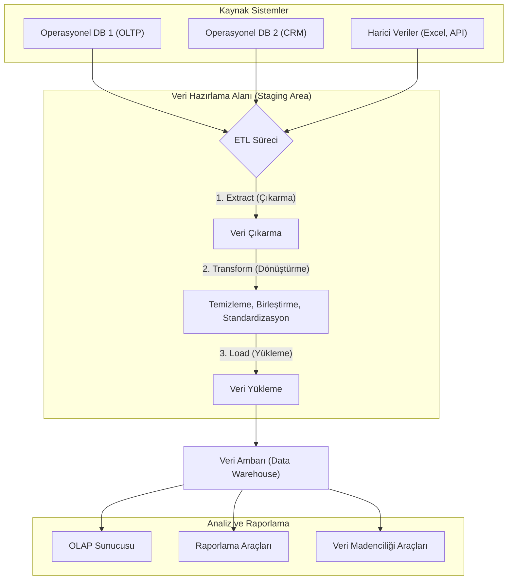

1.  **Çıkarma (Extract):** Farklı operasyonel veritabanları ve harici kaynaklardan (örn. Uygulama Programlama Arayüzü - Application Programming Interface - API) ilgili veriler çekilir.
2.  **Dönüştürme (Transform):** Veriler temizlenir (eksik değerler doldurulur, tutarsızlıklar giderilir), birleştirilir ve veri ambarının standart şemasına uygun hale getirilir.
3.  **Yükleme (Load):** Dönüştürülmüş ve hazır hale getirilmiş veri, analiz edilmek üzere veri ambarına yüklenir.


### Meta Veri (Metadata)

**Tanım:** En basit tanımıyla meta veri, **"veri hakkında veri"** demektir. Veri ambarındaki verinin ne anlama geldiğini, nereden geldiğini, nasıl yapılandırıldığını ve nasıl kullanılacağını açıklayan bir tür "veri sözlüğü" veya "kullanım kılavuzu"dur. Ham veriye bağlam ve anlam kazandırır.

Meta veri, aşağıdaki gibi sorulara yanıt verir:
-   Bu verinin adı nedir? (`Satis_Miktari`)
-   Veri türü nedir? (Sayısal, metin, tarih vb.)
-   Hangi tablodan veya sistemden geliyor? (Kaynak)
-   En son ne zaman güncellendi?
-   Hesaplanmış bir alan ise formülü nedir?

**Örnek:**
Bir satış tablosunda `150` şeklinde bir değer olduğunu düşünelim. Bu değer tek başına bir anlam ifade etmez. Ancak meta verisi ile birlikte anlam kazanır:

-   **Veri (Data):** `150`
-   **Meta Veri (Metadata):**
    -   **Öznitelik Adı:** `Satis_Adedi`
    -   **Açıklama:** "Tek bir işlemde satılan ürün sayısı"
    -   **Veri Tipi:** `Tamsayı (Integer)`
    -   **Kaynak Tablo:** `Gunluk_Satislar`
    -   **Geçerli Aralık:** `1 - 500`

Bu meta veri sayesinde `150` değerinin, `Gunluk_Satislar` tablosundaki bir satış işleminde 150 adet ürün satıldığını ifade eden bir tamsayı olduğunu anlarız. Meta veri olmadan, veri yığınları anlamsız sayılardan ibaret kalır.

### Veri Ambarı Şemaları: Veriyi Anlamlandırma Sanatı

Veri ambarında veriler, analiz sorgularını hızlı ve verimli bir şekilde çalıştıracak şekilde özel yapılarla organize edilir. Bu yapılara **şema** denir. En yaygın kullanılan üç şema türü Yıldız, Kar Tanesi ve Galaksi (Fact Constellation) şemalarıdır.

#### 1. Yıldız Şeması (Star Schema)

En basit ve en yaygın kullanılan veri ambarı şemasıdır. Adını, yapısının bir yıldıza benzemesinden alır: merkezde bir **olgu (fact) tablosu** ve bu tabloya doğrudan bağlı olan **boyut (dimension) tabloları** bulunur.

-   **Olgu Tablosu (Fact Table):** İşletmenin sayısal ölçümlerini (satış adedi, gelir, maliyet gibi) ve boyut tablolarına ait yabancı anahtarları (foreign keys) içerir. İş süreçlerinden ölçülen nicel verileri (sayısal değerleri, metrikleri) tutan tablodur.
-   **Boyut Tabloları (Dimension Tables):** Olgu tablosundaki verilere bağlam kazandıran tanımlayıcı bilgileri (ürün adı, müşteri bilgisi, tarih detayları gibi) içerir. Boyut tabloları **denormalize** edilmiştir, yani ilgili tüm bilgiler tek bir tabloda toplanır.

**Avantajları:**
-   **Basitlik:** Anlaşılması ve sorgulanması kolaydır.
-   **Performans:** Daha az `JOIN` işlemi gerektirdiği için sorgular genellikle çok hızlı çalışır.

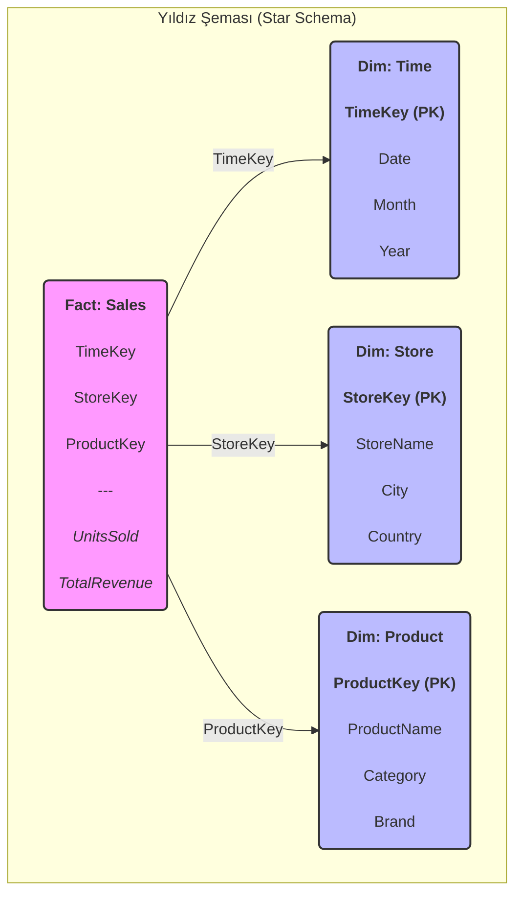

#### 2. Kar Tanesi Şeması (Snowflake Schema)

Yıldız şemasının bir uzantısıdır. Temel fark, boyut tablolarının **normalize** edilmiş olmasıdır. Yani, bir boyut tablosu, veri tekrarını azaltmak için daha küçük ve ilişkili birden fazla tabloya bölünür. Bu yapı, bir kar tanesinin dallanmış kristal yapısına benzediği için bu adı almıştır.

**Avantajları:**
-   **Veri Bütünlüğü:** Normalizasyon sayesinde veri tekrarı azalır ve depolama alanı daha verimli kullanılır.
-   **Bakım Kolaylığı:** Hiyerarşik yapıların yönetimi daha kolaydır (örn. Ürün -> Kategori -> Departman).

**Dezavantajları:**
-   **Sorgu Karmaşıklığı:** Daha fazla tablo olduğu için sorgular daha fazla `JOIN` işlemi gerektirir, bu da performansı düşürebilir.

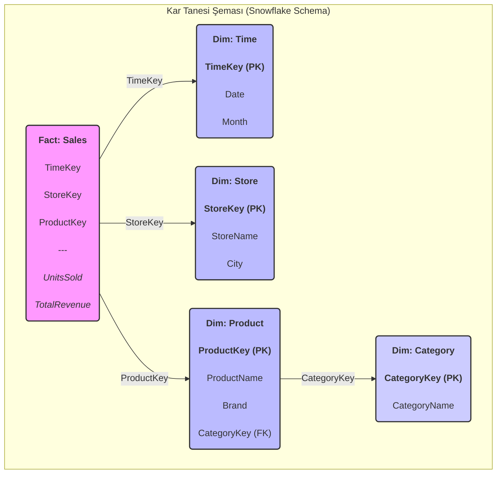

#### 3. Galaksi Şeması / Fact Constellation Şeması

İki veya daha fazla olgu tablosunun, ortak boyut tablolarını paylaştığı daha karmaşık bir yapıdır. Bu şema, birbiriyle ilişkili farklı iş süreçlerini (örneğin, satış ve sevkiyat) tek bir modelde analiz etmek için kullanılır. Yapı, birden fazla yıldızın bir araya gelerek bir galaksi oluşturmasına benzetilir.

**Avantajları:**
-   **Esneklik:** Farklı iş süreçleri arasında entegre analiz yapma imkanı sunar.
-   **Yeniden Kullanılabilirlik:** Boyut tabloları birden fazla olgu tablosu tarafından paylaşıldığı için tutarlılık ve verimlilik artar.

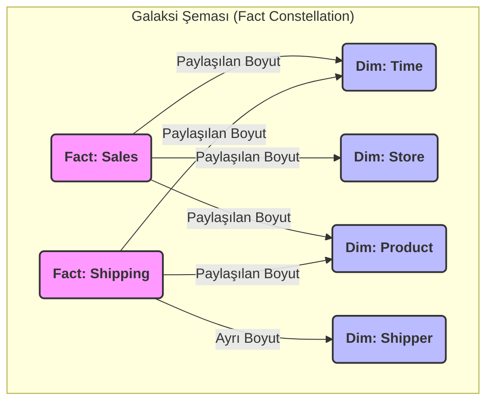

### Şema Karşılaştırması

| Özellik | Yıldız Şeması (Star) | Kar Tanesi Şeması (Snowflake) | Galaksi Şeması (Fact Constellation) |
| :--- | :--- | :--- | :--- |
| **Yapı** | Merkezi bir olgu tablosu, etrafında boyut tabloları | Yıldız şemasının normalize edilmiş hali | Birden fazla olgu tablosu, paylaşılan boyutlar |
| **Normalizasyon** | Boyutlar denormalize (tek tablo) | Boyutlar normalize (çoklu tablo) | Boyutlar genellikle denormalize |
| **Sorgu Performansı** | Yüksek (az `JOIN`) | Daha Düşük (çok `JOIN`) | Değişken (sorguya bağlı) |
| **Veri Bütünlüğü** | Daha düşük (veri tekrarı olabilir) | Yüksek (veri tekrarı az) | Yüksek (paylaşılan boyutlar sayesinde) |
| **Kullanım Alanı** | Çoğu veri ambarı ve veri pazarı (data mart) | Karmaşık hiyerarşilere sahip veri modelleri | Birbiriyle ilişkili birden fazla iş sürecinin analizi |

### Veri Pazarı (Data Mart)
Veri pazarı, kurumsal bir veri ambarının belirli bir departmana (örneğin Satış, Pazarlama) veya iş koluna odaklanmış daha küçük bir alt kümesidir. Amacı, belirli bir kullanıcı grubunun ihtiyaç duyduğu veriye daha hızlı ve kolay erişim sağlamaktır. Veri ambarının tamamı yerine sadece ilgili veri setini içerdiği için daha yönetilebilir, daha hızlı kurulabilir ve daha düşük maliyetlidir. Verilerini merkezi bir veri ambarından veya doğrudan operasyonel kaynaklardan alabilir.  

   - **Galaxy Şeması (Galaxy Schema):**  
     - Çok sayıda kar tanesi şemasının birleşiminden oluşur.  
     - Koleksiyon veya nitelik tablosu gibi düşünülebilir.  
     - Büyük ölçekli sistemlerde tercih edilir.  

---
### OLAP (Çevrimiçi Analitik İşleme - Online Analytical Processing)

OLAP, büyük veri ambarlarındaki verilerin, iş analistleri ve yöneticiler tarafından hızlı, tutarlı ve etkileşimli bir şekilde çok boyutlu olarak analiz edilmesini sağlayan bir teknolojidir. Geleneksel veritabanı sorguları (OLTP sistemlerinde olduğu gibi) veriyi genellikle iki boyutlu (satırlar ve sütunlar) bir yapıda sunarken, iş dünyasındaki sorular genellikle çok daha fazla boyuta sahiptir ("Geçen çeyrekte, Avrupa bölgesindeki hangi mağazalarda, hangi ürün kategorisi en çok kar getirdi?"). OLAP, bu tür karmaşık ve çok boyutlu analitik sorguları saniyeler içinde yanıtlamak için tasarlanmıştır.

#### OLAP Küpü ve Temel Operasyonlar

OLAP'ın temelinde **Veri Küpü (Data Cube)** adı verilen çok boyutlu bir veri yapısı bulunur. Bu küp, analiz edilmek istenen sayısal verileri (**ölçüler - measures**, örn. satış miktarı, kar) ve bu verilerin analiz edileceği farklı bakış açılarını (**boyutlar - dimensions**, örn. zaman, coğrafya, ürün) bir araya getirir. Kullanıcılar, bu küp üzerinde çeşitli operasyonlar gerçekleştirerek veriyi farklı açılardan inceleyebilir, özetleyebilir veya detaylandırabilir.

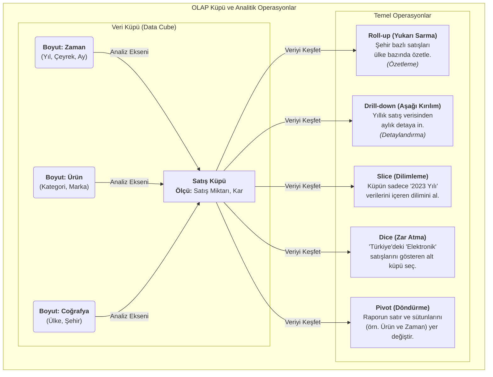

-   **Roll-up (Yukarı Sarma):** Veriyi bir boyut hiyerarşisi boyunca yukarı doğru özetler. Örneğin, şehir bazındaki satış verilerini toplayarak ülke bazında bir özet oluşturur.
-   **Drill-down (Aşağı Kırılım):** Özetlenmiş veriden daha detaylı seviyelere inmeyi sağlar. Örneğin, yıllık satış rakamlarından çeyrek veya ay bazındaki detaylara ulaşmak.
-   **Slice (Dilimleme):** Küpten tek bir boyut değeri seçerek iki boyutlu bir "dilim" alır. Örneğin, `Zaman = '2023'` dilimini alarak sadece o yıla ait satışları inceler.
-   **Dice (Zar Atma):** Birden fazla boyut üzerinde seçim yaparak daha küçük bir alt küp oluşturur. Örneğin, `Coğrafya = 'Türkiye'` VE `Ürün Kategorisi = 'Elektronik'` olan verileri seçer.
-   **Pivot (Döndürme):** Veri küpünün eksenlerini döndürerek veriye farklı bir perspektiften bakmayı sağlar. Örneğin, satırlarda ürünleri, sütunlarda zamanı gösteren bir raporu, satırlarda zamanı, sütunlarda ürünleri gösterecek şekilde değiştirir.

#### OLAP'ın Temel Özellikleri ve Mimarisi

OLAP sistemleri, ham veriyi anlamlı iş bilgisine dönüştürmek için tasarlanmış güçlü analitik motorlardır. Başarıları, aşağıdaki temel özelliklere ve mimari bileşenlere dayanır:

-   **Çok Boyutlu Analiz (Multidimensional Analysis):** OLAP, veriyi geleneksel iki boyutlu (satır/sütun) tablolardan kurtararak, iş dünyasının doğal çok boyutlu yapısını yansıtan küplerde sunar. Bu sayede analistler, veriyi "kim, ne, nerede, ne zaman" gibi farklı iş eksenleri etrafında serbestçe inceleyebilir.
-   **Hızlı Sorgu Performansı:** OLAP sistemleri, karmaşık analitik sorgulara saniyeler içinde yanıt vermek üzere optimize edilmiştir. Bu hızı, verileri önceden hesaplayıp özetleyerek (pre-aggregation), özel indeksleme teknikleri kullanarak ve sonuçları önbelleğe alarak sağlarlar.
-   **Etkileşimli Keşif ve Raporlama:** Kullanıcıların `Roll-up`, `Drill-down` gibi operasyonlarla veri üzerinde etkileşimli olarak gezinmesine olanak tanır. Bu, statik raporlar yerine dinamik bir "keşif" süreci sunar.
-   **İş Odaklı Bakış Açısı:** Teknik veritabanı terminolojisi yerine, "Ürün Kategorisi", "Satış Bölgesi", "Toplam Gelir" gibi anlaşılır iş terimleri kullanır. Bu da teknik olmayan kullanıcıların bile sistemi kolayca kullanabilmesini sağlar.

---

### OLAP Mimarisi: Küpler, Boyutlar ve Ölçüler

OLAP'ın kalbinde, veriyi sezgisel ve analize uygun bir şekilde organize eden üç temel bileşen bulunur:

1.  **Veri Küpü (Data Cube):**
    -   OLAP mimarisinin temel veri yapısıdır. Fiziksel bir küp olmak zorunda değildir; daha çok, verinin çok boyutlu bir mantıksal modelidir.
    -   İşletmenin analiz etmek istediği sayısal metrikleri (ölçüleri), bu metrikleri tanımlayan ve bağlam kazandıran iş kategorileriyle (boyutlarla) birleştirir.

2.  **Boyutlar (Dimensions):**
    -   Bir ölçüye bağlam kazandıran, "kim, ne, nerede, ne zaman" gibi sorulara yanıt veren nitel (kategorik) verilerdir. Boyutlar, veriyi nasıl dilimlemek, filtrelemek ve gruplamak istediğimizi belirler.
    -   **Hiyerarşi (Hierarchy):** Boyutlar genellikle doğal bir hiyerarşiye sahiptir. Bu yapı, kullanıcıların özet veriden detaya (Drill-down) veya detaydan özete (Roll-up) kolayca geçmesini sağlar.
        -   **Örnek Zaman Hiyerarşisi:** `Yıl` → `Çeyrek` → `Ay` → `Gün`
        -   **Örnek Coğrafya Hiyerarşisi:** `Ülke` → `Bölge` → `Şehir`

3.  **Ölçüler (Measures):**
    -   Analiz edilen nicel (sayısal) değerlerdir. Genellikle olgu tablosundaki (fact table) bir sütundan türetilirler ve `SUM`, `COUNT`, `AVERAGE`, `MIN`, `MAX` gibi toplama fonksiyonları ile özetlenirler.
    -   Ölçüler, boyutlar tarafından dilimlendiğinde anlam kazanan iş metrikleridir.
        -   **Örnek Ölçüler:** `Toplam Satış Tutarı`, `Satılan Ürün Adedi`, `Ortalama Kar Marjı`

| Bileşen | Açıklama | Örnek |
| :--- | :--- | :--- |
| **Boyut (Dimension)** | Veriye bağlam kazandıran **kategorik** bilgiler. "Nasıl bakalım?" sorusunu yanıtlar. | Zaman, Ürün, Müşteri, Coğrafya |
| **Ölçü (Measure)** | Analiz edilen **sayısal** değerler. "Ne kadar?" sorusunu yanıtlar. | Satış Miktarı, Gelir, Maliyet |
<br/>

<div style="display: flex; justify-content: space-between; gap: 2em;">
    <div style="flex: 1; text-align: justify;">
        <hr style="border: 2px solid #888888;">
        <h2 style="text-align: center;">Karar Ağaçları (Decision Trees)</h2>
        <hr style="border: 2px solid #CCCCCC;">
    </div>
</div>


## 1. Karar Ağaçlarına Giriş: Sezgisel Bir Zeka Formu

Makine öğrenmesi dünyasındaki yolculuğumuzda, hem insan sezgisine son derece yakın hem de matematiksel olarak bir o kadar sağlam olan zarif bir yöntemle tanışacağız: **Karar Ağaçları**. Bu yöntemi, veriye doğru teşhisi koymak için sistematik bir şekilde sorular soran bir uzmana benzetebiliriz. Her bir soru, veri setini daha küçük ve daha homojen gruplara ayırır ve bu süreç, her bir grup için net bir sonuca ulaşana kadar devam eder. Bu hiyerarşik karar verme süreci, bir akış şeması (flowchart) formunda görselleştirilebilir, bu da onu en karmaşık modeller arasında bile en yorumlanabilir olanlardan biri yapar. İster bir müşterinin kredi riskini belirlemek (sınıflandırma) ister bir gayrimenkulün piyasa değerini tahmin etmek (regresyon) olsun, karar ağaçları bize şeffaf ve güçlü bir analitik çerçeve sunar.

### 1.1. Parametrik Olmayan Yapının Esnekliği ve Gücü

Karar ağaçlarının temelindeki felsefeyi anlamak için, onları diğer modelleme yaklaşımlarından ayıran en temel özelliğe odaklanmalıyız: **parametrik olmayan (non-parametric)** bir yapıya sahip olmaları. Gelin bu teknik ayrımı bir analoji ile somutlaştıralım:

-   **Parametrik Modeller (Önceden Belirlenmiş Kalıplar):** Lineer veya lojistik regresyon gibi modeller, veri ile hedef değişken arasındaki ilişkinin belirli bir fonksiyonel forma (örneğin, bir doğruya) uyduğunu varsayar. Bu modellerin sabit sayıda parametresi vardır (`β₀`, `β₁`, vb.) ve modelin karmaşıklığı veri miktarına bağlı değildir. Bu durum, güçlü bir **tümevarımsal önyargı (inductive bias)** yaratır: model, verinin yalnızca varsaydığı kalıba uyması durumunda başarılı olur.

-   **Karar Ağaçları (Veriden Doğan Esnek Yapı):** Karar ağaçları ise verinin altta yatan dağılımı hakkında böyle katı varsayımlarda bulunmaz. Modelin yapısı ve karmaşıklığı, sabit bir denkleme bağlı olmak yerine, doğrudan verinin kendisinden öğrenilir. Veri miktarı ve karmaşıklığı arttıkça, ağaç da bu yeni örüntüleri yakalamak için büyüyebilir ve dallanabilir. Bu esneklik, karar ağaçlarının doğrusal olmayan (non-linear) ve karmaşık etkileşimleri, önceden bir formül belirtmeye gerek kalmadan, doğal bir şekilde modellemesine olanak tanır. Kısacası, veriyi bir kalıba sokmaya çalışmak yerine, kalıbın veriden doğmasına izin verirler.

### 1.2. Karar Ağaçlarını Neden Bir Köşe Taşı Olarak Görüyoruz?

Bu yöntemin, veri bilimcileri ve analistler için neden vazgeçilmez bir araç olduğunu birkaç temel başlıkta özetleyebiliriz:

-   **Yorumlanabilirlik: "Beyaz Kutu" Modeli:** Derin öğrenme gibi birçok modern algoritmanın "kara kutu" (black-box) olarak nitelendirildiği bir çağda, karar ağaçları şeffaflıklarıyla öne çıkar. Modelin verdiği bir kararın arkasındaki mantığı, kök düğümden yaprak düğüme kadar olan yolu takip ederek `EĞER-O HALDE` (IF-THEN) kuralları şeklinde net bir biçimde açıklayabiliriz. Bu özellik, finansal risk modellemesi veya tıbbi teşhis gibi, alınan kararların gerekçelendirilmesinin zorunlu olduğu alanlarda hayati önem taşır.

-   **Minimum Veri Ön İşleme Gereksinimi:** Karar ağaçları, pratik uygulamalarda büyük bir avantaj sunar. Ağaç yapısı, özelliklerin büyüklüğüne değil, sıralamasına dayalı bölme kararları verdiği için, verilerin normalleştirilmesi veya standartlaştırılması gibi adımlara ihtiyaç duymaz. Ayrıca, CART gibi algoritmalar, eksik değerleri yönetmek için **vekil bölmeler (surrogate splits)** gibi dahili mekanizmalara sahip olabilir, bu da veri hazırlama sürecini önemli ölçüde basitleştirir.

-   **Çok Yönlülük ve Hibrit Veri Desteği:** Gerçek dünya veri setleri nadiren tek tiptir. Karar ağaçlarının temelindeki bölme kriterleri (Gini İndeksi, Entropi vb.), hem sürekli (sayısal) hem de kategorik (nominal) özellikleri doğal bir şekilde işleyebilir. Bu, farklı veri türlerini bir arada barındıran zengin veri setleriyle, karmaşık dönüşümlere gerek kalmadan doğrudan çalışabilme imkanı tanır.

## 2. Karar Ağacının Yapısal Bileşenleri

Aşağıda, karar ağacının temel yapısını gösteren renkli bir diyagram yer almaktadır:

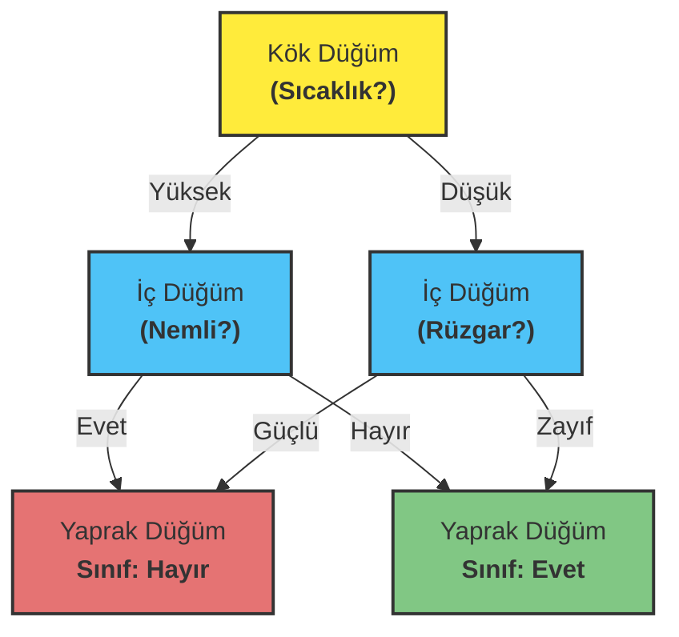

Bu diyagramda:
- **Sarı**: Kök düğüm (ilk karar noktası)
- **Mavi**: İç düğümler (ara karar noktaları)
- **Yeşil**: Pozitif sınıfı temsil eden yaprak düğüm
- **Kırmızı**: Negatif sınıfı temsil eden yaprak düğüm

### 2.1. Karar Ağacının Anatomisi: Düğümler ve Dallar

Sevgili arkadaşlar, bir karar ağacını, veriye teşhis koymak için tasarlanmış organik bir yapı gibi düşünebiliriz. Bu yapının her bir parçası, mantıksal bir akış şemasının unsurlarını temsil eder ve bize verinin içindeki hikayeyi anlatır. Gelin bu zarif yapıyı birlikte inceleyelim.

**a) Kök Düğüm (Root Node): Yolculuğun Başlangıcı**
Her şeyin başladığı yerdir. Kök düğüm, tüm veri setimizi temsil eden ve analize başlarken sorduğumuz ilk, en güçlü sorudur. Bu düğüm, veri setini en anlamlı şekilde iki veya daha fazla ana dala ayıracak olan en ayırt edici özniteliği içerir.

**b) İç Düğümler (Internal Nodes): Karar Zinciri**
Kök düğümden sonra gelen her bir ara karar noktasıdır. Her iç düğüm, bir önceki adımdan kendisine ulaşan veri alt kümesi için yeni bir soru sorar. Bu düğümler, nihai bir sonuca ulaşana kadar veriyi daha küçük ve daha homojen gruplara ayırma görevini üstlenir.

**c) Yaprak Düğümler (Leaf / Terminal Nodes): Hüküm Anı**
Ağacın en uç noktalarıdır; artık daha fazla soru sorulmayan ve nihai kararın verildiği yerlerdir. Her bir yaprak düğüm, o düğüme ulaşan veri örnekleri için bir sınıf etiketi (sınıflandırma probleminde) veya bir sayısal değer (regresyon probleminde) içerir.

### 2.2. Dallar (Branches): Mantığın Patikaları

Dallar, düğümler arasındaki yollardır ve her bir yol, bir karar sürecini temsil eder. Kök düğümden başlayıp bir yaprak düğüme kadar takip edilen her bir patika, aslında `EĞER-O HALDE` (IF-THEN) formatında, insan tarafından kolayca okunabilen bir kural setine karşılık gelir.

**Örnek Kural:** `EĞER` (Sıcaklık > 25°C) `VE` (Nem Oranı < %60) `O HALDE` (Dışarıda Oyna = Evet)

## 3. Karar Ağacı Nasıl İnşa Edilir: Özyinelemeli Bölme Sanatı

### 3.1. En İyi Bölmeyi Bulmak: Açgözlü (Greedy) Yaklaşım

İşte işin büyüsü burada başlıyor. Bir karar ağacı inşa etmek, temelde bir **"böl ve yönet" (divide and conquer)** stratejisidir. Algoritma, her adımda veri setini daha saf alt kümelere ayıracak en iyi soruyu bulmaya çalışır. Bu sürece **özyinelemeli bölme (recursive partitioning)** adını veriyoruz.

Bu yaklaşım "açgözlü" (greedy) olarak nitelendirilir, çünkü algoritma her bir düğümde, o an için en iyi görünen, yani saflığı en çok artıran bölmeyi seçer. Gelecekteki adımların bu karardan nasıl etkileneceğini hesaba katmaz. Bu, genellikle çok iyi sonuçlar veren verimli bir stratejidir.

**Algoritmanın Adımları:**

1.  **En İyi Özniteliği Seç:** Mevcut düğümdeki veri setini en homojen alt gruplara ayıracak özniteliği ve bölünme noktasını belirle. Bu seçim, saflık ölçütleri (Gini, Entropi vb.) kullanılarak matematiksel olarak yapılır.
2.  **Düğümü Böl:** Seçilen öznitelik ve kurala göre düğümü iki veya daha fazla dala ayırarak yeni çocuk düğümler (child nodes) oluştur.
3.  **Özyinelemeyi Uygula:** Her bir çocuk düğüm için süreci tekrarla. Bu işlem, aşağıdaki durdurma kriterlerinden biri karşılanana kadar devam eder:
    *   Düğümdeki tüm örnekler aynı sınıfa aitse (düğüm tamamen saf ise).
    *   Önceden belirlenmiş bir maksimum ağaç derinliğine ulaşılmışsa.
    *   Düğümdeki örnek sayısı, bölünmek için belirlenen minimum sayının altına düşmüşse.

### 3.2. Saflık Ölçütleri: Düzensizliği Ölçme Bilimi

Peki, algoritma "en iyi" bölmenin ne olduğuna nasıl karar veriyor? Cevap, **saflık (purity)** veya onun zıttı olan **kirlilik (impurity)** kavramında yatar. Bir düğüm ne kadar safsa, içindeki örnekler o kadar homojendir (yani çoğunlukla aynı sınıfa aittir). Algoritmanın amacı, her bölme işleminden sonra ortaya çıkan çocuk düğümlerin toplam kirliliğini en aza indirmektir. Bu kirliliği ölçmek için kullandığımız iki temel matematiksel araç vardır: Gini İndeksi ve Entropi.

#### 3.2.1. Gini İndeksi (Gini Impurity): Yanlış Sınıflandırma Olasılığı

Gini İndeksi, oldukça sezgisel bir ölçüttür. Bir düğümdeki veri noktalarından rastgele birini seçip, bu düğümdeki sınıf dağılımına göre onu etiketlersek, ne kadar olasılıkla yanlış etiketleme yaparız? İşte Gini İndeksi tam olarak bunu ölçer.

-   **Mükemmel Saflık (Gini = 0):** Bir düğümdeki tüm örnekler aynı sınıfa aitse, yanlış etiketleme olasılığımız sıfırdır.
-   **Maksimum Kirlilik (Gini = 0.5 - İki sınıflı durumda):** Bir düğümde örnekler sınıflara 50/50 oranında dağılmışsa, kirlilik en yüksek seviyededir.

Matematiksel olarak, `c` farklı sınıfa sahip bir düğüm için Gini İndeksi şu formülle hesaplanır:

$$
Gini = 1 - \sum_{i=1}^{c} (p_i)^2
$$

Burada `p_i`, `i` sınıfına ait örneklerin oranını temsil eder. Algoritma, bölme sonrası oluşacak çocuk düğümlerin ağırlıklı Gini ortalamasını en çok düşüren bölmeyi tercih eder. Bu düşüşe **Gini Kazancı (Gini Gain)** denir.

#### 3.2.2. Entropi ve Bilgi Kazancı (Information Gain)

Entropi, bilgi teorisinin babası Claude Shannon'dan ödünç aldığımız bir kavramdır ve bir sistemdeki belirsizliği veya düzensizliği ölçer. Karar ağaçları bağlamında, bir düğümdeki sınıfların ne kadar karışık olduğunun bir ölçüsüdür.

-   **Mükemmel Saflık (Entropi = 0):** Düğüm tamamen homojen ise, sonuç bellidir ve hiçbir belirsizlik yoktur.
-   **Maksimum Kirlilik (Entropi = 1 - İki sınıflı durumda):** Sınıflar eşit dağılmışsa, belirsizlik en üst düzeydedir.

Formülü şöyledir:

$$
Entropy = - \sum_{i=1}^{c} p_i \log_2(p_i)
$$

Algoritma, Entropiyi doğrudan minimize etmek yerine, bir bölme işlemiyle ne kadar **belirsizlik azalttığını** ölçer. Bu azalmaya **Bilgi Kazancı (Information Gain)** denir ve ID3 algoritmasının temelini oluşturur. En yüksek Bilgi Kazancını sağlayan öznitelik, bölme için en iyi aday olarak seçilir.

| Özellik | Gini İndeksi | Entropi (Bilgi Kazancı ile) |
| :--- | :--- | :--- |
| **Temel Felsefe** | Yanlış sınıflandırma olasılığını en aza indirme | Belirsizliği en aza indirme (bilgiyi en üst düzeye çıkarma) |
| **Hesaplama** | Daha hızlı (karesel işlem) | Daha yavaş (logaritmik işlem) |
| **Davranış** | Genellikle en büyük sınıfı izole etmeye daha yatkındır | Sınıf dağılımındaki küçük değişikliklere daha duyarlıdır |

Pratikte, her iki metrik de genellikle çok benzer ağaçlar üretir. Gini İndeksi'nin hesaplama verimliliği, onu CART gibi algoritmalarda popüler bir varsayılan seçenek haline getirir.

#### 3.2.3. Kazanç Oranı (Gain Ratio): Bilgi Kazancının Tuzağına Karşı Bir Savunma

Bilgi Kazancı'nın zekice bir yaklaşım olmasına rağmen, tehlikeli bir zaafı vardır: **yüksek kardinaliteye sahip** (yani çok sayıda benzersiz değere sahip) özniteliklere karşı bir ön yargı besler. Örneğin, "Müşteri ID" veya "TC Kimlik No" gibi bir özniteliği düşünün. Her bir değer benzersiz olduğu için, bu özniteliğe göre yapılacak bir bölme, her biri tek bir örnek içeren mükemmel derecede saf yapraklar oluşturacaktır. Bilgi Kazancı bu durumu "mükemmel bir bölme" olarak görür, ancak bu aslında öğrenme değil, **ezberlemedir (overfitting)**.

İşte C4.5 algoritmasının getirdiği zarif çözüm olan **Kazanç Oranı (Gain Ratio)** burada devreye girer. Kazanç Oranı, Bilgi Kazancını, bir bölmenin yarattığı dallanma karmaşıklığına bölerek onu cezalandırır.

$$
Gain Ratio = \frac{\text{Information Gain}}{\text{Split Information}}
$$

-   **Split Information:** Bir özniteliğin veriyi ne kadar çok parçaya böldüğünü ölçen bir metriktir. Çok fazla dala neden olan bir bölme (Müşteri ID gibi) yüksek bir Split Information değerine sahip olacak ve bu da Kazanç Oranını düşürecektir.

Bu sayede Kazanç Oranı, hem yüksek bilgi sağlayan hem de veriyi makul sayıda, anlamlı alt gruplara ayıran **dengeli** bölmeleri tercih eder. Bu, modelin genelleme yeteneğini önemli ölçüde artırır.

### 3.3. Gini İndeksi ile Adım Adım Karar Ağacı İnşası: Bir Vaka Analizi

Sevgili arkadaşlar, teorik bilgileri somut bir örnekle taçlandırmanın zamanı geldi. Gelin, "Bugün tenis oynamalı mıyız?" sorusuna cevap arayan klasik bir veri seti üzerinden, Gini İndeksi'ni kullanarak bir karar ağacını adım adım nasıl inşa ettiğimizi birlikte görelim. Bu süreç, algoritmanın "düşünme" biçimini anlamamız için bize harika bir fırsat sunacak.

**Örnek Veri Setimiz:**

| Gün | Hava Durumu | Sıcaklık | Nem | Rüzgar | Tenis Oyna |
| :-- | :--- | :--- | :--- | :--- | :--- |
| D1 | Güneşli | Sıcak | Yüksek | Yok | Hayır |
| D2 | Güneşli | Sıcak | Yüksek | Var | Hayır |
| D3 | Bulutlu | Sıcak | Yüksek | Yok | Evet |
| D4 | Yağmurlu | Ilık | Yüksek | Yok | Evet |
| D5 | Yağmurlu | Soğuk | Normal | Yok | Evet |
| D6 | Yağmurlu | Soğuk | Normal | Var | Hayır |
| D7 | Bulutlu | Soğuk | Normal | Var | Evet |
| D8 | Güneşli | Ilık | Yüksek | Yok | Hayır |
| D9 | Güneşli | Soğuk | Normal | Yok | Evet |
| D10 | Yağmurlu | Ilık | Normal | Yok | Evet |
| D11 | Güneşli | Ilık | Normal | Var | Evet |
| D12 | Bulutlu | Ilık | Yüksek | Var | Evet |
| D13 | Bulutlu | Sıcak | Normal | Yok | Evet |
| D14 | Yağmurlu | Ilık | Yüksek | Var | Hayır |

#### Adım 1: Kök Düğümün Kirliliğini Hesaplama (Başlangıç Noktası)

Her şeyden önce, tüm veri setimizin "kirliliğini" ölçmeliyiz. Bu, bizim referans noktamız olacak.
- Toplam Gözlem: 14
- "Evet" (Tenis Oyna): 9
- "Hayır" (Tenis Oyna): 5

Şimdi Gini formülümüzü uygulayalım:
```
Gini(Kök) = 1 - [ (9/14)² + (5/14)² ] = 1 - [ 0.413 + 0.128 ] = 0.459
```
Başlangıç kirliliğimiz 0.459. Amacımız, bu değeri en çok düşüren özniteliği bulmak.

#### Adım 2: Her Bir Öznitelik İçin Gini Kazancını Hesaplama

Şimdi her bir özniteliği ("Hava Durumu", "Sıcaklık", "Nem", "Rüzgar") potansiyel bir bölme noktası olarak değerlendireceğiz.

**A) Öznitelik: Hava Durumu**

1.  **Hava Durumu = Güneşli:** 5 gözlem (2 Evet, 3 Hayır)
    $Gini(\text{Güneşli}) = 1 - [(\frac{2}{5})^2 + (\frac{3}{5})^2] = 0.48$
2.  **Hava Durumu = Bulutlu:** 4 gözlem (4 Evet, 0 Hayır)
    $Gini(\text{Bulutlu}) = 1 - [(\frac{4}{4})^2 + (\frac{0}{4})^2] = 0$  (Mükemmel saflık!)
3.  **Hava Durumu = Yağmurlu:** 5 gözlem (3 Evet, 2 Hayır)
    $Gini(\text{Yağmurlu}) = 1 - [(\frac{3}{5})^2 + (\frac{2}{5})^2] = 0.48$

Şimdi bu özniteliğin ağırlıklı Gini ortalamasını hesaplayalım:
$Gini_{Ağırlıklı}(\text{Hava Durumu}) = (\frac{5}{14}) \times 0.48 + (\frac{4}{14}) \times 0 + (\frac{5}{14}) \times 0.48 = 0.343$

Ve son olarak, Gini Kazancı:
$Gain(\text{Hava Durumu}) = Gini(\text{Kök}) - Gini_{Ağırlıklı}(\text{Hava Durumu}) = 0.459 - 0.343 = \mathbf{0.116}$

**B) Öznitelik: Rüzgar** (Hesaplamaları diğer öznitelikler için de tekrarlıyoruz)

1.  **Rüzgar = Yok:** 8 gözlem (6 Evet, 2 Hayır)
    $Gini(\text{Yok}) = 1 - [(\frac{6}{8})^2 + (\frac{2}{8})^2] = 0.375$
2.  **Rüzgar = Var:** 6 gözlem (3 Evet, 3 Hayır)
    $Gini(\text{Var}) = 1 - [(\frac{3}{6})^2 + (\frac{3}{6})^2] = 0.5$

Ağırlıklı Gini ve Kazanç:
$Gini_{Ağırlıklı}(\text{Rüzgar}) = (\frac{8}{14}) \times 0.375 + (\frac{6}{14}) \times 0.5 = 0.428$
$Gain(\text{Rüzgar}) = 0.459 - 0.428 = \mathbf{0.031}$

(Benzer hesaplamalar "Sıcaklık" ve "Nem" için de yapıldığında, onların kazançlarının daha düşük olduğu görülecektir.)

#### Adım 3: En İyi Bölmeyi Seçme ve İlk Dalı Oluşturma

Kazançları karşılaştıralım:
- **Gain(Hava Durumu) = 0.116** (En Yüksek!)
- Gain(Nem) = 0.092 (Hesaplandı)
- Gain(Sıcaklık) = 0.013 (Hesaplandı)
- Gain(Rüzgar) = 0.031

En yüksek Gini Kazancını **"Hava Durumu"** özniteliği sağladığı için, ağacımızın kök düğümü bu olacak!

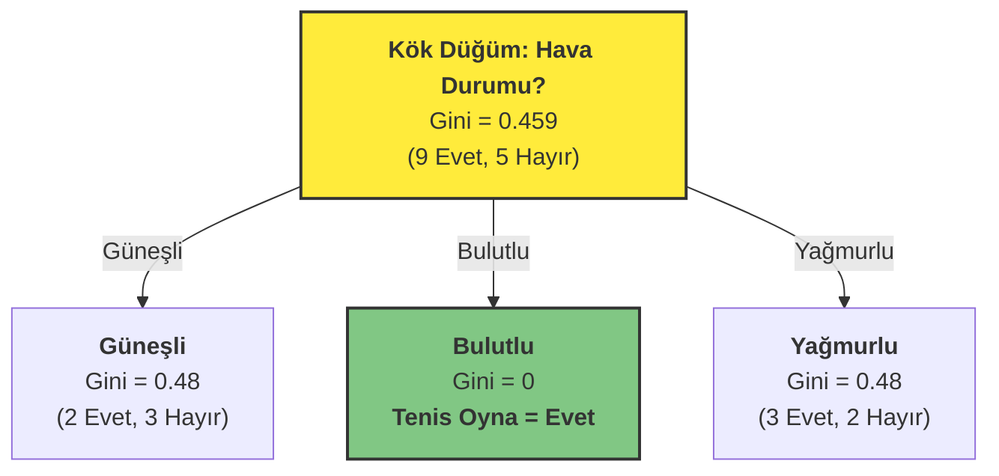

Dikkat ederseniz, "Bulutlu" dalı saf bir yaprak düğüme dönüştü. Artık o dal için daha fazla soru sormamıza gerek yok.

#### Adım 4: Özyinelemeli Süreç: Alt Düğümleri Fethetmek

Kök düğümümüzü belirledik ve 'Bulutlu' hava durumunun bizi doğrudan 'Evet' sonucuna götürdüğünü keşfettik. Ama macera burada bitmiyor. Algoritmamızın "özyinelemeli" doğası tam da bu noktada devreye giriyor. Şimdi, henüz saf olmayan "Güneşli" ve "Yağmurlu" dallarını, sanki her biri kendi başına yeni bir veri setiymiş gibi ele alacağız. Gelin "Güneşli" dalına odaklanalım.

**Alt Problem: Hava Durumu = Güneşli**

Artık tüm veri setini unutup, sadece aşağıdaki 5 gözleme odaklanıyoruz:

| Gün | Hava Durumu | Sıcaklık | Nem | Rüzgar | Tenis Oyna |
| :-- | :--- | :--- | :--- | :--- | :--- |
| D1 | Güneşli | Sıcak | Yüksek | Yok | Hayır |
| D2 | Güneşli | Sıcak | Yüksek | Var | Hayır |
| D8 | Güneşli | Ilık | Yüksek | Yok | Hayır |
| D9 | Güneşli | Soğuk | Normal | Yok | Evet |
| D11 | Güneşli | Ilık | Normal | Var | Evet |

Bu 5 gözlemden oluşan mini veri setimizin başlangıç kirliliği, daha önce hesapladığımız gibi `Gini(Güneşli) = 0.48`. Görevimiz, bu 0.48'lik kirliliği sıfıra indirmek için en iyi soruyu bulmak. Kalan özniteliklerimiz: Sıcaklık, Nem ve Rüzgar.

**A) Öznitelik: Nem (Güneşli günlerde)**

1.  **Nem = Yüksek:** 3 gözlem (D1, D2, D8) -> 0 Evet, 3 Hayır
    $Gini(\text{Yüksek}) = 1 - [(\frac{0}{3})^2 + (\frac{3}{3})^2] = 0$ (Mükemmel saflık!)
2.  **Nem = Normal:** 2 gözlem (D9, D11) -> 2 Evet, 0 Hayır
    $Gini(\text{Normal}) = 1 - [(\frac{2}{2})^2 + (\frac{0}{2})^2] = 0$ (Mükemmel saflık!)

Ağırlıklı Gini ve Kazanç:
$Gini_{Ağırlıklı}(\text{Nem}) = (\frac{3}{5}) \times 0 + (\frac{2}{5}) \times 0 = 0$
$Gain(\text{Nem}) = 0.48 - 0 = \mathbf{0.48}$

**B) Öznitelik: Rüzgar (Güneşli günlerde)**

1.  **Rüzgar = Yok:** 3 gözlem (D1, D8, D9) -> 1 Evet, 2 Hayır
    $Gini(\text{Yok}) = 1 - [(\frac{1}{3})^2 + (\frac{2}{3})^2] = 0.444$
2.  **Rüzgar = Var:** 2 gözlem (D2, D11) -> 1 Evet, 1 Hayır
    $Gini(\text{Var}) = 1 - [(\frac{1}{2})^2 + (\frac{1}{2})^2] = 0.5$

Ağırlıklı Gini ve Kazanç:
$Gini_{Ağırlıklı}(\text{Rüzgar}) = (\frac{3}{5}) \times 0.444 + (\frac{2}{5}) \times 0.5 = 0.466$
$Gain(\text{Rüzgar}) = 0.48 - 0.466 = \mathbf{0.014}$

**Karar Anı: "Güneşli" Dalı İçin En İyi Soru**

Kazançları karşılaştıralım:
- **Gain(Nem) = 0.48** (En Yüksek!)
- Gain(Sıcaklık) = 0.28 (Hesaplandı)
- Gain(Rüzgar) = 0.014

Gördüğümüz gibi, **"Nem"** özniteliği `0.48`'lik kazançla ezici bir üstünlük sağlıyor. Bu, "Güneşli" günlerde tenis oynayıp oynamama kararını en iyi açıklayan faktörün nem oranı olduğu anlamına geliyor. Üstelik bu bölme o kadar mükemmel ki, her iki yeni dal da tamamen saf yapraklara dönüşüyor!

Ağacımızın güncel hali:

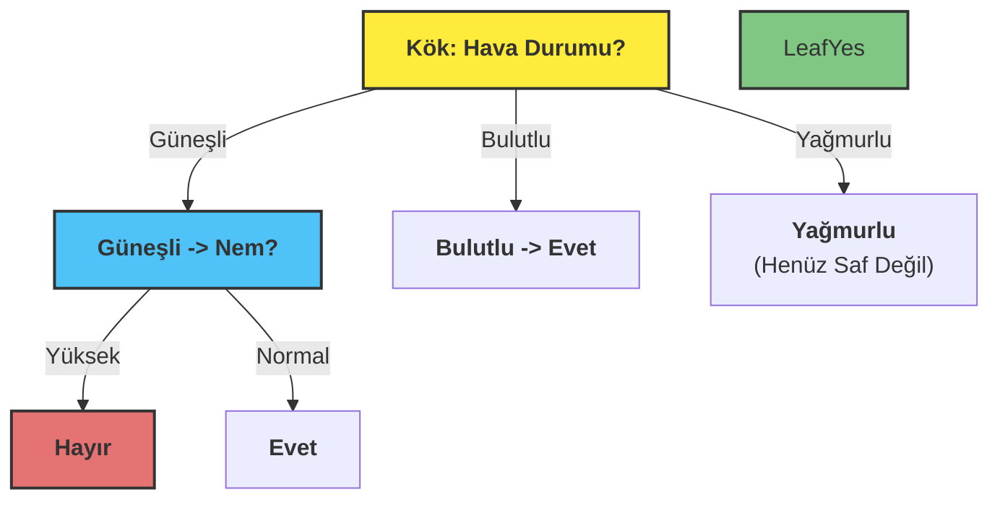

#### Adım 5: Ağacı Tamamlama

Aynı özyinelemeli süreci "Yağmurlu" dalı için de ("Rüzgar" özniteliğine göre bölünür) uyguladığımızda, nihai karar ağacımız ortaya çıkar:

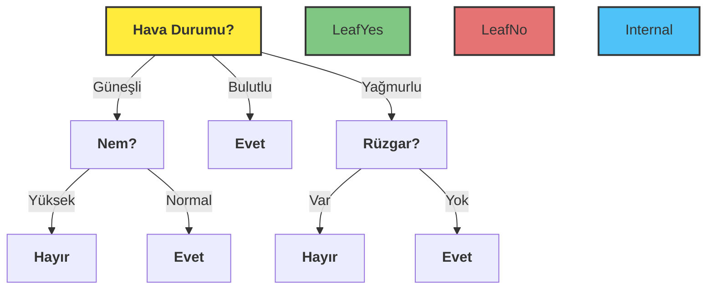
İşte bu kadar! Veri setimizdeki karmaşık ilişkileri, her adımda en mantıklı soruyu sorarak, yorumlanabilir ve güçlü bir `EĞER-O HALDE` kurallar bütününe dönüştürdük. Bu, karar ağaçlarının sezgisel gücünün ve matematiksel zarafetinin en güzel örneklerinden biridir.

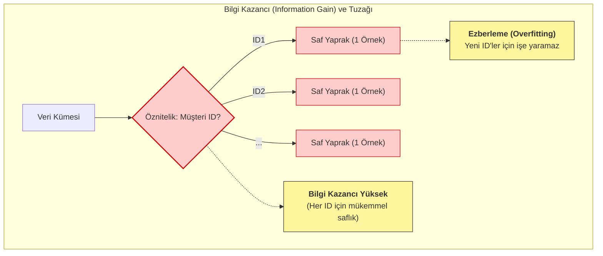

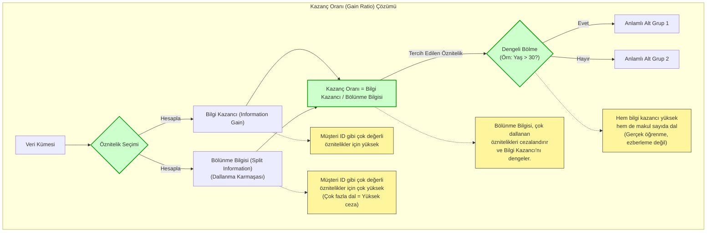

#### 3.2.4. Sınıflandırma Hatası (Classification Error)

Şimdi gelelim en sezgisel, en doğrudan ölçütümüze: Sınıflandırma Hatası. Bu metrik, son derece pratik bir soru sorar: "Eğer bir düğümdeki en popüler sınıf neyse, o düğüme düşen her veriye o etiketi yapıştırsak, ne kadar yanılırız?"

-   **Örnek:** Bir düğümde 8 "Evet" ve 2 "Hayır" kararımız varsa, en popüler sınıfımız "Evet"tir. Eğer bu düğümdeki herkese "Evet" tahmininde bulunursak, 10'da 2 kez yanılmış oluruz. Yani hata oranımız %20'dir.
-   **Amaç:** Algoritmanın amacı da, bu basit ama etkili hata oranını en aza indirecek bölmeyi bulmaktır.

## 4. Durdurma Kriterleri (Stopping Criteria)

Şimdi, karar ağacımızı inşa ederken en kritik sorulardan birine geldik: **Ne zaman durmalıyız?** Eğer ağacımızın sonsuza kadar büyümesine izin verirsek, her bir veri noktasını ezberleyen, ancak genelleme yeteneği sıfır olan aşırı hevesli bir öğrenciye dönüşür. Bu duruma **aşırı uyum (overfitting)** diyoruz. Tersi durumda, ağacı çok erken durdurursak, verideki önemli örüntüleri kaçıran tembel bir öğrenciye sahip oluruz ki bu da **eksik uyumdur (underfitting)**.

İşte bu dengeyi kurmak için ağacımıza bazı sınırlar koymamız, yani durdurma kriterleri belirlememiz gerekir.

### 4.1. Yaygın Durdurma Parametreleri

Bu süreci yönetmek için elimizde harika kontrol mekanizmaları, yani hiperparametreler var. Gelin en yaygın olanlarına bir göz atalım:

**a) Minimum Yaprak Boyutu (Minimum Leaf Size):** Bir yaprak düğümde en az kaç örnek olmalı? Bu, modelin çok özele inip tekil örnekleri ezberlemesini engeller.

**b) Minimum Bölme Boyutu (Minimum Split Size):** Bir düğümü bölmeye değer bulmamız için içinde en az kaç örnek bulunmalı?

**c) Maksimum Derinlik (Maximum Depth):** Ağacımız kökten başlayarak en fazla ne kadar derine insin? Bu, modelin aşırı karmaşıklaşmasını önleyen en doğrudan yollardan biridir.

**d) Maksimum Yaprak Sayısı (Maximum Leaf Nodes):** Ağacın sonunda toplamda kaç tane nihai karar noktası (yaprak) olsun istiyoruz?

**e) Minimum Saflık Artışı (Minimum Purity Increase):** Bir bölme işlemi yapacaksak, bu bize ne kadar "bilgi" kazandırmalı? Eğer kazanç çok azsa, o bölmeyi yapmaya değmez deriz.

### 4.2. Ağacı Ne Zaman Durdurmalı

Karar ağacının ne kadar büyüyeceğine karar vermek, bir sınava nasıl çalışacağınıza karar vermeye çok benzer.

-   **Aşırı Ezber (Aşırı Uyum - Overfitting):** Sadece kitaptaki örnek soruları ve cevaplarını harfi harfine ezberlediğinizi düşünün. Sınavda aynı sorular çıkarsa 100 alırsınız. Ama öğretmen biraz farklı bir soru sorduğunda cevap veremezsiniz. Çünkü konunun mantığını öğrenmediniz, sadece ezberlediniz. Bu, ağacın çok fazla dallanıp her bir yaprağında sadece 1-2 örnek bırakması gibidir. Model, veriyi "ezberlemiş" olur.

-   **Yetersiz Çalışma (Eksik Uyum - Underfitting):** Sadece konuların başlıklarını okuduğunuzu düşünün. Konu hakkında genel bir fikriniz olur ama hiçbir detayı bilmezsiniz. Bu da ağacın hiç dallanmaması, çok genel kalması gibidir. Model, hiçbir şey öğrenememiş olur.

**Peki, en iyisi nedir?** Konunun mantığını anlamak ve her konuyla ilgili birkaç farklı örnek çözmektir. İşte **Berry ve Linoff Kuralı** bize bu "ideal çalışma" seviyesi için pratik bir tavsiye verir. Der ki: "Ağacın her bir karar yaprağında, ne tek bir örnek kalacak kadar detaya in, ne de yüzlerce örnek kalacak kadar genel kal. Veri setinin büyüklüğüne göre makul bir sayıda örnek bırak." Bu kural, modelin hem öğrenmesini hem de ezberlememesini sağlamak için bir denge noktası sunar.

### 4.3. Model Karmaşıklığı ve Genelleme Yeteneği

Karar ağacının büyümesini kontrol eden durdurma kriterleri, modelin **genelleme performansı** ile **karmaşıklığı** arasındaki dengeyi (Bias-Variance Tradeoff) yönetmek için kritik öneme sahiptir. Bu bağlamda, yaprak düğümlerdeki minimum örnek sayısı (`min_samples_leaf`) en etkili hiperparametrelerden biridir.

-   **Aşırı Uyum (Overfitting):** Ağacın çok derinleşmesine izin verildiğinde, yaprak düğümler aşırı saf hale gelir ve eğitim setindeki gürültüyü veya aykırı değerleri modellemeye başlar. Bu durum, modelin eğitim verisinde yüksek başarı gösterip test verisinde (görülmemiş veri) düşük performans sergilemesine neden olur. Yapraklardaki örnek sayısının çok düşük olması (örn. 1) aşırı uyumun en temel göstergelerinden biridir.

-   **Eksik Uyum (Underfitting):** Ağacın büyümesi çok erken durdurulursa, model verideki temel örüntüleri yakalayacak kadar karmaşıklaşamaz. Yaprak düğümlerin çok fazla ve heterojen örnek içermesi, modelin yetersiz öğrendiğini gösterir.

**Berry ve Linoff Kuralı**, bu dengeyi kurmak için ampirik bir başlangıç noktası sunan bir **heuristiktir (sezgisel yöntem)**. Bu kurala göre, bir yaprak düğümdeki hedef kayıt sayısının, toplam eğitim veri setinin **%0.25 ile %1.00**'i arasında olması hedeflenir.

**Örnek: Berry ve Linoff Kuralının Uygulanması**

100.000 müşteriye ait bir veri setini analiz ederek hangi müşterilerin bir ürünü satın alacağını tahmin etmeye çalıştığımızı varsayalım. Modelin ne çok ezberci (aşırı uyum) ne de çok yüzeysel (eksik uyum) olmasını istemiyoruz. Berry ve Linoff kuralını kullanarak `min_samples_leaf` (bir yaprakta olması gereken minimum örnek sayısı) için ideal başlangıç aralığını belirleyebiliriz:

-   **Alt Sınır (Ezberlemeyi Önleme):** Veri setinin %0.25'i. Bu, modelin çok fazla detaya inip gürültüyü ezberlemesini önlemek için bir "fren" görevi görür.
    -   `100.000 * 0.0025 = 250 örnek`
-   **Üst Sınır (Öğrenmeyi Sağlama):** Veri setinin %1.00'i. Bu ise modelin çok genel kalıp önemli örüntüleri kaçırmasını engeller.
    -   `100.000 * 0.01 = 1.000 örnek`

**Sonuç:** Bu durumda, `min_samples_leaf` hiperparametresini **250 ile 1.000 arasında** bir değerle başlatmak, modelin genelleme yeteneği ile öğrenme kapasitesi arasında iyi bir denge kurmak için mantıklı bir başlangıç noktasıdır.

Aşağıdaki tablo, bu parametrenin etkisini özetlemektedir:

| `min_samples_leaf` Değeri | Model Davranışı | Sonuç |
| :--- | :--- | :--- |
| **Düşük (örn. < 250)** | Çok karmaşık, gürültüyü ezberler | **Aşırı Uyum (Overfitting)** |
| **İdeal Aralık (250 - 1000)** | Dengeli, anlamlı örüntüleri öğrenir | **İyi Genelleme** |
| **Yüksek (örn. > 1000)** | Çok basit, önemli detayları kaçırır | **Eksik Uyum (Underfitting)** |

Bu kuralın mutlak bir yasa olmadığını, ancak model optimizasyon sürecinde hangi parametre aralığında arama yapılması gerektiğine dair güçlü bir başlangıç noktası sunduğunu unutmamak önemlidir. Nihai en iyi değer, genellikle çapraz doğrulama (cross-validation) gibi tekniklerle bulunur.

## 5. Budama (Pruning): Ağacı Basitleştirme Sanatı

Bir bahçıvanın gül fidanını budaması gibi, karar ağacı **budaması (pruning)** da benzer bir felsefeyle çalışır. Kontrolsüzce büyüyen bir fidan, enerjisini çok sayıda küçük ve zayıf güle dağıtır. Usta bir bahçıvan ise gereksiz dalları keserek fidanın gücünü daha az sayıda, ancak daha gösterişli ve sağlıklı güller yetiştirmeye odaklar.

Benzer şekilde, bir ağacın çok fazla büyümesine ve karmaşıklaşmasına izin verilirse, eğitim verisinin her detayını, hatta anlamsız gürültüleri bile ezberleyen bir "uzman" haline gelir. Bu duruma **aşırı uyum (overfitting)** denir. Bu "aşırı uzmanlaşmış" ağaç, eğitim verisinde mükemmel sonuçlar verse de, daha önce hiç görmediği yeni verilerle karşılaştığında şaşırtıcı derecede kötü performans gösterir.

Budama, ağacın genelleme yeteneğine en az katkı sağlayan, yani çok az örneğe dayanan veya tahmin gücü zayıf olan dalları kesip atma işlemidir. Sonuç, daha basit, daha sağlam ve yeni verilere karşı daha iyi tahminler yapabilen bir ağaçtır.

Bu süreç aşağıdaki diyagramda gösterilmiştir:

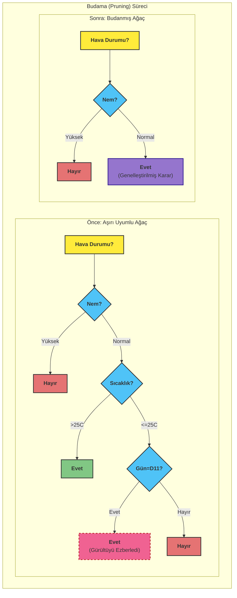

Diyagramda görüldüğü gibi:
-   **Aşırı Uyumlu Ağaç:** Model, `Gün=D11?` gibi bir soru sorarak çok fazla detaya inmiş ve sadece tek bir veri noktasına özel bir kural oluşturmuştur. Bu, öğrenme değil, ezberlemedir ve modelin genelleme yeteneğine zarar verir.
-   **Budanmış Ağaç:** Genelleme yeteneğini bozan karmaşık dal (`Sıcaklık?` ve sonrası) budanmış, yerine o dala düşen verilerin çoğunluk sınıfını temsil eden tek bir yaprak düğüm (`Evet`) konulmuştur. Ağaç artık daha basit ve daha güçlüdür.

Teknik açıdan budama, bir karar ağacının karmaşıklığını azaltmak için kullanılan bir **düzenlileştirme (regularization)** tekniğidir. Tamamen büyümüş bir ağaç, eğitim setindeki gürültüyü ve istisnaları modellediği için genellikle **yüksek varyansa (high variance)** sahiptir. Budama, modelin **yanlılığında (bias)** hafif bir artış pahasına, bu varyansı düşürerek daha dengeli bir model oluşturur. Amaç, görülmemiş veriler üzerinde en iyi performansı gösterecek, ne çok basit ne de çok karmaşık olan "altın oran"daki ağacı bulmaktır. Bu karar, genellikle bir doğrulama seti (validation set) üzerindeki performans metrikleri veya istatistiksel anlamlılık testleri ile verilir.

### 5.1. Budama Türleri

#### 5.1.1. Ön Budama (Pre-pruning / Forward Pruning)

Ağaç oluşturulurken dalların büyümesi kontrol edilir. Belirli kriterlere uymayan bölmeler engellenir.

**Avantajları**:
- Hesaplama açısından daha verimlidir
- Gereksiz dal oluşumunu baştan engeller

**Dezavantajları**:
- Erken durdurma nedeniyle önemli dalların kaçırılması riski (horizon effect)

**Yöntemler**:
- Ki-kare testleri
- Minimum bilgi kazancı eşiği
- Çoklu karşılaştırma düzeltmeleri

#### 5.1.2. Son Budama (Post-pruning / Backward Pruning)

Tam bir ağaç oluşturulduktan sonra, performansı iyileştirmeyen dallar geri doğru budanır.

**Avantajları**:
- Daha iyi sonuçlar verebilir
- Horizon effect problemini önler

**Dezavantajları**:
- Hesaplama açısından daha maliyetlidir

### 5.2. Budama Yöntemleri

**a) Hatalı Tahmin Oranı Minimizasyonu**: Her alt ağaç için hata oranı hesaplanır ve en düşük orana sahip olan seçilir.

**b) Doğrulama Veri Kümesi Yaklaşımı**: 
- Veri eğitim ve doğrulama kümelerine ayrılır
- Model eğitim verisiyle oluşturulur
- Performans doğrulama verisiyle değerlendirilir
- En iyi performansı gösteren alt ağaç seçilir

**c) K-Katlı Çapraz Doğrulama**:
- Veri k eşit katmana bölünür (tipik olarak k=10)
- Model k-1 katmanla eğitilir, kalan katmanla test edilir
- İşlem her katman için tekrarlanır
- Ortalama hata hesaplanır ve en düşük hataya sahip model seçilir

## 6. Popüler Karar Ağacı Algoritmaları

### 6.1. ID3 (Iterative Dichotomiser 3, 1986)

- Ross Quinlan tarafından geliştirilmiştir
- Entropi ve bilgi kazancı kullanır
- Sadece kategorik değişkenlerle çalışır
- Budama yapmaz (aşırı uyum riski)

### 6.2. C4.5 (1993) ve C5.0

- ID3'ün geliştirilmiş versiyonudur
- Hem kategorik hem sürekli değişkenlerle çalışır
- Kazanç oranı kullanır (çok kategorili değişkenlere karşı ön yargıyı azaltır)
- Budama destekler
- Eksik değerleri işleyebilir
- C5.0, C4.5'in daha hızlı ve verimli versiyonudur

### 6.3. CART (Classification and Regression Trees)

- Breiman ve arkadaşları tarafından geliştirilmiştir
- Gini indeksi kullanır
- Hem sınıflandırma hem regresyon için kullanılabilir
- Her düğümde ikili (binary) bölme yapar
- Maliyet-karmaşıklık budama kullanır

### 6.4. CHAID (Chi-squared Automatic Interaction Detection)

- Ki-kare testi kullanarak istatistiksel olarak anlamlı bölmeler yapar
- Çoklu yollu bölme yapabilir (ikiden fazla dal)
- Kategorik hedef değişkenler için uygundur
- Örüntü tanıma uygulamalarında yaygındır

## 7. Karar Ağaçlarının Avantajları ve Dezavantajları

### 7.1. Avantajlar

1. **Yorumlanabilirlik**: Karar süreçleri kolayca anlaşılabilir ve görselleştirilebilir
2. **Veri ön işleme gereksinimsizliği**: Normalizasyon veya standardizasyon gerektirmez
3. **Eksik değer toleransı**: Eksik verilerle çalışabilir
4. **Hibrit veri desteği**: Hem kategorik hem sayısal değişkenlerle çalışır
5. **Doğrusal olmayan ilişkileri yakalama**: Karmaşık etkileşimleri modelleyebilir
6. **Öznitelik seçimi**: Önemli değişkenleri otomatik olarak belirler

### 7.2. Dezavantajlar

1. **Aşırı uyum eğilimi**: Karmaşık ağaçlar eğitim verilerine aşırı uyum sağlayabilir
2. **Kararsızlık**: Verideki küçük değişiklikler farklı ağaç yapılarına yol açabilir
3. **Ölçeklenebilirlik**: Çok büyük veri kümelerinde bellek ve performans sorunları yaşanabilir
4. **Sınıf dengesizliği**: Dengesiz veri kümelerinde dominant sınıfa yanlılık gösterebilir
5. **Optimal çözüm garantisi yok**: Açgözlü (greedy) algoritmalar yerel optimuma takılabilir

## 8. Uygulama Alanları

Karar ağaçları çeşitli alanlarda başarıyla uygulanmaktadır:

- **Tıp**: Hastalık teşhisi, risk değerlendirmesi
- **Finans**: Kredi skorlaması, risk analizi, dolandırıcılık tespiti
- **Pazarlama**: Müşteri segmentasyonu, satın alma tahmini
- **Üretim**: Kalite kontrol, hata teşhisi
- **Eğitim**: Öğrenci performans tahmini
- **Meteoroloji**: Hava durumu tahmini

## 9. Model Değerlendirme

Karar ağacı modelinin performansı çeşitli metriklerle değerlendirilir:

- **Doğruluk (Accuracy)**: Doğru sınıflandırılan kayıtların oranı
- **Hassasiyet (Precision)**: Pozitif tahmin edilen kayıtlar arasında gerçekten pozitif olanların oranı
- **Duyarlılık (Recall/Sensitivity)**: Gerçek pozitif kayıtlar arasında doğru tahmin edilenlerin oranı
- **F1-Skoru**: Hassasiyet ve duyarlılığın harmonik ortalaması
- **Karmaşıklık Matrisi (Confusion Matrix)**: Tahminlerin detaylı gösterimi
- **ROC Eğrisi ve AUC**: Model ayırt etme gücünün değerlendirilmesi

## 10. Sonuç

Karar ağaçları, makine öğrenmesinde güçlü ve esnek bir yöntemdir. Doğru parametreler ve budama teknikleriyle kullanıldığında, karmaşık sınıflandırma ve regresyon problemlerinde yüksek performans gösterebilir. Ancak, aşırı uyum riski ve kararsızlık gibi sınırlamaları göz önünde bulundurulmalıdır. Bu nedenle, pratikte genellikle ensemble yöntemleri (Random Forest, Gradient Boosting gibi) tercih edilir ve bu yöntemler birden fazla karar ağacını birleştirerek daha sağlam ve genellenebilir modeller oluşturur.


Naive Bayes'i, slaytlardaki örnek üzerinden adım adım inceleyelim.

---

# Olasılık Temelli Tahminler: Naive Bayes Sınıflandırıcısı

Merhaba gençler. Bugün, elimizdeki verilerden yola çıkarak geleceğe yönelik akıllı tahminler yapmamızı sağlayan bir yöntemden bahsedeceğiz: **Naive Bayes Sınıflandırıcısı**. Adındaki "naive" kelimesi sizi yanıltmasın, kendisi oldukça güçlü bir tekniktir. Tıpkı bir dedektifin elindeki ipuçlarını birleştirerek bir sonuca varması gibi çalışır.
### Naive Bayes — Keşfi ve Temelleri

Gençler,

Kısa tarihçe:
- Temel fikir Bayes teoremiyle başlar (Thomas Bayes, 18. yy.). Laplace bu fikri genelleştirdi. Makine öğrenmesi bağlamında “Naive Bayes” adı, koşullu bağımsızlık (naive = saf) varsayımından gelir; basit ama pratik bir sınıflandırma yöntemi olarak e-postada spam tespiti, metin sınıflandırma vb. alanlarda yaygın kullanıldı.

 
- Elinizde geçmiş örnekler var; her sınıf için bir “profil” çıkarıyorsunuz (ör. spam ve değil). Yeni bir örneğe bakınca, bu örneğin her özelliğinin o sınıf altında görülme olasılığını çarpıyorsunuz ve en yüksek olasılık veren sınıfı seçiyorsunuz. Özelliklerin birbirinden bağımsız olduğunu varsayar; bu gerçek hayatta her zaman doğru değil ama çoğu pratik problemde yeterince işe yarıyor.

Matematiksel temeli

Temel Bayes bağıntısı:
$$
\displaystyle P(C \mid X) = \frac{P(X \mid C)\,P(C)}{P(X)}
$$

- P(C | X): Posterior — X gözlemi verildiğinde C sınıfında olma olasılığı (aranan değer).
- P(X | C): Likelihood — eğer sınıf C doğruysa X gözlemini elde etme olasılığı.
- P(C): Prior — sınıf C'nin önsel olasılığı (veri kümesindeki frekansla tahmin edilir).
- P(X): Evidence — X gözleminin toplam olasılığı (tüm sınıflara göre normalize eder; sınıfları karşılaştırırken sabittir, genelde ihmal edilir).

$$
\displaystyle P(X \mid C) \;=\; \prod_{i=1}^{n} P(x_i \mid C)
$$

- x_i: X gözleminin i'inci bileşeni (özelliği). Yani X = (x_1, ..., x_n).
- Ürün (∏): Koşullu bağımsızlık varsayımı altında
    $$P(X\mid C)=\prod_{i=1}^{n}P(x_i\mid C)\,.$$
- Hesaplama notu: Sayısal stabilite için genellikle log alınır:
    $$\text{score}_c=\log P(C=c)+\sum_{i=1}^{n}\log P(x_i\mid C=c)\,.$$

Sınıflandırma karar kuralı (özellikle P(X) ihmal edilince):
$$
\displaystyle \hat{C} = \arg\max_{c}\; P(C=c)\,\prod_{i=1}^{n} P(x_i \mid C=c)
$$

- argmax_c: En yüksek skoru veren sınıfı seç.

Sayısal stabilite ve uygulamada yaygın form:

$$
\displaystyle \text{score}_c \;=\; \log P(C=c) \;+\; \sum_{i=1}^{n} \log P(x_i \mid C=c)
$$

Gençler,

 Birden fazla küçük olasılığı (ör. pek çok kelime için P( kelime | sınıf )) birbirleriyle çarptığınızda ortaya çıkan sayı bilgisayarın ondalık gösterim aralığının çok altına düşebilir — buna "alt akış" (underflow) denir. Bu durumda çarpım sıfıra yuvarlanır ve bilgiler kaybolur. Log almak bu sorunu çözer: çarpma işlemi toplamaya dönüşür (log(a·b)=log a + log b), böylece çok küçük çarpımlar yerine makul büyüklükte sayılarla toplama yaparsınız ve sayısal kararlılığı korursunuz. Ayrıca argmax ile sınıflandırma yapıyorsanız, hangi sınıfın skoru daha büyük olduğunu bulmak için log almamız sonucu değiştirmez; çarpımların log'larını toplamak yeterlidir.

Bilgisayarlarda kayan nokta (floating-point) aritmetiği sınırlı dinamik aralığa sahiptir; örneğin 10^(-300) civarındaki değerler güvenli olsa da 10^(-1000) gibi değerler sıfıra yuvarlanır. Naive Bayes'te çok sayıda bağımsız özellik için P(X|C)=∏i P(xi|C) hesaplanırken bu durum sık meydana gelir. Log-olasılık kullanmak şöyle avantajlar sağlar:
- Sayısal kararlılık: Üstel küçüklükler yerine log'ların toplamı tutulur, alt/üst akış riski çok azalır.
- Hesaplama verimliliği: Çarpma yerine toplama yapıldığı için log işlemi ile sayısal hata birikimi azalır; argmax için P(X) (normalizasyon) atılabilir.
- İfade kolaylığı: Skor = log P(C) + Σ_i log P(x_i | C) formu hem anlaşılır hem de doğrudan uygulanır. Sürekli özelliklerde Gaussian varsayımı varsa, log-normalizasyon terimleri log'a alınınca kareli terimler ortaya çıkar ve hesaplama daha stabildir.

Normalizasyon gerektiğinde (ör. gerçek posteriyorları elde etmek isterseniz), log-sum-exp tekniği kullanılır:
log Σ_j exp(s_j) = m + log Σ_j exp(s_j − m),
burada m = max_j s_j. Bu küçük bir öteleme ile exp(·) sırasında oluşabilecek taşma/alt akışı engeller.

- Hangi log tabanını kullandığınız argmax açısından önemli değildir; genellikle doğal log (ln) tercih edilir.
- Laplace (add‑1) smoothing ile hesaplanan frekanslar da log alındıktan sonra doğrudan toplanır.
- Çift hassasiyet (double) kullanmak yardımcıdır ama binlerce özelliğin çarpımı için log yine gereklidir.

Özetle: Log-olasılık hem sayısal açıdan güvenli hem de matematiksel olarak doğal bir yaklaşımdır; Naive Bayes ve benzeri modellerde standard uygulamadır.

3) Pratik notlar ve uygulama detayları
- Olasılık tahmini: Kategorik özelliklerde frekans temelli (say/total). Hiç görülmeyen değerler için Laplace (add-1) smoothing kullanılır: P = (count + 1) / (N + K).
- Sürekli özellikler: Genellikle her sınıf için Gaussian (normal) dağılım varsayılır; P(x_i|C) ~ N(μ_{C,i}, σ_{C,i}^2).
- Bağımsızlık varsayımı gerçekçi değilse bile yöntem hâlâ güçlü olabilir; metin verilerinde özelliklerin (kelime varlığı) kısmi bağımsızlığı nedeniyle özellikle etkilidir.
- Dezavantajlar: Çok güçlü bağımlılıklar varsa performans düşer; özellik seçimi veya birleştirme gerekebilir.
- Performans ölçümü: Çapraz doğrulama, doğruluk, hassasiyet/duyarlılık, F1 gibi metriklerle değerlendirilir.

Sonuç: Yorumlaması kolay, hızlı ve az veri ile çalışabilen bir yöntemdir. Öğrencilerin dikkat etmesi gereken ana nokta, bağımsızlık varsayımının güçlü bir varsayım olduğudur; uygulamada bunu akılda tutup gerekirse özellik mühendisliği ve smoothing yöntemleri kullanılır.

## Örnek Uygulama: Bilgisayar Satın Alma Tahmini
Slaytlardaki örneğimiz üzerinden gidelim. Bir bilgisayar mağazasının elinde geçmiş müşterilerine ait bir tablo var. Bu tabloda müşterilerin yaşı, geliri, öğrenci olup olmadığı ve kredi notu gibi bilgiler ile en sonunda bilgisayar alıp almadıkları (`evet` ya da `hayır`) yazıyor.

### Bilgisayar Satın Alma Veri Seti

| yas | gelir | ogrencimi | kredibilite | bilgisayar_alimi |
| :--- | :--- | :--- | :--- | :--- |
| genc | yuksek | hayir | kotu | hayir |
| genc | yuksek | hayir | iyi | hayir |
| orta_yasli | yuksek | hayir | kotu | evet |
| yasli | orta | hayir | kotu | evet |
| yasli | dusuk | evet | kotu | evet |
| yasli | dusuk | evet | iyi | hayir |
| orta_yasli | dusuk | evet | iyi | evet |
| genc | orta | hayir | kotu | hayir |
| genc | dusuk | evet | kotu | evet |
| yasli | orta | evet | kotu | evet |
| genc | orta | evet | iyi | evet |
| orta_yasli | orta | hayir | iyi | evet |
| orta_yasli | yuksek | evet | kotu | evet |
| yasli | orta | hayir | iyi | hayir |

---

Bu tabloya ilk baktığımızda, aslında bir mağazanın geçmiş müşteri kayıtlarını görüyoruz. Her bir satır, mağazaya gelmiş farklı bir kişiyi temsil ediyor. Sütunlar ise o kişiye ait bildiğimiz özellikleri ve en sonunda ne yaptığı bilgisini bize veriyor. `bilgisayar_alimi` sütunu bizim için "sonuç" veya "hedef" sütunudur. Amacımız, diğer sütunlardaki bilgilere bakarak bu sonuç sütununu tahmin etmektir. İşte bir önceki derste yaptığımız olasılık hesaplamalarının tamamı, bu tablodaki "evet" ve "hayır"ları, "genç" ve "yaşlı"ları sayarak yapıldı. Bu tablo, algoritmamızın tecrübe kazandığı, öğrendiği bir nevi ders kitabıdır.


**Görevimiz:** Mağazaya yeni bir müşteri geliyor. Bu kişinin özelliklerini biliyoruz:
*   **Yaş:** Genç
*   **Gelir:** Orta
*   **Öğrenci mi?:** Evet
*   **Kredibilite:** Kötü

Sorumuz şu: **Bu yeni müşteri bilgisayar satın alır mı, almaz mı?**

İşte Naive Bayes bu noktada bir olasılık oyunu oynayarak bize en mantıklı tahmini sunuyor. Adım adım gidelim:

#### **Adım 1: Genel Duruma Bakalım (Önsel Olasılık)**

Dedektifimiz, daha yeni müşterinin detaylarına inmeden önce genel arşive bir göz atar. "Geçmişte mağazaya gelenlerin ne kadarı bilgisayar aldı, ne kadarı almadı?" diye sorar.

*   Toplam **14** müşteri kaydımız var.
*   Bunlardan **9** tanesi bilgisayar almış (`evet`).
*   Bunlardan **5** tanesi bilgisayar almamış (`hayır`).

Bu bize temel bir oran verir:
*   Bilgisayar alma olasılığı: **P(evet) = 9/14 ≈ %64**
*   Bilgisayar almama olasılığı: **P(hayır) = 5/14 ≈ %36**

Demek ki genel eğilim, insanların bilgisayar alması yönünde. Bu, bizim başlangıç noktamız.

#### **Adım 2: İpuçlarını Değerlendirelim (Koşullu Olasılık)**

Şimdi yeni müşterimizin özelliklerini, yani ipuçlarını masaya yatıralım ve her birini iki ayrı senaryo için değerlendirelim: "Bilgisayar Alanlar" ve "Bilgisayar Almayanlar".

**İpucu 1: "Genç" olması**
*   Bilgisayar alan **9** kişiden kaçı "genç"? Tabloya bakıyoruz: **2** kişi.
    *   Yani, bilgisayar alan birinin genç olma olasılığı: **P(genç | evet) = 2/9**
*   Bilgisayar almayan **5** kişiden kaçı "genç"? Tabloya bakıyoruz: **3** kişi.
    *   Yani, bilgisayar almayan birinin genç olma olasılığı: **P(genç | hayır) = 3/5**

**İpucu 2: "Orta" gelirli olması**
*   Bilgisayar alan **9** kişiden kaçının geliri "orta"? **4** kişi.
    *   Olasılık: **P(orta | evet) = 4/9**
*   Bilgisayar almayan **5** kişiden kaçının geliri "orta"? **2** kişi.
    *   Olasılık: **P(orta | hayır) = 2/5**

Bu şekilde slaytta gösterildiği gibi diğer tüm ipuçları için de olasılıkları hesaplarız: öğrenci olması ve kredisinin kötü olması.

#### **Adım 3: Kanıtları Birleştirelim ve Karar Verelim**

İşte yöntemin "naive" (saf) olarak adlandırıldığı kısım burası. Algoritma, bu ipuçlarının (yaş, gelir vb.) birbirinden tamamen bağımsız olduğunu varsayar. Yani bir kişinin genç olmasının, gelir durumunu etkilemediğini düşünür. Bu gerçek hayatta her zaman doğru olmasa da, bu basitleştirme harika sonuçlar verir.

Şimdi iki takımın ("Evet" takımı ve "Hayır" takımı) puanlarını hesaplayalım. Her takımın puanı, kendi başlangıç olasılığı ile ipuçlarından gelen olasılıkların çarpımıyla bulunur.

**"EVET" Takımının Skoru:**
*   (Başlangıç Olasılığı) x (Genç Olma) x (Orta Gelir) x (Öğrenci Olma) x (Kötü Kredi)
*   P(evet) x P(genç|evet) x P(orta|evet) x P(öğrenci|evet) x P(kötü|evet)
*   (9/14) x (2/9) x (4/9) x (6/9) x (6/9)
*   0.643 x 0.222 x 0.444 x 0.667 x 0.667 ≈ **0.028**

**"HAYIR" Takımının Skoru:**
*   P(hayır) x P(genç|hayır) x P(orta|hayır) x P(öğrenci|hayır) x P(kötü|hayır)
*   (5/14) x (3/5) x (2/5) x (1/5) x (2/5)
*   0.357 x 0.600 x 0.400 x 0.200 x 0.400 ≈ **0.0068**

**Karar Anı:**
"EVET" takımının skoru (**0.028**), "HAYIR" takımının skorundan (**0.0068**) çok daha yüksek.
Bu durumda dedektifimiz, yani Naive Bayes algoritmamız, eldeki tüm ipuçlarını değerlendirdiğinde bu yeni müşterinin **bilgisayar alma olasılığının daha yüksek** olduğuna karar verir.

---
### **Daha Akademik Bir Bakış Açısıyla**

Şimdi bu sezgisel yaklaşımı biraz daha akademik bir dille ve slaytlardaki formüllerle ifade edelim.

Naive Bayes sınıflandırıcısı, temelini olasılık teorisindeki **Bayes Teoremi**'nden alır. Teorem bize, bir hipotezin olasılığını yeni kanıtlar ışığında nasıl güncelleyeceğimizi söyler. Formülümüz şöyledir:

`P(C|X) = [ P(X|C) * P(C) ] / P(X)`

Bu formüldeki terimleri bizim örneğimize uyarlayalım:
*   `C`: Sınıf (yani `bilgisayar_alimi=evet` veya `bilgisayar_alimi=hayır`).
*   `X`: Gözlemlenen veri, yani yeni müşterinin özellikleri `(genç, orta, evet, kötü)`.
*   `P(C|X)`: **Sonsal Olasılık (Posterior Probability):** Aradığımız şey budur. `X` verisi verildiğinde bu verinin `C` sınıfına ait olma olasılığı.
*   `P(C)`: **Önsel Olasılık (Prior Probability):** Herhangi bir veri görmeden önce `C` sınıfının genel olasılığı. (Adım 1'de hesapladığımız 9/14 ve 5/14 değerleri).
*   `P(X|C)`: **Olabilirlik (Likelihood):** `C` sınıfı doğruysa, `X` verisini gözlemleme olasılığımız.
*   `P(X)`: **Kanıt Olasılığı (Evidence):** `X` verisini gözlemlemenin genel olasılığı. Bu değer, tüm sınıflar için sabittir, bu yüzden sınıflandırma yaparken karşılaştırma amacıyla genellikle ihmal edilebilir. Bizim için önemli olan `P(X|C) * P(C)` çarpımını maksimize etmektir.

**"Naive" (Saf) Varsayım:**
Algoritmanın en kritik noktası, `X` vektöründeki özelliklerin (`x_1, x_2, ..., x_n`) sınıf verildiğinde **koşullu olarak bağımsız** olduğunu varsaymasıdır. Bu, `P(X|C)` terimini basitleştirmemizi sağlar:

`P(X|C) = P(x_1|C) * P(x_2|C) * ... * P(x_n|C)`

Bu, slaytlarda `Π` (pi) notasyonu ile gösterilen çarpım işlemidir.

**Örnek Üzerinden Uygulama:**

**1. Önsel Olasılıkların (P(C)) Hesaplanması:**
*   `P(C₁ = evet) = 9/14 = 0.643`
*   `P(C₂ = hayır) = 5/14 = 0.357`

**2. Koşullu Olasılıkların (P(X|C)) Hesaplanması:**
Yeni veri `X = (yas=genç, gelir=orta, ogrencimi=evet, kredibilite=kotu)` için, bağımsızlık varsayımı altında olabilirlikleri hesaplarız:

*   **`C₁=evet` sınıfı için:**
    `P(X|evet) = P(yas=genç|evet) × P(gelir=orta|evet) × P(öğrenci=evet|evet) × P(kredi=kötü|evet)`
    `P(X|evet) = (2/9) × (4/9) × (6/9) × (6/9) = 0.222 × 0.444 × 0.667 × 0.667 = 0.044` (Slayt 43)

*   **`C₂=hayır` sınıfı için:**
    `P(X|hayır) = P(yas=genç|hayır) × P(gelir=orta|hayır) × P(öğrenci=evet|hayır) × P(kredi=kötü|hayır)`
    `P(X|hayır) = (3/5) × (2/5) × (1/5) × (2/5) = 0.600 × 0.400 × 0.200 × 0.400 = 0.019` (Slayt 43)

**3. Sınıflandırma (Karşılaştırma):**
`P(X)` terimini göz ardı ederek, `P(X|C) * P(C)` değerini her sınıf için karşılaştırırız:

*   `P(X|evet) * P(evet) = 0.044 * 0.643 ≈ 0.0283`
*   `P(X|hayır) * P(hayır) = 0.019 * 0.357 ≈ 0.0068`

Sonuç olarak `0.0283 > 0.0068` olduğundan, modelimiz `X` verisini `bilgisayar_alimi = evet` olarak sınıflandırır.

Gençler,

Bir özellik için P(x)=0 olursa (ör. eğitim verisinde o kelime hiç görülmemişse), Naive Bayes’in sınıf olasılığına olan çarpımda o terim tüm çarpımı sıfıra indirir — yani o sınıf için posterior olasılık sıfır olur. Bu, modelin yeni veya nadir görülen örüntüleri “hiç şansı yok” diye cezalandırmasına yol açar; aslında diğer güçlü kanıtlar olsa bile tek bir sıfır tüm kararı yok eder.

Basit çözüm: Laplace (add‑1) smoothing. Kategorik/multinomial durumda her sayımı (count) 1 ekleyip normalizasyonu yeniden yaparsınız:
P_smoothed = (count + 1) / (N + K)
burada N sınıfa ait toplam gözlem, K özellik değerlerinin (ör. sözlük boyutu) sayısıdır. Böylece hiç görülmeyen değerlerin olasılığı sıfır olmaz, küçük ama pozitif olur. Ayrıca pratikte çarpımlar çok küçük değerlere düşer; o yüzden log‑olasılık kullanılır (çarpma → toplam), sayısal taşma/alt akışı önlenir.

Daha teknik notlar:
- Sürekli özelliklerde (Gaussian NB) P(x)=0 nadiren tam sıfır olur ama varyans çok küçükse olasılık etkilenir; küçük bir varyans eşiği veya sınıf başına varyans düzenlemesi (variance smoothing) kullanmak gerekir.
- Çok yüksek boyutlu kelime temelli modellerde log‑olasılık + Laplace en yaygın ve etkili kombinasyondur.
- Laplace tek seçenektir; bazı durumlarda Lidstone (add‑α) daha ince ayar imkânı verir (α∈(0,1) gibi).

Weka ile uygulama (metin/sözlük tabanlı örnek için hızlı adımlar):
1. Weka Explorer → Preprocess → Open file (ARFF veya CSV; metin sütunu string türünde olsun).
2. String alanını kelime vektörüne çevirmek için Filters → unsupervised.attribute.StringToWordVector seçin. Önerilen ayarlar: TF/IDF gerektiğinde açık, lowerCaseTokens = true, wordsToKeep = (ör. 10000), uygun tokenizasyon. Apply ile dönüştürün.
3. Classify sekmesi → Choose → weka.classifiers.bayes.NaiveBayesMultinomial (metin için uygun). Seçeneklerde -L (use Laplace) aktif olduğundan emin olun.
4. Evaluation: Test options altında 10‑fold cross‑validation seçin ve Start. Sonuçlarda doğruluk, F1, confusion matrix ve sınıf dağılımını inceleyin.
5. Karşılaştırma için weka.classifiers.bayes.NaiveBayes (normal NB) ile deneyin; sayısal özellik varsa NaiveBayes’in “useKernelEstimator” veya “useSupervisedDiscretization” seçeneklerini deneyerek sıfır/çok küçük yoğunluk problemlerini hafifletin.
6. Model davranışını anlamak için Classify → More options → Output predictions ve output distribution aktif edilerek örnek bazlı olasılıklar incelenebilir.

Pratik tavsiye: Smoothing parametresini ve StringToWordVector ayarlarını çapraz doğrulama ile ayarlayın; çok agresif temizleme nadir fakat ayırt edici kelimeleri yok edebilir, çok gevşek ayar ise gürültüyü arttırır.

Kısa özet: P(x)=0 model kararını tek taraflı yok eder — Laplace/add‑α smoothing ve log‑olasılık kullanımı bu problemi etkili ve basitçe çözer. Weka’da NaiveBayesMultinomial + Laplace + StringToWordVector ile metin örneklerini deneyip farkı görebilirsiniz.
