# VERİ MADENCİLİĞİ (DATA MINING)  
**Ders Kodu:** BMSB403  
**Hazırlayan:** Ph.D. Erkan ÖZHAN  
Tekirdağ Namık Kemal Üniversitesi  
Çorlu Mühendislik Fakültesi  
Bilgisayar Mühendisliği Bölümü  
2025.v13-6  

E-posta: erkanozhan@gmail.com / eozhan@nku.edu.tr  
Tel: +90 282 250 23 84  
Ofis: Çorlu Mühendislik Fakültesi, 4.Kat A-418 ---
Görüşme Saatleri: Her hafta Perşembe 09:30-12:30 arası.

## 1. Veri Nedir? (What is Data?)
- **Dijital Veri**
- **Basılı – Fiziksel Veri**
- **Soyut Veri**

### 1.1. Veri Türleri:
- Doküman, Resim, Ses, Video, Metin, Program  
- Gazete, Dergi, Kitap, Afiş vb.  
- Tecrübeler, Hatıralar, Hayaller …

---

## 2. Veri Kaynakları
- Marketler  
- Kurumlar  
- Konuşmalar  
- Hastaneler  
- Eğitim Kurumları  
- Laboratuvarlar  
- Turnikeler  
- Otoyol Geçiş Sistemleri  
- Sensörler  
- Facebook, Twitter  
- E-Mailler  
- Otomasyon Sistemleri  

---

## 3. Veri Kaynaklarının Gelişimi
Otomatize edilmiş veri toplama araçları ve “olgunlaşmış” veritabanları; veri ambarlarında ve diğer bilgi depolama alanlarında devasa miktarda verinin birikmesine sebep olmuştur.  

- **Veri Üretimi:** Günümüzde her gün milyarlarca gigabayt veri üretilmektedir. 2025 yılına kadar küresel veri miktarının 175 zettabayta ulaşması beklenmektedir.
- **Depolama Gelişmeleri:** Depolama maliyetleri düşmeye devam ederken, bu devasa veri yığınlarını saklama kapasitemiz sürekli artmaktadır.
- **Sonuç:** Veri bolluğu içindeyiz, ancak asıl ihtiyaç duyduğumuz şey bu veriden anlamlı bilgi (knowledge) ve içgörü (insight) elde etmektir. 

Jerome Friedman:  
> “Verinin boyutu her 10 katına çıktığında, onu analiz etme biçimimizi tamamen yeniden şekillendirmek zorundayız.”  


## 4. Veri Madenciliği (Data Mining)

Veri madenciliği, veri tabanı sorgularından (**database query**) farklıdır.  

### 4.1. Veritabanı Sorgusu (Geleneksel Analiz)
- "Geçen ay en çok hangi ürün satıldı?"
- "İstanbul'daki müşterilerimizin ortalama yaşı kaçtır?"
- "Son üç ayda kaç yeni müşteri kazandık?"  

### 4.2. Veri Madenciliği Analizi (Keşif ve Tahmin)
Veri madenciliği, verinin derinliklerindeki gizli örüntüleri, ilişkileri ve gelecek trendlerini ortaya çıkarmayı hedefler.

- **Birliktelik Analizi:** "Hangi ürünler genellikle birlikte satın alınır?" (Örn: Bebek bezi alan müşteriler bira da alır mı?)
- **Tahminleme (Sınıflandırma):** "Hangi müşterilerin önümüzdeki 3 ay içinde aboneliklerini iptal etme olasılığı yüksektir?"
- **Kümeleme:** "Müşterilerimizi satın alma davranışlarına göre hangi doğal gruplara (segmentlere) ayırabiliriz?"
- **Anomali Tespiti:** "Hangi kredi kartı işlemleri sahtekarlık şüphesi taşımaktadır?"
- **Tavsiye Sistemleri:** "A ürününü satın alan bir müşteriye başka hangi ürünleri önermeliyiz?"

---

## 5. Veri Madenciliği Modelleri
Veri madenciliğinin temel amacı, verinin içindeki gizli örüntüleri ve ilişkileri keşfetmek için modeller oluşturmaktır. Bu modeller, açıkça kodlanmış kurallara dayanmak yerine, veriden otomatik olarak öğrenilir ve genellikle iki ana kategoriye ayrılır:

1.  **Tahminleyici (Predictive) Modeller:**
    - Gelecekteki veya bilinmeyen olayların sonucunu tahmin etmek için kullanılır.
    - **Örnekler:** Bir müşterinin bir ürünü satın alıp almayacağını tahmin eden **sınıflandırma** modelleri veya bir evin gelecekteki fiyatını tahmin eden **regresyon** modelleri.

2.  **Betimleyici (Descriptive) Modeller:**
    - Verideki doğal gruplamaları, ilişkileri veya aykırı durumları bulmaya odaklanır.
    - **Örnekler:** Müşterileri benzer satın alma alışkanlıklarına göre gruplayan **kümeleme** modelleri, birlikte sıkça satın alınan ürünleri belirleyen **birliktelik kuralları** veya sahtekarlık tespiti için kullanılan **anomali tespiti** modelleri.

---

## 6. Veri Madenciliği, Makine Öğrenmesi ve İstatistik İlişkisi
Veri madenciliği, makine öğrenmesi ve istatistik birbiriyle yakından ilişkili, sıklıkla iç içe geçmiş alanlardır. Veri madenciliği, bu disiplinlerden gelen yöntemleri pratik problemlere uygulama sürecidir.

-   **İstatistik (Statistics):**
    -   Veri madenciliğinin teorik temelini oluşturur.
    -   Veriyi anlama, özetleme, hipotez test etme ve sonuçların güvenilirliğini ölçme gibi konulara odaklanır.
    -   Örnekleme, olasılık teorisi ve modelleme gibi klasik yöntemler sunar. Temel amacı, veriden çıkarım (inference) yapmaktır.

-   **Makine Öğrenmesi (Machine Learning):**
    -   Veri madenciliğinin algoritmik motorudur. Bilgisayar bilimi ve yapay zekanın bir alt dalıdır.
    -   Büyük veri setleri üzerinde verimli bir şekilde çalışabilen algoritmalar geliştirmeye odaklanır.
    -   Açıkça programlanmadan, veriden öğrenerek tahminler veya kararlar üreten sistemler oluşturur. Sınıflandırma, regresyon, kümeleme gibi algoritmalar bu alandan gelir. Temel amacı, tahminsel doğruluktur (predictive accuracy).

-   **Veri Madenciliği (Data Mining):**
    -   İstatistik ve makine öğrenmesi tekniklerini kullanarak büyük veri yığınları içindeki **anlamlı, yeni ve potansiyel olarak faydalı** örüntüleri keşfetme sürecidir.
    -   Odak noktası, keşfedilen bilgiyi pratik ve işlevsel bir içgörüye dönüştürmektir.
    -   Genellikle "Veritabanlarında Bilgi Keşfi" (Knowledge Discovery in Databases - KDD) sürecinin bir adımı olarak kabul edilir.

**Özetle:**
-   **İstatistik** "Neden?" sorusuna odaklanarak verinin altındaki yapıyı ve güvenilirliği anlamaya çalışır.
-   **Makine Öğrenmesi** "Nasıl?" sorusuna odaklanarak veriden öğrenen ve doğru tahminler yapan algoritmalar geliştirir.
-   **Veri Madenciliği** ise bu araçları kullanarak "Ne?" sorusuna cevap arar: "Veride hangi gizli ve değerli örüntüler var?" 

---

## 7. Veri Madenciliğinin Önemi ve Uygulama Alanları

Veri madenciliği, ham veriyi iş zekasına, bilimsel keşiflere ve stratejik karar alma süreçlerine dönüştüren kritik bir disiplindir. Önemi, sadece büyük veri yığınlarını analiz etme kapasitesinden değil, aynı zamanda bu verilerden daha önce bilinmeyen, eyleme geçirilebilir ve değerli bilgiler çıkarma yeteneğinden kaynaklanır. Bu süreç, çeşitli sektörlerde devrim yaratmıştır:

-   **İşletme ve Pazarlama:**
    -   **Müşteri Segmentasyonu:** Müşterileri demografik bilgilere, satın alma alışkanlıklarına veya davranışlarına göre gruplayarak hedefli pazarlama stratejileri geliştirilir.
    -   **Pazar Sepeti Analizi (Birliktelik Kuralları):** Hangi ürünlerin birlikte satın alındığını tespit ederek raf düzenlemeleri, çapraz satış (cross-selling) ve promosyon kampanyaları optimize edilir.
    -   **Müşteri Kaybı (Churn) Analizi:** Bir hizmeti terk etme olasılığı yüksek olan müşterileri önceden belirleyerek onları elde tutmaya yönelik proaktif adımlar atılır.

-   **Finans ve Bankacılık:**
    -   **Sahtekarlık Tespiti (Fraud Detection):** Kredi kartı işlemlerindeki veya sigorta taleplerindeki anormal ve şüpheli örüntüleri tespit ederek finansal kayıplar önlenir.
    -   **Kredi Riski Değerlendirmesi:** Başvuru sahiplerinin kredi geçmişini ve diğer özelliklerini analiz ederek geri ödeme olasılıklarını tahmin eder ve kredi kararlarını destekler.

-   **Sağlık ve Biyoinformatik:**
    -   **Hastalık Teşhisi ve Tahmini:** Tıbbi verileri (görüntüler, laboratuvar sonuçları, hasta geçmişi) analiz ederek hastalıkların erken teşhisine yardımcı olur ve tedavi sonuçlarını tahmin eder.
    -   **Genomik Veri Analizi:** Gen dizilimlerindeki örüntüleri keşfederek genetik hastalıklara yatkınlığı belirler ve kişiselleştirilmiş tıp uygulamalarına zemin hazırlar.

-   **Web ve E-Ticaret:**
    -   **Tavsiye Sistemleri (Recommendation Systems):** Kullanıcıların geçmiş davranışlarına dayanarak onlara ilgi duyabilecekleri ürün, film veya içerikleri önerir, böylece kullanıcı deneyimini ve satışları artırır.
    -   **Web Kullanım Madenciliği:** Web sitesi ziyaretçilerinin gezinme yollarını analiz ederek site tasarımını ve kullanıcı arayüzünü iyileştirir.

Bu uygulamalar, veri madenciliğinin sadece teorik bir alan olmadığını, aynı zamanda kuruluşların daha akıllı kararlar almasını, verimliliği artırmasını ve rekabet avantajı elde etmesini sağlayan güçlü bir pratik araç olduğunu göstermektedir.

## 8. Veri Madenciliği (Data Mining)

### 8.1. Tanım
Veri madenciliği, çeşitli akademik kaynaklarda farklı şekillerde tanımlanmakla birlikte, temel olarak büyük veri setleri içindeki değerli bilgiyi keşfetme sürecini ifade eder.

- **Fayyad, Piatetsky-Shapiro, & Smyth (1996)** tarafından yapılan klasik tanıma göre veri madenciliği, "veri içerisindeki **geçerli, yeni, potansiyel olarak kullanışlı** ve nihayetinde **anlaşılabilir** örüntülerin önemsiz olmayan (non-trivial) çıkarım sürecidir." Bu tanım, sürecin sadece veri işlemeyi değil, aynı zamanda keşfedilen bilginin niteliğini de vurgular.
- **Han, Kamber, & Pei (2012)** ise veri madenciliğini, "büyük miktardaki veriden ilginç örüntüleri ve bilgiyi keşfetme süreci" olarak daha geniş bir perspektiften ele alır. Bu süreç, veritabanları, veri ambarları, web ve diğer bilgi havuzlarını kapsar.
- Temel amaç, veriden öğrenen bir **model** oluşturmaktır. Bu model, veriyi özetler ve gelecekteki olayları tahmin etmek (tahminleyici model) veya verinin iç yapısını anlamak (betimleyici model) için kullanılır. Keşfedilen bu yapılar genellikle **model** veya **örüntü (pattern)** olarak adlandırılır.

---
## 9. Veritabanlarında Bilgi Keşfi (Knowledge Discovery in Databases - KDD)

Veritabanlarında Bilgi Keşfi (KDD), ham veri yığınları içerisinden **geçerli, yeni, potansiyel olarak faydalı ve nihayetinde anlaşılabilir** örüntüleri bulmaya yönelik **önemsiz olmayan (non-trivial)** ve bütünsel bir süreçtir. KDD, veri madenciliğini de içeren çok adımlı bir metodoloji olarak kabul edilir ve veriden bilgiye giden yol haritasını çizer.

### 9.1. KDD Sürecinin Adımları
KDD süreci, genellikle aşağıdaki ardışık adımlardan oluşur:

1.  **Veri Seçimi (Selection):** Analiz hedefine uygun olarak, ilgili veri kaynaklarından (veritabanları, veri ambarları vb.) bir hedef veri kümesi oluşturulur.
2.  **Ön İşleme (Preprocessing):** Veri kalitesini artırmak için en kritik adımlardan biridir. Bu aşamada gürültülü veriler temizlenir, eksik değerler yönetilir ve tutarsızlıklar giderilir.
3.  **Dönüşüm (Transformation):** Veri, madencilik algoritmalarının uygulanmasına uygun hale getirmek için dönüştürülür. Bu, boyut indirgeme, öznitelik mühendisliği (feature engineering) ve normalizasyon gibi teknikleri içerebilir.
4.  **Veri Madenciliği (Data Mining):** Sürecin çekirdek adımıdır. Belirli bir amaç doğrultusunda (örn. sınıflandırma, kümeleme) akıllı algoritmalar kullanılarak veri içerisindeki örüntüler sistematik olarak çıkarılır.
5.  **Yorumlama ve Değerlendirme (Interpretation & Evaluation):** Keşfedilen örüntülerin ve modellerin, başlangıçtaki hedeflerle ne kadar uyumlu olduğu değerlendirilir. Anlamlı bulunan bilgiler görselleştirilerek veya raporlanarak karar vericiler için eyleme geçirilebilir bilgiye dönüştürülür.

### 9.2. Keşfedilen Bilginin Nitelikleri
KDD sürecinin nihai hedefi, sadece herhangi bir örüntü bulmak değil, aşağıdaki niteliklere sahip olan **bilgiyi** ortaya çıkarmaktır:

-   **Örtük (Implicit):** Basit sorgularla veya geleneksel analiz yöntemleriyle kolayca bulunamayan, verinin derinliklerinde saklı olan.
-   **Geçerli (Valid):** Sadece analiz edilen veri setinde değil, yeni veriler üzerinde de belirli bir güvenilirlik derecesiyle genellenebilir olan.
-   **Yeni ve Özgün (Novel):** Daha önceden bilinmeyen, şaşırtıcı ve beklentilerin ötesinde olan.
-   **Potansiyel Olarak Faydalı (Potentially Useful):** Stratejik bir avantaj sağlayan, karar alma süreçlerini iyileştiren veya bir hedefe ulaşmak için eyleme geçirilebilen.
-   **Anlaşılabilir (Understandable):** Alan uzmanları veya son kullanıcılar tarafından kolayca yorumlanabilen ve anlamlandırılabilen.

---
## 10. Veri Madenciliği ve KDD Arasındaki İlişki

Veri madenciliği, sıklıkla KDD süreciyle eş anlamlı olarak kullanılsa da, metodolojik olarak KDD'nin yalnızca bir adımıdır; ancak en merkezi adımıdır. KDD, veriden bilgiye ulaşmayı hedefleyen bütünsel bir metodoloji iken, veri madenciliği bu sürecin içerisinde belirli algoritmalar kullanarak örüntülerin fiilen çıkarıldığı analitik aşamayı temsil eder. Kısacası, KDD "bilgi keşfi"nin stratejik yol haritasını çizerken, veri madenciliği bu haritadaki en önemli "keşif" eylemidir.

### 10.1. Geleneksel Yöntemlerin Rolü
Uygulamada, bir KDD projesinde harcanan zaman ve eforun büyük bir kısmı—genellikle %80'e varan bir oranı—veri madenciliği adımından önceki hazırlık aşamalarına (veri seçimi, ön işleme ve dönüşüm) ayrılır. Bunun temel nedeni, gerçek dünya verilerinin genellikle "kirli" (eksik, gürültülü, tutarsız) olmasıdır. Veri madenciliği algoritmalarının başarısı, doğrudan girdi verisinin kalitesine bağlıdır. "Çöp girer, çöp çıkar" (Garbage In, Garbage Out) prensibi, bu aşamanın kritik önemini vurgular.

KDD sürecinin başlangıcında, genellikle standart veritabanı sorgulama dilleri (SQL) ve Çevrimiçi Analitik İşleme (OLAP) araçları ile bir ön analiz yapılır. Bu araçlar, veritabanında açıkça var olan bilgileri özetlemek, filtrelemek ve raporlamak için son derece güçlüdür. Ancak bu geleneksel yöntemler, verinin derinliklerindeki örtük, daha önce bilinmeyen ve tahmine dayalı ilişkileri ortaya çıkarmada yetersiz kalır. İşte bu noktada veri madenciliği devreye girer ve SQL'in cevaplayamadığı sorulara odaklanır:

-   **Birliktelik Analizi:** "Hangi ürünler genellikle birlikte satın alınır?" (SQL ile bu soruyu sormak için önce hangi ürünleri karşılaştıracağınızı bilmeniz gerekir; veri madenciliği ise bu ilişkileri otomatik olarak keşfeder.)
-   **Sınıflandırma ve Tahmin:** "Bir müşterinin kredi başvurusunun riskli olup olmadığını hangi özelliklere bakarak tahmin edebilirim?" (Bu, geleceğe yönelik bir tahmin gerektirir ve veriden öğrenen bir model oluşturulmasını zorunlu kılar.)

Özetle, SQL ve OLAP mevcut veriyi "sorgularken", veri madenciliği verinin kendisine "soru sormasını" sağlayarak gizli içgörüleri ve geleceğe yönelik modelleri keşfeder.

## 11. Operasyonel Veritabanları ve Veri Ambarları

Veri analizi ve karar destek sistemleri bağlamında, operasyonel veritabanları ile veri ambarları arasında temel mimari ve amaç farklılıkları bulunmaktadır.

### 11.1. Operasyonel Veritabanı Sistemleri (OLTP)
Operasyonel sistemler, bir kuruluşun günlük işlemlerini yürütmek için tasarlanmış **Çevrimiçi İşlem Gerçekleştirme (Online Transaction Processing - OLTP)** sistemleridir.

-   **Temel Amaç:** Günlük ticari işlemleri (ekleme, silme, güncelleme) hızlı ve tutarlı bir şekilde kaydetmek ve yönetmektir.
-   **Veri Yapısı:** Veri bütünlüğünü sağlamak ve tekrarı önlemek amacıyla genellikle yüksek derecede normalize edilmiş (Üçüncü Normal Form - 3NF) ilişkisel tablolardan oluşur.
-   **Kullanıcılar:** Genellikle son kullanıcılar, kasiyerler veya veri giriş operatörleridir.
-   **Odak Noktası:** Anlık, güncel veriler üzerindedir. Örneğin, bir bankacılık sistemindeki anlık bakiye veya bir e-ticaret sitesindeki mevcut stok durumu.

### 11.2. Veri Ambarları (Data Warehouses - DW)
Veri ambarı, farklı operasyonel kaynaklardan toplanan verilerin analiz ve karar destek amacıyla bütünleştirildiği merkezi bir depodur. Bu sistemler **Çevrimiçi Analitik İşleme (Online Analytical Processing - OLAP)** için optimize edilmiştir.

**Tanım (W. H. Inmon):** Veri ambarı; stratejik karar almayı desteklemek amacıyla tasarlanmış, **konu odaklı (subject-oriented)**, **bütünleşik (integrated)**, **zamana göre değişen (time-variant)** ve **kalıcı (non-volatile)** bir veri koleksiyonudur.

-   **Konu Odaklı:** Veriler, "müşteri," "ürün," "satış" gibi analitik konular etrafında organize edilir.
-   **Bütünleşik:** Farklı kaynaklardan (örn. satış veritabanı, pazarlama Müşteri İlişkileri Yönetimi (Customer Relationship Management - CRM)) gelen veriler, tutarlı bir formatta birleştirilir ve standartlaştırılır.
-   **Zamana Göre Değişen:** Veriler, tarihsel bir perspektif sunacak şekilde (örn. son 5 yılın satış verileri) saklanır. Bu, trend analizini mümkün kılar.
-   **Kalıcı:** Veri ambarına yüklenen veriler genellikle değiştirilmez veya silinmez. Sadece periyodik olarak yeni veriler eklenir.

### 11.3. OLTP ve Veri Ambarı Karşılaştırması

| Özellik | OLTP Sistemleri (Operasyonel Veritabanı) | Veri Ambarı (OLAP için) |
| :--- | :--- | :--- |
| **Ana Amaç** | Günlük işlemleri yürütme | Stratejik karar verme ve analiz |
| **Veri İçeriği** | Anlık, güncel ve detaylı veri | Tarihsel, özetlenmiş ve birleştirilmiş veri |
| **Veri Yapısı** | Yüksek derecede normalize (örn. 3NF) | Denormalize, çok boyutlu (örn. Yıldız, Kar Tanesi) |
| **Odak** | İşlem (Transaction) odaklı | Analiz (Query) odaklı |
| **Erişim Türü** | Sık okuma/yazma işlemleri | Yoğunlukla okuma, karmaşık sorgular |
| **Kullanıcılar** | Veri giriş operatörleri, son kullanıcılar | Bilgi çalışanları, analistler, yöneticiler |

### 11.4. Veri Ambarı Mimarisi ve ETL Süreci

Veri ambarları, çeşitli kaynaklardan veri toplayan ve bu veriyi analize uygun hale getiren bir **Ayıklama, Dönüştürme, Yükleme (Extract, Transform, Load - ETL)** süreci üzerine kuruludur.

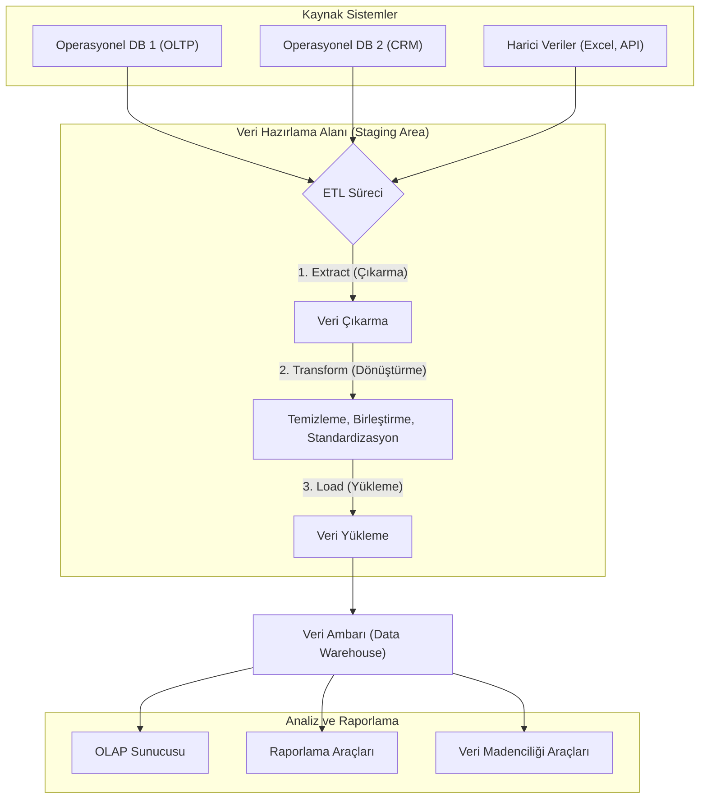

1.  **Çıkarma (Extract):** Farklı operasyonel veritabanları ve harici kaynaklardan (örn. Uygulama Programlama Arayüzü - Application Programming Interface - API) ilgili veriler çekilir.
2.  **Dönüştürme (Transform):** Veriler temizlenir (eksik değerler doldurulur, tutarsızlıklar giderilir), birleştirilir ve veri ambarının standart şemasına uygun hale getirilir.
3.  **Yükleme (Load):** Dönüştürülmüş ve hazır hale getirilmiş veri, analiz edilmek üzere veri ambarına yüklenir.


### 11.5. Meta Veri (Metadata)

**Tanım:** En basit tanımıyla meta veri, **"veri hakkında veri"** demektir. Veri ambarındaki verinin ne anlama geldiğini, nereden geldiğini, nasıl yapılandırıldığını ve nasıl kullanılacağını açıklayan bir tür "veri sözlüğü" veya "kullanım kılavuzu"dur. Ham veriye bağlam ve anlam kazandırır.

Meta veri, aşağıdaki gibi sorulara yanıt verir:
-   Bu verinin adı nedir? (`Satis_Miktari`)
-   Veri türü nedir? (Sayısal, metin, tarih vb.)
-   Hangi tablodan veya sistemden geliyor? (Kaynak)
-   En son ne zaman güncellendi?
-   Hesaplanmış bir alan ise formülü nedir?

**Örnek:**
Bir satış tablosunda `150` şeklinde bir değer olduğunu düşünelim. Bu değer tek başına bir anlam ifade etmez. Ancak meta verisi ile birlikte anlam kazanır:

-   **Veri (Data):** `150`
-   **Meta Veri (Metadata):**
    -   **Öznitelik Adı:** `Satis_Adedi`
    -   **Açıklama:** "Tek bir işlemde satılan ürün sayısı"
    -   **Veri Tipi:** `Tamsayı (Integer)`
    -   **Kaynak Tablo:** `Gunluk_Satislar`
    -   **Geçerli Aralık:** `1 - 500`

Bu meta veri sayesinde `150` değerinin, `Gunluk_Satislar` tablosundaki bir satış işleminde 150 adet ürün satıldığını ifade eden bir tamsayı olduğunu anlarız. Meta veri olmadan, veri yığınları anlamsız sayılardan ibaret kalır.

### 11.6. Veri Ambarı Şemaları: Veriyi Anlamlandırma Sanatı

Veri ambarında veriler, analiz sorgularını hızlı ve verimli bir şekilde çalıştıracak şekilde özel yapılarla organize edilir. Bu yapılara **şema** denir. En yaygın kullanılan üç şema türü Yıldız, Kar Tanesi ve Galaksi (Fact Constellation) şemalarıdır.

#### 11.6.1. Yıldız Şeması (Star Schema)

En basit ve en yaygın kullanılan veri ambarı şemasıdır. Adını, yapısının bir yıldıza benzemesinden alır: merkezde bir **olgu (fact) tablosu** ve bu tabloya doğrudan bağlı olan **boyut (dimension) tabloları** bulunur.

-   **Olgu Tablosu (Fact Table):** İşletmenin sayısal ölçümlerini (satış adedi, gelir, maliyet gibi) ve boyut tablolarına ait yabancı anahtarları (foreign keys) içerir. İş süreçlerinden ölçülen nicel verileri (sayısal değerleri, metrikleri) tutan tablodur.
-   **Boyut Tabloları (Dimension Tables):** Olgu tablosundaki verilere bağlam kazandıran tanımlayıcı bilgileri (ürün adı, müşteri bilgisi, tarih detayları gibi) içerir. Boyut tabloları **denormalize** edilmiştir, yani ilgili tüm bilgiler tek bir tabloda toplanır.

**Avantajları:**
-   **Basitlik:** Anlaşılması ve sorgulanması kolaydır.
-   **Performans:** Daha az `JOIN` işlemi gerektirdiği için sorgular genellikle çok hızlı çalışır.

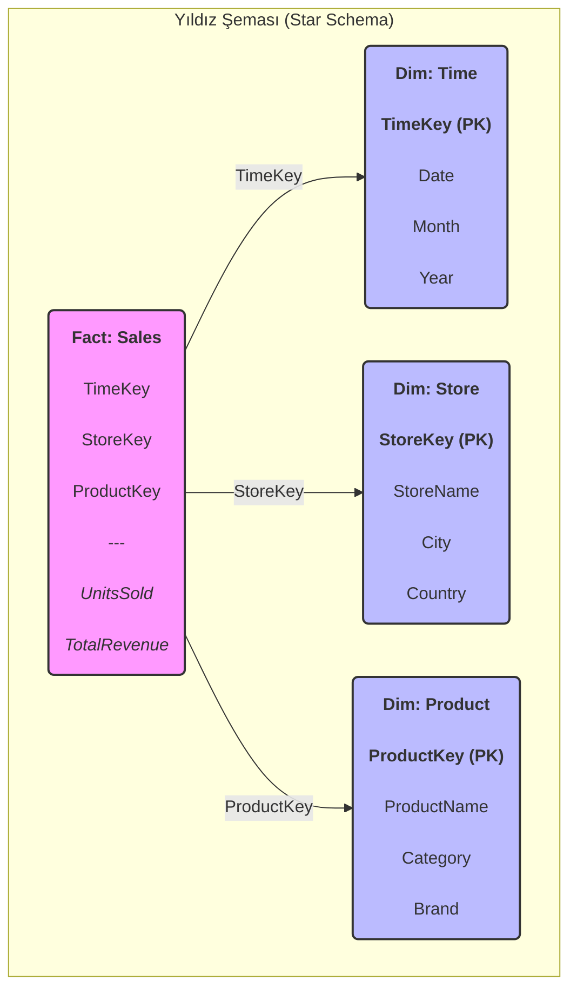

#### 11.6.2. Kar Tanesi Şeması (Snowflake Schema)

Yıldız şemasının bir uzantısıdır. Temel fark, boyut tablolarının **normalize** edilmiş olmasıdır. Yani, bir boyut tablosu, veri tekrarını azaltmak için daha küçük ve ilişkili birden fazla tabloya bölünür. Bu yapı, bir kar tanesinin dallanmış kristal yapısına benzediği için bu adı almıştır.

**Avantajları:**
-   **Veri Bütünlüğü:** Normalizasyon sayesinde veri tekrarı azalır ve depolama alanı daha verimli kullanılır.
-   **Bakım Kolaylığı:** Hiyerarşik yapıların yönetimi daha kolaydır (örn. Ürün -> Kategori -> Departman).

**Dezavantajları:**
-   **Sorgu Karmaşıklığı:** Daha fazla tablo olduğu için sorgular daha fazla `JOIN` işlemi gerektirir, bu da performansı düşürebilir.

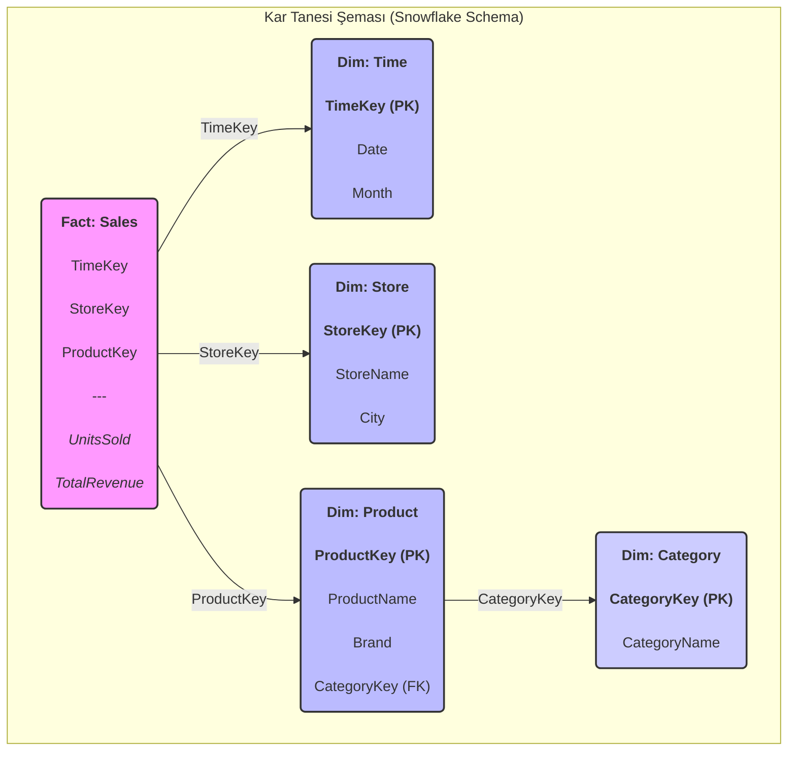

#### 11.6.3. Galaksi Şeması / Fact Constellation Şeması

İki veya daha fazla olgu tablosunun, ortak boyut tablolarını paylaştığı daha karmaşık bir yapıdır. Bu şema, birbiriyle ilişkili farklı iş süreçlerini (örneğin, satış ve sevkiyat) tek bir modelde analiz etmek için kullanılır. Yapı, birden fazla yıldızın bir araya gelerek bir galaksi oluşturmasına benzetilir.

**Avantajları:**
-   **Esneklik:** Farklı iş süreçleri arasında entegre analiz yapma imkanı sunar.
-   **Yeniden Kullanılabilirlik:** Boyut tabloları birden fazla olgu tablosu tarafından paylaşıldığı için tutarlılık ve verimlilik artar.

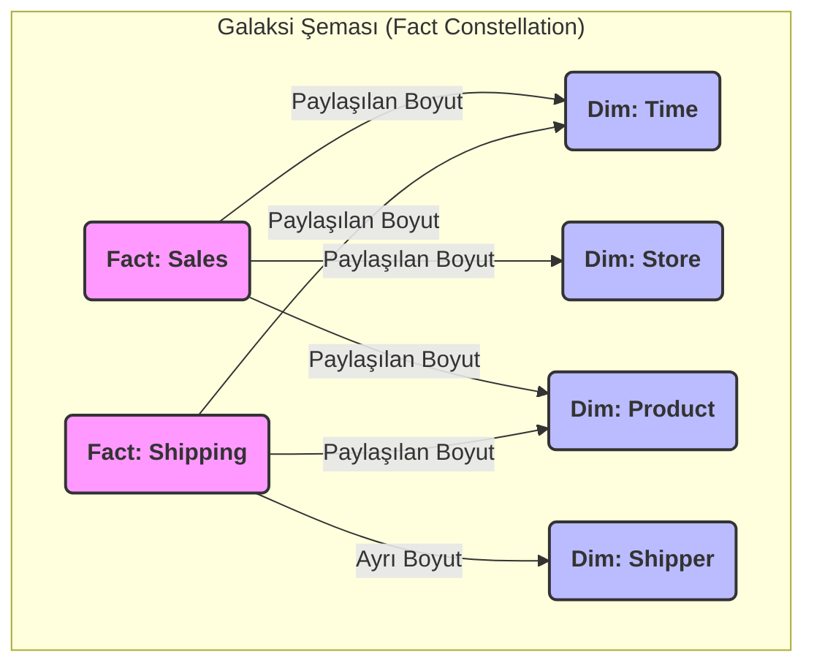

### 11.7. Şema Karşılaştırması

| Özellik | Yıldız Şeması (Star) | Kar Tanesi Şeması (Snowflake) | Galaksi Şeması (Fact Constellation) |
| :--- | :--- | :--- | :--- |
| **Yapı** | Merkezi bir olgu tablosu, etrafında boyut tabloları | Yıldız şemasının normalize edilmiş hali | Birden fazla olgu tablosu, paylaşılan boyutlar |
| **Normalizasyon** | Boyutlar denormalize (tek tablo) | Boyutlar normalize (çoklu tablo) | Boyutlar genellikle denormalize |
| **Sorgu Performansı** | Yüksek (az `JOIN`) | Daha Düşük (çok `JOIN`) | Değişken (sorguya bağlı) |
| **Veri Bütünlüğü** | Daha düşük (veri tekrarı olabilir) | Yüksek (veri tekrarı az) | Yüksek (paylaşılan boyutlar sayesinde) |
| **Kullanım Alanı** | Çoğu veri ambarı ve veri pazarı (data mart) | Karmaşık hiyerarşilere sahip veri modelleri | Birbiriyle ilişkili birden fazla iş sürecinin analizi |

### 11.8. Veri Pazarı (Data Mart)
Veri pazarı, kurumsal bir veri ambarının belirli bir departmana (örneğin Satış, Pazarlama) veya iş koluna odaklanmış daha küçük bir alt kümesidir. Amacı, belirli bir kullanıcı grubunun ihtiyaç duyduğu veriye daha hızlı ve kolay erişim sağlamaktır. Veri ambarının tamamı yerine sadece ilgili veri setini içerdiği için daha yönetilebilir, daha hızlı kurulabilir ve daha düşük maliyetlidir. Verilerini merkezi bir veri ambarından veya doğrudan operasyonel kaynaklardan alabilir.  

   - **Galaxy Şeması (Galaxy Schema):**  
     - Çok sayıda kar tanesi şemasının birleşiminden oluşur.  
     - Koleksiyon veya nitelik tablosu gibi düşünülebilir.  
     - Büyük ölçekli sistemlerde tercih edilir.  

---
## 12. OLAP (Çevrimiçi Analitik İşleme - Online Analytical Processing)

OLAP, büyük veri ambarlarındaki verilerin, iş analistleri ve yöneticiler tarafından hızlı, tutarlı ve etkileşimli bir şekilde çok boyutlu olarak analiz edilmesini sağlayan bir teknolojidir. Geleneksel veritabanı sorguları (OLTP sistemlerinde olduğu gibi) veriyi genellikle iki boyutlu (satırlar ve sütunlar) bir yapıda sunarken, iş dünyasındaki sorular genellikle çok daha fazla boyuta sahiptir ("Geçen çeyrekte, Avrupa bölgesindeki hangi mağazalarda, hangi ürün kategorisi en çok kar getirdi?"). OLAP, bu tür karmaşık ve çok boyutlu analitik sorguları saniyeler içinde yanıtlamak için tasarlanmıştır.

### 12.1. OLAP Küpü ve Temel Operasyonlar

OLAP'ın temelinde **Veri Küpü (Data Cube)** adı verilen çok boyutlu bir veri yapısı bulunur. Bu küp, analiz edilmek istenen sayısal verileri (**ölçüler - measures**, örn. satış miktarı, kar) ve bu verilerin analiz edileceği farklı bakış açılarını (**boyutlar - dimensions**, örn. zaman, coğrafya, ürün) bir araya getirir. Kullanıcılar, bu küp üzerinde çeşitli operasyonlar gerçekleştirerek veriyi farklı açılardan inceleyebilir, özetleyebilir veya detaylandırabilir.

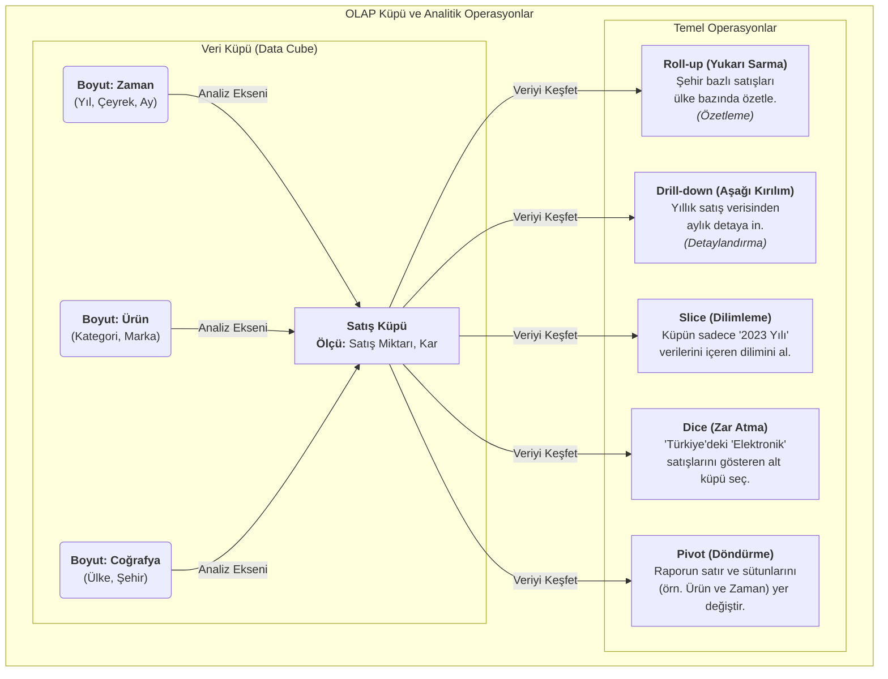

-   **Roll-up (Yukarı Sarma):** Veriyi bir boyut hiyerarşisi boyunca yukarı doğru özetler. Örneğin, şehir bazındaki satış verilerini toplayarak ülke bazında bir özet oluşturur.
-   **Drill-down (Aşağı Kırılım):** Özetlenmiş veriden daha detaylı seviyelere inmeyi sağlar. Örneğin, yıllık satış rakamlarından çeyrek veya ay bazındaki detaylara ulaşmak.
-   **Slice (Dilimleme):** Küpten tek bir boyut değeri seçerek iki boyutlu bir "dilim" alır. Örneğin, `Zaman = '2023'` dilimini alarak sadece o yıla ait satışları inceler.
-   **Dice (Zar Atma):** Birden fazla boyut üzerinde seçim yaparak daha küçük bir alt küp oluşturur. Örneğin, `Coğrafya = 'Türkiye'` VE `Ürün Kategorisi = 'Elektronik'` olan verileri seçer.
-   **Pivot (Döndürme):** Veri küpünün eksenlerini döndürerek veriye farklı bir perspektiften bakmayı sağlar. Örneğin, satırlarda ürünleri, sütunlarda zamanı gösteren bir raporu, satırlarda zamanı, sütunlarda ürünleri gösterecek şekilde değiştirir.

### 12.2. OLAP'ın Temel Özellikleri ve Mimarisi

OLAP sistemleri, ham veriyi anlamlı iş bilgisine dönüştürmek için tasarlanmış güçlü analitik motorlardır. Başarıları, aşağıdaki temel özelliklere ve mimari bileşenlere dayanır:

-   **Çok Boyutlu Analiz (Multidimensional Analysis):** OLAP, veriyi geleneksel iki boyutlu (satır/sütun) tablolardan kurtararak, iş dünyasının doğal çok boyutlu yapısını yansıtan küplerde sunar. Bu sayede analistler, veriyi "kim, ne, nerede, ne zaman" gibi farklı iş eksenleri etrafında serbestçe inceleyebilir.
-   **Hızlı Sorgu Performansı:** OLAP sistemleri, karmaşık analitik sorgulara saniyeler içinde yanıt vermek üzere optimize edilmiştir. Bu hızı, verileri önceden hesaplayıp özetleyerek (pre-aggregation), özel indeksleme teknikleri kullanarak ve sonuçları önbelleğe alarak sağlarlar.
-   **Etkileşimli Keşif ve Raporlama:** Kullanıcıların `Roll-up`, `Drill-down` gibi operasyonlarla veri üzerinde etkileşimli olarak gezinmesine olanak tanır. Bu, statik raporlar yerine dinamik bir "keşif" süreci sunar.
-   **İş Odaklı Bakış Açısı:** Teknik veritabanı terminolojisi yerine, "Ürün Kategorisi", "Satış Bölgesi", "Toplam Gelir" gibi anlaşılır iş terimleri kullanır. Bu da teknik olmayan kullanıcıların bile sistemi kolayca kullanabilmesini sağlar.

---

## 13. OLAP Mimarisi: Küpler, Boyutlar ve Ölçüler

OLAP'ın kalbinde, veriyi sezgisel ve analize uygun bir şekilde organize eden üç temel bileşen bulunur:

1.  **Veri Küpü (Data Cube):**
    -   OLAP mimarisinin temel veri yapısıdır. Fiziksel bir küp olmak zorunda değildir; daha çok, verinin çok boyutlu bir mantıksal modelidir.
    -   İşletmenin analiz etmek istediği sayısal metrikleri (ölçüleri), bu metrikleri tanımlayan ve bağlam kazandıran iş kategorileriyle (boyutlarla) birleştirir.

2.  **Boyutlar (Dimensions):**
    -   Bir ölçüye bağlam kazandıran, "kim, ne, nerede, ne zaman" gibi sorulara yanıt veren nitel (kategorik) verilerdir. Boyutlar, veriyi nasıl dilimlemek, filtrelemek ve gruplamak istediğimizi belirler.
    -   **Hiyerarşi (Hierarchy):** Boyutlar genellikle doğal bir hiyerarşiye sahiptir. Bu yapı, kullanıcıların özet veriden detaya (Drill-down) veya detaydan özete (Roll-up) kolayca geçmesini sağlar.
        -   **Örnek Zaman Hiyerarşisi:** `Yıl` → `Çeyrek` → `Ay` → `Gün`
        -   **Örnek Coğrafya Hiyerarşisi:** `Ülke` → `Bölge` → `Şehir`

3.  **Ölçüler (Measures):**
    -   Analiz edilen nicel (sayısal) değerlerdir. Genellikle olgu tablosundaki (fact table) bir sütundan türetilirler ve `SUM`, `COUNT`, `AVERAGE`, `MIN`, `MAX` gibi toplama fonksiyonları ile özetlenirler.
    -   Ölçüler, boyutlar tarafından dilimlendiğinde anlam kazanan iş metrikleridir.
        -   **Örnek Ölçüler:** `Toplam Satış Tutarı`, `Satılan Ürün Adedi`, `Ortalama Kar Marjı`

| Bileşen | Açıklama | Örnek |
| :--- | :--- | :--- |
| **Boyut (Dimension)** | Veriye bağlam kazandıran **kategorik** bilgiler. "Nasıl bakalım?" sorusunu yanıtlar. | Zaman, Ürün, Müşteri, Coğrafya |
| **Ölçü (Measure)** | Analiz edilen **sayısal** değerler. "Ne kadar?" sorusunu yanıtlar. | Satış Miktarı, Gelir, Maliyet |
<br/>

<div style="display: flex; justify-content: space-between; gap: 2em;">
    <div style="flex: 1; text-align: justify;">
        <hr style="border: 2px solid #888888;">
        <h2 style="text-align: center;">Karar Ağaçları (Decision Trees)</h2>
        <hr style="border: 2px solid #CCCCCC;">
    </div>
</div>


## 14. Karar Ağaçlarına Giriş: Sezgisel Bir Zeka Formu

Makine öğrenmesi dünyasındaki yolculuğumuzda, hem insan sezgisine son derece yakın hem de matematiksel olarak bir o kadar sağlam olan zarif bir yöntemle tanışacağız: **Karar Ağaçları**. Bu yöntemi, veriye doğru teşhisi koymak için sistematik bir şekilde sorular soran bir uzmana benzetebiliriz. Her bir soru, veri setini daha küçük ve daha homojen gruplara ayırır ve bu süreç, her bir grup için net bir sonuca ulaşana kadar devam eder. Bu hiyerarşik karar verme süreci, bir akış şeması (flowchart) formunda görselleştirilebilir, bu da onu en karmaşık modeller arasında bile en yorumlanabilir olanlardan biri yapar. İster bir müşterinin kredi riskini belirlemek (sınıflandırma) ister bir gayrimenkulün piyasa değerini tahmin etmek (regresyon) olsun, karar ağaçları bize şeffaf ve güçlü bir analitik çerçeve sunar.

### 14.1. Parametrik Olmayan Yapının Esnekliği ve Gücü

Karar ağaçlarının temelindeki felsefeyi anlamak için, onları diğer modelleme yaklaşımlarından ayıran en temel özelliğe odaklanmalıyız: **parametrik olmayan (non-parametric)** bir yapıya sahip olmaları. Gelin bu teknik ayrımı bir analoji ile somutlaştıralım:

-   **Parametrik Modeller (Önceden Belirlenmiş Kalıplar):** Lineer veya lojistik regresyon gibi modeller, veri ile hedef değişken arasındaki ilişkinin belirli bir fonksiyonel forma (örneğin, bir doğruya) uyduğunu varsayar. Bu modellerin sabit sayıda parametresi vardır (`β₀`, `β₁`, vb.) ve modelin karmaşıklığı veri miktarına bağlı değildir. Bu durum, güçlü bir **tümevarımsal önyargı (inductive bias)** yaratır: model, verinin yalnızca varsaydığı kalıba uyması durumunda başarılı olur.

-   **Karar Ağaçları (Veriden Doğan Esnek Yapı):** Karar ağaçları ise verinin altta yatan dağılımı hakkında böyle katı varsayımlarda bulunmaz. Modelin yapısı ve karmaşıklığı, sabit bir denkleme bağlı olmak yerine, doğrudan verinin kendisinden öğrenilir. Veri miktarı ve karmaşıklığı arttıkça, ağaç da bu yeni örüntüleri yakalamak için büyüyebilir ve dallanabilir. Bu esneklik, karar ağaçlarının doğrusal olmayan (non-linear) ve karmaşık etkileşimleri, önceden bir formül belirtmeye gerek kalmadan, doğal bir şekilde modellemesine olanak tanır. Kısacası, veriyi bir kalıba sokmaya çalışmak yerine, kalıbın veriden doğmasına izin verirler.

### 14.2. Karar Ağaçlarını Neden Bir Köşe Taşı Olarak Görüyoruz?

Bu yöntemin, veri bilimcileri ve analistler için neden vazgeçilmez bir araç olduğunu birkaç temel başlıkta özetleyebiliriz:

-   **Yorumlanabilirlik: "Beyaz Kutu" Modeli:** Derin öğrenme gibi birçok modern algoritmanın "kara kutu" (black-box) olarak nitelendirildiği bir çağda, karar ağaçları şeffaflıklarıyla öne çıkar. Modelin verdiği bir kararın arkasındaki mantığı, kök düğümden yaprak düğüme kadar olan yolu takip ederek `EĞER-O HALDE` (IF-THEN) kuralları şeklinde net bir biçimde açıklayabiliriz. Bu özellik, finansal risk modellemesi veya tıbbi teşhis gibi, alınan kararların gerekçelendirilmesinin zorunlu olduğu alanlarda hayati önem taşır.

-   **Minimum Veri Ön İşleme Gereksinimi:** Karar ağaçları, pratik uygulamalarda büyük bir avantaj sunar. Ağaç yapısı, özelliklerin büyüklüğüne değil, sıralamasına dayalı bölme kararları verdiği için, verilerin normalleştirilmesi veya standartlaştırılması gibi adımlara ihtiyaç duymaz. Ayrıca, CART gibi algoritmalar, eksik değerleri yönetmek için **vekil bölmeler (surrogate splits)** gibi dahili mekanizmalara sahip olabilir, bu da veri hazırlama sürecini önemli ölçüde basitleştirir.

-   **Çok Yönlülük ve Hibrit Veri Desteği:** Gerçek dünya veri setleri nadiren tek tiptir. Karar ağaçlarının temelindeki bölme kriterleri (Gini İndeksi, Entropi vb.), hem sürekli (sayısal) hem de kategorik (nominal) özellikleri doğal bir şekilde işleyebilir. Bu, farklı veri türlerini bir arada barındıran zengin veri setleriyle, karmaşık dönüşümlere gerek kalmadan doğrudan çalışabilme imkanı tanır.

## 15. Karar Ağacının Yapısal Bileşenleri

Aşağıda, karar ağacının temel yapısını gösteren renkli bir diyagram yer almaktadır:

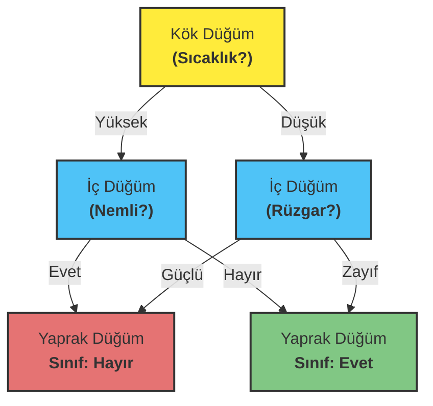

Bu diyagramda:
- **Sarı**: Kök düğüm (ilk karar noktası)
- **Mavi**: İç düğümler (ara karar noktaları)
- **Yeşil**: Pozitif sınıfı temsil eden yaprak düğüm
- **Kırmızı**: Negatif sınıfı temsil eden yaprak düğüm

### 15.1. Karar Ağacının Anatomisi: Düğümler ve Dallar

Sevgili arkadaşlar, bir karar ağacını, veriye teşhis koymak için tasarlanmış organik bir yapı gibi düşünebiliriz. Bu yapının her bir parçası, mantıksal bir akış şemasının unsurlarını temsil eder ve bize verinin içindeki hikayeyi anlatır. Gelin bu zarif yapıyı birlikte inceleyelim.

**a) Kök Düğüm (Root Node): Yolculuğun Başlangıcı**
Her şeyin başladığı yerdir. Kök düğüm, tüm veri setimizi temsil eden ve analize başlarken sorduğumuz ilk, en güçlü sorudur. Bu düğüm, veri setini en anlamlı şekilde iki veya daha fazla ana dala ayıracak olan en ayırt edici özniteliği içerir.

**b) İç Düğümler (Internal Nodes): Karar Zinciri**
Kök düğümden sonra gelen her bir ara karar noktasıdır. Her iç düğüm, bir önceki adımdan kendisine ulaşan veri alt kümesi için yeni bir soru sorar. Bu düğümler, nihai bir sonuca ulaşana kadar veriyi daha küçük ve daha homojen gruplara ayırma görevini üstlenir.

**c) Yaprak Düğümler (Leaf / Terminal Nodes): Hüküm Anı**
Ağacın en uç noktalarıdır; artık daha fazla soru sorulmayan ve nihai kararın verildiği yerlerdir. Her bir yaprak düğüm, o düğüme ulaşan veri örnekleri için bir sınıf etiketi (sınıflandırma probleminde) veya bir sayısal değer (regresyon probleminde) içerir.

### 15.2. Dallar (Branches): Mantığın Patikaları

Dallar, düğümler arasındaki yollardır ve her bir yol, bir karar sürecini temsil eder. Kök düğümden başlayıp bir yaprak düğüme kadar takip edilen her bir patika, aslında `EĞER-O HALDE` (IF-THEN) formatında, insan tarafından kolayca okunabilen bir kural setine karşılık gelir.

**Örnek Kural:** `EĞER` (Sıcaklık > 25°C) `VE` (Nem Oranı < %60) `O HALDE` (Dışarıda Oyna = Evet)

## 16. Karar Ağacı Nasıl İnşa Edilir: Özyinelemeli Bölme Sanatı

### 16.1. En İyi Bölmeyi Bulmak: Açgözlü (Greedy) Yaklaşım

İşte işin büyüsü burada başlıyor. Bir karar ağacı inşa etmek, temelde bir **"böl ve yönet" (divide and conquer)** stratejisidir. Algoritma, her adımda veri setini daha saf alt kümelere ayıracak en iyi soruyu bulmaya çalışır. Bu sürece **özyinelemeli bölme (recursive partitioning)** adını veriyoruz.

Bu yaklaşım "açgözlü" (greedy) olarak nitelendirilir, çünkü algoritma her bir düğümde, o an için en iyi görünen, yani saflığı en çok artıran bölmeyi seçer. Gelecekteki adımların bu karardan nasıl etkileneceğini hesaba katmaz. Bu, genellikle çok iyi sonuçlar veren verimli bir stratejidir.

**Algoritmanın Adımları:**

1.  **En İyi Özniteliği Seç:** Mevcut düğümdeki veri setini en homojen alt gruplara ayıracak özniteliği ve bölünme noktasını belirle. Bu seçim, saflık ölçütleri (Gini, Entropi vb.) kullanılarak matematiksel olarak yapılır.
2.  **Düğümü Böl:** Seçilen öznitelik ve kurala göre düğümü iki veya daha fazla dala ayırarak yeni çocuk düğümler (child nodes) oluştur.
3.  **Özyinelemeyi Uygula:** Her bir çocuk düğüm için süreci tekrarla. Bu işlem, aşağıdaki durdurma kriterlerinden biri karşılanana kadar devam eder:
    *   Düğümdeki tüm örnekler aynı sınıfa aitse (düğüm tamamen saf ise).
    *   Önceden belirlenmiş bir maksimum ağaç derinliğine ulaşılmışsa.
    *   Düğümdeki örnek sayısı, bölünmek için belirlenen minimum sayının altına düşmüşse.

### 16.2. Saflık Ölçütleri: Düzensizliği Ölçme Bilimi

Peki, algoritma "en iyi" bölmenin ne olduğuna nasıl karar veriyor? Cevap, **saflık (purity)** veya onun zıttı olan **kirlilik (impurity)** kavramında yatar. Bir düğüm ne kadar safsa, içindeki örnekler o kadar homojendir (yani çoğunlukla aynı sınıfa aittir). Algoritmanın amacı, her bölme işleminden sonra ortaya çıkan çocuk düğümlerin toplam kirliliğini en aza indirmektir. Bu kirliliği ölçmek için kullandığımız iki temel matematiksel araç vardır: Gini İndeksi ve Entropi.

#### 16.2.1. Gini İndeksi (Gini Impurity): Yanlış Sınıflandırma Olasılığı

Gini İndeksi, oldukça sezgisel bir ölçüttür. Bir düğümdeki veri noktalarından rastgele birini seçip, bu düğümdeki sınıf dağılımına göre onu etiketlersek, ne kadar olasılıkla yanlış etiketleme yaparız? İşte Gini İndeksi tam olarak bunu ölçer.

-   **Mükemmel Saflık (Gini = 0):** Bir düğümdeki tüm örnekler aynı sınıfa aitse, yanlış etiketleme olasılığımız sıfırdır.
-   **Maksimum Kirlilik (Gini = 0.5 - İki sınıflı durumda):** Bir düğümde örnekler sınıflara 50/50 oranında dağılmışsa, kirlilik en yüksek seviyededir.

Matematiksel olarak, `c` farklı sınıfa sahip bir düğüm için Gini İndeksi şu formülle hesaplanır:

$$
Gini = 1 - \sum_{i=1}^{c} (p_i)^2
$$

Burada `p_i`, `i` sınıfına ait örneklerin oranını temsil eder. Algoritma, bölme sonrası oluşacak çocuk düğümlerin ağırlıklı Gini ortalamasını en çok düşüren bölmeyi tercih eder. Bu düşüşe **Gini Kazancı (Gini Gain)** denir.

#### 16.2.2. Entropi ve Bilgi Kazancı (Information Gain)

Entropi, bilgi teorisinin babası Claude Shannon'dan ödünç aldığımız bir kavramdır ve bir sistemdeki belirsizliği veya düzensizliği ölçer. Karar ağaçları bağlamında, bir düğümdeki sınıfların ne kadar karışık olduğunun bir ölçüsüdür.

-   **Mükemmel Saflık (Entropi = 0):** Düğüm tamamen homojen ise, sonuç bellidir ve hiçbir belirsizlik yoktur.
-   **Maksimum Kirlilik (Entropi = 1 - İki sınıflı durumda):** Sınıflar eşit dağılmışsa, belirsizlik en üst düzeydedir.

Formülü şöyledir:

$$
Entropy = - \sum_{i=1}^{c} p_i \log_2(p_i)
$$

Algoritma, Entropiyi doğrudan minimize etmek yerine, bir bölme işlemiyle ne kadar **belirsizlik azalttığını** ölçer. Bu azalmaya **Bilgi Kazancı (Information Gain)** denir ve ID3 algoritmasının temelini oluşturur. En yüksek Bilgi Kazancını sağlayan öznitelik, bölme için en iyi aday olarak seçilir.

| Özellik | Gini İndeksi | Entropi (Bilgi Kazancı ile) |
| :--- | :--- | :--- |
| **Temel Felsefe** | Yanlış sınıflandırma olasılığını en aza indirme | Belirsizliği en aza indirme (bilgiyi en üst düzeye çıkarma) |
| **Hesaplama** | Daha hızlı (karesel işlem) | Daha yavaş (logaritmik işlem) |
| **Davranış** | Genellikle en büyük sınıfı izole etmeye daha yatkındır | Sınıf dağılımındaki küçük değişikliklere daha duyarlıdır |

Pratikte, her iki metrik de genellikle çok benzer ağaçlar üretir. Gini İndeksi'nin hesaplama verimliliği, onu CART gibi algoritmalarda popüler bir varsayılan seçenek haline getirir.

#### 16.2.3. Kazanç Oranı (Gain Ratio): Bilgi Kazancının Tuzağına Karşı Bir Savunma

Bilgi Kazancı'nın zekice bir yaklaşım olmasına rağmen, tehlikeli bir zaafı vardır: **yüksek kardinaliteye sahip** (yani çok sayıda benzersiz değere sahip) özniteliklere karşı bir ön yargı besler. Örneğin, "Müşteri ID" veya "TC Kimlik No" gibi bir özniteliği düşünün. Her bir değer benzersiz olduğu için, bu özniteliğe göre yapılacak bir bölme, her biri tek bir örnek içeren mükemmel derecede saf yapraklar oluşturacaktır. Bilgi Kazancı bu durumu "mükemmel bir bölme" olarak görür, ancak bu aslında öğrenme değil, **ezberlemedir (overfitting)**.

İşte C4.5 algoritmasının getirdiği zarif çözüm olan **Kazanç Oranı (Gain Ratio)** burada devreye girer. Kazanç Oranı, Bilgi Kazancını, bir bölmenin yarattığı dallanma karmaşıklığına bölerek onu cezalandırır.

$$
Gain Ratio = \frac{\text{Information Gain}}{\text{Split Information}}
$$

-   **Split Information:** Bir özniteliğin veriyi ne kadar çok parçaya böldüğünü ölçen bir metriktir. Çok fazla dala neden olan bir bölme (Müşteri ID gibi) yüksek bir Split Information değerine sahip olacak ve bu da Kazanç Oranını düşürecektir.

Bu sayede Kazanç Oranı, hem yüksek bilgi sağlayan hem de veriyi makul sayıda, anlamlı alt gruplara ayıran **dengeli** bölmeleri tercih eder. Bu, modelin genelleme yeteneğini önemli ölçüde artırır.

#### 16.2.4. Sınıflandırma Hatası (Classification Error)

Şimdi gelelim en sezgisel, en doğrudan ölçütümüze: Sınıflandırma Hatası. Bu metrik, son derece pratik bir soru sorar: "Eğer bir düğümdeki en popüler sınıf neyse, o düğüme düşen her veriye o etiketi yapıştırsak, ne kadar yanılırız?"

-   **Örnek:** Bir düğümde 8 "Evet" ve 2 "Hayır" kararımız varsa, en popüler sınıfımız "Evet"tir. Eğer bu düğümdeki herkese "Evet" tahmininde bulunursak, 10'da 2 kez yanılmış oluruz. Yani hata oranımız %20'dir.
-   **Amaç:** Algoritmanın amacı da, bu basit ama etkili hata oranını en aza indirecek bölmeyi bulmaktır.

### 16.3. Gini İndeksi ile Adım Adım Karar Ağacı İnşası: Bir Vaka Analizi

Gençler, teorik bilgileri somut bir örnekle taçlandırmanın zamanı geldi. Gelin, "Bugün tenis oynamalı mıyız?" sorusuna cevap arayan klasik bir veri seti üzerinden, Gini İndeksi'ni kullanarak bir karar ağacını adım adım nasıl inşa ettiğimizi birlikte görelim.

**Örnek Veri Setimiz:**

| Gün | Hava Durumu | Sıcaklık | Nem | Rüzgar | Tenis Oyna |
| :-- | :--- | :--- | :--- | :--- | :--- |
| D1 | Güneşli | Sıcak | Yüksek | Yok | Hayır |
| D2 | Güneşli | Sıcak | Yüksek | Var | Hayır |
| D3 | Bulutlu | Sıcak | Yüksek | Yok | Evet |
| D4 | Yağmurlu | Ilık | Yüksek | Yok | Evet |
| D5 | Yağmurlu | Soğuk | Normal | Yok | Evet |
| D6 | Yağmurlu | Soğuk | Normal | Var | Hayır |
| D7 | Bulutlu | Soğuk | Normal | Var | Evet |
| D8 | Güneşli | Ilık | Yüksek | Yok | Hayır |
| D9 | Güneşli | Soğuk | Normal | Yok | Evet |
| D10 | Yağmurlu | Ilık | Normal | Yok | Evet |
| D11 | Güneşli | Ilık | Normal | Var | Evet |
| D12 | Bulutlu | Ilık | Yüksek | Var | Evet |
| D13 | Bulutlu | Sıcak | Normal | Yok | Evet |
| D14 | Yağmurlu | Ilık | Yüksek | Var | Hayır |

#### 16.3.1. Adım 1: Kök Düğümün Kirliliğini Hesaplama (Başlangıç Noktası)

Her şeyden önce, tüm veri setimizin "kirliliğini" ölçmeliyiz. Bu, bizim referans noktamız olacak.
- Toplam Gözlem: 14
- "Evet" (Tenis Oyna): 9
- "Hayır" (Tenis Oyna): 5

Şimdi Gini formülümüzü uygulayalım:
```
Gini(Kök) = 1 - [ (9/14)² + (5/14)² ] = 1 - [ 0.413 + 0.128 ] = 0.459
```
Başlangıç kirliliğimiz 0.459. Amacımız, bu değeri en çok düşüren özniteliği bulmak.

#### 16.3.2. Adım 2: Her Bir Öznitelik İçin Gini Kazancını Hesaplama

Şimdi her bir özniteliği ("Hava Durumu", "Sıcaklık", "Nem", "Rüzgar") potansiyel bir bölme noktası olarak değerlendireceğiz.

**A) Öznitelik: Hava Durumu**

1.  **Hava Durumu = Güneşli:** 5 gözlem (2 Evet, 3 Hayır)
    $Gini(\text{Güneşli}) = 1 - [(\frac{2}{5})^2 + (\frac{3}{5})^2] = 0.48$
2.  **Hava Durumu = Bulutlu:** 4 gözlem (4 Evet, 0 Hayır)
    $Gini(\text{Bulutlu}) = 1 - [(\frac{4}{4})^2 + (\frac{0}{4})^2] = 0$  (Mükemmel saflık!)
3.  **Hava Durumu = Yağmurlu:** 5 gözlem (3 Evet, 2 Hayır)
    $Gini(\text{Yağmurlu}) = 1 - [(\frac{3}{5})^2 + (\frac{2}{5})^2] = 0.48$

Şimdi bu özniteliğin ağırlıklı Gini ortalamasını hesaplayalım:
$Gini_{Ağırlıklı}(\text{Hava Durumu}) = (\frac{5}{14}) \times 0.48 + (\frac{4}{14}) \times 0 + (\frac{5}{14}) \times 0.48 = 0.343$

Ve son olarak, Gini Kazancı:
$Gain(\text{Hava Durumu}) = Gini(\text{Kök}) - Gini_{Ağırlıklı}(\text{Hava Durumu}) = 0.459 - 0.343 = \mathbf{0.116}$

**B) Öznitelik: Rüzgar** (Hesaplamaları diğer öznitelikler için de tekrarlıyoruz)

1.  **Rüzgar = Yok:** 8 gözlem (6 Evet, 2 Hayır)
    $Gini(\text{Yok}) = 1 - [(\frac{6}{8})^2 + (\frac{2}{8})^2] = 0.375$
2.  **Rüzgar = Var:** 6 gözlem (3 Evet, 3 Hayır)
    $Gini(\text{Var}) = 1 - [(\frac{3}{6})^2 + (\frac{3}{6})^2] = 0.5$

Ağırlıklı Gini ve Kazanç:
$Gini_{Ağırlıklı}(\text{Rüzgar}) = (\frac{8}{14}) \times 0.375 + (\frac{6}{14}) \times 0.5 = 0.428$
$Gain(\text{Rüzgar}) = 0.459 - 0.428 = \mathbf{0.031}$

(Benzer hesaplamalar "Sıcaklık" ve "Nem" için de yapıldığında, onların kazançlarının daha düşük olduğu görülecektir.)

#### 16.3.3. Adım 3: En İyi Bölmeyi Seçme ve İlk Dalı Oluşturma

Kazançları karşılaştıralım:
- **Gain(Hava Durumu) = 0.116** (En Yüksek!)
- Gain(Nem) = 0.092 (Hesaplandı)
- Gain(Sıcaklık) = 0.013 (Hesaplandı)
- Gain(Rüzgar) = 0.031

En yüksek Gini Kazancını **"Hava Durumu"** özniteliği sağladığı için, ağacımızın kök düğümü bu olacak!

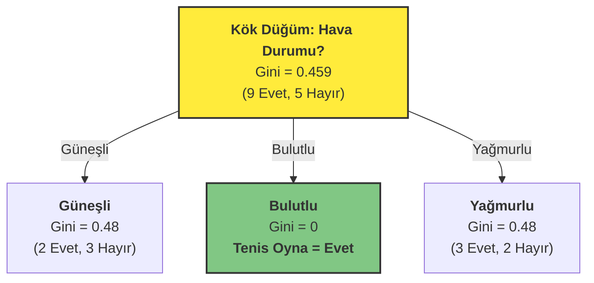

Dikkat ederseniz, "Bulutlu" dalı saf bir yaprak düğüme dönüştü. Artık o dal için daha fazla soru sormamıza gerek yok.

#### 16.3.4. Adım 4: Özyinelemeli Süreç: Alt Düğümleri Fethetmek

Kök düğümümüzü belirledik ve 'Bulutlu' hava durumunun bizi doğrudan 'Evet' sonucuna götürdüğünü keşfettik. Ama macera burada bitmiyor. Algoritmamızın "özyinelemeli" doğası tam da bu noktada devreye giriyor. Şimdi, henüz saf olmayan "Güneşli" ve "Yağmurlu" dallarını, sanki her biri kendi başına yeni bir veri setiymiş gibi ele alacağız. Gelin "Güneşli" dalına odaklanalım.

**Alt Problem: Hava Durumu = Güneşli**

Artık tüm veri setini unutup, sadece aşağıdaki 5 gözleme odaklanıyoruz:

| Gün | Hava Durumu | Sıcaklık | Nem | Rüzgar | Tenis Oyna |
| :-- | :--- | :--- | :--- | :--- | :--- |
| D1 | Güneşli | Sıcak | Yüksek | Yok | Hayır |
| D2 | Güneşli | Sıcak | Yüksek | Var | Hayır |
| D8 | Güneşli | Ilık | Yüksek | Yok | Hayır |
| D9 | Güneşli | Soğuk | Normal | Yok | Evet |
| D11 | Güneşli | Ilık | Normal | Var | Evet |

Bu 5 gözlemden oluşan mini veri setimizin başlangıç kirliliği, daha önce hesapladığımız gibi `Gini(Güneşli) = 0.48`. Görevimiz, bu 0.48'lik kirliliği sıfıra indirmek için en iyi soruyu bulmak. Kalan özniteliklerimiz: Sıcaklık, Nem ve Rüzgar.

**A) Öznitelik: Nem (Güneşli günlerde)**

1.  **Nem = Yüksek:** 3 gözlem (D1, D2, D8) -> 0 Evet, 3 Hayır
    $Gini(\text{Yüksek}) = 1 - [(\frac{0}{3})^2 + (\frac{3}{3})^2] = 0$ (Mükemmel saflık!)
2.  **Nem = Normal:** 2 gözlem (D9, D11) -> 2 Evet, 0 Hayır
    $Gini(\text{Normal}) = 1 - [(\frac{2}{2})^2 + (\frac{0}{2})^2] = 0$ (Mükemmel saflık!)

Ağırlıklı Gini ve Kazanç:
$Gini_{Ağırlıklı}(\text{Nem}) = (\frac{3}{5}) \times 0 + (\frac{2}{5}) \times 0 = 0$
$Gain(\text{Nem}) = 0.48 - 0 = \mathbf{0.48}$

**B) Öznitelik: Rüzgar (Güneşli günlerde)**

1.  **Rüzgar = Yok:** 3 gözlem (D1, D8, D9) -> 1 Evet, 2 Hayır
    $Gini(\text{Yok}) = 1 - [(\frac{1}{3})^2 + (\frac{2}{3})^2] = 0.444$
2.  **Rüzgar = Var:** 2 gözlem (D2, D11) -> 1 Evet, 1 Hayır
    $Gini(\text{Var}) = 1 - [(\frac{1}{2})^2 + (\frac{1}{2})^2] = 0.5$

Ağırlıklı Gini ve Kazanç:
$Gini_{Ağırlıklı}(\text{Rüzgar}) = (\frac{3}{5}) \times 0.444 + (\frac{2}{5}) \times 0.5 = 0.466$
$Gain(\text{Rüzgar}) = 0.48 - 0.466 = \mathbf{0.014}$

**Karar Anı: "Güneşli" Dalı İçin En İyi Soru**

Kazançları karşılaştıralım:
- **Gain(Nem) = 0.48** (En Yüksek!)
- Gain(Sıcaklık) = 0.28 (Hesaplandı)
- Gain(Rüzgar) = 0.014

Gördüğümüz gibi, **"Nem"** özniteliği `0.48`'lik kazançla ezici bir üstünlük sağlıyor. Bu, "Güneşli" günlerde tenis oynamayıp oynamama kararını en iyi açıklayan faktörün nem oranı olduğu anlamına geliyor. Üstelik bu bölme o kadar mükemmel ki, her iki yeni dal da tamamen saf yapraklara dönüşüyor!

Ağacımızın güncel hali:

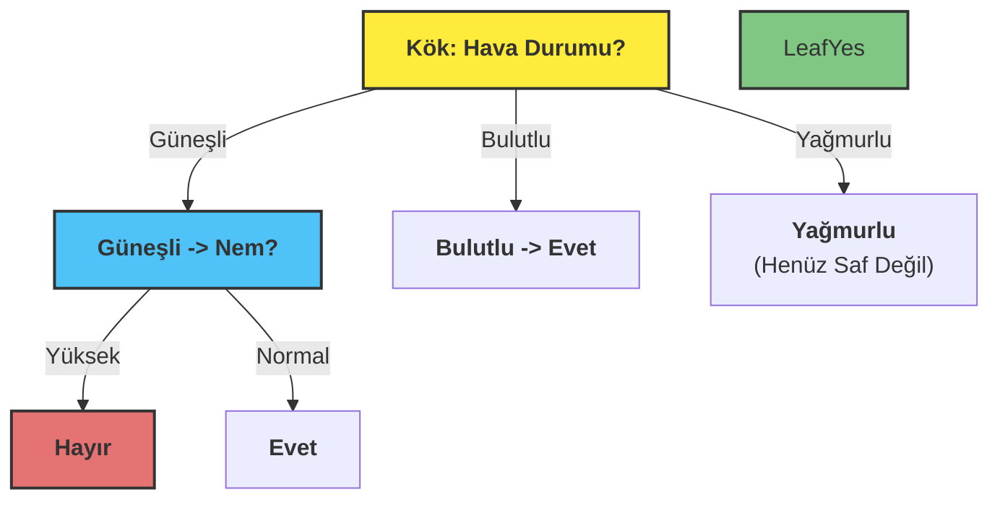

#### 16.3.5. Adım 5: Ağacı Tamamlama

Aynı özyinelemeli süreci "Yağmurlu" dalı için de ("Rüzgar" özniteliğine göre bölünür) uyguladığımızda, nihai karar ağacımız ortaya çıkar:

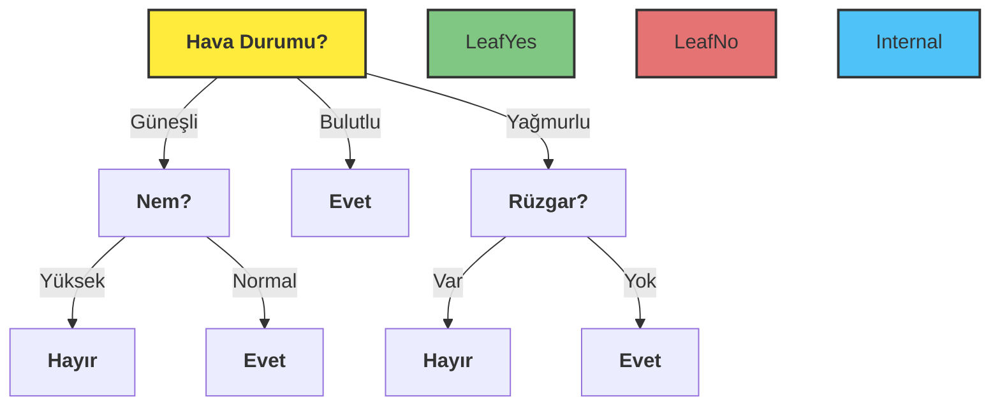
İşte bu kadar! Veri setimizdeki karmaşık ilişkileri, her adımda en mantıklı soruyu sorarak, yorumlanabilir ve güçlü bir `EĞER-O HALDE` kurallar bütününe dönüştürdük. Bu, karar ağaçlarının sezgisel gücünün ve matematiksel zarafetinin en güzel örneklerinden biridir.

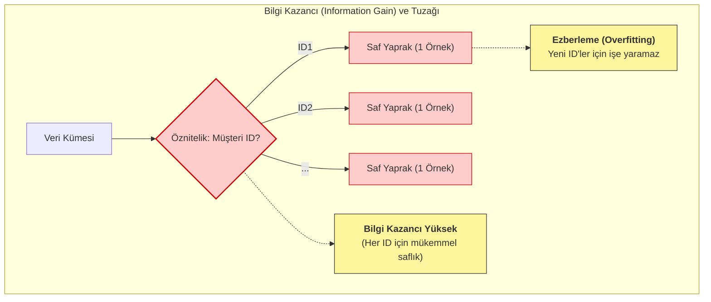

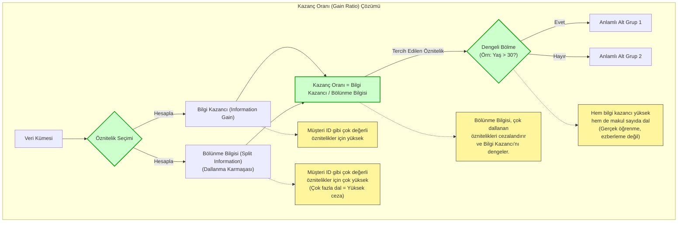

## 17. Durdurma Kriterleri (Stopping Criteria)

Şimdi, karar ağacımızı inşa ederken en kritik sorulardan birine geldik: **Ne zaman durmalıyız?** Eğer ağacımızın sonsuza kadar büyümesine izin verirsek, her bir veri noktasını ezberleyen, ancak genelleme yeteneği sıfır olan aşırı hevesli bir öğrenciye dönüşür. Bu duruma **aşırı uyum (overfitting)** diyoruz. Tersi durumda, ağacı çok erken durdurursak, verideki önemli örüntüleri kaçıran tembel bir öğrenciye sahip oluruz ki bu da **eksik uyumdur (underfitting)**.

İşte bu dengeyi kurmak için ağacımıza bazı sınırlar koymamız, yani durdurma kriterleri belirlememiz gerekir.

### 17.1. Yaygın Durdurma Parametreleri

Bu süreci yönetmek için elimizde etkili kontrol mekanizmaları, yani hiperparametreler var. En yaygın olanlarına bir göz atalım:

**a) Minimum Yaprak Boyutu (Minimum Leaf Size):** Bir yaprak düğümde en az kaç örnek olmalı? Bu, modelin çok özele inip tekil örnekleri ezberlemesini engeller.

**b) Minimum Bölme Boyutu (Minimum Split Size):** Bir düğümü bölmeye değer bulmamız için içinde en az kaç örnek bulunmalı?

**c) Maksimum Derinlik (Maximum Depth):** Ağacımız kökten başlayarak en fazla ne kadar derine insin? Bu, modelin aşırı karmaşıklaşmasını önleyen en doğrudan yollardan biridir.

**d) Maksimum Yaprak Sayısı (Maximum Leaf Nodes):** Ağacın sonunda toplamda kaç tane nihai karar noktası (yaprak) olsun istiyoruz?

**e) Minimum Saflık Artışı (Minimum Purity Increase):** Bir bölme işlemi yapacaksak, bu bize ne kadar "bilgi" kazandırmalı? Eğer kazanç çok azsa, o bölmeyi yapmaya değmez deriz.

### 17.2. Ağacı Ne Zaman Durdurmalı

Karar ağacının ne kadar büyüyeceğine karar vermek, bir sınava nasıl çalışacağınıza karar vermeye çok benzer.

-   **Aşırı Ezber (Aşırı Uyum - Overfitting):** Sadece kitaptaki örnek soruları ve cevaplarını harfi harfine ezberlediğinizi düşünün. Sınavda aynı sorular çıkarsa 100 alırsınız. Ama öğretmen biraz farklı bir soru sorduğunda cevap veremezsiniz. Çünkü konunun mantığını öğrenmediniz, sadece ezberlediniz. Bu, ağacın çok fazla dallanıp her bir yaprağında sadece 1-2 örnek bırakması gibidir. Model, veriyi "ezberlemiş" olur.

-   **Yetersiz Çalışma (Eksik Uyum - Underfitting):** Sadece konuların başlıklarını okuduğunuzu düşünün. Konu hakkında genel bir fikriniz olur ama hiçbir detayı bilmezsiniz. Bu da ağacın hiç dallanmaması, çok genel kalması gibidir. Model, hiçbir şey öğrenememiş olur.

**Peki, en iyisi nedir?** Konunun mantığını anlamak ve her konuyla ilgili birkaç farklı örnek çözmektir. İşte **Berry ve Linoff Kuralı** bize bu "ideal çalışma" seviyesi için pratik bir tavsiye verir. Der ki: "Ağacın her bir karar yaprağında, ne tek bir örnek kalacak kadar detaya in, ne de yüzlerce örnek kalacak kadar genel kal. Veri setinin büyüklüğüne göre makul bir sayıda örnek bırak." Bu kural, modelin hem öğrenmesini hem de ezberlememesini sağlamak için bir denge noktası sunar.

### 17.3. Model Karmaşıklığı ve Genelleme Yeteneği

Karar ağacının büyümesini kontrol eden durdurma kriterleri, modelin **genelleme performansı** ile **karmaşıklığı** arasındaki dengeyi (Bias-Variance Tradeoff) yönetmek için kritik öneme sahiptir. Bu bağlamda, yaprak düğümlerdeki minimum örnek sayısı (`min_samples_leaf`) en etkili hiperparametrelerden biridir.

-   **Aşırı Uyum (Overfitting):** Ağacın çok derinleşmesine izin verildiğinde, yaprak düğümler aşırı saf hale gelir ve eğitim setindeki gürültüyü veya aykırı değerleri modellemeye başlar. Bu durum, modelin eğitim verisinde yüksek başarı gösterip test verisinde (görülmemiş veri) düşük performans sergilemesine neden olur. Yapraklardaki örnek sayısının çok düşük olması (örn. 1) aşırı uyumun en temel göstergelerinden biridir.

-   **Eksik Uyum (Underfitting):** Ağacın büyümesi çok erken durdurulursa, model verideki temel örüntüleri yakalayacak kadar karmaşıklaşamaz. Yaprak düğümlerin çok fazla ve heterojen örnek içermesi, modelin yetersiz öğrendiğini gösterir.

**Berry ve Linoff Kuralı**, bu dengeyi kurmak için ampirik bir başlangıç noktası sunan bir **heuristiktir (sezgisel yöntem)**. Bu kurala göre, bir yaprak düğümdeki hedef kayıt sayısının, toplam eğitim veri setinin **%0.25 ile %1.00**'i arasında olması hedeflenir.

**Örnek: Berry ve Linoff Kuralının Uygulanması**

100.000 müşteriye ait bir veri setini analiz ederek hangi müşterilerin bir ürünü satın alacağını tahmin etmeye çalıştığımızı varsayalım. Modelin ne çok ezberci (aşırı uyum) ne de çok yüzeysel (eksik uyum) olmasını istemiyoruz. Berry ve Linoff kuralını kullanarak `min_samples_leaf` (bir yaprakta olması gereken minimum örnek sayısı) için ideal başlangıç aralığını belirleyebiliriz:

-   **Alt Sınır (Ezberlemeyi Önleme):** Veri setinin %0.25'i. Bu, modelin çok fazla detaya inip gürültüyü ezberlemesini önlemek için bir "fren" görevi görür.
    -   `100.000 * 0.0025 = 250 örnek`
-   **Üst Sınır (Öğrenmeyi Sağlama):** Veri setinin %1.00'i. Bu ise modelin çok genel kalıp önemli örüntüleri kaçırmasını engeller.
    -   `100.000 * 0.01 = 1.000 örnek`

**Sonuç:** Bu durumda, `min_samples_leaf` hiperparametresini **250 ile 1.000 arasında** bir değerle başlatmak, modelin genelleme yeteneği ile öğrenme kapasitesi arasında iyi bir denge kurmak için mantıklı bir başlangıç noktasıdır.

Aşağıdaki tablo, bu parametrenin etkisini özetlemektedir:

| `min_samples_leaf` Değeri | Model Davranışı | Sonuç |
| :--- | :--- | :--- |
| **Düşük (örn. < 250)** | Çok karmaşık, gürültüyü ezberler | **Aşırı Uyum (Overfitting)** |
| **İdeal Aralık (250 - 1000)** | Dengeli, anlamlı örüntüleri öğrenir | **İyi Genelleme** |
| **Yüksek (örn. > 1000)** | Çok basit, önemli detayları kaçırır | **Eksik Uyum (Underfitting)** |

Bu kuralın mutlak bir yasa olmadığını, ancak model optimizasyon sürecinde hangi parametre aralığında arama yapılması gerektiğine dair güçlü bir başlangıç noktası sunduğunu unutmamak önemlidir. Nihai en iyi değer, genellikle çapraz doğrulama (cross-validation) gibi tekniklerle bulunur.

## 18. Budama (Pruning): Ağacı Basitleştirme Sanatı

Bir bahçıvanın gül fidanını budaması gibi, karar ağacı **budaması (pruning)** da benzer bir felsefeyle çalışır. Kontrolsüzce büyüyen bir fidan, enerjisini çok sayıda küçük ve zayıf güle dağıtır. Usta bir bahçıvan ise gereksiz dalları keserek fidanın gücünü daha az sayıda, ancak daha gösterişli ve sağlıklı güller yetiştirmeye odaklar.

Benzer şekilde, bir ağacın çok fazla büyümesine ve karmaşıklaşmasına izin verilirse, eğitim verisinin her detayını, hatta anlamsız gürültüleri bile ezberleyen bir "uzman" haline gelir. Bu duruma **aşırı uyum (overfitting)** denir. Bu "aşırı uzmanlaşmış" ağaç, eğitim verisinde mükemmel sonuçlar verse de, daha önce hiç görmediği yeni verilerle karşılaştığında şaşırtıcı derecede kötü performans gösterir.

Budama, ağacın genelleme yeteneğine en az katkı sağlayan, yani çok az örneğe dayanan veya tahmin gücü zayıf olan dalları kesip atma işlemidir. Sonuç, daha basit, daha sağlam ve yeni verilere karşı daha iyi tahminler yapabilen bir ağaçtır.

Bu süreç aşağıdaki diyagramda gösterilmiştir:

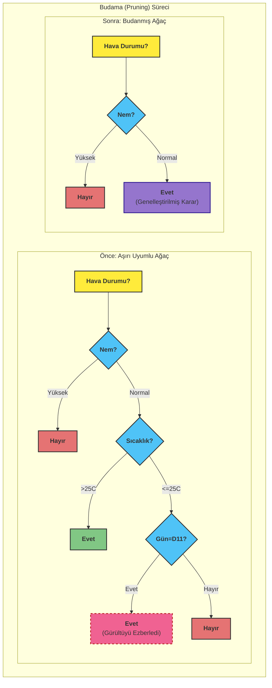

Diyagramda görüldüğü gibi:
-   **Aşırı Uyumlu Ağaç:** Model, `Gün=D11?` gibi bir soru sorarak çok fazla detaya inmiş ve sadece tek bir veri noktasına özel bir kural oluşturmuştur. Bu, öğrenme değil, ezberlemedir ve modelin genelleme yeteneğine zarar verir.
-   **Budanmış Ağaç:** Genelleme yeteneğini bozan karmaşık dal (`Sıcaklık?` ve sonrası) budanmış, yerine o dala düşen verilerin çoğunluk sınıfını temsil eden tek bir yaprak düğüm (`Evet`) konulmuştur. Ağaç artık daha basit ve daha güçlüdür.

Teknik açıdan budama, bir karar ağacının karmaşıklığını azaltmak için kullanılan bir **düzenlileştirme (regularization)** tekniğidir. Tamamen büyümüş bir ağaç, eğitim setindeki gürültüyü ve istisnaları modellediği için genellikle **yüksek varyansa (high variance)** sahiptir. Budama, modelin **yanlılığında (bias)** hafif bir artış pahasına, bu varyansı düşürerek daha dengeli bir model oluşturur. Amaç, görülmemiş veriler üzerinde en iyi performansı gösterecek, ne çok basit ne de çok karmaşık olan "altın oran"daki ağacı bulmaktır. Bu karar, genellikle bir doğrulama seti (validation set) üzerindeki performans metrikleri veya istatistiksel anlamlılık testleri ile verilir.

### 18.1. Budama Türleri

#### 18.1.1. Ön Budama (Pre-pruning / Forward Pruning)

Ağaç oluşturulurken dalların büyümesi kontrol edilir. Belirli kriterlere uymayan bölmeler engellenir.

**Avantajları**:
- Hesaplama açısından daha verimlidir
- Gereksiz dal oluşumunu baştan engeller

**Dezavantajları**:
- Erken durdurma nedeniyle önemli dalların kaçırılması riski (horizon effect)

**Yöntemler**:
- Ki-kare testleri
- Minimum bilgi kazancı eşiği
- Çoklu karşılaştırma düzeltmeleri

#### 18.1.2. Son Budama (Post-pruning / Backward Pruning)

Tam bir ağaç oluşturulduktan sonra, performansı iyileştirmeyen dallar geri doğru budanır.

**Avantajları**:
- Daha iyi sonuçlar verebilir
- Horizon effect problemini önler

**Dezavantajları**:
- Hesaplama açısından daha maliyetlidir

### 18.2. Budama Yöntemleri

**a) Hatalı Tahmin Oranı Minimizasyonu**: Her alt ağaç için hata oranı hesaplanır ve en düşük orana sahip olan seçilir.

**b) Doğrulama Veri Kümesi Yaklaşımı**: 
- Veri eğitim ve doğrulama kümelerine ayrılır
- Model eğitim verisiyle oluşturulur
- Performans doğrulama verisiyle değerlendirilir
- En iyi performansı gösteren alt ağaç seçilir

**c) K-Katlı Çapraz Doğrulama**:
- Veri k eşit katmana bölünür (tipik olarak k=10)
- Model k-1 katmanla eğitilir, kalan katmanla test edilir
- İşlem her katman için tekrarlanır
- Ortalama hata hesaplanır ve en düşük hataya sahip model seçilir

## 19. Popüler Karar Ağacı Algoritmaları

### 19.1. ID3 (Iterative Dichotomiser 3, 1986)

- Ross Quinlan tarafından geliştirilmiştir
- Entropi ve bilgi kazancı kullanır
- Sadece kategorik değişkenlerle çalışır
- Budama yapmaz (aşırı uyum riski)

### 19.2. C4.5 (1993) ve C5.0

- ID3'ün geliştirilmiş versiyonudur
- Hem kategorik hem sürekli değişkenlerle çalışır
- Kazanç oranı kullanır (çok kategorili değişkenlere karşı ön yargıyı azaltır)
- Budama destekler
- Eksik değerleri işleyebilir
- C5.0, C4.5'in daha hızlı ve verimli versiyonudur

### 19.3. CART (Classification and Regression Trees)

- Breiman ve arkadaşları tarafından geliştirilmiştir
- Gini indeksi kullanır
- Hem sınıflandırma hem regresyon için kullanılabilir
- Her düğümde ikili (binary) bölme yapar
- Maliyet-karmaşıklık budama kullanır

### 19.4. CHAID (Chi-squared Automatic Interaction Detection)

- Ki-kare testi kullanarak istatistiksel olarak anlamlı bölmeler yapar
- Çoklu yollu bölme yapabilir (ikiden fazla dal)
- Kategorik hedef değişkenler için uygundur
- Örüntü tanıma uygulamalarında yaygındır

## 20. Karar Ağaçlarının Avantajları ve Dezavantajları

### 20.1. Avantajlar

1. **Yorumlanabilirlik**: Karar süreçleri kolayca anlaşılabilir ve görselleştirilebilir
2. **Veri ön işleme gereksinimsizliği**: Normalizasyon veya standardizasyon gerektirmez
3. **Eksik değer toleransı**: Eksik verilerle çalışabilir
4. **Hibrit veri desteği**: Hem kategorik hem sayısal değişkenlerle çalışır
5. **Doğrusal olmayan ilişkileri yakalama**: Karmaşık etkileşimleri modelleyebilir
6. **Öznitelik seçimi**: Önemli değişkenleri otomatik olarak belirler

### 20.2. Dezavantajlar

1. **Aşırı uyum eğilimi**: Karmaşık ağaçlar eğitim verilerine aşırı uyum sağlayabilir
2. **Kararsızlık**: Verideki küçük değişiklikler farklı ağaç yapılarına yol açabilir
3. **Ölçeklenebilirlik**: Çok büyük veri kümelerinde bellek ve performans sorunları yaşanabilir
4. **Sınıf dengesizliği**: Dengesiz veri kümelerinde dominant sınıfa yanlılık gösterebilir
5. **Optimal çözüm garantisi yok**: Açgözlü (greedy) algoritmalar yerel optimuma takılabilir

## 21. Uygulama Alanları

Karar ağaçları çeşitli alanlarda başarıyla uygulanmaktadır:

- **Tıp**: Hastalık teşhisi, risk değerlendirmesi
- **Finans**: Kredi skorlaması, risk analizi, dolandırıcılık tespiti
- **Pazarlama**: Müşteri segmentasyonu, satın alma tahmini
- **Üretim**: Kalite kontrol, hata teşhisi
- **Eğitim**: Öğrenci performans tahmini
- **Meteoroloji**: Hava durumu tahmini
- **Biyoloji**: Tür sınıflandırması, genetik analiz
- 
## 22. Model Değerlendirme

Karar ağacı modelinin performansı çeşitli metriklerle değerlendirilir:

- **Doğruluk (Accuracy)**: Doğru sınıflandırılan kayıtların oranı
- **Hassasiyet (Precision)**: Pozitif tahmin edilen kayıtlar arasında gerçekten pozitif olanların oranı
- **Duyarlılık (Recall/Sensitivity)**: Gerçek pozitif kayıtlar arasında doğru tahmin edilenlerin oranı
- **F1-Skoru**: Hassasiyet ve duyarlılığın harmonik ortalaması
- **Karmaşıklık Matrisi (Confusion Matrix)**: Tahminlerin detaylı gösterimi
- **ROC Eğrisi ve AUC**: Model ayırt etme gücünün değerlendirilmesi

## 23. Sonuç

Karar ağaçları, makine öğrenmesinde güçlü ve esnek bir yöntemdir. Doğru parametreler ve budama teknikleriyle kullanıldığında, karmaşık sınıflandırma ve regresyon problemlerinde yüksek performans gösterebilir. Ancak, aşırı uyum riski ve kararsızlık gibi sınırlamaları göz önünde bulundurulmalıdır. Bu nedenle, pratikte genellikle ensemble yöntemleri (Random Forest, Gradient Boosting gibi) tercih edilir ve bu yöntemler birden fazla karar ağacını birleştirerek daha sağlam ve genellenebilir modeller oluşturur.

## 24. Weka ile Bir Sınıflandırma Uygulaması: `araclarvekaza.csv` Veri Seti Üzerine Naive Bayes

Şimdi, teorik bilgilerimizi somut bir uygulama ile pekiştirelim. GitHub'da bulunan `erkanozhan/datamining` deposundaki `araclarvekaza.csv` veri setini kullanarak, Naive Bayes sınıflandırıcısının Weka ortamında nasıl çalıştığını adım adım inceleyeceğiz. Bu veri seti, araç ve kaza bilgilerini içererek, belirli koşullar altında bir kazanın meydana gelip gelmeyeceğini tahmin etme gibi bir senaryoyu modellememize olanak tanır.

### 24.1. Veri Setini Weka'ya Yükleme

İlk adımımız, veri setini Weka'ya tanıtmaktır.

*   **Veri Setini Edinme:** Öncelikle `araclarvekaza.csv` dosyasını bilgisayarınıza indirin. Bu dosyayı, genellikle ders materyalleriniz arasında veya belirtilen GitHub deposunda bulabilirsiniz.
*   **Weka Explorer'ı Açma:** Weka programını başlattıktan sonra "Explorer" arayüzünü seçin.
*   **Dosyayı Yükleme:** "Preprocess" sekmesinde, "Open file..." butonuna tıklayın. İndirdiğiniz `araclarvekaza.csv` dosyasını bulun ve seçin.

Weka, dosyayı yükledikten sonra "Current relation" bölümünde veri setinin adını, "Attributes" bölümünde ise veri setindeki öznitelikleri (sütunları) ve onların türlerini (nominal, numeric vb.) gösterecektir. Sağ taraftaki "Visualize" alanında ise seçili özniteliğin dağılımını görebilirsiniz. Bu aşamada, hedef değişkenimizin (yani tahmin etmek istediğimiz sonucun) doğru bir şekilde "Class" olarak işaretlendiğinden emin olun. Genellikle Weka, son özniteliği otomatik olarak sınıf özniteliği olarak algılar. Eğer yanlış bir öznitelik seçilmişse, "Class" açılır menüsünden doğru özniteliği seçebilirsiniz.

### 24.2. Veri Ön İşleme (Gerekliyse)

`araclarvekaza.csv` gibi yapılandırılmış veri setlerinde genellikle büyük bir ön işleme ihtiyacı olmayabilir. Ancak genel olarak dikkat etmemiz gereken bazı noktalar vardır:

*   **Öznitelik Tipleri:** Weka, öznitelik tiplerini (sayısal, nominal) doğru algılamış mı? Örneğin, bir öznitelik aslında kategorik (nominal) olmasına rağmen sayısal olarak algılanmışsa, bu durumu düzeltmek gerekebilir. Weka'nın "Filter" bölümündeki "Unsupervised" -> "Attribute" altındaki filtreler (örneğin `NumericToNominal`) bu tür dönüşümler için kullanılabilir.
*   **Eksik Değerler:** Veri setinde eksik değerler (missing values) olup olmadığını kontrol edin. Eğer varsa, Weka'nın "Filter" bölümündeki "ReplaceMissingValues" gibi filtreler ile bu değerleri ortalama, medyan veya mod gibi yöntemlerle doldurabilirsiniz. Naive Bayes gibi bazı algoritmalar eksik değerleri doğrudan işleyebilirken, bazıları için bu adım zorunlu olabilir.

Bu örnek için, `araclarvekaza.csv` dosyasının genellikle temiz ve kullanıma hazır olduğunu varsayabiliriz.

### 24.3. Sınıflandırıcı Seçimi ve Yapılandırması: Naive Bayes

Şimdi modelimizi oluşturma ve eğitme aşamasına geçelim.

*   **"Classify" Sekmesine Geçiş:** Weka Explorer'da "Classify" sekmesine tıklayın.
*   **Sınıflandırıcı Seçimi:** "Classifier" bölümünde "Choose" butonuna tıklayın. Açılan menüden `weka.classifiers.bayes.NaiveBayes` sınıflandırıcısını seçin. (Eğer metin verisi gibi frekans tabanlı bir durum olsaydı `NaiveBayesMultinomial` daha uygun olabilirdi, ancak bu tür yapısal veriler için `NaiveBayes` genellikle yeterlidir.)
*   **Sınıf Özniteliği:** "Class" açılır menüsünden tahmin etmek istediğimiz hedef özniteliğin (örneğin, "kaza_durumu" veya benzeri bir öznitelik) seçili olduğundan emin olun.

### 24.4. Model Eğitimi ve Değerlendirme

Modelimizin ne kadar iyi çalıştığını anlamak için onu değerlendirmemiz gerekir.

*   **Test Seçenekleri:** "Test options" bölümünde, modelin nasıl değerlendirileceğini belirleriz. En yaygın ve güvenilir yöntemlerden biri **10-fold cross-validation (10 katlı çapraz doğrulama)**'dır.
    *   `Cross-validation` seçeneğini işaretleyin ve `Folds` değerini `10` olarak bırakın. Bu, veri setinin 10 eşit parçaya bölüneceği, modelin 9 parça ile eğitilip kalan 1 parça ile test edileceği ve bu işlemin 10 kez tekrarlanacağı anlamına gelir. Her tekrarda farklı bir parça test için kullanılır. Bu yöntem, modelin genelleme yeteneğini daha sağlam bir şekilde ölçmemizi sağlar ve tek bir eğitim/test ayrımına bağlı kalmaktan kaynaklanan yanlılığı azaltır.
    *   `Random seed` değerini `1` gibi sabit bir sayıya ayarlamak, her çalıştırdığınızda aynı sonuçları almanızı sağlar, bu da deneylerin tekrarlanabilirliği açısından önemlidir.
*   **Eğitimi Başlatma:** Tüm ayarları yaptıktan sonra "Start" butonuna tıklayın. Weka, Naive Bayes modelini eğitecek ve çapraz doğrulama sürecini çalıştıracaktır.

### 24.5. Sonuçların Yorumlanması

Model eğitimi tamamlandığında, "Classifier output" penceresinde detaylı sonuçlar belirecektir. Bu sonuçları dikkatlice yorumlamak, modelin performansını anlamak için kritik öneme sahiptir.

*   **Karmaşıklık Matrisi (Confusion Matrix):** Bu matris, modelin yaptığı doğru ve yanlış tahminlerin bir özetidir. Örneğin, "kaza_durumu" özniteliği "Evet" ve "Hayır" değerlerine sahipse:
    *   **a (True Positive):** Gerçekte kaza olan ve modelin de "kaza var" olarak tahmin ettiği durumlar.
    *   **b (False Negative):** Gerçekte kaza olan ancak modelin "kaza yok" olarak yanlış tahmin ettiği durumlar (kaçırılan kazalar).
    *   **c (False Positive):** Gerçekte kaza olmayan ancak modelin "kaza var" olarak yanlış tahmin ettiği durumlar (yanlış alarm).
    *   **d (True Negative):** Gerçekte kaza olmayan ve modelin de "kaza yok" olarak doğru tahmin ettiği durumlar.
    Bu matris, modelin hangi tür hataları daha sık yaptığını anlamamızı sağlar. Özellikle kaza tespiti gibi durumlarda, yanlış negatiflerin (kazayı kaçırma) maliyeti, yanlış pozitiflerden (yanlış alarm) daha yüksek olabilir.
*   **Performans Metrikleri:**
    *   **Accuracy (Doğruluk):** Tüm doğru tahminlerin toplam gözlem sayısına oranıdır. Genel bir başarı göstergesi olsa da, sınıf dağılımı dengesiz olduğunda yanıltıcı olabilir.
    *   **Precision (Hassasiyet):** Modelin "kaza var" dediği durumların ne kadarının gerçekten kaza olduğunu gösterir (a / (a+c)). Yanlış pozitifleri minimize etmeye odaklanır.
    *   **Recall (Duyarlılık / Sensitivity):** Gerçekte kaza olan tüm durumların ne kadarını modelin doğru bir şekilde tespit ettiğini gösterir (a / (a+b)). Yanlış negatifleri minimize etmeye odaklanır.
    *   **F1-Score:** Precision ve Recall'ın harmonik ortalamasıdır. Her iki metriğin de önemli olduğu durumlarda dengeli bir ölçüt sunar.
    *   **ROC Alanı (Area Under ROC Curve - AUC):** Modelin farklı eşik değerlerinde pozitif ve negatif sınıfları ne kadar iyi ayırt edebildiğini gösteren bir metriktir. 1'e yakın değerler daha iyi bir ayırt etme gücünü ifade eder.

Bu metrikleri inceleyerek, Naive Bayes modelimizin `araclarvekaza.csv` veri seti üzerindeki performansını kapsamlı bir şekilde değerlendirebiliriz.

### 24.6. İyileştirme ve İleri Adımlar

Elde edilen sonuçlar, modelin başlangıç performansını gösterir. Eğer daha iyi bir performans hedefleniyorsa, aşağıdaki adımlar düşünülebilir:

*   **Öznitelik Mühendisliği:** Mevcut özniteliklerden yeni, daha anlamlı öznitelikler türetmek veya gereksiz öznitelikleri elemek model performansını artırabilir.
*   **Farklı Sınıflandırıcılar:** Naive Bayes basit ve hızlı bir başlangıç noktasıdır. Karar Ağaçları, Destek Vektör Makineleri (SVM) veya Rastgele Orman (Random Forest) gibi diğer sınıflandırma algoritmalarını denemek farklı sonuçlar verebilir.
*   **Hiperparametre Ayarlaması:** Naive Bayes'in genellikle çok az hiperparametresi olsa da, diğer algoritmalar için bu ayarların optimize edilmesi performansı önemli ölçüde etkileyebilir.
*   **Veri Dengesizliği:** Eğer "kaza var" durumu "kaza yok" durumuna göre çok daha azsa (sınıf dengesizliği), örnekleme (sampling) teknikleri (oversampling veya undersampling) veya maliyet duyarlı öğrenme (cost-sensitive learning) yöntemleri uygulanabilir.

Bu uygulama, Naive Bayes'in temel prensiplerini ve Weka'da bir sınıflandırma projesinin nasıl yürütüleceğini anlamanız için iyi bir başlangıç noktasıdır. Her adımda elde ettiğiniz sonuçları not alarak ve farklı ayarları deneyerek veri bilimi yolculuğunuzda önemli tecrübeler kazanabilirsiniz.


## 25. Olasılık Temelli Tahminler: Naive Bayes Sınıflandırıcısı

Merhaba gençler. Bugün, elimizdeki verilerden yola çıkarak geleceğe yönelik akıllı tahminler yapmamızı sağlayan bir yöntemden bahsedeceğiz: **Naive Bayes Sınıflandırıcısı**. Adındaki "naive" kelimesi sizi yanıltmasın, kendisi oldukça güçlü bir tekniktir. Tıpkı bir dedektifin elindeki ipuçlarını birleştirerek bir sonuca varması gibi çalışır.
### 25.1. Naive Bayes — Keşfi ve Temelleri

Gençler,

Kısa tarihçe:
- Temel fikir Bayes teoremiyle başlar (Thomas Bayes, 18. yy.). Laplace bu fikri genelleştirdi. Makine öğrenmesi bağlamında “Naive Bayes” adı, koşullu bağımsızlık (naive = saf) varsayımından gelir; basit ama pratik bir sınıflandırma yöntemi olarak e-postada spam tespiti, metin sınıflandırma vb. alanlarda yaygın kullanıldı.

 
- Elinizde geçmiş örnekler var; her sınıf için bir “profil” çıkarıyorsunuz (ör. spam ve değil). Yeni bir örneğe bakınca, bu örneğin her özelliğinin o sınıf altında görülme olasılığını çarpıyorsunuz ve en yüksek olasılık veren sınıfı seçiyorsunuz. Özelliklerin birbirinden bağımsız olduğunu varsayar; bu gerçek hayatta her zaman doğru değil ama çoğu pratik problemde yeterince işe yarıyor.

Matematiksel temeli

Temel Bayes bağıntısı:
$$
\displaystyle P(C \mid X) = \frac{P(X \mid C)\,P(C)}{P(X)}
$$

- P(C | X): Posterior — X gözlemi verildiğinde C sınıfında olma olasılığı (aranan değer).
- P(X | C): Likelihood — eğer sınıf C doğruysa X gözlemini elde etme olasılığı.
- P(C): Prior — sınıf C'nin önsel olasılığı (veri kümesindeki frekansla tahmin edilir).
- P(X): Evidence — X gözleminin toplam olasılığı (tüm sınıflara göre normalize eder; sınıfları karşılaştırırken sabittir, genelde ihmal edilir).

$$
\displaystyle P(X \mid C) \;=\; \prod_{i=1}^{n} P(x_i \mid C)
$$

- x_i: X gözleminin i'inci bileşeni (özelliği). Yani X = (x_1, ..., x_n).
- Ürün (∏): Koşullu bağımsızlık varsayımı altında
    $$P(X\mid C)=\prod_{i=1}^{n}P(x_i\mid C)\,.$$
- Hesaplama notu: Sayısal stabilite için genellikle log alınır:
    $$\text{score}_c=\log P(C=c)+\sum_{i=1}^{n}\log P(x_i\mid C=c)\,.$$

Sınıflandırma karar kuralı (özellikle P(X) ihmal edilince):
$$
\displaystyle \hat{C} = \arg\max_{c}\; P(C=c)\,\prod_{i=1}^{n} P(x_i \mid C=c)
$$

- argmax_c: En yüksek skoru veren sınıfı seç.

Sayısal stabilite ve uygulamada yaygın form:

$$
\displaystyle \text{score}_c \;=\; \log P(C=c) \;+\; \sum_{i=1}^{n} \log P(x_i \mid C=c)
$$

Gençler,

 Birden fazla küçük olasılığı (ör. pek çok kelime için P( kelime | sınıf )) birbirleriyle çarptığınızda ortaya çıkan sayı bilgisayarın ondalık gösterim aralığının çok altına düşebilir — buna "alt akış" (underflow) denir. Bu durumda çarpım sıfıra yuvarlanır ve bilgiler kaybolur. Log almak bu sorunu çözer: çarpma işlemi toplamaya dönüşür (log(a·b)=log a + log b), böylece çok küçük çarpımlar yerine makul büyüklükte sayılarla toplama yaparsınız ve sayısal kararlılığı korursunuz. Ayrıca argmax ile sınıflandırma yapıyorsanız, hangi sınıfın skoru daha büyük olduğunu bulmak için log almamız sonucu değiştirmez; çarpımların log'larını toplamak yeterlidir.

Bilgisayarlarda kayan nokta (floating-point) aritmetiği sınırlı dinamik aralığa sahiptir; örneğin 10^(-300) civarındaki değerler güvenli olsa da 10^(-1000) gibi değerler sıfıra yuvarlanır. Naive Bayes'te çok sayıda bağımsız özellik için P(X|C)=∏i P(xi|C) hesaplanırken bu durum sık meydana gelir. Log-olasılık kullanmak şöyle avantajlar sağlar:
- Sayısal kararlılık: Üstel küçüklükler yerine log'ların toplamı tutulur, alt/üst akış riski çok azalır.
- Hesaplama verimliliği: Çarpma yerine toplama yapıldığı için log işlemi ile sayısal hata birikimi azalır; argmax için P(X) (normalizasyon) atılabilir.
- İfade kolaylığı: Skor = log P(C) + Σ_i log P(x_i | C) formu hem anlaşılır hem de doğrudan uygulanır. Sürekli özelliklerde Gaussian varsayımı varsa, log-normalizasyon terimleri log'a alınınca kareli terimler ortaya çıkar ve hesaplama daha stabildir.

Normalizasyon gerektiğinde (ör. gerçek posteriyorları elde etmek isterseniz), log-sum-exp tekniği kullanılır:
log Σ_j exp(s_j) = m + log Σ_j exp(s_j − m),
burada m = max_j s_j. Bu küçük bir öteleme ile exp(·) sırasında oluşabilecek taşma/alt akışı engeller.

- Hangi log tabanını kullandığınız argmax açısından önemli değildir; genellikle doğal log (ln) tercih edilir.
- Laplace (add‑1) smoothing ile hesaplanan frekanslar da log alındıktan sonra doğrudan toplanır.
- Çift hassasiyet (double) kullanmak yardımcıdır ama binlerce özelliğin çarpımı için log yine gereklidir.

Özetle: Log-olasılık hem sayısal açıdan güvenli hem de matematiksel olarak doğal bir yaklaşımdır; Naive Bayes ve benzeri modellerde standard uygulamadır.

3) Pratik notlar ve uygulama detayları
- Olasılık tahmini: Kategorik özelliklerde frekans temelli (say/total). Hiç görülmeyen değerler için Laplace (add-1) smoothing kullanılır: P = (count + 1) / (N + K).
- Sürekli özellikler: Genellikle her sınıf için Gaussian (normal) dağılım varsayılır; P(x_i|C) ~ N(μ_{C,i}, σ_{C,i}^2).
- Bağımsızlık varsayımı gerçekçi değilse bile yöntem hâlâ güçlü olabilir; metin verilerinde özelliklerin (kelime varlığı) kısmi bağımsızlığı nedeniyle özellikle etkilidir.
- Dezavantajlar: Çok güçlü bağımlılıklar varsa performans düşer; özellik seçimi veya birleştirme gerekebilir.
- Performans ölçümü: Çapraz doğrulama, doğruluk, hassasiyet/duyarlılık, F1 gibi metriklerle değerlendirilir.

Sonuç: Yorumlaması kolay, hızlı ve az veri ile çalışabilen bir yöntemdir. Öğrencilerin dikkat etmesi gereken ana nokta, bağımsızlık varsayımının güçlü bir varsayım olduğudur; uygulamada bunu akılda tutup gerekirse özellik mühendisliği ve smoothing yöntemleri kullanılır.

## 26. Örnek Uygulama: Bilgisayar Satın Alma Tahmini
Slaytlardaki örneğimiz üzerinden gidelim. Bir bilgisayar mağazasının elinde geçmiş müşterilerine ait bir tablo var. Bu tabloda müşterilerin yaşı, geliri, öğrenci olup olmadığı ve kredi notu gibi bilgiler ile en sonunda bilgisayar alıp almadıkları (`evet` ya da `hayır`) yazıyor.

### 26.1. Bilgisayar Satın Alma Veri Seti

| yas | gelir | ogrencimi | kredibilite | bilgisayar_alimi |
| :--- | :--- | :--- | :--- | :--- |
| genc | yuksek | hayir | kotu | hayir |
| genc | yuksek | hayir | iyi | hayir |
| orta_yasli | yuksek | hayir | kotu | evet |
| yasli | orta | hayir | kotu | evet |
| yasli | dusuk | evet | kotu | evet |
| yasli | dusuk | evet | iyi | hayir |
| orta_yasli | dusuk | evet | iyi | evet |
| genc | orta | hayir | kotu | hayir |
| genc | dusuk | evet | kotu | evet |
| yasli | orta | evet | kotu | evet |
| genc | orta | evet | iyi | evet |
| orta_yasli | orta | hayir | iyi | evet |
| orta_yasli | yuksek | evet | kotu | evet |
| yasli | orta | hayir | iyi | hayir |

---

Bu tabloya ilk baktığımızda, aslında bir mağazanın geçmiş müşteri kayıtlarını görüyoruz. Her bir satır, mağazaya gelmiş farklı bir kişiyi temsil ediyor. Sütunlar ise o kişiye ait bildiğimiz özellikleri ve en sonunda ne yaptığı bilgisini bize veriyor. `bilgisayar_alimi` sütunu bizim için "sonuç" veya "hedef" sütunudur. Amacımız, diğer sütunlardaki bilgilere bakarak bu sonuç sütununu tahmin etmektir. İşte bir önceki derste yaptığımız olasılık hesaplamalarının tamamı, bu tablodaki "evet" ve "hayır"ları, "genç" ve "yaşlı"ları sayarak yapıldı. Bu tablo, algoritmamızın tecrübe kazandığı, öğrendiği bir nevi ders kitabıdır.


**Görevimiz:** Mağazaya yeni bir müşteri geliyor. Bu kişinin özelliklerini biliyoruz:
*   **Yaş:** Genç
*   **Gelir:** Orta
*   **Öğrenci mi?:** Evet
*   **Kredibilite:** Kötü

Sorumuz şu: **Bu yeni müşteri bilgisayar satın alır mı, almaz mı?**

İşte Naive Bayes bu noktada bir olasılık oyunu oynayarak bize en mantıklı tahmini sunuyor. Adım adım gidelim:
Gençler,

Yeni müşterinin sahip olduğu dört ipucu (genç, gelir = orta, öğrenci = evet, kredi = kötü) için veriden elde ettiğimiz olasılıklar şunlar:

- Önsel olasılıklar:
    - P(evet) = 9/14 ≈ 0.643
    - P(hayır) = 5/14 ≈ 0.357

- Koşullu olasılıklar:
    - Yaş = genç:
        - P(genç | evet) = 2/9 ≈ 0.222
        - P(genç | hayır) = 3/5 = 0.600
    - Gelir = orta:
        - P(orta | evet) = 4/9 ≈ 0.444
        - P(orta | hayır) = 2/5 = 0.400
    - Öğrenci = evet:
        - P(öğrenci | evet) = 6/9 = 0.667
        - P(öğrenci | hayır) = 1/5 = 0.200
    - Kredi = kötü:
        - P(kötü | evet) = 6/9 = 0.667
        - P(kötü | hayır) = 2/5 = 0.400

Bu ipuçlarını Naive Bayes yaklaşımıyla birleştiriyoruz. Her sınıf için puan (score) = P(sınıf) × Π P(özellik | sınıf).

- "Evet" takımı:
    - Score = (9/14) × (2/9) × (4/9) × (6/9) × (6/9)
    - Yaklaşık = 0.643 × 0.222 × 0.444 × 0.667 × 0.667 ≈ 0.028

- "Hayır" takımı:
    - Score = (5/14) × (3/5) × (2/5) × (1/5) × (2/5)
    - Yaklaşık = 0.357 × 0.600 × 0.400 × 0.200 × 0.400 ≈ 0.0068

**Karar Anı:**
"EVET" takımının skoru (**0.028**), "HAYIR" takımının skorundan (**0.0068**) çok daha yüksek.
Bu durumda dedektifimiz, yani Naive Bayes algoritmamız, eldeki tüm ipuçlarını değerlendirdiğinde bu yeni müşterinin **bilgisayar alma olasılığının daha yüksek** olduğuna karar verir.

- Bu hesaplama, özelliklerin sınıf verildiğinde koşullu bağımsız olduğunu varsayar; gerçek hayatta tam doğru olmayabilir ama çoğu durumda işe yarar.
- Birden çok özellik olduğunda çarpımlar çok küçük değerlere düşebilir; uygulamada log-olasılık kullanılır:
    - score_c = log P(c) + Σ log P(x_i | c); büyük olan skoru seçmek yeterlidir.

---

Naive Bayes sınıflandırıcısı, temelini olasılık teorisindeki **Bayes Teoremi**'nden alır. Teorem bize, bir hipotezin olasılığını yeni kanıtlar ışığında nasıl güncelleyeceğimizi söyler. Formülümüz şöyledir:

$P(C\mid X)=\dfrac{P(X\mid C)\,P(C)}{P(X)}$

Bu formüldeki terimleri bizim örneğimize uyarlayalım:
*   `C`: Sınıf (yani `bilgisayar_alimi=evet` veya `bilgisayar_alimi=hayır`).
*   `X`: Gözlemlenen veri, yani yeni müşterinin özellikleri `(genç, orta, evet, kötü)`.
*   `P(C|X)`: **Sonsal Olasılık (Posterior Probability):** Aradığımız şey budur. `X` verisi verildiğinde bu verinin `C` sınıfına ait olma olasılığı.
*   `P(C)`: **Önsel Olasılık (Prior Probability):** Herhangi bir veri görmeden önce `C` sınıfının genel olasılığı. (Adım 1'de hesapladığımız 9/14 ve 5/14 değerleri).
*   `P(X|C)`: **Olabilirlik (Likelihood):** `C` sınıfı doğruysa, `X` verisini gözlemleme olasılığımız.
*   `P(X)`: **Kanıt Olasılığı (Evidence):** `X` verisini gözlemlemenin genel olasılığı. Bu değer, tüm sınıflar için sabittir, bu yüzden sınıflandırma yaparken karşılaştırma amacıyla genellikle ihmal edilebilir. Bizim için önemli olan `P(X|C) * P(C)` çarpımını maksimize etmektir.

### 26.2. "Naive" (Saf) Varsayım:
Algoritmanın en kritik noktası, `X` vektöründeki özelliklerin (`x_1, x_2, ..., x_n`) sınıf verildiğinde **koşullu olarak bağımsız** olduğunu varsaymasıdır. Bu, `P(X|C)` terimini basitleştirmemizi sağlar:
$$P(X\mid C)=\prod_{i=1}^{n}P(x_i\mid C)$$

### 26.3. Laplace Smoothing ve Sayısal Kararlılık

Gençler, şimdi Naive Bayes'in en zarif hilelerinden birine, ama aynı zamanda en kritik savunma mekanizmasına geliyoruz. Düşünün ki, modelimiz 'bilgisayar alır' diyen müşteriler arasında hiç 'geliri=düşük' olan birini görmemiş. Yeni bir müşteri geliyor, tüm özellikleri 'evet' demeye çok yatkın ama geliri düşük. Formülümüzdeki `P(gelir=düşük | evet)` terimi ne olur? Sıfır. Ve matematikte sıfır, çarpma işleminde acımasız bir yok edicidir. Diğer tüm kanıtlar ne kadar güçlü olursa olsun, o tek bir sıfır bütün skoru sıfırlar ve 'evet' ihtimalini tamamen ortadan kaldırır. Bu adil mi? Elbette değil. Bu, modelin tecrübesizliğinden kaynaklanan bir aşırı özgüven sorunudur.

İşte bu sorunu çözmek için **Laplace Düzeltmesi (Laplace Smoothing)** dediğimiz zekice bir yöntem kullanıyoruz. Yaptığımız şey çok basit: Her bir ihtimale, sanki onu daha önce en az bir kez görmüşüz gibi davranıyoruz. Yani, her bir sayıma görünmez bir `+1` ekliyoruz. Bu, hiçbir olasılığın sıfır olmamasını garanti altına alan küçük bir sigortadır. Elbette, paya bir ekliyorsak, paydayı da adil bir şekilde ayarlamamız gerekir. Bu yüzden paydaya da o özellikteki toplam kategori sayısını ekleriz. Böylece modelimiz, daha önce hiç karşılaşmadığı bir duruma 'imkansız' demek yerine, 'düşük bir ihtimal ama olabilir' demeyi öğrenir.

Bu yaklaşım, sadece pratik bir hile değil, aynı zamanda sağlam bir teorik temele de dayanır. Teknik olarak, **sıfır frekans problemi** olarak bilinen bu durum, olasılıkları doğrudan gözlem frekanslarından tahmin ettiğimizde ortaya çıkar. Laplace düzeltmesi, her olası sonuca küçük bir önsel olasılık atayarak bu sorunu çözer. Formülü `P = (sayım + 1) / (N + K)` olarak ifade ederiz. Burada `N` o sınıftaki toplam gözlem sayısı, `K` ise o özellikteki toplam benzersiz değer sayısıdır (örneğin, 'gelir' için 'düşük', 'orta', 'yüksek' olmak üzere K=3). Bu yöntem, modelin eğitim verisinde görmediği olaylara karşı daha esnek ve dayanıklı olmasını sağlar, yani genelleme yeteneğini artırır.

Sonuç olarak, elimizdeki ipuçları ve basit varsayımlarla yapılan hesaplama yeni müşterinin satın alma olasılığının daha yüksek olduğunu gösteriyor.


## 27. Weka ile Birliktelik Kuralı Madenciliği

### 27.1. Veri Kümemiz

Elimizde beş işlem ve bu işlemlerde yer alan ögeler var:

| İşlem ID | Ögeler |
|----------|---------|
| T1 | M, O, N, K, E, Y |
| T2 | D, O, N, K, E, Y |
| T3 | M, A, K, E |
| T4 | M, U, C, K, Y |
| T5 | C, O, O, K, I, E |

### 27.2. Veriyi Anlamak

Gençler, bu veriye baktığınızda her satırın bir alışveriş sepeti veya bir işlem olduğunu düşünebilirsiniz. Örneğin T1 işleminde {M, O, N, K, E, Y} ögeleri birlikte bulunuyor. Amacımız hangi ögelerin sıklıkla birlikte göründüğünü bulmak.

Birkaç örnek:
- E ögesi: T1, T2, T3 ve T5'te görünüyor (4/5 işlemde)
- K ögesi: T1, T2, T3 ve T5'te görünüyor (4/5 işlemde)
- M ögesi: T1, T3 ve T4'te görünüyor (3/5 işlemde)

### 27.3. Weka İçin Veri Formatı

Weka'da birliktelik kuralı analizi yapmak için verinin özel bir formatta olması gerekir. ARFF (Attribute-Relation File Format) dosyası oluşturacağız.

#### 27.3.1. ARFF Dosyası Oluşturma
Bir metin editörü açın ve aşağıdaki yapıyı oluşturun. Verilerde bulunmayan ögeler için Weka'daki "eksik değer" karşılığı olan `?` (soru işareti) kullanılmıştır.
```arff
@relation market_basket

@attribute M {1, '?'}
@attribute O {1, '?'}
@attribute N {1, '?'}
@attribute K {1, '?'}
@attribute E {1, '?'}
@attribute Y {1, '?'}
@attribute D {1, '?'}
@attribute A {1, '?'}
@attribute U {1, '?'}
@attribute C {1, '?'}
@attribute I {1, '?'}

@data
1,1,1,1,1,1,?,?,?,?,?
?,1,1,1,1,1,1,?,?,?,?
1,?,?,1,1,?,?,1,?,?,?
1,?,?,1,?,1,?,?,1,1,?
?,1,?,1,1,?,?,?,?,1,1
```

Her öge (harf) bir öznitelik (attribute) olarak tanımlanır. Değerler ikili (binary): 1 varsa o öge işlemde var, `?` ise yok.

**Veri satırlarının açıklaması:**
- İlk satır (T1): M, O, N, K, E, Y ögeleri var. D, A, U, C, I ögeleri yok.
- İkinci satır (T2): O, N, K, E, Y, D ögeleri var. M, A, U, C, I ögeleri yok.
- Üçüncü satır (T3): M, K, E, A ögeleri var. O, N, Y, D, U, C, I ögeleri yok.
- Dördüncü satır (T4): M, K, Y, U, C ögeleri var. O, N, E, D, A, I ögeleri yok.
- Beşinci satır (T5): O, K, E, C, I ögeleri var. M, N, Y, D, A, U ögeleri yok.

Bu dosyayı `market_data.arff` adıyla kaydedin.

### 27.4. Weka'da Analiz Adımları

#### 27.4.1. Veriyi Yüklemek

Weka'yı açın ve Explorer sekmesini seçin:

1. **Open file** düğmesine tıklayın
2. `market_data.arff` dosyasını seçin
3. Preprocess sekmesinde verinizi inceleyin

Her özniteliğin istatistiklerini görebilirsiniz. Örneğin E özniteliğine tıklarsanız, 4 işlemde 1 değerini aldığını (yani 4 kez göründüğünü) görürsünüz.

#### 27.4.2. Apriori Algoritmasını Çalıştırmak

Apriori, birliktelik kurallarını bulmak için kullanılan klasik bir algoritmadır.

1. **Associate** sekmesine geçin
2. **Choose** düğmesine tıklayın
3. **Apriori** algoritmasını seçin
4. Algoritma adının yanındaki metne tıklayarak parametreleri ayarlayın

##### 27.4.2.1. Önemli Parametreler

**minSupport (Minimum Destek):** Bir öge kümesinin en az kaç işlemde görünmesi gerektiğini belirler. 0.4 değeri, ögenin en az %40 işlemde (bizim durumumuzda 5 işlemin 2'sinde) bulunması gerektiği anlamına gelir.

**minMetric (Minimum Güven):** Bir kuralın ne kadar güvenilir olması gerektiğini belirler. 0.7 değeri, kuralın %70 güvenle doğru olması gerektiği anlamına gelir.

Başlangıç için şu değerleri deneyin:
- minSupport: 0.4 (2/5 işlem)
- minMetric (confidence): 0.7

#### 27.4.3. Sonuçları Yorumlamak

**Start** düğmesine bastıktan sonra çıktıda şunları göreceksiniz:

##### 27.4.3.1. Sık Öge Kümeleri

Örnek çıktı:
```
1. K=1 E=1 4 ==> Y=1 3    conf:(0.75)
2. E=1 3 ==> K=1 3    conf:(0.75)
```

Bu ne anlama gelir?

**İlk kural:** K ve E birlikte 4 işlemde görünüyor. Bu 4 işlemin 3'ünde Y de var. Yani K ve E birlikte görüldüğünde, Y'nin de olma olasılığı 3/4 = 0.75 (%75).

**İkinci kural:** E tek başına 4 işlemde görünüyor. E olan işlemlerin 3'ünde K de var. Dolayısıyla E görüldüğünde K'nın da olma olasılığı 3/4 = 0.75.

##### 27.4.3.2. Destek ve Güven Değerleri

Her kural için iki metrik vardır:

**Destek (Support):** Kuralın sol tarafındaki ögelerin birlikte kaç işlemde göründüğü. K=1 ve E=1 için destek 4'tür (T1, T2, T3, T5).

**Güven (Confidence):** Sol taraftaki ögeler varken sağ taraftaki ögenin de bulunma olasılığı. Yukarıdaki örnekte 0.75.

### 27.5. Farklı Parametre Değerleri Denemek

Minimum desteği azaltırsanız (örneğin 0.3'e) daha fazla kural bulursunuz, ancak bunlar daha az işlemde geçerli olur. Minimum desteği artırırsanız (örneğin 0.6'ya) sadece çok sık görülen öge kombinasyonlarını bulursunuz.

#### 27.5.1. Düşük Destek Örneği (minSupport = 0.3)

```
M=1 3 ==> E=1 2    conf:(0.67)
```

M, 3 işlemde görünüyor (T1, T3, T4). Bu 3 işlemin 2'sinde E de var (T1, T3). Güven: 2/3 ≈ 0.67.

#### 27.5.2. Yüksek Destek Örneği (minSupport = 0.6)

MinSupport değerini 0.6 yaparsak (yani 3/5 = 3 işlem), bir öge kümesinin en az 3 işlemde görünmesi gerekir.

**Hangi ögeler kalır?**

Her ögenin kaç işlemde göründüğüne bakalım:
- K: 4 işlemde (T1, T2, T3, T5) ✓
- E: 4 işlemde (T1, T2, T3, T5) ✓
- M: 3 işlemde (T1, T3, T4) ✓
- O: 3 işlemde (T1, T2, T5) ✓
- Y: 3 işlemde (T1, T2, T4) ✓
- N: 2 işlemde (T1, T2) ✗
- C: 2 işlemde (T4, T5) ✗
- D, A, U, I: 1'er işlemde ✗

Sadece K, E, M, O, Y ögeleri minimum desteği sağlıyor.

**İki öge kombinasyonları:**

- K ve E birlikte: T1, T2, T3, T5 = 4 işlem ✓
- K ve O birlikte: T1, T2, T5 = 3 işlem ✓
- E ve O birlikte: T1, T2, T5 = 3 işlem ✓
- K ve Y birlikte: T1, T2 = 2 işlem ✗
- E ve Y birlikte: T1, T2 = 2 işlem ✗
- M ve diğerleri: Hepsi 2 veya daha az ✗

**Üç öge kombinasyonu:**

- K, E ve O birlikte: T1, T2, T5 = 3 işlem ✓

**Weka çıktısı şöyle görünür:**

```
=== Apriori ===

Minimum support: 0.6 (3 instances)
Minimum metric (confidence): 0.9
Number of cycles performed: 10

Generated sets of large itemsets:

Size of set of large itemsets L(1): 5

Size of set of large itemsets L(2): 3

Size of set of large itemsets L(3): 1

Best rules found:

1. K=1 E=1 4 ==> O=1 3    conf:(0.75)
2. E=1 4 ==> K=1 4    conf:(1)
3. K=1 4 ==> E=1 4    conf:(1)
4. O=1 3 ==> K=1 3    conf:(1)
5. O=1 3 ==> E=1 3    conf:(1)
6. K=1 O=1 3 ==> E=1 3    conf:(1)
7. E=1 O=1 3 ==> K=1 3    conf:(1)
```

**Bu kuralları yorumlayalım:**

**Kural 1:** K ve E birlikte 4 işlemde var. Bu 4 işlemin 3'ünde O da var. Güven: 3/4 = 0.75.

**Kural 2:** E, 4 işlemde var. E olan tüm işlemlerde K de var. Güven: 4/4 = 1.0 (mükemmel!)

**Kural 3:** K, 4 işlemde var. K olan tüm işlemlerde E de var. Güven: 4/4 = 1.0 (mükemmel!)

**Kural 4:** O, 3 işlemde var. O olan tüm işlemlerde K de var. Güven: 3/3 = 1.0.

**Kural 5:** O, 3 işlemde var. O olan tüm işlemlerde E de var. Güven: 3/3 = 1.0.

**Kural 6:** K ve O birlikte 3 işlemde var. Bu 3 işlemde E de kesinlikle var. Güven: 1.0.

**Kural 7:** E ve O birlikte 3 işlemde var. Bu 3 işlemde K de kesinlikle var. Güven: 1.0.

**Önemli gözlem:** K, E ve O ögeleri çok güçlü bir ilişki içinde. O görüldüğünde hem K hem E kesinlikle var. K ve E de neredeyse her zaman birlikte görünüyor. Bu üç öge arasında güçlü bir birliktelik var.

### 27.6. Lift Değeri: Kuralların Gerçek Anlamını Keşfetmek

Gençler, birliktelik kurallarını incelerken sadece "destek" ve "güven" değerlerine bakmak bazen yanıltıcı olabilir. Bir kuralın gerçekten ilginç olup olmadığını anlamak için daha derin bir ölçüte ihtiyacımız var: **Lift değeri**.

Düşünün ki, bir markette "ekmek alanların %80'i süt de alır" gibi bir kural buldunuz. Bu kulağa güçlü geliyor, değil mi? Ama ya markete gelen herkesin zaten %90'ı süt alıyorsa? Bu durumda, ekmek almanın süt alma olasılığını artırdığını söylemek pek de doğru olmaz. İşte Lift değeri tam da bu noktada devreye girer ve bir kuralın rastlantısal bir durumdan mı ibaret olduğunu yoksa gerçekten anlamlı bir ilişkiyi mi gösterdiğini ortaya koyar.

#### 27.6.1. Lift Değeri Ne Anlatır?

Lift, bir kuralın sol tarafındaki ögelerin (antecedent) sağ tarafındaki ögeyi (consequent) tahmin etme gücünün, sağ taraftaki ögenin tek başına görülme olasılığına göre ne kadar arttığını gösterir. Basitçe ifade etmek gerekirse:

*   **Lift > 1:** Kuralın sol tarafındaki ögeler, sağ taraftaki ögenin görülme olasılığını **artırır**. Bu, kuralın rastlantısal olmaktan öte, gerçek bir ilişkiyi yansıttığını gösterir. Ne kadar büyükse, ilişki o kadar güçlüdür.
*   **Lift = 1:** Kuralın sol tarafındaki ögeler ile sağ taraftaki öge arasında **bağımsız bir ilişki** vardır. Yani, sol tarafın varlığı, sağ tarafın görülme olasılığını ne artırır ne de azaltır.
*   **Lift < 1:** Kuralın sol tarafındaki ögeler, sağ taraftaki ögenin görülme olasılığını **azaltır**. Bu, ögeler arasında negatif bir ilişki olduğunu, yani sol tarafın varlığının sağ tarafın yokluğunu işaret edebileceğini gösterir.

#### 27.6.2. Lift Değeri Nasıl Hesaplanır? 

Lift değeri, bir kuralın güvenini, kuralın sağ tarafındaki ögenin (consequent) genel desteğine bölerek hesaplanır.

Matematiksel olarak, bir $A \rightarrow B$ kuralı için Lift değeri şu formülle ifade edilir:

$$
\text{Lift}(A \rightarrow B) = \frac{\text{Confidence}(A \rightarrow B)}{\text{Support}(B)} = \frac{P(B|A)}{P(B)}
$$

Burada:
*   `Confidence(A → B)`: $A$ ögesi görüldüğünde $B$ ögesinin de görülme olasılığıdır. Yani, $P(B|A)$.
*   `Support(B)`: $B$ ögesinin tüm veri setinde tek başına görülme olasılığıdır. Yani, $P(B)$.

Bu formül, $A$ ögesinin varlığında $B$'nin görülme olasılığının, $B$'nin genel görülme olasılığına oranını verir. Eğer bu oran 1'den büyükse, $A$'nın varlığı $B$'nin görülme olasılığını artırıyor demektir.

**Örnek Üzerinden Yorumlama:**

Daha önce bulduğumuz `K=1 E=1 ==> Y=1` kuralını ele alalım:
*   `Confidence(K=1, E=1 → Y=1)`: 0.75 (K ve E birlikte görüldüğünde, Y'nin de olma olasılığı %75)
*   `Support(Y=1)`: 3/5 = 0.6 (Y ögesinin tüm işlemlerde görülme olasılığı %60)

Şimdi Lift değerini hesaplayalım:
$$
\text{Lift}(K=1, E=1 \rightarrow Y=1) = \frac{0.75}{0.6} = 1.25
$$

Bu 1.25 değeri bize ne söylüyor?
K ve E ögeleri birlikte görüldüğünde, Y ögesinin görülme olasılığı, Y'nin genel görülme olasılığından %25 daha yüksektir. Bu, K ve E'nin birlikte varlığının Y'nin satın alınmasını **pozitif yönde etkilediğini** gösteren anlamlı bir ilişkidir. Eğer Lift değeri 1'in altında olsaydı, bu kuralın pek de işe yaramadığını, hatta negatif bir ilişki olduğunu düşünebilirdik.

Lift değeri, birliktelik kurallarının iş dünyasındaki gerçek değerini anlamak için kritik bir ölçüttür.

Örneğin:
- Kural: K=1, E=1 → Y=1
- Güven: 0.75
- Y'nin desteği: 3/5 = 0.6
- Lift: 0.75 / 0.6 = 1.25

Lift 1.25 olduğu için, K ve E birlikte olduğunda Y'nin görünme olasılığı, Y'nin genel görünme olasılığından %25 daha yüksektir. Bu, kuralın faydalı olduğunu gösterir.

### 27.7. Algoritma Parametrelerini Ayarlamak

Apriori algoritması seçiliyken, algoritma adına tıklayarak parametreleri düzenleyebilirsiniz:

```
car: false
classIndex: -1
delta: 0.05
lowerBoundMinSupport: 0.1
minMetric: 0.9
numRules: 10
outputItemSets: false
removeAllMissingCols: true
significanceLevel: -1
upperBoundMinSupport: 1.0
verbose: false
```

**car (Class Association Rules):** Belirli bir sınıf özniteliği için kurallar üretir. Bizim örneğimizde false olmalı.

**delta:** Her iterasyonda desteğin ne kadar azaltılacağı. Varsayılan 0.05 genellikle iyidir.

**lowerBoundMinSupport:** Algoritmanın deneyeceği minimum destek değeri.

**numRules:** Maksimum kural sayısı.

**outputItemSets:** true yaparsanız, sadece kuralları değil, sık öge kümelerini de gösterir.

### 27.8. Sonuçları Kaydetmek

Weka'da sonuçları farklı formatlarda kaydedebilirsiniz:

1. **Result list** panelinde sonuç üzerine sağ tıklayın
2. **Save result buffer** seçin
3. Bir metin dosyası olarak kaydedin

### 27.9. İpuçları

1. **Veri Hazırlığı:** Gerçek uygulamalarda veriniz CSV formatında olabilir. Bu durumda Excel veya bir Python betiği ile ARFF formatına dönüştürmeniz veya Weka'nın csv loader'ını kullanmanız gerekebilir.

2. **Parametre Optimizasyonu:** Farklı minSupport ve minMetric değerleri deneyin. Çok fazla kural çıkıyorsa, bu parametreleri artırın. Hiç kural bulamıyorsanız, azaltın.

3. **Kural Filtreleme:** Çok fazla kural bulursanız, Weka'nın filtreleme özelliklerini kullanarak sadece belirli ögeleri içeren kuralları görebilirsiniz.

4. **Karşılaştırma:** Apriori dışında FPGrowth gibi başka algoritmalar da deneyin. FPGrowth genellikle daha hızlıdır ancak aynı sonuçları verir.

### 27.10. Alternatif: FPGrowth Algoritması

FPGrowth, Apriori'ye göre daha verimli bir algoritmadır çünkü veri tabanını tekrar tekrar taramaz.

1. **Associate** sekmesinde **Choose** düğmesine tıklayın
2. **weka.associations.FPGrowth** seçin
3. Parametreleri ayarlayın (minSupport, minMetric)
4. **Start** düğmesine basın

FPGrowth genellikle büyük veri kümelerinde daha hızlı çalışır.

### 27.11. Sık Karşılaşılan Sorunlar

**Problem:** "No large itemsets and rules found!" hatası

**Çözüm:** minSupport değerini azaltın. Veri kümeniz küçükse, 0.2 veya daha düşük bir değer deneyin.

**Problem:** Çok fazla kural üretiliyor

**Çözüm:** minSupport veya minMetric değerlerini artırın. numRules parametresini azaltın.

**Problem:** ARFF dosyası yüklenmiyor

**Çözüm:** Dosya formatını kontrol edin. @relation, @attribute ve @data bölümlerinin doğru sırada olduğundan emin olun. Satır sonları Windows (CRLF) veya Unix (LF) formatında olabilir.


Birliktelik kuralı madenciliği, hangi ögelerin birlikte sık görüldüğünü bulmamıza yarar. Weka'da bu analizi yapmak için:

1. Verinizi ARFF formatına dönüştürün
2. Apriori veya FPGrowth algoritmasını seçin
3. Minimum destek ve güven parametrelerini ayarlayın
4. Sonuçları yorumlayın: yüksek destek ve güvenle kurallar arayın
5. Lift değerine bakarak kuralın anlamlılığını değerlendirin

Bu yöntem market sepeti analizinden metin madenciliğine, web analizi'nden biyoinformatiğe kadar birçok alanda kullanılır.


## 28. Veri Madenciliği - Kümeleme (Clustering) Analizi

### 28.1. Kümeleme Analizi

Gençler, bugün veri madenciliğinde sıkça karşımıza çıkan kümeleme analizini ele alacağız. Öncelikle basit bir örnekle başlayalım.

Diyelim ki bir markette çalışıyorsunuz ve müdür sizden binlerce müşterinin alışveriş verilerini incelemenizi istedi. Bu verilerin içinde kim hangi ürünü almış, ne zaman almış, ne kadar harcamış gibi bilgiler var. İşte kümeleme analizi bu noktada devreye giriyor - bu karmaşık veriyi benzer özellikteki gruplara ayırmamıza yardımcı oluyor.

#### 28.1.1. Kümeleme Nedir?

Kümeleme, eldeki veri noktalarını benzerliklerine göre gruplara ayırma işlemidir. Dikkat edin, burada önceden belirlenmiş kategoriler yok. Algoritma verinin kendi yapısını inceleyerek bu grupları kendisi buluyor. Bu yönüyle sınıflandırmadan farklıdır - sınıflandırmada hangi grupların olduğunu bilirsiniz, kümelemede ise grupları keşfedersiniz.

Bir örnekle açıklayalım: Sınıfta oturan öğrencileri boy uzunluklarına ve kilolarına göre gruplamak istesek, kümeleme algoritması muhtemelen benzer fiziksel özelliklere sahip öğrencileri aynı gruba koyacaktır. Ama biz önceden "uzun boylu", "kısa boylu" gibi etiketler vermeyiz - algoritma bu grupları kendisi oluşturur.

#### 28.1.2. Kümeleme Analizinin Kullanım Amaçları

Kümeleme analizini iki temel amaçla kullanırız:

**1. Keşifsel Amaçlar:** Verinin bize ne anlattığını anlamaya çalışırız. Örneğin, bir bankanın müşteri verilerini analiz ettiğimizde ortaya çıkan kümeler bize farklı müşteri tiplerini gösterebilir - emekliler, öğrenciler, çalışan profesyoneller gibi. Bu grupları önceden tahmin etmemiş olabiliriz ama veri bize bunları gösterir.

**2. Doğrulayıcı Amaçlar:** Bir hipotezimiz varsa, bunu test etmek için kullanırız. Mesela "müşterilerimiz üç ana gruba ayrılıyor" diye düşünüyorsak, kümeleme ile bunun doğru olup olmadığını kontrol edebiliriz.

#### 28.1.3. Kümeleme Analizine Başlamadan Önce Cevaplanması Gereken Sorular

Kümeleme yapmadan önce bazı kritik kararlar vermemiz gerekiyor. Bu kararlar sonuçlarımızı doğrudan etkiler.

**1. Ne Aradığımızı Biliyor muyuz?**

Tamamen körlemesine veri analizi yapmıyoruz aslında. Hangi özelliklerin önemli olabileceğine dair bir fikrimiz olmalı. Müşteri segmentasyonu yapıyorsak, yaş ve gelir mi önemli yoksa alışveriş sıklığı mı? Bu sorunun cevabı hangi verilere odaklanacağımızı belirler.

Basit bir mantıkla düşünelim: Okuldaki öğrencileri gruplamak istiyorsak, boy ve kiloyu mu kullanacağız yoksa ders notlarını mı? Amacımız spor takımları oluşturmaksa ilki, akademik başarı grupları oluşturmaksa ikincisi mantıklı olur.

**2. Benzerliği Nasıl Ölçeceğiz?**

İki şeyin birbirine ne kadar benzediğini sayısal olarak ifade etmemiz gerekiyor. En basit yöntem Öklid uzaklığıdır - iki nokta arasındaki düz çizgi mesafesi. Ancak her durumda bu yöntem işe yaramaz.

Düşünün ki iki öğrencinin matematik ve fen notlarını karşılaştırıyorsunuz. Birinin notları (80, 85), diğerinin (75, 80). Öklid uzaklığı bu iki öğrenci arasındaki farkı hesaplar. Ama eğer metin verileriyle çalışıyorsak, mesela öğrencilerin yazdığı kompozisyonları gruplamak istiyorsak, farklı yöntemler kullanmamız gerekir.

**3. Verileri Standartlaştıracak mıyız?**

Bu çok önemli bir nokta. Diyelim ki yaş (0-100 arası) ve maaş (3000-50000 arası) verilerimiz var. Maaştaki 1000 liralık bir fark, yaştaki 10 yıllık farktan çok daha büyük görünecektir matematiksel olarak. Bu da maaşın kümeleme üzerinde haksız bir ağırlığa sahip olmasına neden olur.

Bunu önlemek için verileri aynı ölçeğe getiririz. Mesela hepsini 0 ile 1 arasına sıkıştırırız. Böylece yaştaki 10 yıllık fark ile maaştaki 5000 liralık fark eşit ağırlıkta değerlendirilir.

**4. Kaç Küme Oluşturacağız?**

İşin belki de en zor kısmı budur. Veriyi 2'ye mi, 3'e mi, 10'a mı böleceğiz? Bunun için çeşitli istatistiksel yöntemler var.

Dirsek yöntemi bunlardan biri. Farklı küme sayıları deneyip, her birinde ne kadar iyi gruplandığına bakarız. Genelde belli bir noktadan sonra iyileşme azalır - işte o nokta optimal küme sayımızdır. Tıpkı bir grafikte dirseğe benzeyen kırılma noktası gibi.

Ama unutmayın, istatistiksel olarak "en iyi" olan her zaman pratik olarak en anlamlı olan değildir. Bazen 7 küme matematiksel olarak optimal olabilir ama iş dünyasında 3-4 küme çok daha yönetilebilir ve anlamlı olabilir.

#### 28.1.4. Başarılı Bir Kümelemenin Özellikleri

İyi bir kümeleme sonucunda:
- Aynı kümedeki elemanlar birbirine çok benzemelidir (homojenlik)
- Farklı kümelerdeki elemanlar birbirinden belirgin şekilde farklı olmalıdır (heterojenlik)

Bunu şöyle düşünebilirsiniz: Sınıftaki öğrencileri grupladığınızda, aynı gruptakiler birbirine benzemeli, farklı gruptakiler ise birbirinden ayırt edilebilir olmalı. Eğer gruplar arasında çok fazla benzerlik varsa veya grup içinde çok fazla farklılık varsa, kümelememiz başarısız demektir.

Kümeleme analizi, veri madenciliğinin temel taşlarından biridir. Doğru uygulandığında, büyük veri yığınlarındaki gizli yapıları ortaya çıkarır ve bize değerli içgörüler sunar. Ancak unutmayın, bu bir araçtır ve her araç gibi, doğru kullanıldığında faydalıdır.

### 28.2. Benzerlik ve Uzaklık Ölçütleri (Similarity and Distance Measures)

Kümeleme analizinde (clustering analysis) en temel soru şudur: İki veri noktasının birbirine ne kadar benzediğini nasıl ölçeriz? Bu sorunun cevabı, tüm kümeleme sürecinin temelini oluşturur.

#### 28.2.1. Benzerlik ve Uzaklık Kavramları

Önce basit bir örnekle başlayalım. Sınıftaki iki arkadaşınızın birbirine ne kadar benzediğini düşünün. Neye göre karşılaştırırsınız? Boy, kilo, saç rengi, hobiler, ders notları... Her özellik için farklı bir karşılaştırma yöntemi kullanmanız gerekir. İşte veri analizinde de durum böyledir.

Kümeleme algoritmaları, veri noktalarını (data points) gruplarken aralarındaki **benzerlikleri (similarities)** veya **uzaklıkları (distances)** hesaplar. Benzerlik yüksekse aynı kümeye (cluster), düşükse farklı kümelere koyar. Ama "benzerlik" dediğimiz şey, duruma göre değişir. İki müşterinin benzer olması başka, iki kelimenin benzer olması başkadır.

#### 28.2.2. Veri Türlerine Göre Ölçüm Yöntemleri

##### 28.2.2.1. Kategorik Veriler İçin Ölçütler (Categorical Data Measures)

Kategorik veriler (categorical/nominal data), sayısal olmayan değerlerdir. Renk, cinsiyet, meslek gibi. Bunlarda büyüklük-küçüklük yoktur, sadece farklılık vardır.

**Basit Eşleşme Katsayısı (Simple Matching Coefficient - SMC):** İki kişinin kaç özelliğinin (attribute) aynı olduğuna bakarız. Mesela Ali ve Ayşe'yi karşılaştıralım:
- Şehir: İkisi de İstanbul (eşleşme var)
- Meslek: Ali öğretmen, Ayşe mühendis (eşleşme yok)
- Hobiler: İkisi de kitap okuyor (eşleşme var)

3 özellikten 2'si eşleşiyor, benzerlik = 2/3 = 0.67

**Jaccard Katsayısı (Jaccard Coefficient/Index):** Özellikle ikili veriler (binary data) veya seyrek veri setleri (sparse datasets) için kullanılır. Market sepeti analizi (market basket analysis) bunun klasik örneğidir:
- Ali: Ekmek, süt, yumurta aldı
- Ayşe: Ekmek, süt, peynir aldı

Ortak ürünler (intersection): Ekmek, süt (2 ürün)
Toplam farklı ürün (union): Ekmek, süt, yumurta, peynir (4 ürün)
Jaccard benzerliği = 2/4 = 0.5

Bu yöntem, özellikle öneri sistemlerinde (recommendation systems) kullanılır. "Bu ürünü alanlar bunları da aldı" mantığının arkasında bu hesaplamalar vardır.

#### 28.2.3. Kümeleme Analizi: Benzerliklerin Hesaplanması

Kümeleme analizinin temel adımlarından biri, veri setindeki gözlemlerin (bu örnekte müşterilerin) birbirlerine ne kadar benzediğini veya ne kadar uzak olduğunu ölçmektir. Elimizdeki veri seti, kategorik değişkenler içerdiğinden, benzerliği tespit etmek için özel bir yöntem kullanmamız gerekir. Bu derste, eşleşen özelliklerin sayılmasına dayalı basit bir yöntemi inceleyeceğiz.

Yöntemin temel prensibi şudur: İki müşteri karşılaştırılırken, her bir özellik (değişken) için tercihleri kontrol edilir. Eğer iki müşterinin bir özellik için tercihi **aynı ise 1**, **farklı ise 0** puanı verilir. İki müşteri arasındaki toplam benzerlik skoru, tüm özelliklerden aldıkları puanların toplanmasıyla bulunur. En yüksek toplam puana sahip olan çift, birbirine en çok benzeyen çift olarak kabul edilir.

##### 28.2.3.1. İncelenecek Veri Seti

Analize başlamadan önce, 5 müşterinin otomobil tercihlerini içeren veri tablosunu tekrar hatırlayalım:

| Kişiler (Müşteri) | Model | Ülke | Renk |
| :--- | :---: | :--: | :--: |
| **1** | 2 | 2 | 3 |
| **2** | 2 | 1 | 4 |
| **3** | 1 | 1 | 2 |
| **4** | 3 | 1 | 1 |
| **5** | 3 | 2 | 3 |

Bu tabloda 5 müşteri olduğundan, ikili olarak toplam C(5,2) = 10 farklı müşteri çifti ilişkisi bulunmaktadır. Şimdi her bir çift için benzerlik skorlarını hesaplayalım.

##### 28.2.3.2. Benzerlik Skorlarının Hesaplanması (S)

Her bir `S_ij` değeri, i numaralı müşteri ile j numaralı müşteri arasındaki benzerlik skorunu ifade etmektedir.

*   **Müşteri 1 ve 2 (S₁₂):**
    *   Model: 2 vs 2 → **1** (Aynı)
    *   Ülke: 2 vs 1 → **0** (Farklı)
    *   Renk: 3 vs 4 → **0** (Farklı)
    *   **S₁₂ = 1 + 0 + 0 = 1**

*   **Müşteri 1 ve 3 (S₁₃):**
    *   Model: 2 vs 1 → **0** (Farklı)
    *   Ülke: 2 vs 1 → **0** (Farklı)
    *   Renk: 3 vs 2 → **0** (Farklı)
    *   **S₁₃ = 0 + 0 + 0 = 0**

*   **Müşteri 1 ve 4 (S₁₄):**
    *   Model: 2 vs 3 → **0** (Farklı)
    *   Ülke: 2 vs 1 → **0** (Farklı)
    *   Renk: 3 vs 1 → **0** (Farklı)
    *   **S₁₄ = 0 + 0 + 0 = 0**

*   **Müşteri 1 ve 5 (S₁₅):**
    *   Model: 2 vs 3 → **0** (Farklı)
    *   Ülke: 2 vs 2 → **1** (Aynı)
    *   Renk: 3 vs 3 → **1** (Aynı)
    *   **S₁₅ = 0 + 1 + 1 = 2**

*   **Müşteri 2 ve 3 (S₂₃):**
    *   Model: 2 vs 1 → **0** (Farklı)
    *   Ülke: 1 vs 1 → **1** (Aynı)
    *   Renk: 4 vs 2 → **0** (Farklı)
    *   **S₂₃ = 0 + 1 + 0 = 1**

*   **Müşteri 2 ve 4 (S₂₄):**
    *   Model: 2 vs 3 → **0** (Farklı)
    *   Ülke: 1 vs 1 → **1** (Aynı)
    *   Renk: 4 vs 1 → **0** (Farklı)
    *   **S₂₄ = 0 + 1 + 0 = 1**

*   **Müşteri 2 ve 5 (S₂₅):**
    *   Model: 2 vs 3 → **0** (Farklı)
    *   Ülke: 1 vs 2 → **0** (Farklı)
    *   Renk: 4 vs 3 → **0** (Farklı)
    *   **S₂₅ = 0 + 0 + 0 = 0**

*   **Müşteri 3 ve 4 (S₃₄):**
    *   Model: 1 vs 3 → **0** (Farklı)
    *   Ülke: 1 vs 1 → **1** (Aynı)
    *   Renk: 2 vs 1 → **0** (Farklı)
    *   **S₃₄ = 0 + 1 + 0 = 1**

*   **Müşteri 3 ve 5 (S₃₅):**
    *   Model: 1 vs 3 → **0** (Farklı)
    *   Ülke: 1 vs 2 → **0** (Farklı)
    *   Renk: 2 vs 3 → **0** (Farklı)
    *   **S₃₅ = 0 + 0 + 0 = 0**

*   **Müşteri 4 ve 5 (S₄₅):**
    *   Model: 3 vs 3 → **1** (Aynı)
    *   Ülke: 1 vs 2 → **0** (Farklı)
    *   Renk: 1 vs 3 → **0** (Farklı)
    *   **S₄₅ = 1 + 0 + 0 = 1**

---

Hesaplamalar sonucunda en yüksek benzerlik skorunun **S₁₅ = 2** olduğunu görüyoruz. Bu, veri setimizdeki birbirine en çok benzeyen çiftin **1. ve 5. müşteriler** olduğu anlamına gelir. Bu iki müşteri, 3 özellikten 2'sinde aynı tercihi yapmıştır.

Diğer yandan, skoru 1 olan (S₁₂, S₂₃, S₂₄, S₃₄, S₄₅) ve skoru 0 olan (S₁₃, S₁₄, S₂₅, S₃₅) çiftler de bulunmaktadır.

Bu yöntem, en benzer çifti net bir şekilde ortaya koyar. Ancak, bu skorların mutlak eşleşme sayılarını göstermesi nedeniyle bir zayıflığı vardır. Örneğin, skoru "1" olan tüm çiftler aynı derecede mi benzerdir? Bu skor, toplam özellik sayısına oranlanmadığı için (yani 1/3 gibi bir değere dönüştürülmediği için) farklı veri setleri arasında veya farklı sayıda özelliğe sahip durumlarda karşılaştırma yapmayı zorlaştırır. Bu yüzden, en çok benzeyen çifti bulmak için etkili olsa da, diğer benzerlikler hakkında derinlemesine ve göreceli yorumlar yapmak daha güçtür.

Şimdi de ağırlıklandırma yöntemini kullanarak analizi derinleştirelim.

***

#### 28.2.4. Kümeleme Analizi: Ağırlıklandırılmış Benzerlik Hesabı

Önceki yöntemde her bir özelliğe (Model, Ülke, Renk) eşit önem vermiştik. Ancak, bazı durumlarda bu yaklaşım yeterli olmayabilir. Örneğin, daha fazla seçeneği olan bir değişkendeki eşleşme, daha az seçeneği olan bir değişkendeki eşleşmeden daha anlamlı veya daha nadir bir durumu ifade ediyor olabilir.

Gözlemler arasındaki benzerliği daha net ve hassas bir şekilde ifade edebilmek için her bir özelliğe bir "ağırlık" atayabiliriz. Bu örnekte, her bir değişkenin sahip olduğu kategori (ölçek) sayısını o değişkenin ağırlığı olarak kabul edeceğiz. Bu yaklaşım, daha fazla alternatife sahip bir özellikteki eşleşmenin, benzerlik skoruna daha fazla katkı yapmasını sağlar.

##### 28.2.4.1. Ağırlıkların Belirlenmesi

*   **Model Değişkeni:** 3 farklı seçeneği var (Klasik, Spor, Aile). **Ağırlık = 3**
*   **Ülke Değişkeni:** 2 farklı seçeneği var (Japonya, Fransa). **Ağırlık = 2**
*   **Renk Değişkeni:** 4 farklı seçeneği var (Mavi, Beyaz, Kırmızı, Siyah). **Ağırlık = 4**

Hesaplama yöntemi aynı kalacak (eşleşme için 1, farklılık için 0), ancak bu sefer bulunan 0 veya 1 değerleri, ilgili değişkenin ağırlık değeri ile çarpılacaktır.

**Formül:** `Ağırlıklı Skor = (Eşleşme_Model * 3) + (Eşleşme_Ülke * 2) + (Eşleşme_Renk * 4)`

##### 28.2.4.2. Ağırlıklandırılmış Benzerlik Skorlarının Hesaplanması

Şimdi tüm müşteri çiftleri için bu yeni yönteme göre skorları tekrar hesaplayalım.

*   **S₁₂:** (1 × 3) + (0 × 2) + (0 × 4) = 3 + 0 + 0 = **3**
*   **S₁₃:** (0 × 3) + (0 × 2) + (0 × 4) = 0 + 0 + 0 = **0**
*   **S₁₄:** (0 × 3) + (0 × 2) + (0 × 4) = 0 + 0 + 0 = **0**
*   **S₁₅:** (0 × 3) + (1 × 2) + (1 × 4) = 0 + 2 + 4 = **6**
*   **S₂₃:** (0 × 3) + (1 × 2) + (0 × 4) = 0 + 2 + 0 = **2**
*   **S₂₄:** (0 × 3) + (1 × 2) + (0 × 4) = 0 + 2 + 0 = **2**
*   **S₂₅:** (0 × 3) + (0 × 2) + (0 × 4) = 0 + 0 + 0 = **0**
*   **S₃₄:** (0 × 3) + (1 × 2) + (0 × 4) = 0 + 2 + 0 = **2**
*   **S₃₅:** (0 × 3) + (0 × 2) + (0 × 4) = 0 + 0 + 0 = **0**
*   **S₄₅:** (1 × 3) + (0 × 2) + (0 × 4) = 3 + 0 + 0 = **3**

---

##### 28.2.4.3. Sonuçların Değerlendirilmesi ve Karşılaştırılması

Yeni hesaplamalarımıza göre, **en yüksek skoru (6) alan 1. ve 5. müşteriler**, yine en çok benzeyen çift olarak öne çıkmaktadır. Ağırlıklandırma, bu çiftin benzerliğinin ne kadar güçlü olduğunu daha da belirginleştirmiştir.

Ancak daha önemli bir sonuç, önceki yöntemde ortaya çıkan belirsizliğin giderilmesidir:

*   **Ağırlıksız Yöntemde:** S₁₂, S₂₃, S₂₄, S₃₄ ve S₄₅ çiftlerinin hepsi **1** skorunu almıştı. Bu durum, bu beş çiftin hepsinin eşit derecede benzer olduğu gibi bir izlenim yaratıyordu ve aralarında bir önceliklendirme yapmak mümkün değildi.
*   **Ağırlıklı Yöntemde:** Bu durum netleşmiştir.
    *   **S₁₂** ve **S₄₅** çiftleri **3** puan almıştır. Bu çiftler, 3 seçenekli "Model" değişkeninde eşleşmiştir.
    *   **S₂₃**, **S₂₄** ve **S₃₄** çiftleri ise **2** puan almıştır. Bu çiftler ise sadece 2 seçenekli "Ülke" değişkeninde eşleşmiştir.

Bu yeni sonuçlara göre, **1. ve 2. müşteriler** ile **4. ve 5. müşterilerin** benzerliklerinin, diğer üç çifte göre daha anlamlı olduğu söylenebilir. Çünkü eşleşme sağladıkları "Model" değişkeni, "Ülke" değişkenine göre daha fazla kategori içerdiğinden, bu eşleşme daha ayırt edici kabul edilmiştir.

Kısacası, ağırlıklandırma yapmak, benzerlik ölçümlerine daha hassas bir bakış açısı kazandırmış ve gruplar arasındaki benzerlik derecelerini daha net bir şekilde ayrıştırmamızı sağlamıştır.


Gençler, önceki bölümde, tamamen kategorik değişkenlerden oluşan bir veri setinde gözlemler arasındaki benzerliği, basit eşleşme katsayısı gibi yöntemlerle nasıl ölçebileceğimizi incelemiştik. Bu yaklaşım, iki gözlemin belirli bir özellik için aynı kategoriye sahip olup olmadığını sayarak bir benzerlik skoru elde etmemizi sağlıyordu. Ancak, gerçek dünya veri setleri nadiren bu kadar homojen olur. **Çoğu zaman, hem kategorik hem de sayısal (metrik) değişkenleri bir arada barındıran karmaşık yapılarla karşılaşırız.

Şimdi düşünelim ki, otomobil tercihleri tablomuzdaki 'Model', 'Ülke' ve 'Renk' gibi kategorik özelliklerin yanına, 'Yıllık Gelir' veya 'Yaş' gibi sayısal bir değişken ekledik. Bu durumda, basit eşleşme katsayısı yöntemimiz yetersiz kalır. Çünkü 'Gelir' gibi sürekli bir değişken için 'aynı' veya 'farklı' demenin ötesinde, 'ne kadar farklı' olduklarını ölçmemiz gerekir. İki kişinin gelirinin 50.000 TL ile 51.000 TL olması ile 50.000 TL ile 500.000 TL olması arasındaki farkı, sadece 'farklı' diyerek göz ardı edemeyiz. Bu, benzerlik ölçümümüzün hassasiyetini ve anlamlılığını ciddi şekilde düşürür.

İşte bu tür karmaşık veri yapıları için, özellikle sayısal değişkenlerin farklılıklarını daha anlamlı bir şekilde değerlendirebilmek adına yeni yaklaşımlara ihtiyacımız doğar. Bu noktada, gözlemler arasındaki 'uzaklığı' veya 'farklılığı' ölçmeye odaklanan iki temel yöntem devreye girer: **Mutlak Sapmalar Yöntemi** ve **Farklar Karesi Toplamı Yöntemi**.


#### 28.2.5. Mutlak Sapmalar Yöntemi

**Mutlak Sapmalar Yöntemi**, adından da anlaşılacağı gibi, iki gözlem arasındaki her bir sayısal özelliğin farkının mutlak değerini alarak bu farkları toplar. Yani, 'A' ve 'B' gibi iki gözlemimiz ve 'X', 'Y', 'Z' gibi sayısal özelliklerimiz varsa, her bir özellik için `|A_X - B_X|`, `|A_Y - B_Y|`, `|A_Z - B_Z|` gibi mutlak farkları hesaplarız. Ardından bu mutlak farkları toplayarak iki gözlem arasındaki toplam sapmayı elde ederiz. Bu yöntem, her bir özelliğin farkını doğrudan yansıtır ve büyük farkların etkisini doğrusal bir şekilde hesaba katar. Örneğin, bir kişinin geliri 50.000, diğerinin 60.000 ise fark 10.000'dir. Başka bir çiftte 100.000 ve 110.000 ise yine fark 10.000'dir. Her iki durumda da bu 10.000'lik fark, toplam sapma skoruna eşit ağırlıkta katkıda bulunur. Bu yöntem, özellikle aykırı değerlerin (outlier) etkisini daha az hissettirmek istediğimiz durumlarda tercih edilebilir, çünkü farkları karelemek gibi bir amplifikasyon yapmaz.

#### 28.2.6. Farklar Karesi Toplamı Yöntemi

Diğer bir önemli yaklaşım ise **Farklar Karesi Toplamı Yöntemi**'dir. Bu yöntemde, her bir sayısal özelliğin farkı alındıktan sonra, bu farkın karesi hesaplanır ve ardından tüm özellikler için bu kareler toplanır. Yani, `(A_X - B_X)² + (A_Y - B_Y)² + (A_Z - B_Z)²` şeklinde bir hesaplama yaparız. Bu yöntem, aslında **Öklid uzaklığının karesi** olarak da bilinen bir ölçümdür. Kare alma işlemi, küçük farkları daha küçük, büyük farkları ise orantısal olarak çok daha büyük hale getirir. Örneğin, 1 birimlik bir farkın karesi 1 iken, 10 birimlik bir farkın karesi 100 olur. Bu durum, büyük sapmaların toplam uzaklık skoruna çok daha baskın bir şekilde etki etmesine neden olur. Dolayısıyla, bu yöntem, gözlemler arasındaki belirgin farklılıkları vurgulamak istediğimizde veya aykırı değerlerin kümeleme üzerindeki etkisini artırmak istediğimizde daha uygun olabilir.

Her iki yöntem de sayısal değişkenler için uzaklık ölçümü sunar. Seçimimiz, veri setimizin özelliklerine ve analizden beklentilerimize bağlıdır. Mutlak sapmalar, farkları doğrusal olarak ele alırken, farklar karesi toplamı, büyük farklara daha fazla ağırlık vererek onları daha belirgin hale getirir. Bu yöntemler, kümeleme analizinde gözlemler arasındaki gerçek farklılıkları daha doğru bir şekilde yansıtmamızı sağlayarak, daha anlamlı küme yapıları elde etmemize olanak tanır.

#### 28.2.7. Neden farklar karesi alırız? Sadece farkları toplasak yetmez mi?

Veri analizinde, özellikle iki veri seti arasındaki "uzaklığı" veya "hatayı" ölçerken, farkların karesini almak standart bir yaklaşımdır. Peki, neden farkların mutlak değerlerini toplamakla yetinmeyip, karesini alma zahmetine giriyoruz? Bu sorunun cevabı, ölçümün hassasiyeti ve büyük hatalara verdiği önemde yatmaktadır.

Bu durumu, sunulan iki örnek üzerinden inceleyelim.

---

##### 28.2.7.1. Örnek 1

*   **Veri Setleri:** `(5, 7, 9)` ve `(1, 4, 3)`
*   **Mutlak Farklar:**
    *   `|5 - 1| = 4`
    *   `|7 - 4| = 3`
    *   `|9 - 3| = 6`
*   **Farkların Toplamı:** `4 + 3 + 6 = 13`
*   **Farkların Kareleri Toplamı:** `4² + 3² + 6² = 16 + 9 + 36 = 61`

##### 28.2.7.2. Örnek 2

*   **Veri Setleri:** `(12, 2, 4)` ve `(1, 1, 3)`
*   **Mutlak Farklar:**
    *   `|12 - 1| = 11`
    *   `|2 - 1| = 1`
    *   `|4 - 3| = 1`
*   **Farkların Toplamı:** `11 + 1 + 1 = 13`
*   **Farkların Kareleri Toplamı:** `11² + 1² + 1² = 121 + 1 + 1 = 123`

---

##### 28.2.7.3. Sonuç

Dikkat edilmesi gereken en önemli nokta, her iki örnekte de **Farkların Toplamı**'nın `13` olmasıdır. Eğer ölçütümüz sadece bu toplam olsaydı, iki durumdaki veri setlerinin birbirinden "eşit uzaklıkta" olduğu gibi yanıltıcı bir sonuca varırdık.

Ancak **Farkların Kareleri Toplamı**'na baktığımızda gerçek durum ortaya çıkar:

1.  **Birinci Örnekte Sonuç: 61**
2.  **İkinci Örnekte Sonuç: 123**

Bu sonuçlar, ikinci durumdaki veri setleri arasındaki toplam farkın, birinciye göre çok daha anlamlı ve büyük olduğunu gösterir.

##### 28.2.7.4. Neden Bu Fark Oluşuyor?

Farkların karesini almanın temel işlevi, **büyük farkları orantısal olarak daha fazla cezalandırmaktır.**

*   İkinci örnekteki `11` birimlik tek bir büyük sapma, karesi alındığında (`121`) toplam skoru neredeyse tek başına belirler. Bu, sistemin bu büyük hatayı ne kadar ciddiye aldığını gösterir.
*   Birinci örnekteki daha dengeli ve küçük farklar (`4, 3, 6`), kareleri alındığında toplam skoru daha makul bir seviyede tutar.

Kısacası, farkların karesini almak;
*   **Büyük hatalara ve aykırı değerlere karşı duyarlılığı artırır.** Birçok analizde, tek bir büyük hata, çok sayıda küçük hatadan daha sorunludur.
*   **Farkların dağılımı hakkında daha fazla bilgi sunar.** Sadece mutlak toplam, farkların nasıl dağıldığını gizlerken; kareler toplamı, büyük sapmaların varlığını hemen belli eder.
*   Negatif ve pozitif farkların birbirini götürmesini engeller ve tüm hataları pozitif bir değer olarak hesaba katar.

Bu sebeplerle, Öklid mesafesi, en küçük kareler yöntemi gibi istatistik ve makine öğrenmesinin temelini oluşturan birçok yöntemde, farkların karesi kullanılır.
Önceki derste tartıştığımız "farkların karesini almak" meselesi, aslında şimdi ele alacağımız sayısal uzaklık ölçümlerinin tam kalbinde yer alıyor. Kümeleme analizi, özünde, veri noktalarını "benzerliklerine" göre gruplama sanatıdır ve bu benzerliğin matematiksel ifadesi de genellikle "mesafe" veya "uzaklık" kavramıyla ölçülür. İki nokta birbirine ne kadar "yakınsa", o kadar benzer kabul edilir.

Peki, bu "yakınlığı" nasıl ölçeriz? İşte burada, amaca ve verinin yapısına göre seçebileceğimiz farklı metrikler devreye giriyor.

***

#### 28.2.8. Sayısal Verilerde Uzaklık Ölçümleri (Numerical/Metric Data Measures)

Kümeleme algoritmaları, veri noktaları (gözlemler) arasındaki mesafeleri hesaplayarak işe başlar. En yakın olanları aynı kümeye dahil etme eğilimindedirler. Sayısal veriler için geometrik uzaklık kavramlarını kullanırız. Bu süreçte en yaygın olarak kullanılan üç temel uzaklık ölçüsünü inceleyelim.

##### 28.2.8.1. Öklid Uzaklığı (Euclidean Distance)

Bu, hepimizin sezgisel olarak bildiği, en temel ve en yaygın kullanılan uzaklık ölçüsüdür. İki nokta arasındaki **"kuş uçuşu"** mesafeyi ifade eder. Düz bir çizgi çektiğinizde o çizginin uzunluğu ne ise, Öklid uzaklığı da odur.

Geometriden hatırlayacağınız Pisagor teoremine dayanır. İki boyutlu bir düzlemde A(x₁, y₁) ve B(x₂, y₂) noktaları arasındaki mesafe şu şekilde hesaplanır:

`Mesafe = √[(x₂ - x₁)² + (y₂ - y₁)²]`

Bu formülü, veri setimizdeki 'p' adet özelliğe (boyuta) genelleyebiliriz. A ve B gibi iki müşteri ve onların 'p' adet özelliği (örneğin yaş, gelir, harcama miktarı...) olduğunu düşünelim:

**`Öklid(A, B) = √[ (a₁ - b₁)² + (a₂ - b₂)² + ... + (aₚ - bₚ)² ]`**

Şimdi önceki dersle bağlantı kuracağımız yere geldik. Formülün içindeki `(a - b)²` ifadesi, tam olarak **farkların karesidir**.

**Sayısal Örnekler:**

*   **Öğrenci Notları Örneği:** İki öğrencinin matematik ve fen notları var.
    *   Öğrenci A: Matematik 80, Fen 70
    *   Öğrenci B: Matematik 85, Fen 75
    Bu iki öğrenciyi bir koordinat sisteminde düşünün. X ekseni matematik, Y ekseni fen notu. Aralarındaki mesafeyi cetvel koyup ölçsek, Öklid uzaklığını bulmuş oluruz. Matematiksel olarak:
    `Öklid(A, B) = √[(85-80)² + (75-70)²] = √(25+25) = 7.07`

*   **2 Boyutlu Örnek:** A(1, 2) ve B(4, 6) noktaları arasındaki Öklid uzaklığı:
    `Öklid(A, B) = √[ (4 - 1)² + (6 - 2)² ]`
    `= √[ (3)² + (4)² ]`
    `= √[ 9 + 16 ]`
    `= √25 = 5`

*   **3 Boyutlu Örnek:** A(1, 2, 3) ve B(4, 6, 7) noktaları arasındaki Öklid uzaklığı:
    `Öklid(A, B) = √[ (4 - 1)² + (6 - 2)² + (7 - 3)² ]`
    `= √[ (3)² + (4)² + (4)² ]`
    `= √[ 9 + 16 + 16 ]`
    `= √41 ≈ 6.40`

*   **Neden Önemli?** Öklid uzaklığı, büyük farklara karşı oldukça hassastır. Bir özellikteki büyük bir fark, karesi alındığı için toplam mesafeyi ciddi şekilde artırır. Bu, aykırı değerlerin (outlier) kümeleme sonuçlarını önemli ölçüde etkileyebileceği anlamına gelir. Verileriniz yoğun ve küresel bir dağılıma sahipse genellikle çok iyi sonuçlar verir.

##### 28.2.8.2. Manhattan veya City-Block Uzaklığı (Manhattan Distance / City Block Distance)

İsmini, Manhattan gibi ızgara planlı bir şehirde bir yerden bir yere gitme probleminden alır. Binaların içinden geçemeyeceğiniz için, caddeler ve sokaklar boyunca yatay ve dikey olarak hareket etmek zorundasınızdır. Bu yüzden "şehir bloku" veya "taksimetre" uzaklığı olarak da bilinir.

Bu metrik, iki nokta arasındaki farkların **mutlak değerlerini** toplar.

İki boyutlu bir düzlemde A(x₁, y₁) ve B(x₂, y₂) noktaları için:

`Mesafe = |x₂ - x₁| + |y₂ - y₁|`

'p' adet özelliğe sahip A ve B müşterileri için formül şöyledir:

**`Manhattan(A, B) = |a₁ - b₁| + |a₂ - b₂| + ... + |aₚ - bₚ|`**

**Sayısal Örnekler:**

*   **Öğrenci Notları Örneği:** Aynı öğrenci örneğinde:
    *   Matematik farkı: |85-80| = 5
    *   Fen farkı: |75-70| = 5
    *   Manhattan uzaklığı = 5 + 5 = 10
    Gençler, bu iki yöntem arasındaki farkı şöyle düşünebilirsiniz: Öklid uzaklığı kuş uçuşu mesafe (as the crow flies), Manhattan uzaklığı ise sokakları takip ederek gidilen mesafedir.

*   **2 Boyutlu Örnek:** A(1, 2) ve B(4, 6) noktaları arasındaki Manhattan uzaklığı:
    `Manhattan(A, B) = |4 - 1| + |6 - 2|`
    `= 3 + 4 = 7`

*   **3 Boyutlu Örnek:** A(1, 2, 3) ve B(4, 6, 7) noktaları arasındaki Manhattan uzaklığı:
    `Manhattan(A, B) = |4 - 1| + |6 - 2| + |7 - 3|`
    `= 3 + 4 + 4 = 11`

*   **Neden Önemli?** Bu yöntem, farkların karesini almadığı için Öklid uzaklığına göre aykırı değerlere karşı **daha dayanıklıdır (robust)**. Bir özellikteki büyük bir fark, toplam mesafeyi Öklid'deki kadar dramatik bir şekilde artırmaz. Özellikle, özellikler arasındaki "köşegen" bir hareketin anlamlı olmadığı durumlarda (örneğin, bir eksen yaş, diğer eksen alışveriş adedi ise bu ikisi arasında doğrudan bir geçiş anlamsızdır) veya çok yüksek boyutlu veri setlerinde tercih edilebilir.

##### 28.2.8.3. Minkowski Uzaklığı (Minkowski Distance)

Minkowski uzaklığı, aslında bir "üst metrik" veya "genelleştirilmiş" bir formüldür. Öklid ve Manhattan uzaklıklarını özel durumlar olarak içinde barındırır.

Formülü şu şekildedir:

**`Minkowski(A, B) = [ (|a₁ - b₁|)ᵖ + (|a₂ - b₂|)ᵖ + ... + (|aₚ - bₚ|)ᵖ ]¹/ᵖ`**

Buradaki **'p'** parametresi, metriğin davranışını kontrol eden kilit noktadır.

*   **Eğer p = 1 ise:**
    `[ |a₁ - b₁|¹ + ... ]¹/¹ = |a₁ - b₁| + ...`
    Formül, **Manhattan Uzaklığı**'na dönüşür.

*   **Eğer p = 2 ise:**
    `[ |a₁ - b₁|² + ... ]¹/² = √[ (a₁ - b₁)² + ... ]`
    Formül, **Öklid Uzaklığı**'na dönüşür.

*   **Eğer p = ∞ ise:**
    Chebyshev uzaklığı elde edilir.

Daha ileri düzey analizlerde, probleme özgü uzaklık tanımları yapmak için kullanılır.

**Sayısal Örnek (p=3 için):**

*   **2 Boyutlu Örnek (p=3):** A(1, 2) ve B(4, 6) noktaları arasındaki Minkowski uzaklığı (p=3):
    `Minkowski(A, B) = [ (|4 - 1|)³ + (|6 - 2|)³ ]¹/³`
    `= [ (3)³ + (4)³ ]¹/³`
    `= [ 27 + 64 ]¹/³`
    `= [ 91 ]¹/³ ≈ 4.50`

*   **Neden Önemli?** Minkowski uzaklığı, bize esneklik kazandırır. `p` parametresini değiştirerek, büyük farklara ne kadar önem vereceğimizi ayarlayabiliriz. `p` değeri arttıkça, en büyük farkın toplam mesafe üzerindeki etkisi de o kadar artar. Bu, analizcinin problemine en uygun uzaklık ölçüsünü deneyerek bulmasına olanak tanır.

##### 28.2.8.4. Karma Veriler İçin Yaklaşımlar (Mixed Data Approaches)

Gerçek hayatta veriler genelde karışık tipte (mixed-type) olur. Bir müşteri verisinde hem yaş (sayısal/numerical) hem meslek (kategorik/categorical) olabilir. Bu durumda ne yapacağız?

Her öznitelik türü (attribute type) için ayrı uzaklık hesaplarız, sonra bunları birleştiririz:

*   Yaş farkı için Öklid uzaklığı kullan, normalize et (normalization) - 0-1 arası yap
*   Meslek için eşleşme var mı yok mu bak (0 veya 1)
*   İkisinin ağırlıklı ortalamasını (weighted average) al

Bu birleştirme işleminde dikkatli olmak gerekir. Bazı özellikler diğerlerinden daha önemli olabilir. Mesela kredi risk analizinde (credit risk analysis) gelir, hobilerden daha önemlidir. Bu durumda özellik ağırlıklandırması (feature weighting) yaparız.

##### 28.2.8.5. Uzaklık Ölçütü Seçiminin Önemi

Yanlış uzaklık ölçütü seçmek, tamamen yanlış sonuçlara yol açabilir. Örneğin:

*   Metin madenciliğinde (text mining) Öklid uzaklığı yerine kosinüs benzerliği (cosine similarity) kullanmak daha mantıklıdır (Sonraki bölümlerde anlatılacak).
*   Yüksek boyutlu verilerde (high-dimensional data) Manhattan uzaklığı bazen daha iyi sonuç verir.
*   Aykırı değerlere (outliers) duyarlı olmamak için Mahalanobis uzaklığı tercih edilebilir.

##### 28.2.8.6. Pratik Uygulamalar

Farklı uzaklık ölçütlerini çeşitli platformlarda uygulayabiliriz:

*   **R'da uygulama:**
    ```R
    dist(data, method = "euclidean")  # Öklid uzaklığı
    dist(data, method = "manhattan")  # Manhattan uzaklığı
    ```
*   **Python'da uygulama:**
    ```python
    from sklearn.metrics import pairwise_distances
    distances = pairwise_distances(data, metric='euclidean')
    ```
*   **Weka'da:** Kümeleme algoritması seçerken "Distance Function" bölümünden uygun metriği seçebilirsiniz.
*   **Java'da:** Kendi uzaklık fonksiyonunuzu (custom distance function) yazabilir veya Apache Commons Math kütüphanesini kullanabilirsiniz.

Pratikte, farklı uzaklık ölçütlerini deneyip sonuçları karşılaştırmak iyi bir yaklaşımdır. Hangi ölçüt daha anlamlı kümeler veriyorsa, o sizin probleminiz için daha uygundur. Unutmayın, veri ön işleme (data preprocessing) ve ölçeklendirme (scaling) adımları da uzaklık hesaplamalarını doğrudan etkiler.

Kümeleme analizinin kalitesi, bu temel kararlarla başlar. Verinizin yapısını anlayın, amacınızı belirleyin, sonra uygun ölçütü seçin. Varsayılan ayarları (default settings) körü körüne kullanmayın.

#### 28.2.9. Özetle

*   **Öklid (p=2):** En yaygın, sezgisel "düz çizgi" mesafesi. Aykırı değerlere duyarlıdır.
*   **Manhattan (p=1):** "Şehir blokları" mesafesi. Aykırı değerlere daha dayanıklıdır.
*   **Minkowski:** Diğer ikisini de içeren genel bir çerçeve. `p` parametresi ile esneklik sağlar.

Doğru uzaklık metriğini seçmek, kümeleme analizinin kalitesini doğrudan etkileyen kritik bir karardır ve verinin doğasına bağlıdır.



### 28.3. Veri Madenciliği ve Kümeleme Analizi: Kümeleme Yöntemleri

Kümeleme algoritmaları, temel çalışma prensiplerine göre iki ana sınıfa ayrılır: **Hiyerarşik** ve **Hiyerarşik Olmayan** yöntemler. Bu ayrım, kümeleme sürecine nasıl yaklaştıklarının en temel farklılığını yansıtır.

Aşağıdaki şema, bu sınıflandırmayı ve alt dallarını göstermektedir:
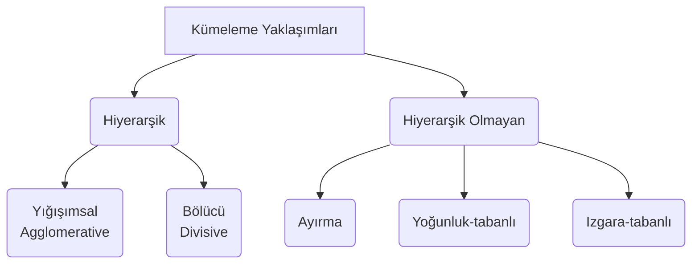

---

#### 28.3.1. Hiyerarşik Kümeleme

Bu yaklaşımın ana fikri, tek bir kümeleme sonucu üretmek yerine, bir dizi iç içe geçmiş kümeden oluşan bir **hiyerarşi** veya bir **ağaç yapısı (dendrogram)** oluşturmaktır. Başlangıçta kaç küme olması gerektiğini belirtmenize gerek yoktur. Algoritma size tüm olası küme birleşimlerini bir ağaç olarak sunar, siz de bu ağacı istediğiniz seviyeden "keserek" küme sayısını belirlersiniz.

Bu yaklaşımın iki temel stratejisi vardır:

*   **a) Yığışımsal (Agglomerative) / Birleştirici:** Bu, "aşağıdan yukarıya" (bottom-up) bir yaklaşımdır.
    1.  **Başlangıç:** Her bir veri noktası tek başına bir küme olarak kabul edilir. (N veri noktası varsa, N küme vardır.)
    2.  **İterasyon:** Her adımda, birbirine en yakın olan iki küme bulunur ve birleştirilir.
    3.  **Bitiş:** Tüm veri noktaları tek bir büyük kümede birleşene kadar bu birleştirme işlemi devam eder.

*   **b) Bölücü (Divisive):** Bu, "yukarıdan aşağıya" (top-down) bir yaklaşımdır ve daha nadir kullanılır.
    1.  **Başlangıç:** Tüm veri noktaları tek bir kümenin içindedir.
    2.  **İterasyon:** Her adımda, mevcut bir küme, içindeki noktalar birbirine en az benzeyecek şekilde ikiye bölünür.
    3.  **Bitiş:** Her veri noktası tek başına bir küme olana kadar bu bölme işlemi devam eder.

Hiyerarşik yöntemler, verinin yapısı hakkında zengin bir görsel bilgi sunar ancak büyük veri setlerinde hesaplama maliyetleri yüksek olabilir.

---

#### 28.3.2. Hiyerarşik Olmayan Kümeleme

Bu yaklaşımda amaç, veri setini önceden belirlenmiş **'K' adet** kümeye doğrudan bölmektir. Bir hiyerarşi oluşturulmaz; bunun yerine, veri noktaları belirli bir optimizasyon kriterine göre en uygun kümelere atanır. Genellikle hiyerarşik yöntemlerden daha hızlıdırlar ve bu nedenle büyük veri setleri için daha uygundurlar.

Bu sınıftaki bazı önemli alt başlıklar şunlardır:

*   **a) Ayırma (Partitioning) Yöntemleri:** En yaygın kullanılan yaklaşımdır. Amaç, veri setini K adet, kesişmeyen kümeye ayırmaktır. Analizcinin küme sayısı olan 'K' değerini en başta belirtmesi gerekir. En bilinen örneği **K-Means** algoritmasıdır. Bu algoritma, her kümenin bir merkez noktası (centroid) etrafında toplandığını varsayar.

*   **b) Yoğunluk Tabanlı (Density-based) Yöntemler:** Bu algoritmalar kümeleri, veri uzayında yoğun olarak bulunan bölgeler olarak tanımlar. Düşük yoğunluklu bölgeler ise bu kümeleri birbirinden ayıran sınırlar olarak görülür. Kümelerin küresel olmak zorunda olmadığını varsaydıkları için **farklı geometrik şekillerdeki kümeleri** bulabilirler. Ayrıca, herhangi bir kümeye ait olmayan "gürültü" (noise) veya "aykırı" (outlier) noktaları tespit etmede de oldukça başarılıdırlar. **DBSCAN** bu kategorinin popüler bir örneğidir.

*   **c) Izgara Tabanlı (Grid-based) Yöntemler:** Bu yöntemler, veri uzayını ızgara benzeri hücrelere böler ve tüm kümeleme işlemlerini bu hücreler üzerinde gerçekleştirir. Avantajı, işlem hızının veri noktası sayısına değil, ızgara hücrelerinin sayısına bağlı olmasıdır. Bu da onu çok büyük veri setleri için oldukça verimli kılar.

Sonuç olarak, hangi kümeleme yönteminin seçileceği; verinin yapısına, boyutuna, veri setinde gürültü olup olmamasına ve analizin nihai hedefine bağlıdır. Tek bir "en iyi" yöntem yoktur; her problemin doğası, en uygun yaklaşımın seçilmesini gerektirir.


### 28.4. Hiyerarşik Olmayan Kümeleme: K-Means Algoritması

Gençler, şimdi hiyerarşik olmayan yöntemlerin en popüler ve temel taşı olarak kabul edilen algoritmasını, **K-Means**'i inceleyeceğiz. Bu algoritmanın güzelliği, karmaşık bir problemi oldukça basit ve sezgisel adımlarla çözmesinde yatar.

Temel fikir şudur: Elimizdeki veri setini, önceden belirlediğimiz 'k' adet kümeye ayırmak istiyoruz. K-Means, her kümenin bir "ağırlık merkezi" veya geometrik merkezi olduğunu varsayar. Bu merkeze literatürde **centroid** denir. Bir veri noktasının kaderi basittir: Hangi centroid'e daha yakınsa, o centroid'in kümesine aittir.

Algoritmayı, bir odaya dağılmış insanları 'k' adet gruba ayırmaya çalışan bir organizatöre benzetebiliriz. Organizatörün görevi, her grubun kendi içinde mümkün olduğunca sıkı ve birbirine yakın olmasını sağlamaktır.

#### 28.4.1. Algoritmanın Çalışma Prensibi

K-Means, bu en iyi gruplamayı bulmak için yinelemeli (iterative) bir yaklaşım kullanır. Süreç, belirli bir denge durumuna ulaşana kadar kendini tekrar eden adımlardan oluşur.

1.  **Başlatma (Initialization):**
    *   İlk olarak, veriyi kaç kümeye ayırmak istediğimize karar veririz. Bu sayı 'k'dır.
    *   Ardından, veri uzayında rastgele 'k' adet nokta, başlangıç merkezleri (centroid'ler) olarak seçilir. Bu ilk merkezler, genellikle veri setinden rastgele seçilen 'k' adet noktanın kendisi olabilir. Bu, organizatörün odada rastgele 'k' noktayı "grup toplanma merkezi" olarak ilan etmesi gibidir.

2.  **Atama (Assignment):**
    *   Veri setindeki her bir nokta (odadaki her bir kişi) tek tek ele alınır.
    *   Her nokta için, kendisine en yakın olan centroid hesaplanır. "Yakınlık" ölçümü için standart olarak **Öklid uzaklığı** kullanılır.
    *   Her nokta, en yakın olduğu centroid'in kümesine dahil edilir. Bu adımın sonunda, herkes en yakın bulduğu toplanma merkezine gitmiş ve 'k' adet başlangıç kümesi oluşmuş olur.

3.  **Güncelleme (Update):**
    *   Atama adımı tamamlandıktan sonra, oluşan her bir kümenin yeni centroid'i, yani yeni ağırlık merkezi hesaplanır.
    *   Bu, o kümeye atanmış olan tüm veri noktalarının koordinatlarının aritmetik ortalaması alınarak yapılır. Algoritmanın ismindeki **"Means" (Ortalamalar)** kelimesi bu adımdan gelmektedir.
    *   Yani organizatör, her grubun tam ortasına giderek "Yeni toplanma merkezi burasıdır!" der.

4.  **Yineleme ve Yakınsama (Iteration & Convergence):**
    *   2. (Atama) ve 3. (Güncelleme) adımları, sistem bir denge durumuna ulaşana kadar tekrar edilir. İnsanlar yeni merkezlere göre tekrar en yakın grubu seçer, merkezler tekrar hesaplanır.
    *   Bu döngü ne zaman durur? Genellikle iki koşuldan biri sağlandığında:
        *   Centroid'lerin konumları bir önceki adıma göre artık hiç değişmez veya çok az değişir.
        *   Noktaların küme üyelikleri artık değişmez (kimse grup değiştirmez).
    *   Bu denge durumuna ulaşıldığında (buna **yakınsama** denir), küme merkezleri ve üyelikleri sabitlenir ve algoritma sonlanır.

Aşağıdaki diyagram, bu yinelemeli süreci görselleştirmektedir:

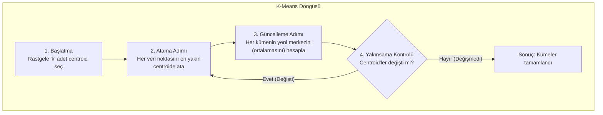

#### 28.4.2. K-Means'in Matematiksel Hedefi: WCSS'yi Minimize Etmek

Gençler, K-Means'in bu adımları rastgele atmadığını, aslında net bir matematiksel hedefi takip ettiğini bilmek önemlidir. Algoritmanın temel amacı, oluşturduğu kümeleri kendi içlerinde olabildiğince yoğun ve birbirine yakın tutmaktır. Her bir kümenin ne kadar "dağınık" olduğunu ölçen bir maliyet fonksiyonu düşünün. K-Means, her adımda bu toplam dağınıklığı, yani hatayı azaltmaya çalışır.

Bu toplam hatanın teknik adı **Küme İçi Hata Kareleri Toplamı (Within-Cluster Sum of Squares - WCSS)**'dır. WCSS, her bir veri noktasının, ait olduğu kümenin merkezine (centroid'e) olan uzaklıklarının karesinin toplanmasıyla hesaplanır.

<p align="center">
    WCSS = &sum;<sub>i=1</sub><sup>k</sup> &sum;<sub>x &isin; C<sub>i</sub></sub> ||x - &mu;<sub>i</sub>||<sup>2</sup>
</p>

Bu formüldeki bileşenleri inceleyelim:
*   $k$: Toplam küme sayısı.
*   $C_i$: $i$ numaralı küme.
*   $x$: $C_i$ kümesine ait bir veri noktası.
*   $\mu_i$: $C_i$ kümesinin centroid'i (merkezi).
*   $||x - \mu_i||^2$: $x$ noktası ile centroid $\mu_i$ arasındaki Öklid uzaklığının karesi. Bu kare alma işlemi, merkeze uzak olan noktaların hatasını daha fazla vurgular.

K-Means'in yaptığı her bir "Atama" ve "Güncelleme" adımı, bu WCSS değerini sistematik olarak düşürmeye yönelik bir hamledir. Atama adımında her nokta, kendisini WCSS'yi en çok azaltacak merkeze atar. Güncelleme adımında ise her bir centroid, kendi kümesinin yeni kütle merkezine taşınır ki bu da o küme için WCSS'yi minimize eden noktadır.

Algoritma, bu değeri daha fazla düşüremediği bir denge noktasına ulaştığında durur. Bu noktaya **yerel minimum (local minimum)** denir. Bu, algoritmanın mümkün olan en iyi çözümü bulduğunu garanti etmez; çünkü sonuç, başlangıçta centroid'lerin nereye yerleştirildiğine bağlıdır. Bu nedenle pratikte, algoritma farklı başlangıç noktalarıyla birkaç kez çalıştırılır ve en düşük WCSS değerini veren sonuç en iyi kümeleme olarak kabul edilir.


***

### 28.5. Uygulama: Weka ile "insanlar.csv" Veri Seti Üzerinde Analiz

Bu çalışmadaki amacımız, kişilerin fiziksel özelliklerine (`yas`, `boy`, `kilo`, `ayak_no`) bakarak aralarında doğal gruplar olup olmadığını keşfetmek ve ardından bu grupları tanımlayan kuralları ortaya çıkarmaktır.

---

#### 28.5.1. Bölüm 1: k-Means ile Keşifsel Kümeleme

##### 28.5.1.1. Adım 1: Veri Setini Weka'ya Yükleme

Weka, yerel dosyaların yanı sıra doğrudan internet üzerindeki verilere de erişebilir.

*   **İşlem:**
    1.  Weka Explorer'ı başlatın.
    2.  "Preprocess" sekmesinde, "Open file..." yerine **"Open URL..."** seçeneğine tıklayın.
    3.  Açılan pencereye aşağıdaki adresi yapıştırın ve "OK" tuşuna basın:
        `https://raw.githubusercontent.com/erkanozhan/datamining_lab_data/master/insanlar.csv`
    4.  Veri yüklendiğinde, "Attributes" panelinde `ad`, `yas`, `boy`, `kilo` ve `ayak_no` özniteliklerini göreceksiniz.

##### 28.5.1.2. Adım 2: k-Means Algoritmasını Yapılandırma ve Çalıştırma

Kümeleme, nesneler arasındaki sayısal mesafelere dayalı bir analizdir. Veri setimizdeki `ad` özniteliği, her kişi için benzersiz bir tanımlayıcı olduğundan, iki kişi arasındaki mesafeyi hesaplarken anlamsal bir katkı sağlamaz. Bu tür tanımlayıcı öznitelikleri analizden çıkarmak, modelin daha anlamlı sonuçlar üretmesini sağlar. Weka'da bir özniteliği kalıcı olarak silmek yerine, kümeleme algoritmasının onu **göz ardı etmesini (ignore)** sağlayabiliriz.

*   **İşlem:**
    1.  "Cluster" sekmesine geçin.
    2.  "Choose" butonu ile `weka.clusterers.SimpleKMeans`'i seçin.
    3.  Algoritma adına tıklayarak ayarlarını açın ve `numClusters` değerini **3** olarak belirleyin. (Bu, veriyi 3 gruba ayırmak istediğimizi belirtir). "OK" ile kapatın.
    4.  "Cluster mode" bölümünün hemen altında bulunan **"Ignore attributes"** butonuna tıklayın.
    5.  Açılan pencerede `(Nom) ad` özniteliğini seçin. Bu işlem, Weka'ya k-Means algoritmasını çalıştırırken bu sütunu mesafe hesaplamalarına dahil etmemesini söyler.
    6.  "Start" butonuna basarak kümeleme işlemini başlatın.

##### 28.5.1.3. Adım 3: Sonuçları Yorumlama (Öklid Uzaklığı ile)

Weka'nın "Clusterer output" panelindeki sonuçları bu veri setine göre yorumlayalım. (Not: Rastgele başlangıç nedeniyle sizin sonuçlarınız küçük farklılıklar gösterebilir, ancak genel yapı benzer olacaktır.)

*   **Cluster Centroids (Küme Merkezleri):**
    Bu tablo, 3 grubun "ortalama insan profilini" gösterir. Olası bir çıktı şöyle görünebilir:

| Öznitelik | Küme 0 | Küme 1 | Küme 2 |
| :--- | :---: | :---: | :---: |
| yas | 22.5 | 25.8 | 32.0 |
| boy | 1.72 | 1.84 | 1.96 |
| kilo | 59.5 | 81.2 | 100.0 |
| ayak_no | 38.4 | 43.8 | 44.5 |

    *   **Yorum:**
        *   **Küme 0:** Bu grup, daha kısa boylu, daha zayıf ve daha küçük ayak numarasına sahip, genellikle kadınlardan oluşan bir segmenti temsil ediyor gibi görünmektedir.
        *   **Küme 1:** Bu grup, ortalamanın üzerinde boy ve kiloya sahip, genellikle erkeklerden oluşan en kalabalık segmenti temsil etmektedir.
        *   **Küme 2:** Bu grup ise belirgin şekilde daha yaşlı, çok daha uzun ve daha kilolu kişileri içeren daha küçük bir segmenti ifade etmektedir.

*   **Clustered Instances (Kümelenmiş Örnekler):**
    `Cluster 0: 12 (%32)`
    `Cluster 1: 20 (%54)`
    `Cluster 2: 5 (%14)`
    *   **Yorum:** Veri setindeki kişilerin yarısından fazlası (%54) Küme 1 profiline uymaktadır.

---

#### 28.5.2. Bölüm 2: Küme Etiketlerinden Anlam Çıkarma (Sınıflandırma)

Şimdi, bu soyut "Küme 0", "Küme 1" etiketlerinin hangi somut kurallarla tanımlandığını bulalım.

##### 28.5.2.1. Adım 1: Küme Etiketlerini Veriye Ekleme

*   **İşlem:**
    1.  "Preprocess" sekmesine dönün.
    2.  "Filter" -> "Choose" -> `weka.filters.unsupervised.attribute.AddCluster` yolunu izleyin.
    3.  Filtrenin ayarlarına girip kümeleyici olarak `SimpleKMeans`'i ve `numClusters`'ı **3** olarak yapılandırın.
    4.  "Apply" butonuna basın. Veri setinizin sonuna her bir kişinin hangi kümeye atandığını gösteren yeni bir `cluster` sütunu eklenecektir.

##### 28.5.2.2. Adım 2: Karar Ağacı ile Kuralları Görselleştirme

Bu küme etiketlerini hangi fiziksel özelliklerin belirlediğini bir ağaç yapısıyla görelim.

*   **İşlem:**
    1.  "Classify" sekmesine geçin.
    2.  Hedef değişken olarak en üstteki listeden yeni eklenen `(Nom) cluster` özniteliğini seçin.
    3.  "Choose" butonu ile `weka.classifiers.trees.J48`'i seçin.
    4.  "Start" butonuna basın.
*   **Ağacı Yorumlama:**
    "Result list" panelinde oluşan modelin üzerine sağ tıklayıp **"Visualize tree"** deyin. Karşınıza çıkacak ağaç, muhtemelen şöyle bir yapıya sahip olacaktır:

    ```
    boy <= 1.72
    |   kilo <= 65: cluster0 (12.0/1.0)  // Eğer boy 1.72'den küçük ve kilo 65'ten az ise büyük ihtimalle Küme 0'dır.
    |   kilo > 65: cluster1 (3.0/1.0)
    boy > 1.72
    |   kilo <= 85
    |   |   boy <= 1.85: cluster1 (15.0/2.0)
    |   |   boy > 1.85: cluster2 (4.0/1.0)
    |   kilo > 85: cluster2 (3.0)
    ```
    *   **Yorum:** Bu ağaç bize, kümeleri ayıran en önemli özelliğin **boy** ve ardından **kilo** olduğunu net bir şekilde gösteriyor. Örneğin, 1.72m'den kısa ve 65kg'dan hafif kişilerin neredeyse tamamı Küme 0'a atanmış. Bu, kümeleme ile bulduğumuz soyut gruplara, insan tarafından okunabilir, somut ve işe yarar tanımlar getirmemizi sağlar.

##### 28.5.2.3. Adım 3: Kural Tabanlı Algoritma ile Kuralları Listeleme

Aynı işi bir de basit kural listesi olarak görelim.

*   **İşlem:**
    "Choose" ile `weka.classifiers.rules.JRip` algoritmasını seçin ve "Start"a basın.
*   **Kuralları Yorumlama:**
    Çıktı panelinde şuna benzer, daha sade bir kural listesi göreceksiniz:

    `(boy <= 1.72) and (kilo <= 65) => cluster=cluster0 (12.0/1.0)`
    `(boy >= 1.88) or (kilo >= 90) => cluster=cluster2 (5.0/0.0)`
    `=> cluster=cluster1 (20.0/3.0)`

    *   **Yorum:** Bu kurallar da bize aynı hikayeyi anlatıyor: Küme 0, kısa ve zayıf kişilerden oluşuyor. Küme 2, çok uzun veya çok kilolu kişileri kapsıyor. Geriye kalan herkes ise Küme 1'dir. Bu tür net kurallar, müşteri segmentasyonu gibi alanlarda pazarlama stratejileri geliştirmek için doğrudan kullanılabilir.
*   
#### 28.5.3. Weka'da Kümeleme Sonuçlarını Değerlendirme

Gençler, bir önceki bölümde k-Means ile veri setimizi anlamlı gruplara ayırdık ve hatta bu grupları tanımlayan kuralları karar ağaçları yardımıyla ortaya çıkardık. Bu noktada akla şu kritik soru geliyor: Yaptığımız bu kümeleme ne kadar "başarılı"?

Sınıflandırma problemlerinde işimiz daha kolaydı, çünkü elimizde "doğru cevaplar" yani etiketler vardı. Modelin tahminlerini bu etiketlerle karşılaştırıp bir doğruluk oranı hesaplayabiliyorduk. Ancak kümelemede durum farklı. Bu, "gözetimsiz öğrenme" (unsupervised learning) alanına girer, yani elimizde önceden tanımlanmış doğru cevaplar yoktur. Algoritma, verinin kendi iç yapısına göre grupları keşfeder. Peki, bu keşfin kalitesini nasıl ölçeriz?

Weka, bu konuda bize bazı araçlar sunar. En yaygın kullanılan ve en aydınlatıcı olan yöntemlerden biri, **"Classes to clusters evaluation"** (Sınıflara göre kümeleri değerlendirme) modudur.

Bu yöntemin temel mantığı şudur: Kümeleme algoritmasının, analizde kullanmadığı harici bir etiket bilgisini ne kadar iyi yansıttığını kontrol ederiz. Yani, algoritmayı belirli özniteliklere göre çalıştırırız, ancak değerlendirme aşamasında, sürece hiç dahil etmediğimiz bir sınıf etiketini referans alırız. Eğer oluşturulan kümeler, bu referans etikete göre anlamlı bir şekilde ayrışıyorsa, kümelememizin veri içindeki gerçek bir yapıyı yakaladığını söyleyebiliriz.

```r
# Gerekli Kütüphanelerin Yüklenmesi
library(factoextra)
library(NbClust)
library(ggplot2)
library(cluster)

# Veri Yükleme
data(iris)

# Veri Ön İşleme
# 5. sütun olan 'Species' kategorik değişkeni çıkarılır
df <- iris[, -5]

# Standardizasyon (Ortalama=0, Standart Sapma=1)
df_scaled <- scale(df)

# İlk 5 satırın kontrolü
head(df_scaled)
```

**Analiz:** İris verisinde ölçüm birimleri aynı (cm) olsa da, varyansları eşitlemek için ölçeklendirme yapılmıştır. Bu, Öklid uzaklığının, varyansı büyük olan değişken (Petal Length) tarafından domine edilmesini engeller.

### **4.2 Elbow Yöntemi Uygulaması ve Sonuçları**

fviz_nbclust fonksiyonu method = "wss" argümanı ile çalıştırılır.

```r
set.seed(123) # Tekrarlanabilirlik için
fviz_nbclust(df_scaled, kmeans, method = "wss") +
    geom_vline(xintercept = 3, linetype = 2) +
    labs(title = "Elbow Yöntemi (İris Veri Seti)",
             subtitle = "Toplam WCSS'in Küme Sayısına Göre Değişimi",
             x = "Küme Sayısı (k)", y = "Toplam WCSS")
```

Bulgular ve Yorum:
Grafik incelendiğinde, WCSS değerinin $k=1$'den $k=2$'ye geçerken çok keskin bir düşüş gösterdiği görülür. Bu, Setosa türünün diğerlerinden ayrılmasının yarattığı büyük varyans azalmasıdır.

*   **$k=2$ noktası:** Çok belirgin bir kırılma vardır.
*   **$k=3$ noktası:** İkinci, daha yumuşak bir kırılma (dirsek) görülür. Bu da *Versicolor* ve *Virginica* ayrımını temsil eder.
*   **Sonuç:** Elbow yöntemi İris veri setinde belirsizdir (ambiguous). Matematiksel olarak en büyük kazanç 2'de olsa da, 3 noktasındaki dirsek de göz ardı edilemez. Literatürde bu durum genellikle $k=2$ veya $k=3$ adayı olarak yorumlanır.3

### **4.3 Silhouette Yöntemi Uygulaması ve Sonuçları**

fviz_nbclust fonksiyonu method = "silhouette" argümanı ile çalıştırılır.

```r
fviz_nbclust(df_scaled, kmeans, method = "silhouette") +
    labs(title = "Silhouette Analizi",
             subtitle = "Ortalama Silhouette Genişliği",
             x = "Küme Sayısı (k)", y = "Ortalama Silhouette Genişliği")
```

Bulgular ve Yorum:
Silhouette analizi sonuçları genellikle çok daha keskindir:

*   **$k=2$:** Ortalama Silhouette Genişliği (ASW) en yüksek değerine ulaşır (yaklaşık 0.58).
*   **$k=3$:** ASW değeri düşer (yaklaşık 0.46).

Neden $k=2$?
Silhouette indeksi, kümelerin ne kadar ayrık (separated) olduğunu ödüllendirir. Setosa kümesi çok ayrıktır ($s(i)$ değeri 1'e yakındır). Ancak $k=3$ yapıldığında, Versicolor ve Virginica kümeleri birbirine çok yakın olduğu ve sınırda birçok nokta bulunduğu için bu bölgelerdeki noktaların $s(i)$ değerleri düşer (sıfıra yaklaşır veya negatif olur). Bu durum genel ortalamayı aşağı çeker. Dolayısıyla Silhouette yöntemi, matematiksel olarak en iyi ayrışımın 2 küme ile sağlandığını (Setosa ve Diğerleri) iddia eder.9

### **4.4 NbClust Çoğunluk Kuralı Uygulaması ve Sonuçları**

En kapsamlı analiz için NbClust fonksiyonu çalıştırılır. İris verisi için $k$ aralığı 2 ile 10 arasında belirlenir.

```r
nb_res <- NbClust(data = df_scaled,
                                    distance = "euclidean",
                                    min.nc = 2, max.nc = 10,
                                    method = "kmeans",
                                    index = "all")

# Sonuçların görselleştirilmesi
fviz_nbclust(nb_res) +
    labs(title = "NbClust Çoğunluk Kuralı Sonuçları")
```

Bulgular ve Yorum:
NbClust çıktısı, 30 indeksin her birinin önerisini listeler. Tipik bir İris analizi çıktısı şu şekildedir 22:

*   **Hubert, D-index:** Genellikle grafiksel yöntemlerdir.
*   **Silhouette, Dunn, Gap Statistic:** Genellikle $k=2$ önerir.
*   **Pseudo-T2, Frey, Hartigan:** Bazen $k=3$ veya daha yüksek değerler önerebilir.

Oylama Sonucu:
Çoğu durumda, indekslerin büyük bir kısmı (örneğin 30 indeksin 10-12 tanesi) $k=2$ önerisinde bulunur. İkinci en popüler öneri ise (örneğin 8-9 indeks) $k=3$ olur.
NbClust fonksiyonunun konsol çıktısı şuna benzer bir ifadeyle biter:
"Among all indices: 10 proposed 2 as the best number of clusters. 8 proposed 3 as the best number of clusters. Conclusion: According to the majority rule, the best number of clusters is 2.".18

#### 28.5.4. Kümeleme Sonuçlarını Veri Setine Ekleyerek Yorumlama: `AddCluster` Filtresi

Peki ya elimizde karşılaştıracak harici bir etiket yoksa? Bu durumda, kümelemenin kendi sonuçlarını kullanarak veriyi daha derinlemesine analiz edebiliriz. Weka'daki `AddCluster` filtresi tam da bu amaç için tasarlanmıştır.

Bu filtre, kümeleme algoritmasını çalıştırır ve her bir veri noktasının (satırın) hangi kümeye atandığını gösteren **yeni bir sütunu** veri setimize ekler. Böylece, soyut bir kümeleme sonucu yerine, üzerinde analiz yapabileceğimiz somut bir "küme etiketi" sütunumuz olur.

##### 28.5.4.1. İşlem Adımları

"insanlar.csv" veri setimiz üzerinden süreci adım adım uygulayalım:

1.  **Veriyi Yükleyin:** "insanlar.csv" veri setini Weka'ya yükleyin.
2.  **Filtreyi Seçin:** "Preprocess" sekmesinde, `Filter -> Choose -> unsupervised -> attribute -> AddCluster` yolunu izleyin.
3.  **Filtreyi Yapılandırın:** Filtre adına tıklayarak ayarlarını açın.
        *   Kullanılacak kümeleyici olarak `SimpleKMeans`'i seçin.
        *   Küme sayısını (`numClusters`) **3** olarak ayarlayın.
4.  **Uygulayın:** "Apply" butonuna basın. Weka, arka planda K-Means algoritmasını çalıştıracak ve veri tablonuza her bir satır için "cluster0", "cluster1" gibi değerler içeren `cluster` adında yeni bir sütun ekleyecektir.

##### 28.5.4.2. Sonuçları Yorumlama

Artık elimizde küme etiketlerini içeren bir sütun var. Bu yeni sütun sayesinde, her bir kümenin karakteristiğini ortaya çıkarmak için çeşitli analizler yapabiliriz.

*   **Görsel Analiz:** Weka'nın "Visualize" sekmesine geçin. `boy` ve `kilo` eksenlerini seçip, noktaları yeni `cluster` sütununa göre renklendirin.
        *   **cluster0** etiketli noktaların grafiğin sol alt köşesinde (düşük boy, düşük kilo).
        *   **cluster2** etiketli noktaların ise sağ üst köşede (yüksek boy, yüksek kilo) yoğunlaştığını görebilirsiniz.
        *   **cluster1** ise bu iki grubun arasında bir yerde konumlanacaktır.

Bu görsel analizler bize, algoritmanın veriyi anlamlı bir şekilde üç gruba ayırdığını gösterir. Artık bu grupları isimlendirebiliriz:
*   **Küme 0:** Genç ve daha minyon yapılı bireyler.
*   **Küme 1:** Ortalama fiziksel ölçülere sahip bireyler.
*   **Küme 2:** Daha yapılı bireyler.

Bu yöntem, sadece "veriyi 3 gruba ayırdık" demekten çok daha fazlasını sunar; bu grupların kimler olduğunu ve onları ayıran temel özelliklerin neler olduğunu anlamamızı sağlar.

Bu ders notunun hazırlanmasında aşağıdaki kaynaklar ve R paketleri temel alınmıştır:

* **NbClust Paketi ve İndeksleri:** 6  
* **Silhouette ve Elbow Yöntemleri:** 3  
* **Görselleştirme ve Factoextra:** 5  
* **İris Veri Seti Analizleri:** 2  
* **Standardizasyonun Önemi:** 14

#### **Alıntılanan çalışmalar**

1. Practical Guide To Cluster Analysis in R \- XSLiuLab.github.io, erişim tarihi Aralık 10, 2025, [https://xsliulab.github.io/Workshop/2021/week10/r-cluster-book.pdf](https://xsliulab.github.io/Workshop/2021/week10/r-cluster-book.pdf)  
2. K-means Clustering: Complete Guide with Algorithm, Implementation & Best Practices \- Interactive | Michael Brenndoerfer, erişim tarihi Aralık 10, 2025, [https://mbrenndoerfer.com/writing/kmeans-clustering-complete-guide](https://mbrenndoerfer.com/writing/kmeans-clustering-complete-guide)  
3. Determining the optimal number of clusters: 3 must known methods \- Unsupervised Machine Learning \- Easy Guides \- Wiki \- STHDA, erişim tarihi Aralık 10, 2025, [https://www.sthda.com/english/wiki/wiki.php?id\_contents=7923](https://www.sthda.com/english/wiki/wiki.php?id_contents=7923)  
4. Clustering Distance Measures \- GeeksforGeeks, erişim tarihi Aralık 10, 2025, [https://www.geeksforgeeks.org/machine-learning/clustering-distance-measures/](https://www.geeksforgeeks.org/machine-learning/clustering-distance-measures/)  
5. fviz\_nbclust: Dertermining and Visualizing the Optimal Number of Clusters in factoextra: Extract and Visualize the Results of Multivariate Data Analyses \- rdrr.io, erişim tarihi Aralık 10, 2025, [https://rdrr.io/cran/factoextra/man/fviz\_nbclust.html](https://rdrr.io/cran/factoextra/man/fviz_nbclust.html)  
6. NbClust package for determining the number of clusters in a dataset \- ResearchGate, erişim tarihi Aralık 10, 2025, [https://www.researchgate.net/profile/Malika-Charrad/publication/275463140\_Determining\_the\_number\_of\_clusters\_using\_NbClust\_package/links/553cf5b10cf2c415bb0d0b8a/Determining-the-number-of-clusters-using-NbClust-package.pdf?origin=scientificContributions](https://www.researchgate.net/profile/Malika-Charrad/publication/275463140_Determining_the_number_of_clusters_using_NbClust_package/links/553cf5b10cf2c415bb0d0b8a/Determining-the-number-of-clusters-using-NbClust-package.pdf?origin=scientificContributions)  
7. Clustering Iris Species Using an Unsupervised Learning Approach: K-Means and Principal Component Analysis (PCA) \- ResearchGate, erişim tarihi Aralık 10, 2025, [https://www.researchgate.net/publication/391437962\_Clustering\_Iris\_Species\_Using\_an\_Unsupervised\_Learning\_Approach\_K-Means\_and\_Principal\_Component\_Analysis\_PCA](https://www.researchgate.net/publication/391437962_Clustering_Iris_Species_Using_an_Unsupervised_Learning_Approach_K-Means_and_Principal_Component_Analysis_PCA)  
8. Explore the Basics of K-means Clustering in R based on iris dataset \- Medium, erişim tarihi Aralık 10, 2025, [https://medium.com/data-and-beyond/explore-the-basics-of-k-means-clustering-in-r-based-on-iris-dataset-4aab016a9771](https://medium.com/data-and-beyond/explore-the-basics-of-k-means-clustering-in-r-based-on-iris-dataset-4aab016a9771)  
9. K-Means Clustering Analysis of Iris Morphological Features \- RPubs, erişim tarihi Aralık 10, 2025, [https://rpubs.com/Cherry\_Chan/1377363](https://rpubs.com/Cherry_Chan/1377363)  
10. Clustering trees: a visualisation for evaluating clusterings at multiple resolutions \- bioRxiv, erişim tarihi Aralık 10, 2025, [https://www.biorxiv.org/content/10.1101/274035v1.full.pdf](https://www.biorxiv.org/content/10.1101/274035v1.full.pdf)  
11. Iris Dataset Clustering Analysis \- RPubs, erişim tarihi Aralık 10, 2025, [https://rpubs.com/aakashaldankar/1236510](https://rpubs.com/aakashaldankar/1236510)  
12. STAT 5230 \- k-means clustering \- iris data \- RPubs, erişim tarihi Aralık 10, 2025, [https://rpubs.com/jmartin/1148365](https://rpubs.com/jmartin/1148365)  
13. NbClust: Determining the Best Number of Clusters in a Data Set, erişim tarihi Aralık 10, 2025, [https://cran.r-project.org/web/packages/NbClust/NbClust.pdf](https://cran.r-project.org/web/packages/NbClust/NbClust.pdf)  
14. Standardization in Cluster Analysis \- Alteryx Knowledge Base, erişim tarihi Aralık 10, 2025, [https://knowledge.alteryx.com/index/s/article/Standardization-in-Cluster-Analysis-1583461087248](https://knowledge.alteryx.com/index/s/article/Standardization-in-Cluster-Analysis-1583461087248)  
15. Data Standardization: How to Do It and Why It Matters | Built In, erişim tarihi Aralık 10, 2025, [https://builtin.com/data-science/when-and-why-standardize-your-data](https://builtin.com/data-science/when-and-why-standardize-your-data)  
16. Why and When to Standardize Your Data in Machine Learning: A Comprehensive Guide | by JABERI Mohamed Habib | Medium, erişim tarihi Aralık 10, 2025, [https://medium.com/@jaberi.mohamedhabib/why-and-when-to-standardize-your-data-in-machine-learning-a-comprehensive-guide-9e4ca063c050](https://medium.com/@jaberi.mohamedhabib/why-and-when-to-standardize-your-data-in-machine-learning-a-comprehensive-guide-9e4ca063c050)  
17. how to print the optimal number of clusters using fviz\_nbclust \- Stack Overflow, erişim tarihi Aralık 10, 2025, [https://stackoverflow.com/questions/40821591/how-to-print-the-optimal-number-of-clusters-using-fviz-nbclust](https://stackoverflow.com/questions/40821591/how-to-print-the-optimal-number-of-clusters-using-fviz-nbclust)  
18. Determining The Optimal Number Of Clusters: 3 Must Know Methods \- Articles \- STHDA, erişim tarihi Aralık 10, 2025, [https://www.sthda.com/english/articles/index.php?url=/29-cluster-validation-essentials/96-determining-the-optimal-number-of-clusters-3-must-known-methods/](https://www.sthda.com/english/articles/index.php?url=/29-cluster-validation-essentials/96-determining-the-optimal-number-of-clusters-3-must-known-methods/)  
19. Silhouette Package \- cran \- R-universe, erişim tarihi Aralık 10, 2025, [https://cran.r-universe.dev/articles/Silhouette/Silhouette.html](https://cran.r-universe.dev/articles/Silhouette/Silhouette.html)  
20. NbClust/R/NbClust.R at master · cran/NbClust \- GitHub, erişim tarihi Aralık 10, 2025, [https://github.com/cran/NbClust/blob/master/R/NbClust.R](https://github.com/cran/NbClust/blob/master/R/NbClust.R)  
21. Retrieve best number of clusters from NbClust \- Stack Overflow, erişim tarihi Aralık 10, 2025, [https://stackoverflow.com/questions/37292878/retrieve-best-number-of-clusters-from-nbclust](https://stackoverflow.com/questions/37292878/retrieve-best-number-of-clusters-from-nbclust)  
22. R: NbClust package gives different optimal number of clusters using the same dataset with the random order of rows, erişim tarihi Aralık 10, 2025, [https://stackoverflow.com/questions/64510649/r-nbclust-package-gives-different-optimal-number-of-clusters-using-the-same-dat](https://stackoverflow.com/questions/64510649/r-nbclust-package-gives-different-optimal-number-of-clusters-using-the-same-dat)  
23. NbClust: An R Package for Determining the Relevant Number of Clusters in a Data Set \- Journal of Statistical Software, erişim tarihi Aralık 10, 2025, [https://www.jstatsoft.org/article/view/v061i06/798](https://www.jstatsoft.org/article/view/v061i06/798)  
24. Assessing Clustering Tendency in R | My thoughts & learnings \- WordPress.com, erişim tarihi Aralık 10, 2025, [https://edumine.wordpress.com/2015/05/13/assessing-clustering-tendency-in-r/](https://edumine.wordpress.com/2015/05/13/assessing-clustering-tendency-in-r/)  
25. Dertermining and Visualizing the Optimal Number of Clusters \- R, erişim tarihi Aralık 10, 2025, [https://search.r-project.org/CRAN/refmans/factoextra/html/fviz\_nbclust.html](https://search.r-project.org/CRAN/refmans/factoextra/html/fviz_nbclust.html)  
26. factoextra source: R/fviz\_nbclust.R \- rdrr.io, erişim tarihi Aralık 10, 2025, [https://rdrr.io/cran/factoextra/src/R/fviz\_nbclust.R](https://rdrr.io/cran/factoextra/src/R/fviz_nbclust.R)  
27. What is Feature Scaling and Why is it Important? \- Analytics Vidhya, erişim tarihi Aralık 10, 2025, [https://www.analyticsvidhya.com/blog/2020/04/feature-scaling-machine-learning-normalization-standardization/](https://www.analyticsvidhya.com/blog/2020/04/feature-scaling-machine-learning-normalization-standardization/)

#### 28.5.4. Kümeleme Sonuçlarını Veri Setine Ekleyerek Yorumlama: `AddCluster` Filtresi

Peki ya elimizde karşılaştıracak harici bir etiket yoksa? Bu durumda, kümelemenin kendi sonuçlarını kullanarak veriyi daha derinlemesine analiz edebiliriz. Weka'daki `AddCluster` filtresi tam da bu amaç için tasarlanmıştır.

Bu filtre, kümeleme algoritmasını çalıştırır ve her bir veri noktasının (satırın) hangi kümeye atandığını gösteren **yeni bir sütunu** veri setimize ekler. Böylece, soyut bir kümeleme sonucu yerine, üzerinde analiz yapabileceğimiz somut bir "küme etiketi" sütunumuz olur.

##### 28.5.4.1. İşlem Adımları

"insanlar.csv" veri setimiz üzerinden süreci adım adım uygulayalım:

1.  **Veriyi Yükleyin:** "insanlar.csv" veri setini Weka'ya yükleyin.
2.  **Filtreyi Seçin:** "Preprocess" sekmesinde, `Filter -> Choose -> unsupervised -> attribute -> AddCluster` yolunu izleyin.
3.  **Filtreyi Yapılandırın:** Filtre adına tıklayarak ayarlarını açın.
    *   Kullanılacak kümeleyici olarak `SimpleKMeans`'i seçin.
    *   Küme sayısını (`numClusters`) **3** olarak ayarlayın.
4.  **Uygulayın:** "Apply" butonuna basın. Weka, arka planda K-Means algoritmasını çalıştıracak ve veri tablonuza her bir satır için "cluster0", "cluster1" gibi değerler içeren `cluster` adında yeni bir sütun ekleyecektir.

##### 28.5.4.2. Sonuçları Yorumlama

Artık elimizde küme etiketlerini içeren bir sütun var. Bu yeni sütun sayesinde, her bir kümenin karakteristiğini ortaya çıkarmak için çeşitli analizler yapabiliriz.

*   **Görsel Analiz:** Weka'nın "Visualize" sekmesine geçin. `boy` ve `kilo` eksenlerini seçip, noktaları yeni `cluster` sütununa göre renklendirin.
    *   **cluster0** etiketli noktaların grafiğin sol alt köşesinde (düşük boy, düşük kilo).
    *   **cluster2** etiketli noktaların ise sağ üst köşede (yüksek boy, yüksek kilo) yoğunlaştığını görebilirsiniz.
    *   **cluster1** ise bu iki grubun arasında bir yerde konumlanacaktır.

Bu görsel analizler bize, algoritmanın veriyi anlamlı bir şekilde üç gruba ayırdığını gösterir. Artık bu grupları isimlendirebiliriz:
*   **Küme 0:** Genç ve daha minyon yapılı bireyler.
*   **Küme 1:** Ortalama fiziksel ölçülere sahip bireyler.
*   **Küme 2:** Daha yapılı bireyler.

Bu yöntem, sadece "veriyi 3 gruba ayırdık" demekten çok daha fazlasını sunar; bu grupların kimler olduğunu ve onları ayıran temel özelliklerin neler olduğunu anlamamızı sağlar.

---

#### 28.5.5. Keşiften Kurala: Küme Etiketleri ile Sınıflandırma Modeli Eğitmek

Peki, `AddCluster` ile elde ettiğimiz bu küme etiketlerini bir sınıflandırma modelini eğitmek için kullanabilir miyiz? **Kesinlikle evet!** Bu, veri madenciliğinde oldukça güçlü ve yaygın bir tekniktir.

Bu yaklaşım, **keşiften kural çıkarmaya** geçişi sağlar.

1.  **Keşif Aşaması (Gözetimsiz Öğrenme):** K-Means ile verideki doğal grupları bulduk. Bu, verinin içindeki gizli yapıyı keşfetmektir.
2.  **Kural Çıkarma Aşaması (Gözetimli Öğrenme):** Şimdi, oluşturduğumuz bu küme etiketlerini sanki en başından beri var olan "doğru cevaplar" gibi kabul ediyoruz. Bir sınıflandırma algoritması (örneğin Karar Ağacı - **J48**) kullanarak bu etiketleri tahmin etmeye yönelik bir model eğitiyoruz.

Bu ikinci aşamanın amacı şudur: **"Bir bireyin 'cluster1' grubuna ait olmasının kuralları nelerdir?"** sorusuna net bir cevap bulmak.

Sınıflandırma modeli, bu soruyu cevaplamak için veriyi inceler ve şöyle yorumlanabilir kurallar bütünü oluşturabilir:

```
EĞER boy > 1.80 ve kilo > 85 İSE -> cluster2
EĞER boy < 1.65 ve ayak_no < 40 İSE -> cluster0
DEĞİLSE -> cluster1
```

##### 28.5.5.1. Bu Yaklaşım Bize Ne Kazandırır?

*   **Yorumlanabilirlik:** Kümeleme size grupları verir, sınıflandırma ise bu grupların **neden** oluştuğunu açıklayan net kurallar üretir.
*   **Verimlilik:** Yeni bir veri geldiğinde, tüm kümeleme sürecini baştan çalıştırmak yerine, eğittiğimiz bu hızlı sınıflandırma modelini kullanarak o verinin hangi kümeye ait olduğunu anında tahmin edebiliriz.
*   **Segmentasyon ve Profilleme:** Bu yöntem, müşteri segmentasyonu gibi alanlarda paha biçilmezdir. Müşterileri davranışlarına göre kümelersiniz, ardından bu küme etiketlerini kullanarak her bir segmentin profilini (örneğin, "30 yaş altı ve ayda 5'ten fazla alışveriş yapıyorsa 'Sadık Müşteri'dir") çıkaran kurallar elde edersiniz.

> Özetle, kümeleme ile **keşfettiğiniz** grupları, sınıflandırma ile **tanımlanabilir ve uygulanabilir kurallara** dönüştürürsünüz. Bu, gözetimsiz öğrenmenin keşif gücünü, gözetimli öğrenmenin tahmin ve kural çıkarma yeteneğiyle birleştiren son derece pratik bir yaklaşımdır.


## 29. Metin Madenciliği (Text Mining)

Gençler, şimdiye kadar genellikle sayılardan veya net kategorilerden oluşan, yani "yapılandırılmış" verilerle çalıştık. Her bilginin yeri belliydi: bir tablo, bir satır, bir sütun. Ancak dijital dünyanın büyük bir kısmı böyle düzenli değil. E-postalar, sosyal medya gönderileri, haber makaleleri, müşteri yorumları, kitaplar... Bunların hepsi, insan dilinin esnekliği ve karmaşıklığıyla dolu "yapılandırılmamış" metinlerdir.

İşte **Metin Madenciliği**, bu devasa metin okyanusundan anlamlı bilgi ve örüntüler çıkarmak için kullandığımız bir dizi tekniktir. Temelde, bilgisayarlara bu metinleri "okumayı", işlemeyi ve içlerindeki gizli hazineleri keşfetmeyi öğretme sanatıdır. Amacımız, bir insanın okuyup anlayarak yapacağı analizi, binlerce hatta milyonlarca doküman üzerinde saniyeler içinde yapabilmektir.

Metin madenciliği, belirgin bir formatı olmayan, yazı biçimindeki veriler içerisinden gizli nitelikli bilginin çıkarılması ve düzensiz haldeki bilginin formatlanması sürecidir.
Bir başka tanıma göre metin madenciliği, metin koleksiyonlarından bilgiye erişmeyi, metinlerden bilgi çıkarmayı amaçlayan süreçleri birleştiren mimaridir.

Metin madenciliği, veri madenciliğinin bir alt dalı olarak görülebilir, ancak kendine özgü zorlukları ve yöntemleri vardır. Temel felsefesi, yapılandırılmamış metin verisini, analiz edebileceğimiz **yapılandırılmış bir formata** dönüştürmektir. Bu dönüşüm sağlandıktan sonra, daha önce öğrendiğimiz sınıflandırma, kümeleme gibi veri madenciliği tekniklerini bu yeni yapılandırılmış veri üzerinde uygulayabiliriz.

Bu süreç genellikle birkaç temel adımdan oluşur:

1.  **Bilgi Erişimi (Information Retrieval):** Analiz için ilgili dokümanları bulma ve toplama aşamasıdır. Google'da bir arama yapmak gibi düşünebilirsiniz.
2.  **Doğal Dil İşleme (Natural Language Processing - NLP):** Sürecin kalbidir. Burada metin, dilbilgisi kurallarına göre parçalarına ayrılır. Cümleler, kelimeler, kelime kökleri (stemming), isimler, fiiller gibi dilbilimsel unsurlar tespit edilir. Bu, bilgisayarın metnin yapısını anlamasını sağlar.
3.  **Bilgi Çıkarımı (Information Extraction):** Metnin içinden belirli ve somut bilgilerin (örneğin, kişi adları, şirket isimleri, tarihler, yerler) otomatik olarak çıkarılmasıdır.
4.  **Örüntü Keşfi (Pattern Discovery):** Yapılandırılmış hale getirilen bu veriler üzerinde istatistiksel ve makine öğrenmesi algoritmaları çalıştırılarak gizli ilişkiler, trendler ve gruplar ortaya çıkarılır.

**Metin Madenciliğinin Bazı Popüler Uygulamaları:**

*   **Duygu Analizi (Sentiment Analysis):** Müşteri yorumlarının veya sosyal medya gönderilerinin pozitif mi, negatif mi, yoksa nötr mü olduğunu otomatik olarak belirlemek.
*   **Konu Modelleme (Topic Modeling):** Binlerce haber makalesini analiz edip, "ekonomi", "spor", "teknoloji" gibi ana konuları otomatik olarak gruplamak.
*   **Metin Sınıflandırma:** Gelen e-postaları "spam" veya "önemli" olarak etiketlemek, destek taleplerini ilgili departmanlara yönlendirmek.
*   **Metin Özetleme:** Uzun bir dokümanı okuyup ana fikirlerini içeren kısa bir özetini otomatik olarak oluşturmak.


Metin Madenciliği (Text Mining), bu yapılandırılmamış metin yığınlarının içindeki değerli bilgiyi ve gizli örüntüleri keşfetme sürecidir. Bu, tek bir adımdan oluşan sihirli bir işlem değil, sistematik bir yaklaşımlar bütünüdür. Şimdi bu sürecin temel aşamalarını daha derinlemesine inceleyelim.

***

### 29.1. Metin Madenciliği (Text Mining)

Metin madenciliği, ham metin verisini bilgisayarların anlayabileceği ve üzerine analiz yapabileceği bir formata dönüştürerek, bu veriden anlamlı sonuçlar çıkarma disiplinidir. Bu süreç, genellikle dört ana aşamadan oluşan bir boru hattı (pipeline) olarak düşünülebilir.

#### 29.1.1. Aşama 1: Metin Koleksiyonu Oluşturma (Corpus Building)

Her veri projesinde olduğu gibi, ilk adım üzerinde çalışacağımız veriyi toplamaktır. Metin madenciliğinde, bu toplanan dokümanlar bütününe **"corpus"** veya **"derlem"** denir. Bu aşamanın amacı, analiz hedefimize uygun, ilgili ve yeterli miktarda metin verisini bir araya getirmektir.

*   **Ne Yapılır?**
    *   **Kaynak Belirleme:** Analiz edeceğimiz metinler nereden gelecek? Müşteri yorumları için bir e-ticaret sitesi mi, kamuoyu nabzını ölçmek için Twitter mı, yoksa bilimsel trendleri anlamak için akademik makale veritabanları mı?
    *   **Veri Toplama:** Kaynak belirlendikten sonra, veriler teknik yöntemlerle toplanır. Bu, web sitelerinden veri kazımak (web scraping), sosyal medya platformlarının sağladığı API'ları (Uygulama Programlama Arayüzü) kullanmak veya kurumsal veritabanlarından (e-postalar, destek talepleri) veri çekmek olabilir.
*   **Neden Önemli?**
    Toplanan verinin kalitesi ve ilgililiği, projenin başarısını doğrudan etkiler. Yanlış veya ilgisiz bir metin koleksiyonu ile başlanırsa, sonraki tüm aşamalar anlamını yitirecektir.

#### 29.1.2. Aşama 2: Metin Önişleme (Text Preprocessing)

Bu, metin madenciliğinin en kritik ve genellikle en çok zaman alan aşamasıdır. Ham metin, bilgisayarlar için anlamsız bir karakter dizisidir. Amacımız, bu "kirli" ve yapılandırılmamış metni, makine öğrenmesi algoritmalarının işleyebileceği temiz, standart ve **sayısal** bir formata dönüştürmektir.

*   **Temel Adımlar:**
    *   **Normalizasyon:** Metindeki tutarsızlıkları giderme işlemidir. Genellikle tüm harfleri küçük harfe çevirmek (`"Veri"`, `"VERİ"` → `"veri"`) gibi adımları içerir.
    *   **Tokenizasyon (Tokenization):** Metni anlamlı birimlere, yani "token"lara ayırmaktır. Bu genellikle kelimelere ayırma şeklinde olur. `("Bu bir cümledir.") → ["Bu", "bir", "cümledir", "."]`
    *   **Etkisiz Kelimelerin Çıkarılması (Stop Word Removal):** Metinde sıkça geçen ancak anlamsal olarak tek başına bir değer taşımayan kelimelerin (`"ve"`, `"ama"`, `"bir"`, `"için"`, `"şey"`) temizlenmesidir. Bu, analizde gürültüyü azaltır.
    *   **Kök Bulma (Stemming & Lemmatization):** Kelimeleri eklerinden arındırarak kök formuna indirgemektir. Bu, aynı anlama gelen farklı kelime formlarını tek bir çatı altında toplamayı sağlar.
        *   **Stemming:** Basit ve kurala dayalı bir kırpma işlemidir. Kelimenin sonundaki ekleri basitçe keser. Hızlıdır ama bazen anlamsız veya yanlış kökler üretebilir.
            *   **Örnekler (Türkçe):** `"kitaplar"`, `"kitapçı"`, `"kitaplık"` → `"kitap"`. `"gözlükçü"`, `"gözlem"`, `"gözleri"` → `"göz"`. `"koşuyorlar"`, `"koşucu"` → `"koş"`.
            *   **Örnekler (İngilizce):** `"studies"`, `"studying"` → `"studi"` (anlamsız kök). `"running"`, `"ran"`, `"runner"` → `"run"`.
        *   **Lemmatization:** Kelimenin dilbilgisel yapısını ve bağlamını dikkate alarak sözlükteki anlamlı kökünü (lemma) bulur. Daha doğrudur ama daha yavaştır ve bir dil sözlüğü gerektirir.
            *   **Örnekler (Türkçe):** `"gidiyorum"`, `"gittiler"`, `"gidecek"` → `"gitmek"`. `"yaptım"`, `"yapar"` → `"yapmak"`.
            *   **Örnekler (İngilizce):** `"am"`, `"is"`, `"are"` → `"be"`. `"better"` → `"good"`. `"mice"` → `"mouse"`.
*   **Sayısal Temsile Dönüştürme (Vectorization):**
    Temizlenen, köklerine ayrılmış metin, nihayetinde sayılara dönüştürülmelidir. Bu aşamada, her doküman bir sayı vektörü olarak temsil edilir. Bu, metni makine öğrenmesi algoritmalarının anlayabileceği bir "dil" olan matematiğe çevirmektir. En yaygın yöntemlerden biri, her dokümanın hangi kelimeleri ne kadar önemle içerdiğini gösteren bir **Belge-Terim Matrisi (Document-Term Matrix)** oluşturmaktır.

    **TF-IDF (Term Frequency-Inverse Document Frequency)** gibi teknikler, bir kelimenin bir doküman ve tüm koleksiyon (corpus) içindeki önemini tartan ağırlıklar hesaplayarak bu dönüşümü gerçekleştirir.

    **TF-IDF Değerlerinin Hesaplanması:**

    TF-IDF değeri, iki ana bileşenin çarpımıyla elde edilir: **Terim Frekansı (TF)** ve **Ters Doküman Frekansı (IDF)**.

    1.  **Terim Frekansı (Term Frequency - TF):** Bir kelimenin (terimin) belirli bir doküman içinde ne sıklıkla geçtiğini ölçer. Genellikle, kelimenin dokümandaki geçiş sayısının, o dokümandaki toplam kelime sayısına bölünmesiyle normalleştirilir.
        $$
        TF(t, d) = \frac{\text{t teriminin d dokümanındaki geçiş sayısı}}{\text{d dokümanındaki toplam terim sayısı}}
        $$

    2.  **Ters Doküman Frekansı (Inverse Document Frequency - IDF):** Bir kelimenin tüm doküman koleksiyonu (corpus) içinde ne kadar nadir olduğunu ölçer. Nadir kelimeler daha yüksek IDF değerine sahip olur, çünkü bu kelimeler dokümanı daha iyi ayırt eder.
        $$
            IDF(t) = \log_e \left( \frac{\text{Toplam doküman sayısı (N)}}{\text{t terimini içeren doküman sayısı}} \right)
        $$

    3.  **TF-IDF Değeri:**
        $$
            TF\text{-}IDF(t, d) = TF(t, d) \times IDF(t)
        $$
            
        TF-IDF, bir kelimenin bir doküman için önemini gösteren nihai değerdir. IDF formülünde, bazı uygulamalarda sıfıra bölme hatasını önlemek için paydada `(t terimini içeren doküman sayısı + 1)` kullanılır veya logaritma tabanı 2 olabilir.

    **Örnek Üzerinden Adım Adım Hesaplama:**

    Üç basit dokümanımız olduğunu varsayalım (ön işleme adımlarından sonra):
    *   D1: "veri madencilik veri analiz" (Toplam kelime: 4)
    *   D2: "metin madencilik uygulama" (Toplam kelime: 3)
    *   D3: "veri analiz raporlama" (Toplam kelime: 3)

    Toplam Doküman Sayısı (N) = 3
    Sözlük (Benzersiz Kelimeler): "veri", "madencilik", "analiz", "metin", "uygulama", "raporlama"

    **Adım 1: Terim Frekansı (TF) Hesaplaması**

    *   **D1 için:**
        *   TF("veri", D1) = 2/4 = 0.50
        *   TF("madencilik", D1) = 1/4 = 0.25
        *   TF("analiz", D1) = 1/4 = 0.25
        *   Diğer kelimeler (metin, uygulama, raporlama) için TF = 0

    *   **D2 için:**
        *   TF("metin", D2) = 1/3 ≈ 0.33
        *   TF("madencilik", D2) = 1/3 ≈ 0.33
        *   TF("uygulama", D2) = 1/3 ≈ 0.33
        *   Diğer kelimeler (veri, analiz, raporlama) için TF = 0

    *   **D3 için:**
        *   TF("veri", D3) = 1/3 ≈ 0.33
        *   TF("analiz", D3) = 1/3 ≈ 0.33
        *   TF("raporlama", D3) = 1/3 ≈ 0.33
        *   Diğer kelimeler (madencilik, metin, uygulama) için TF = 0

    **Adım 2: Ters Doküman Frekansı (IDF) Hesaplaması**

    *   "veri": D1, D3'te geçiyor (2 doküman)
        $$
        IDF(\text{"veri"}) = \log_e\left(\frac{3}{2}\right) = \log_e(1.5) \approx 0.41
        $$
    *   "madencilik": D1, D2'de geçiyor (2 doküman)
        $$
        IDF(\text{"madencilik"}) = \log_e\left(\frac{3}{2}\right) = \log_e(1.5) \approx 0.41
        $$
    *   "analiz": D1, D3'te geçiyor (2 doküman)
        $$
        IDF(\text{"analiz"}) = \log_e\left(\frac{3}{2}\right) = \log_e(1.5) \approx 0.41
        $$
    *   "metin": D2'de geçiyor (1 doküman)
        $$
        IDF(\text{"metin"}) = \log_e\left(\frac{3}{1}\right) = \log_e(3) \approx 1.10
        $$
    *   "uygulama": D2'de geçiyor (1 doküman)
        $$
        IDF(\text{"uygulama"}) = \log_e\left(\frac{3}{1}\right) = \log_e(3) \approx 1.10
        $$
    *   "raporlama": D3'de geçiyor (1 doküman)
        $$
        IDF(\text{"raporlama"}) = \log_e\left(\frac{3}{1}\right) = \log_e(3) \approx 1.10
        $$

    **Adım 3: TF-IDF Değerlerinin Hesaplaması (TF x IDF)**

    *   **D1 için:**
        *   TF-IDF("veri", D1) = 0.50 * 0.41 = 0.205
        *   TF-IDF("madencilik", D1) = 0.25 * 0.41 = 0.1025
        *   TF-IDF("analiz", D1) = 0.25 * 0.41 = 0.1025
        *   TF-IDF("metin", D1) = 0 * 1.10 = 0
        *   TF-IDF("uygulama", D1) = 0 * 1.10 = 0
        *   TF-IDF("raporlama", D1) = 0 * 1.10 = 0

    *   **D2 için:**
        *   TF-IDF("veri", D2) = 0 * 0.41 = 0
        *   TF-IDF("madencilik", D2) = 0.33 * 0.41 = 0.1353
        *   TF-IDF("analiz", D2) = 0 * 0.41 = 0
        *   TF-IDF("metin", D2) = 0.33 * 1.10 = 0.363
        *   TF-IDF("uygulama", D2) = 0.33 * 1.10 = 0.363
        *   TF-IDF("raporlama", D2) = 0 * 1.10 = 0

    *   **D3 için:**
        *   TF-IDF("veri", D3) = 0.33 * 0.41 = 0.1353
        *   TF-IDF("madencilik", D3) = 0 * 0.41 = 0
        *   TF-IDF("analiz", D3) = 0.33 * 0.41 = 0.1353
        *   TF-IDF("metin", D3) = 0 * 1.10 = 0
        *   TF-IDF("uygulama", D3) = 0 * 1.10 = 0
        *   TF-IDF("raporlama", D3) = 0.33 * 1.10 = 0.363

    Bu hesaplamalar sonucunda elde edilen Belge-Terim Matrisi (yaklaşık değerlerle):

    | Doküman | veri | madencilik | analiz | metin | uygulama | raporlama |
    | :--- | :--: | :---: | :---: | :---: | :---: | :---: |
    | **D1** | 0.21 | 0.10 | 0.10 | 0.00 | 0.00 | 0.00 |
    | **D2** | 0.00 | 0.14 | 0.00 | 0.36 | 0.36 | 0.00 |
    | **D3** | 0.14 | 0.00 | 0.14 | 0.00 | 0.00 | 0.36 |

    *   **Not:** TF-IDF hesaplamalarında kullanılan normalizasyon yöntemleri (örneğin, L2 normalizasyonu) veya logaritma tabanı farklılık gösterebilir. Bu durum, farklı araçlar veya kütüphaneler arasında küçük sayısal farklılıklara yol açabilir, ancak temel mantık ve kelimelerin göreceli önemi aynı kalır.

    *   **Yorum:** Bu tablo, her bir dokümanı (satır) artık bir sayı vektörü olarak temsil etmektedir. Örneğin, D1 dokümanı `[0.21, 0.10, 0.10, 0.00, 0.00, 0.00]` vektörü ile ifade edilir. Değerler, o kelimenin o doküman için ne kadar "karakteristik" olduğunu gösterir. "Raporlama" kelimesi sadece D3'te geçtiği için yüksek bir ağırlığa (0.36) sahiptir. "Veri" kelimesi D1'de iki kez geçtiği için (yüksek terim frekansı), D1 için diğer kelimelere göre daha yüksek bir ağırlığa (0.21) sahiptir.
***

### Weka'da Text Mining Uygulaması:
Weka, metin madenciliği için güçlü araçlar sunar. Şimdi, Weka kullanarak basit bir metin madenciliği projesi nasıl yapılır, adım adım inceleyelim. 
# **Weka Laboratuvar Uygulaması: Reuters Haberlerini Sınıflandırma**

Gençler, bugünkü dersimizde sizlerle verinin biraz daha "dağınık" tarafına, yani metin madenciliğine odaklanacağız. Şimdiye kadar satırları ve sütunları belli, düzenli tablolarla çalıştık. Ancak dışarıdaki dünyada veri her zaman bu kadar uslu durmaz; çoğu zaman karşımıza bir haber metni, bir e-posta veya bir sosyal medya mesajı olarak çıkar. Bizim işimiz, bu harf yığınlarını bilgisayarın anlayabileceği matematiksel bir dile çevirmek.

Bugün elimizde "ReutersGrain" adında gerçek bir veri seti var. Amacımız şu: Bilgisayara binlerce haber metnini okutacağız ve ona hangi haberin "tahıl" (grain) konusuyla ilgili olup olmadığını ayırt etmeyi öğreteceğiz.

Hazırsanız Weka'yı açalım ve başlayalım.

## ---

**1\. Hazırlık: Veri Setini Tanıyalım**

Weka'nın kurulu olduğu dizindeki data klasöründe iki önemli dosya göreceksiniz:

1. **ReutersGrain-train.arff**: Bu bizim "ders kitabımız". Modeli bununla eğiteceğiz.  
2. **ReutersGrain-test.arff**: Bu da "sınav kağıdımız". Modelin gerçekten öğrenip öğrenmediğini bu dosya ile test edeceğiz.

Bu dosyalarda her satır bir haberdir. Genellikle sadece bir metin (string) ve sonunda o haberin sınıfını belirten bir etiket (class) bulunur. Etiketimiz basit: Ya grain (tahıl ile ilgili) ya da not-grain (değil).

## ---

**2\. Altın Kural: Veri Sızıntısını Önlemek**

Metin madenciliğine başlarken yapılan en büyük acemi hatası şudur: Eğitim ve test verilerini birbirinden bağımsız olarak kelimelere ayırmak. Eğer bunu yaparsanız, test setindeki kelimelerle eğitim setindeki kelimeler eşleşmez ve "Incompatible types" hatası alırsınız.

Bunu çözmek için Weka'da çok akıllıca bir araç kullanacağız: FilteredClassifier.  
Bu araç, eğitim setine uyguladığımız kelime sözlüğünü ve kuralları hafızasında tutar ve test seti geldiğinde birebir aynısını ona da uygular. Böylece modelimiz şaşırmaz.

### **Kurulum**

1. Weka **Explorer** ekranını açın.  
2. Open file... diyerek **ReutersGrain-train.arff** dosyasını yükleyin.  
3. Yukarıdan **Classify** sekmesine geçin.  
4. Sol üstteki Classifier butonuna tıklayın ve listeden **meta \> FilteredClassifier** seçeneğini bulun.

Şimdi bu sınıflandırıcının içine girip ince ayarlarımızı yapacağız. FilteredClassifier yazısının üzerine tıklayın; karşınıza bir ayar penceresi gelecek.

## ---

**3\. Modeli İnşa Etmek: Kelimelerden Sayılara**

Ayar penceresinde iki temel bölüm var: classifier (sınıflandırıcı) ve filter (filtre).

### **A. Sınıflandırıcı Seçimi**

Metin sınıflandırmada, kelimelerin geçme sıklığına dayalı olasılık hesapları yapan algoritmalar çok iyi çalışır.

* classifier kısmına tıklayın ve **bayes \> NaiveBayesMultinomial** seçin. Bu algoritma, metin dünyasının emektar ve güçlü bir işçisidir.

### **B. Filtre Ayarları (Vektörleştirme)**

Şimdi metni parçalayıp sayıya çevireceğiz.

* filter kısmına tıklayın ve **unsupervised \> attribute \> StringToWordVector** seçin.  
* Şimdi bu filtrenin detaylarına girmek için StringToWordVector yazısına tıklayın.

Burada yapacağımız ayarlar, modelimizin başarısını doğrudan etkileyecek kritik kararlardır.

#### **Kritik Hamle: Rakamları Temizlemek (Alphabetical Stemming)**

Haber metinlerinde tarihler (1990), fiyatlar ($500) veya oranlar (%20) çok sık geçer. Ancak "1990" yılı, bir haberin tahılla ilgili olup olmadığını belirlemede genellikle yanıltıcıdır; çünkü petrol krizi haberi de 1990'da yazılmış olabilir. Biz sadece kelimelere odaklanmak istiyoruz.

Bunun için **Tokenizer** ayarını değiştireceğiz:

1. tokenizer satırındaki butona tıklayın ve **AlphabeticTokenizer** seçin.  
2. Bu seçim, metindeki sayıları, noktalama işaretlerini ve özel karakterleri tamamen atar. Sadece "a"dan "z"ye olan harf dizilerini alır. Bu, bir nevi temizlik (stemming) işlemidir ve modelin kafasının karışmasını önler.

## ---

**4\. Senaryo 1: Basit Kelime Sayımı (Word Counts)**

İlk deneyimizde şu mantığı kuruyoruz: "Bir kelime ne kadar çok geçiyorsa, o kadar önemlidir."

StringToWordVector ayarlarında şunları yapın:

* **outputWordCounts**: **True**. (Sadece var/yok değil, kaç kere geçtiğini sayacağız).  
* **IDFTransform**: **False**. (Şimdilik ağırlıklandırma yapmıyoruz).  
* **TFTransform**: **False**.  
* **attributeIndices**: first-last (Varsayılan kalabilir).

**Testi Başlatma:**

1. Ayarlara OK diyerek çıkın.  
2. Classify ekranında **Test options** bölümüne gelin.  
3. Supplied test set seçeneğini işaretleyin ve Set... butonundan **ReutersGrain-test.arff** dosyasını gösterin.  
4. **Start** butonuna basın.

Sonuçları Okumak:  
Sağ taraftaki çıktı ekranına (Classifier Output) bakın. Correctly Classified Instances oranı muhtemelen yüksek çıkacaktır. Ancak "Confusion Matrix"e (Karmaşıklık Matrisi) dikkat edin. Tahıl haberlerini (grain) doğru bulabilmiş mi? Yoksa her şeye "tahıl değil" deyip geçiştirmiş mi?

## ---

**5\. Senaryo 2: Kelime Ağırlıklandırma (TF-IDF)**

İkinci deneyimizde stratejimizi değiştiriyoruz. Gençler, "ve", "veya", "bir" gibi kelimeler her metinde yüzlerce kez geçer ama bize hiçbir bilgi vermez. Buna karşılık "hasat" kelimesi az geçer ama çok şey anlatır.

Şimdi sık geçen boş kelimelerin sesini kısıp, nadir ve değerli kelimelerin sesini açacağız. Buna **TF-IDF** (Term Frequency \- Inverse Document Frequency) diyoruz.

Tekrar FilteredClassifier \-\> filter \-\> StringToWordVector ayarlarına dönün:

* **IDFTransform**: **True** yapın.  
* **TFTransform**: **True** yapın.  
* **outputWordCounts**: **True** kalmalı.  
* Tokenizer yine **AlphabeticTokenizer** olarak kalsın (rakamları istemiyoruz).

Karşılaştırma:  
Tekrar Start butonuna basın. Sonuçları ilk senaryo ile kıyaslayın.  
Genellikle göreceksiniz ki, TF-IDF kullandığımızda modelimiz gürültülü kelimelerden daha az etkilenir. Ancak, NaiveBayesMultinomial algoritması aslında tam sayılarla (kelime adetleriyle) çalışmayı sever. TF-IDF ise ondalıklı sayılar üretir. Weka bunu halleder ama bazen saf kelime sayımı (Senaryo 1), bu spesifik veri setinde daha kararlı sonuçlar verebilir.

## ---

**6\. Değerlendirme**

Gençler, bugün bir metin yığınının içinden anlamlı örüntüler çıkardık. Rakamları atarak (AlphabeticTokenizer) veriyi sadeleştirdik ve iki farklı matematiksel yaklaşımla (Word Count vs TF-IDF) modelimizi sınadık.

Bu dersten cebinize koymanızı istediğim en önemli şey şu: Makine öğrenmesinde "sihirli bir buton" yoktur. Verinizi ne kadar iyi temizler ve probleminize uygun şekilde temsil ederseniz (sayım mı, ağırlık mı?), modeliniz o kadar zeki olur.

Bir sonraki laboratuvarımızda bu sonuçları daha da iyileştirmek için farklı algoritmalar deneyeceğiz. Şimdilik bu adımları kendi bilgisayarlarınızda tekrarlayıp sonuçları not alın. Hepinize iyi çalışmalar.


### R Yazılımında Uygulamalar
Sütunlar Üzerinde Düzenleme, Arama, Mutation ve çok kullanılan Fonksiyonlar ve uygulamalı örnekler

