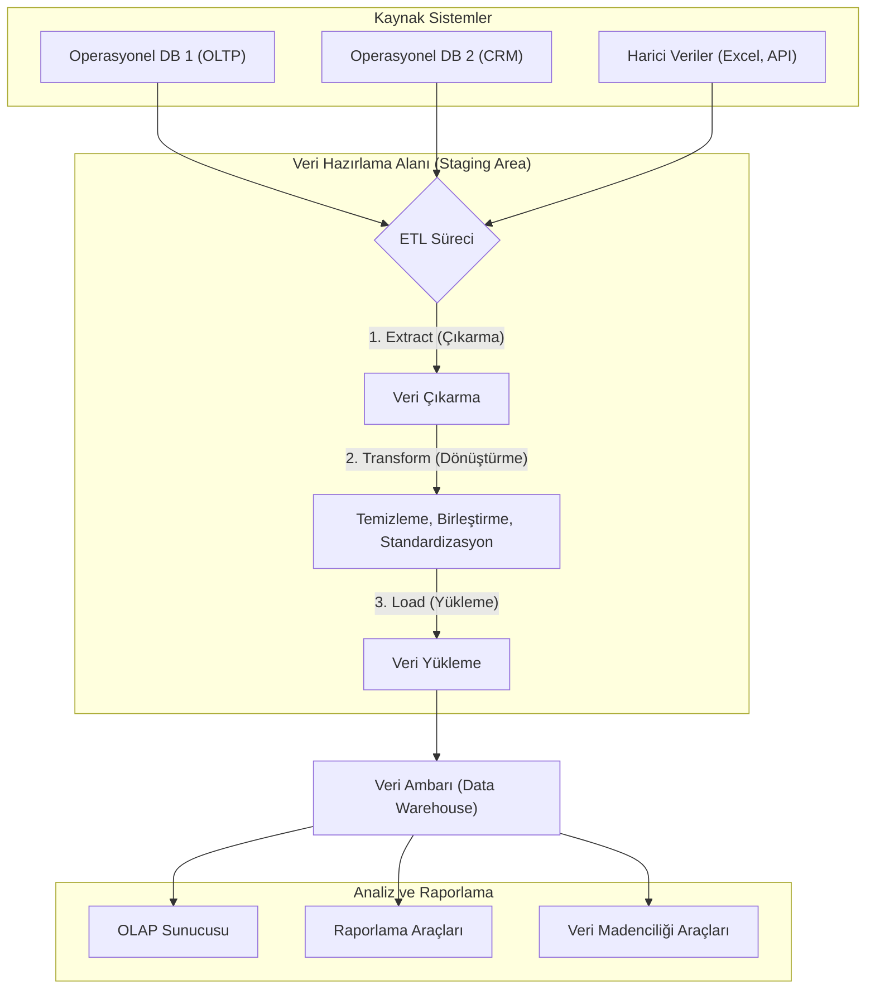
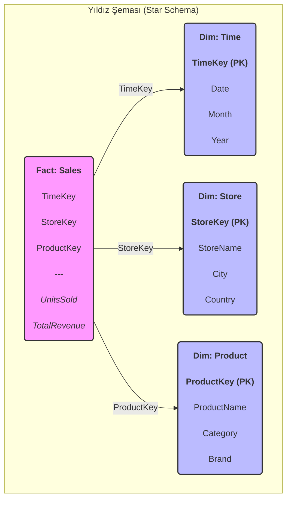
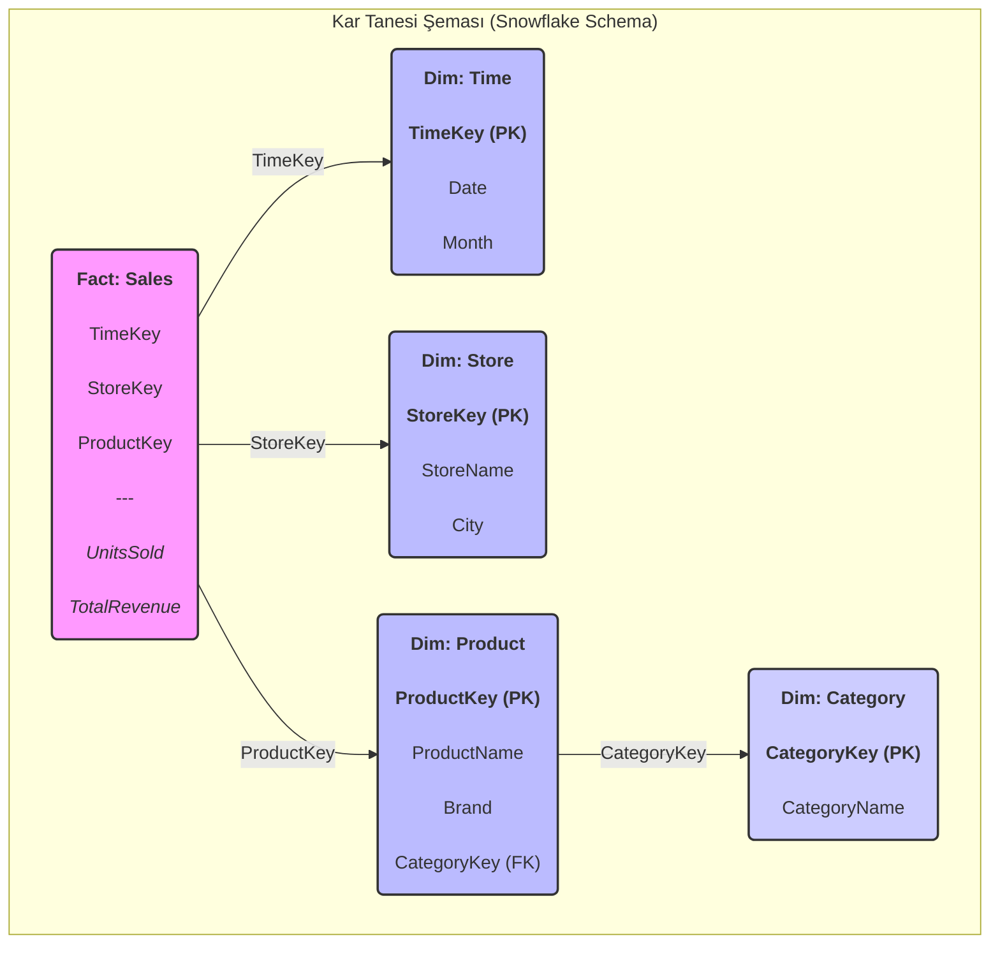
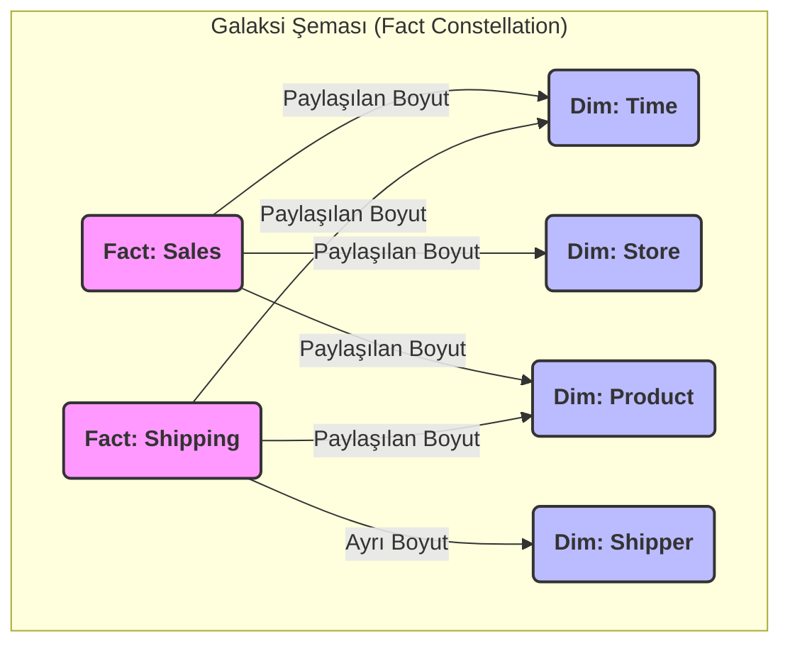
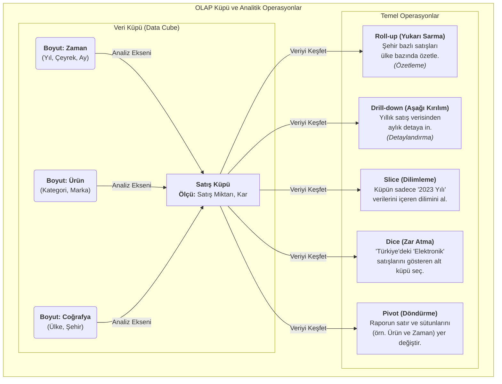
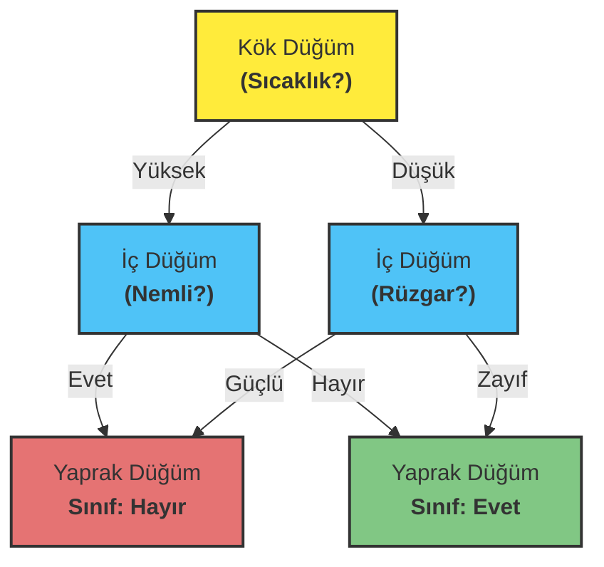

# VERİ MADENCİLİĞİ (DATA MINING)  
**Ders Kodu:** BMSB403  
**Hazırlayan:** Ph.D. Erkan ÖZHAN  
Tekirdağ Namık Kemal Üniversitesi  
Çorlu Mühendislik Fakültesi  
Bilgisayar Mühendisliği Bölümü  
2022.v13-5  

E-posta: erkanozhan@gmail.com / eozhan@nku.edu.tr  
Tel: +90 282 250 23 84  

---

## Veri Nedir? (What is Data?)
- **Dijital Veri**
- **Basılı – Fiziksel Veri**
- **Soyut Veri**

### Veri Türleri:
- Doküman, Resim, Ses, Video, Metin, Program  
- Gazete, Dergi, Kitap, Afiş vb.  
- Tecrübeler, Hatıralar, Hayaller …

---

## Veri Kaynakları
- Marketler  
- Kurumlar  
- Konuşmalar  
- Hastaneler  
- Eğitim Kurumları  
- Laboratuvarlar  
- Turnikeler  
- Otoyol Geçiş Sistemleri  
- Sensörler  
- Facebook, Twitter  
- E-Mailler  
- Otomasyon Sistemleri  

---

## Veri Kaynaklarının Gelişimi
Otomatize edilmiş veri toplama araçları ve “olgunlaşmış” veritabanları; veri ambarlarında ve diğer bilgi depolama alanlarında devasa miktarda verinin birikmesine sebep olmuştur.  

- **Veri Üretimi:** Günümüzde her gün milyarlarca gigabayt veri üretilmektedir. 2025 yılına kadar küresel veri miktarının 175 zettabayta ulaşması beklenmektedir.
- **Depolama Gelişmeleri:** Depolama maliyetleri düşmeye devam ederken, bu devasa veri yığınlarını saklama kapasitemiz sürekli artmaktadır.
- **Sonuç:** Veri bolluğu içindeyiz, ancak asıl ihtiyaç duyduğumuz şey bu veriden anlamlı bilgi (knowledge) ve içgörü (insight) elde etmektir. 

Jerome Friedman:  
> “Verinin boyutu her 10 katına çıktığında, onu analiz etme biçimimizi tamamen yeniden şekillendirmek zorundayız.”  

## Veri Madenciliği (Data Mining)

Veri madenciliği, veri tabanı sorgularından (**database query**) farklıdır.  

### Veritabanı Sorgusu (Geleneksel Analiz)
- "Geçen ay en çok hangi ürün satıldı?"
- "İstanbul'daki müşterilerimizin ortalama yaşı kaçtır?"
- "Son üç ayda kaç yeni müşteri kazandık?"  

### Veri Madenciliği Analizi (Keşif ve Tahmin)
Veri madenciliği, verinin derinliklerindeki gizli örüntüleri, ilişkileri ve gelecek trendlerini ortaya çıkarmayı hedefler.

- **Birliktelik Analizi:** "Hangi ürünler genellikle birlikte satın alınır?" (Örn: Bebek bezi alan müşteriler bira da alır mı?)
- **Tahminleme (Sınıflandırma):** "Hangi müşterilerin önümüzdeki 3 ay içinde aboneliklerini iptal etme olasılığı yüksektir?"
- **Kümeleme:** "Müşterilerimizi satın alma davranışlarına göre hangi doğal gruplara (segmentlere) ayırabiliriz?"
- **Anomali Tespiti:** "Hangi kredi kartı işlemleri sahtekarlık şüphesi taşımaktadır?"
- **Tavsiye Sistemleri:** "A ürününü satın alan bir müşteriye başka hangi ürünleri önermeliyiz?"

---

## Veri Madenciliği Modelleri
Veri madenciliğinin temel amacı, verinin içindeki gizli örüntüleri ve ilişkileri keşfetmek için modeller oluşturmaktır. Bu modeller, açıkça kodlanmış kurallara dayanmak yerine, veriden otomatik olarak öğrenilir ve genellikle iki ana kategoriye ayrılır:

1.  **Tahminleyici (Predictive) Modeller:**
    - Gelecekteki veya bilinmeyen olayların sonucunu tahmin etmek için kullanılır.
    - **Örnekler:** Bir müşterinin bir ürünü satın alıp almayacağını tahmin eden **sınıflandırma** modelleri veya bir evin gelecekteki fiyatını tahmin eden **regresyon** modelleri.

2.  **Betimleyici (Descriptive) Modeller:**
    - Verideki doğal gruplamaları, ilişkileri veya aykırı durumları bulmaya odaklanır.
    - **Örnekler:** Müşterileri benzer satın alma alışkanlıklarına göre gruplayan **kümeleme** modelleri, birlikte sıkça satın alınan ürünleri belirleyen **birliktelik kuralları** veya sahtekarlık tespiti için kullanılan **anomali tespiti** modelleri.

---

## Veri Madenciliği, Makine Öğrenmesi ve İstatistik İlişkisi
Veri madenciliği, makine öğrenmesi ve istatistik birbiriyle yakından ilişkili, sıklıkla iç içe geçmiş alanlardır. Veri madenciliği, bu disiplinlerden gelen yöntemleri pratik problemlere uygulama sürecidir.

-   **İstatistik (Statistics):**
    -   Veri madenciliğinin teorik temelini oluşturur.
    -   Veriyi anlama, özetleme, hipotez test etme ve sonuçların güvenilirliğini ölçme gibi konulara odaklanır.
    -   Örnekleme, olasılık teorisi ve modelleme gibi klasik yöntemler sunar. Temel amacı, veriden çıkarım (inference) yapmaktır.

-   **Makine Öğrenmesi (Machine Learning):**
    -   Veri madenciliğinin algoritmik motorudur. Bilgisayar bilimi ve yapay zekanın bir alt dalıdır.
    -   Büyük veri setleri üzerinde verimli bir şekilde çalışabilen algoritmalar geliştirmeye odaklanır.
    -   Açıkça programlanmadan, veriden öğrenerek tahminler veya kararlar üreten sistemler oluşturur. Sınıflandırma, regresyon, kümeleme gibi algoritmalar bu alandan gelir. Temel amacı, tahminsel doğruluktur (predictive accuracy).

-   **Veri Madenciliği (Data Mining):**
    -   İstatistik ve makine öğrenmesi tekniklerini kullanarak büyük veri yığınları içindeki **anlamlı, yeni ve potansiyel olarak faydalı** örüntüleri keşfetme sürecidir.
    -   Odak noktası, keşfedilen bilgiyi pratik ve işlevsel bir içgörüye dönüştürmektir.
    -   Genellikle "Veritabanlarında Bilgi Keşfi" (Knowledge Discovery in Databases - KDD) sürecinin bir adımı olarak kabul edilir.

**Özetle:**
-   **İstatistik** "Neden?" sorusuna odaklanarak verinin altındaki yapıyı ve güvenilirliği anlamaya çalışır.
-   **Makine Öğrenmesi** "Nasıl?" sorusuna odaklanarak veriden öğrenen ve doğru tahminler yapan algoritmalar geliştirir.
-   **Veri Madenciliği** ise bu araçları kullanarak "Ne?" sorusuna cevap arar: "Veride hangi gizli ve değerli örüntüler var?" 

---

## Veri Madenciliğinin Önemi ve Uygulama Alanları

Veri madenciliği, ham veriyi iş zekasına, bilimsel keşiflere ve stratejik karar alma süreçlerine dönüştüren kritik bir disiplindir. Önemi, sadece büyük veri yığınlarını analiz etme kapasitesinden değil, aynı zamanda bu verilerden daha önce bilinmeyen, eyleme geçirilebilir ve değerli bilgiler çıkarma yeteneğinden kaynaklanır. Bu süreç, çeşitli sektörlerde devrim yaratmıştır:

-   **İşletme ve Pazarlama:**
    -   **Müşteri Segmentasyonu:** Müşterileri demografik bilgilere, satın alma alışkanlıklarına veya davranışlarına göre gruplayarak hedefli pazarlama stratejileri geliştirilir.
    -   **Pazar Sepeti Analizi (Birliktelik Kuralları):** Hangi ürünlerin birlikte satın alındığını tespit ederek raf düzenlemeleri, çapraz satış (cross-selling) ve promosyon kampanyaları optimize edilir.
    -   **Müşteri Kaybı (Churn) Analizi:** Bir hizmeti terk etme olasılığı yüksek olan müşterileri önceden belirleyerek onları elde tutmaya yönelik proaktif adımlar atılır.

-   **Finans ve Bankacılık:**
    -   **Sahtekarlık Tespiti (Fraud Detection):** Kredi kartı işlemlerindeki veya sigorta taleplerindeki anormal ve şüpheli örüntüleri tespit ederek finansal kayıplar önlenir.
    -   **Kredi Riski Değerlendirmesi:** Başvuru sahiplerinin kredi geçmişini ve diğer özelliklerini analiz ederek geri ödeme olasılıklarını tahmin eder ve kredi kararlarını destekler.

-   **Sağlık ve Biyoinformatik:**
    -   **Hastalık Teşhisi ve Tahmini:** Tıbbi verileri (görüntüler, laboratuvar sonuçları, hasta geçmişi) analiz ederek hastalıkların erken teşhisine yardımcı olur ve tedavi sonuçlarını tahmin eder.
    -   **Genomik Veri Analizi:** Gen dizilimlerindeki örüntüleri keşfederek genetik hastalıklara yatkınlığı belirler ve kişiselleştirilmiş tıp uygulamalarına zemin hazırlar.

-   **Web ve E-Ticaret:**
    -   **Tavsiye Sistemleri (Recommendation Systems):** Kullanıcıların geçmiş davranışlarına dayanarak onlara ilgi duyabilecekleri ürün, film veya içerikleri önerir, böylece kullanıcı deneyimini ve satışları artırır.
    -   **Web Kullanım Madenciliği:** Web sitesi ziyaretçilerinin gezinme yollarını analiz ederek site tasarımını ve kullanıcı arayüzünü iyileştirir.

Bu uygulamalar, veri madenciliğinin sadece teorik bir alan olmadığını, aynı zamanda kuruluşların daha akıllı kararlar almasını, verimliliği artırmasını ve rekabet avantajı elde etmesini sağlayan güçlü bir pratik araç olduğunu göstermektedir.

## Veri Madenciliği (Data Mining)

### Tanım
Veri madenciliği, çeşitli akademik kaynaklarda farklı şekillerde tanımlanmakla birlikte, temel olarak büyük veri setleri içindeki değerli bilgiyi keşfetme sürecini ifade eder.

- **Fayyad, Piatetsky-Shapiro, & Smyth (1996)** tarafından yapılan klasik tanıma göre veri madenciliği, "veri içerisindeki **geçerli, yeni, potansiyel olarak kullanışlı** ve nihayetinde **anlaşılabilir** örüntülerin önemsiz olmayan (non-trivial) çıkarım sürecidir." Bu tanım, sürecin sadece veri işlemeyi değil, aynı zamanda keşfedilen bilginin niteliğini de vurgular.
- **Han, Kamber, & Pei (2012)** ise veri madenciliğini, "büyük miktardaki veriden ilginç örüntüleri ve bilgiyi keşfetme süreci" olarak daha geniş bir perspektiften ele alır. Bu süreç, veritabanları, veri ambarları, web ve diğer bilgi havuzlarını kapsar.
- Temel amaç, veriden öğrenen bir **model** oluşturmaktır. Bu model, veriyi özetler ve gelecekteki olayları tahmin etmek (tahminleyici model) veya verinin iç yapısını anlamak (betimleyici model) için kullanılır. Keşfedilen bu yapılar genellikle **model** veya **örüntü (pattern)** olarak adlandırılır.

---
## Veritabanlarında Bilgi Keşfi (Knowledge Discovery in Databases - KDD)

Veritabanlarında Bilgi Keşfi (KDD), ham veri yığınları içerisinden **geçerli, yeni, potansiyel olarak faydalı ve nihayetinde anlaşılabilir** örüntüleri bulmaya yönelik **önemsiz olmayan (non-trivial)** ve bütünsel bir süreçtir. KDD, veri madenciliğini de içeren çok adımlı bir metodoloji olarak kabul edilir ve veriden bilgiye giden yol haritasını çizer.

### KDD Sürecinin Adımları
KDD süreci, genellikle aşağıdaki ardışık adımlardan oluşur:

1.  **Veri Seçimi (Selection):** Analiz hedefine uygun olarak, ilgili veri kaynaklarından (veritabanları, veri ambarları vb.) bir hedef veri kümesi oluşturulur.
2.  **Ön İşleme (Preprocessing):** Veri kalitesini artırmak için en kritik adımlardan biridir. Bu aşamada gürültülü veriler temizlenir, eksik değerler yönetilir ve tutarsızlıklar giderilir.
3.  **Dönüşüm (Transformation):** Veri, madencilik algoritmalarının uygulanmasına uygun hale getirmek için dönüştürülür. Bu, boyut indirgeme, öznitelik mühendisliği (feature engineering) ve normalizasyon gibi teknikleri içerebilir.
4.  **Veri Madenciliği (Data Mining):** Sürecin çekirdek adımıdır. Belirli bir amaç doğrultusunda (örn. sınıflandırma, kümeleme) akıllı algoritmalar kullanılarak veri içerisindeki örüntüler sistematik olarak çıkarılır.
5.  **Yorumlama ve Değerlendirme (Interpretation & Evaluation):** Keşfedilen örüntülerin ve modellerin, başlangıçtaki hedeflerle ne kadar uyumlu olduğu değerlendirilir. Anlamlı bulunan bilgiler görselleştirilerek veya raporlanarak karar vericiler için eyleme geçirilebilir bilgiye dönüştürülür.

### Keşfedilen Bilginin Nitelikleri
KDD sürecinin nihai hedefi, sadece herhangi bir örüntü bulmak değil, aşağıdaki niteliklere sahip olan **bilgiyi** ortaya çıkarmaktır:

-   **Örtük (Implicit):** Basit sorgularla veya geleneksel analiz yöntemleriyle kolayca bulunamayan, verinin derinliklerinde saklı olan.
-   **Geçerli (Valid):** Sadece analiz edilen veri setinde değil, yeni veriler üzerinde de belirli bir güvenilirlik derecesiyle genellenebilir olan.
-   **Yeni ve Özgün (Novel):** Daha önceden bilinmeyen, şaşırtıcı ve beklentilerin ötesinde olan.
-   **Potansiyel Olarak Faydalı (Potentially Useful):** Stratejik bir avantaj sağlayan, karar alma süreçlerini iyileştiren veya bir hedefe ulaşmak için eyleme geçirilebilen.
-   **Anlaşılabilir (Understandable):** Alan uzmanları veya son kullanıcılar tarafından kolayca yorumlanabilen ve anlamlandırılabilen.

---
## Veri Madenciliği ve KDD Arasındaki İlişki

Veri madenciliği, sıklıkla KDD süreciyle eş anlamlı olarak kullanılsa da, metodolojik olarak KDD'nin yalnızca bir adımıdır; ancak en merkezi adımıdır. KDD, veriden bilgiye ulaşmayı hedefleyen bütünsel bir metodoloji iken, veri madenciliği bu sürecin içerisinde belirli algoritmalar kullanarak örüntülerin fiilen çıkarıldığı analitik aşamayı temsil eder. Kısacası, KDD "bilgi keşfi"nin stratejik yol haritasını çizerken, veri madenciliği bu haritadaki en önemli "keşif" eylemidir.

### Efor Dağılımı ve Geleneksel Yöntemlerin Rolü
Uygulamada, bir KDD projesinde harcanan zaman ve eforun büyük bir kısmı—genellikle %80'e varan bir oranı—veri madenciliği adımından önceki hazırlık aşamalarına (veri seçimi, ön işleme ve dönüşüm) ayrılır. Bunun temel nedeni, gerçek dünya verilerinin genellikle "kirli" (eksik, gürültülü, tutarsız) olmasıdır. Veri madenciliği algoritmalarının başarısı, doğrudan girdi verisinin kalitesine bağlıdır. "Çöp girer, çöp çıkar" (Garbage In, Garbage Out) prensibi, bu aşamanın kritik önemini vurgular.

KDD sürecinin başlangıcında, genellikle standart veritabanı sorgulama dilleri (SQL) ve Çevrimiçi Analitik İşleme (OLAP) araçları ile bir ön analiz yapılır. Bu araçlar, veritabanında açıkça var olan bilgileri özetlemek, filtrelemek ve raporlamak için son derece güçlüdür. Ancak bu geleneksel yöntemler, verinin derinliklerindeki örtük, daha önce bilinmeyen ve tahmine dayalı ilişkileri ortaya çıkarmada yetersiz kalır. İşte bu noktada veri madenciliği devreye girer ve SQL'in cevaplayamadığı sorulara odaklanır:

-   **Birliktelik Analizi:** "Hangi ürünler genellikle birlikte satın alınır?" (SQL ile bu soruyu sormak için önce hangi ürünleri karşılaştıracağınızı bilmeniz gerekir; veri madenciliği ise bu ilişkileri otomatik olarak keşfeder.)
-   **Sınıflandırma ve Tahmin:** "Bir müşterinin kredi başvurusunun riskli olup olmadığını hangi özelliklere bakarak tahmin edebilirim?" (Bu, geleceğe yönelik bir tahmin gerektirir ve veriden öğrenen bir model oluşturulmasını zorunlu kılar.)

Özetle, SQL ve OLAP mevcut veriyi "sorgularken", veri madenciliği verinin kendisine "soru sormasını" sağlayarak gizli içgörüleri ve geleceğe yönelik modelleri keşfeder.

## Operasyonel Veritabanları ve Veri Ambarları

Veri analizi ve karar destek sistemleri bağlamında, operasyonel veritabanları ile veri ambarları arasında temel mimari ve amaç farklılıkları bulunmaktadır.

### Operasyonel Veritabanı Sistemleri (OLTP)
Operasyonel sistemler, bir kuruluşun günlük işlemlerini yürütmek için tasarlanmış **Çevrimiçi İşlem Gerçekleştirme (Online Transaction Processing - OLTP)** sistemleridir.

-   **Temel Amaç:** Günlük ticari işlemleri (ekleme, silme, güncelleme) hızlı ve tutarlı bir şekilde kaydetmek ve yönetmektir.
-   **Veri Yapısı:** Veri bütünlüğünü sağlamak ve tekrarı önlemek amacıyla genellikle yüksek derecede normalize edilmiş (Üçüncü Normal Form - 3NF) ilişkisel tablolardan oluşur.
-   **Kullanıcılar:** Genellikle son kullanıcılar, kasiyerler veya veri giriş operatörleridir.
-   **Odak Noktası:** Anlık, güncel veriler üzerindedir. Örneğin, bir bankacılık sistemindeki anlık bakiye veya bir e-ticaret sitesindeki mevcut stok durumu.

### Veri Ambarları (Data Warehouses - DW)
Veri ambarı, farklı operasyonel kaynaklardan toplanan verilerin analiz ve karar destek amacıyla bütünleştirildiği merkezi bir depodur. Bu sistemler **Çevrimiçi Analitik İşleme (Online Analytical Processing - OLAP)** için optimize edilmiştir.

**Tanım (W. H. Inmon):** Veri ambarı; stratejik karar almayı desteklemek amacıyla tasarlanmış, **konu odaklı (subject-oriented)**, **bütünleşik (integrated)**, **zamana göre değişen (time-variant)** ve **kalıcı (non-volatile)** bir veri koleksiyonudur.

-   **Konu Odaklı:** Veriler, "müşteri," "ürün," "satış" gibi analitik konular etrafında organize edilir.
-   **Bütünleşik:** Farklı kaynaklardan (örn. satış veritabanı, pazarlama Müşteri İlişkileri Yönetimi (Customer Relationship Management - CRM)) gelen veriler, tutarlı bir formatta birleştirilir ve standartlaştırılır.
-   **Zamana Göre Değişen:** Veriler, tarihsel bir perspektif sunacak şekilde (örn. son 5 yılın satış verileri) saklanır. Bu, trend analizini mümkün kılar.
-   **Kalıcı:** Veri ambarına yüklenen veriler genellikle değiştirilmez veya silinmez. Sadece periyodik olarak yeni veriler eklenir.

### OLTP ve Veri Ambarı Karşılaştırması

| Özellik | OLTP Sistemleri (Operasyonel Veritabanı) | Veri Ambarı (OLAP için) |
| :--- | :--- | :--- |
| **Ana Amaç** | Günlük işlemleri yürütme | Stratejik karar verme ve analiz |
| **Veri İçeriği** | Anlık, güncel ve detaylı veri | Tarihsel, özetlenmiş ve birleştirilmiş veri |
| **Veri Yapısı** | Yüksek derecede normalize (örn. 3NF) | Denormalize, çok boyutlu (örn. Yıldız, Kar Tanesi) |
| **Odak** | İşlem (Transaction) odaklı | Analiz (Query) odaklı |
| **Erişim Türü** | Sık okuma/yazma işlemleri | Yoğunlukla okuma, karmaşık sorgular |
| **Kullanıcılar** | Veri giriş operatörleri, son kullanıcılar | Bilgi çalışanları, analistler, yöneticiler |

### Veri Ambarı Mimarisi ve ETL Süreci

Veri ambarları, çeşitli kaynaklardan veri toplayan ve bu veriyi analize uygun hale getiren bir **Ayıklama, Dönüştürme, Yükleme (Extract, Transform, Load - ETL)** süreci üzerine kuruludur.

1.  **Çıkarma (Extract):** Farklı operasyonel veritabanları ve harici kaynaklardan (örn. Uygulama Programlama Arayüzü - Application Programming Interface - API) ilgili veriler çekilir.
2.  **Dönüştürme (Transform):** Veriler temizlenir (eksik değerler doldurulur, tutarsızlıklar giderilir), birleştirilir ve veri ambarının standart şemasına uygun hale getirilir.
3.  **Yükleme (Load):** Dönüştürülmüş ve hazır hale getirilmiş veri, analiz edilmek üzere veri ambarına yüklenir.

### Meta Veri (Metadata)

**Tanım:** En basit tanımıyla meta veri, **"veri hakkında veri"** demektir. Veri ambarındaki verinin ne anlama geldiğini, nereden geldiğini, nasıl yapılandırıldığını ve nasıl kullanılacağını açıklayan bir tür "veri sözlüğü" veya "kullanım kılavuzu"dur. Ham veriye bağlam ve anlam kazandırır.

Meta veri, aşağıdaki gibi sorulara yanıt verir:
-   Bu verinin adı nedir? (`Satis_Miktari`)
-   Veri türü nedir? (Sayısal, metin, tarih vb.)
-   Hangi tablodan veya sistemden geliyor? (Kaynak)
-   En son ne zaman güncellendi?
-   Hesaplanmış bir alan ise formülü nedir?

**Örnek:**
Bir satış tablosunda `150` şeklinde bir değer olduğunu düşünelim. Bu değer tek başına bir anlam ifade etmez. Ancak meta verisi ile birlikte anlam kazanır:

-   **Veri (Data):** `150`
-   **Meta Veri (Metadata):**
    -   **Öznitelik Adı:** `Satis_Adedi`
    -   **Açıklama:** "Tek bir işlemde satılan ürün sayısı"
    -   **Veri Tipi:** `Tamsayı (Integer)`
    -   **Kaynak Tablo:** `Gunluk_Satislar`
    -   **Geçerli Aralık:** `1 - 500`

Bu meta veri sayesinde `150` değerinin, `Gunluk_Satislar` tablosundaki bir satış işleminde 150 adet ürün satıldığını ifade eden bir tamsayı olduğunu anlarız. Meta veri olmadan, veri yığınları anlamsız sayılardan ibaret kalır.

### Veri Ambarı Şemaları: Veriyi Anlamlandırma Sanatı

Veri ambarında veriler, analiz sorgularını hızlı ve verimli bir şekilde çalıştıracak şekilde özel yapılarla organize edilir. Bu yapılara **şema** denir. En yaygın kullanılan üç şema türü Yıldız, Kar Tanesi ve Galaksi (Fact Constellation) şemalarıdır.

#### 1. Yıldız Şeması (Star Schema)

En basit ve en yaygın kullanılan veri ambarı şemasıdır. Adını, yapısının bir yıldıza benzemesinden alır: merkezde bir **olgu (fact) tablosu** ve bu tabloya doğrudan bağlı olan **boyut (dimension) tabloları** bulunur.

-   **Olgu Tablosu (Fact Table):** İşletmenin sayısal ölçümlerini (satış adedi, gelir, maliyet gibi) ve boyut tablolarına ait yabancı anahtarları (foreign keys) içerir. İş süreçlerinden ölçülen nicel verileri (sayısal değerleri, metrikleri) tutan tablodur.
-   **Boyut Tabloları (Dimension Tables):** Olgu tablosundaki verilere bağlam kazandıran tanımlayıcı bilgileri (ürün adı, müşteri bilgisi, tarih detayları gibi) içerir. Boyut tabloları **denormalize** edilmiştir, yani ilgili tüm bilgiler tek bir tabloda toplanır.

**Avantajları:**
-   **Basitlik:** Anlaşılması ve sorgulanması kolaydır.
-   **Performans:** Daha az `JOIN` işlemi gerektirdiği için sorgular genellikle çok hızlı çalışır.

#### 2. Kar Tanesi Şeması (Snowflake Schema)

Yıldız şemasının bir uzantısıdır. Temel fark, boyut tablolarının **normalize** edilmiş olmasıdır. Yani, bir boyut tablosu, veri tekrarını azaltmak için daha küçük ve ilişkili birden fazla tabloya bölünür. Bu yapı, bir kar tanesinin dallanmış kristal yapısına benzediği için bu adı almıştır.

**Avantajları:**
-   **Veri Bütünlüğü:** Normalizasyon sayesinde veri tekrarı azalır ve depolama alanı daha verimli kullanılır.
-   **Bakım Kolaylığı:** Hiyerarşik yapıların yönetimi daha kolaydır (örn. Ürün -> Kategori -> Departman).

**Dezavantajları:**
-   **Sorgu Karmaşıklığı:** Daha fazla tablo olduğu için sorgular daha fazla `JOIN` işlemi gerektirir, bu da performansı düşürebilir.

#### 3. Galaksi Şeması / Fact Constellation Şeması

İki veya daha fazla olgu tablosunun, ortak boyut tablolarını paylaştığı daha karmaşık bir yapıdır. Bu şema, birbiriyle ilişkili farklı iş süreçlerini (örneğin, satış ve sevkiyat) tek bir modelde analiz etmek için kullanılır. Yapı, birden fazla yıldızın bir araya gelerek bir galaksi oluşturmasına benzetilir.

**Avantajları:**
-   **Esneklik:** Farklı iş süreçleri arasında entegre analiz yapma imkanı sunar.
-   **Yeniden Kullanılabilirlik:** Boyut tabloları birden fazla olgu tablosu tarafından paylaşıldığı için tutarlılık ve verimlilik artar.

### Şema Karşılaştırması

| Özellik | Yıldız Şeması (Star) | Kar Tanesi Şeması (Snowflake) | Galaksi Şeması (Fact Constellation) |
| :--- | :--- | :--- | :--- |
| **Yapı** | Merkezi bir olgu tablosu, etrafında boyut tabloları | Yıldız şemasının normalize edilmiş hali | Birden fazla olgu tablosu, paylaşılan boyutlar |
| **Normalizasyon** | Boyutlar denormalize (tek tablo) | Boyutlar normalize (çoklu tablo) | Boyutlar genellikle denormalize |
| **Sorgu Performansı** | Yüksek (az `JOIN`) | Daha Düşük (çok `JOIN`) | Değişken (sorguya bağlı) |
| **Veri Bütünlüğü** | Daha düşük (veri tekrarı olabilir) | Yüksek (veri tekrarı az) | Yüksek (paylaşılan boyutlar sayesinde) |
| **Kullanım Alanı** | Çoğu veri ambarı ve veri pazarı (data mart) | Karmaşık hiyerarşilere sahip veri modelleri | Birbiriyle ilişkili birden fazla iş sürecinin analizi |

### Veri Pazarı (Data Mart)
Veri pazarı, kurumsal bir veri ambarının belirli bir departmana (örneğin Satış, Pazarlama) veya iş koluna odaklanmış daha küçük bir alt kümesidir. Amacı, belirli bir kullanıcı grubunun ihtiyaç duyduğu veriye daha hızlı ve kolay erişim sağlamaktır. Veri ambarının tamamı yerine sadece ilgili veri setini içerdiği için daha yönetilebilir, daha hızlı kurulabilir ve daha düşük maliyetlidir. Verilerini merkezi bir veri ambarından veya doğrudan operasyonel kaynaklardan alabilir.  

   - **Galaxy Şeması (Galaxy Schema):**  
     - Çok sayıda kar tanesi şemasının birleşiminden oluşur.  
     - Koleksiyon veya nitelik tablosu gibi düşünülebilir.  
     - Büyük ölçekli sistemlerde tercih edilir.  

---
### OLAP (Çevrimiçi Analitik İşleme - Online Analytical Processing)

OLAP, büyük veri ambarlarındaki verilerin, iş analistleri ve yöneticiler tarafından hızlı, tutarlı ve etkileşimli bir şekilde çok boyutlu olarak analiz edilmesini sağlayan bir teknolojidir. Geleneksel veritabanı sorguları (OLTP sistemlerinde olduğu gibi) veriyi genellikle iki boyutlu (satırlar ve sütunlar) bir yapıda sunarken, iş dünyasındaki sorular genellikle çok daha fazla boyuta sahiptir ("Geçen çeyrekte, Avrupa bölgesindeki hangi mağazalarda, hangi ürün kategorisi en çok kar getirdi?"). OLAP, bu tür karmaşık ve çok boyutlu analitik sorguları saniyeler içinde yanıtlamak için tasarlanmıştır.

#### OLAP Küpü ve Temel Operasyonlar

OLAP'ın temelinde **Veri Küpü (Data Cube)** adı verilen çok boyutlu bir veri yapısı bulunur. Bu küp, analiz edilmek istenen sayısal verileri (**ölçüler - measures**, örn. satış miktarı, kar) ve bu verilerin analiz edileceği farklı bakış açılarını (**boyutlar - dimensions**, örn. zaman, coğrafya, ürün) bir araya getirir. Kullanıcılar, bu küp üzerinde çeşitli operasyonlar gerçekleştirerek veriyi farklı açılardan inceleyebilir, özetleyebilir veya detaylandırabilir.

-   **Roll-up (Yukarı Sarma):** Veriyi bir boyut hiyerarşisi boyunca yukarı doğru özetler. Örneğin, şehir bazındaki satış verilerini toplayarak ülke bazında bir özet oluşturur.
-   **Drill-down (Aşağı Kırılım):** Özetlenmiş veriden daha detaylı seviyelere inmeyi sağlar. Örneğin, yıllık satış rakamlarından çeyrek veya ay bazındaki detaylara ulaşmak.
-   **Slice (Dilimleme):** Küpten tek bir boyut değeri seçerek iki boyutlu bir "dilim" alır. Örneğin, `Zaman = '2023'` dilimini alarak sadece o yıla ait satışları inceler.
-   **Dice (Zar Atma):** Birden fazla boyut üzerinde seçim yaparak daha küçük bir alt küp oluşturur. Örneğin, `Coğrafya = 'Türkiye'` VE `Ürün Kategorisi = 'Elektronik'` olan verileri seçer.
-   **Pivot (Döndürme):** Veri küpünün eksenlerini döndürerek veriye farklı bir perspektiften bakmayı sağlar. Örneğin, satırlarda ürünleri, sütunlarda zamanı gösteren bir raporu, satırlarda zamanı, sütunlarda ürünleri gösterecek şekilde değiştirir.

#### OLAP'ın Temel Özellikleri ve Mimarisi

OLAP sistemleri, ham veriyi anlamlı iş bilgisine dönüştürmek için tasarlanmış güçlü analitik motorlardır. Başarıları, aşağıdaki temel özelliklere ve mimari bileşenlere dayanır:

-   **Çok Boyutlu Analiz (Multidimensional Analysis):** OLAP, veriyi geleneksel iki boyutlu (satır/sütun) tablolardan kurtararak, iş dünyasının doğal çok boyutlu yapısını yansıtan küplerde sunar. Bu sayede analistler, veriyi "kim, ne, nerede, ne zaman" gibi farklı iş eksenleri etrafında serbestçe inceleyebilir.
-   **Hızlı Sorgu Performansı:** OLAP sistemleri, karmaşık analitik sorgulara saniyeler içinde yanıt vermek üzere optimize edilmiştir. Bu hızı, verileri önceden hesaplayıp özetleyerek (pre-aggregation), özel indeksleme teknikleri kullanarak ve sonuçları önbelleğe alarak sağlarlar.
-   **Etkileşimli Keşif ve Raporlama:** Kullanıcıların `Roll-up`, `Drill-down` gibi operasyonlarla veri üzerinde etkileşimli olarak gezinmesine olanak tanır. Bu, statik raporlar yerine dinamik bir "keşif" süreci sunar.
-   **İş Odaklı Bakış Açısı:** Teknik veritabanı terminolojisi yerine, "Ürün Kategorisi", "Satış Bölgesi", "Toplam Gelir" gibi anlaşılır iş terimleri kullanır. Bu da teknik olmayan kullanıcıların bile sistemi kolayca kullanabilmesini sağlar.

---

### OLAP Mimarisi: Küpler, Boyutlar ve Ölçüler

OLAP'ın kalbinde, veriyi sezgisel ve analize uygun bir şekilde organize eden üç temel bileşen bulunur:

1.  **Veri Küpü (Data Cube):**
    -   OLAP mimarisinin temel veri yapısıdır. Fiziksel bir küp olmak zorunda değildir; daha çok, verinin çok boyutlu bir mantıksal modelidir.
    -   İşletmenin analiz etmek istediği sayısal metrikleri (ölçüleri), bu metrikleri tanımlayan ve bağlam kazandıran iş kategorileriyle (boyutlarla) birleştirir.

2.  **Boyutlar (Dimensions):**
    -   Bir ölçüye bağlam kazandıran, "kim, ne, nerede, ne zaman" gibi sorulara yanıt veren nitel (kategorik) verilerdir. Boyutlar, veriyi nasıl dilimlemek, filtrelemek ve gruplamak istediğimizi belirler.
    -   **Hiyerarşi (Hierarchy):** Boyutlar genellikle doğal bir hiyerarşiye sahiptir. Bu yapı, kullanıcıların özet veriden detaya (Drill-down) veya detaydan özete (Roll-up) kolayca geçmesini sağlar.
        -   **Örnek Zaman Hiyerarşisi:** `Yıl` → `Çeyrek` → `Ay` → `Gün`
        -   **Örnek Coğrafya Hiyerarşisi:** `Ülke` → `Bölge` → `Şehir`

3.  **Ölçüler (Measures):**
    -   Analiz edilen nicel (sayısal) değerlerdir. Genellikle olgu tablosundaki (fact table) bir sütundan türetilirler ve `SUM`, `COUNT`, `AVERAGE`, `MIN`, `MAX` gibi toplama fonksiyonları ile özetlenirler.
    -   Ölçüler, boyutlar tarafından dilimlendiğinde anlam kazanan iş metrikleridir.
        -   **Örnek Ölçüler:** `Toplam Satış Tutarı`, `Satılan Ürün Adedi`, `Ortalama Kar Marjı`

| Bileşen | Açıklama | Örnek |
| :--- | :--- | :--- |
| **Boyut (Dimension)** | Veriye bağlam kazandıran **kategorik** bilgiler. "Nasıl bakalım?" sorusunu yanıtlar. | Zaman, Ürün, Müşteri, Coğrafya |
| **Ölçü (Measure)** | Analiz edilen **sayısal** değerler. "Ne kadar?" sorusunu yanıtlar. | Satış Miktarı, Gelir, Maliyet |
 

    

        

        <h2 style="text-align: center;">Karar Ağaçları (Decision Trees)</h2>
        

    

## 1. Giriş ve Temel Kavramlar

Karar ağaçları, veri madenciliği ve makine öğrenmesinde yaygın olarak kullanılan, parametrik olmayan denetimli öğrenme algoritmalarıdır. Bu yöntem, hem sınıflandırma hem de regresyon problemlerinde kullanılabilir ve karmaşık karar süreçlerini görsel olarak anlaşılır bir ağaç yapısında temsil eder.

### 1.1. Temel Özellikler

Karar ağaçlarının başlıca özellikleri şunlardır:

- **Parametrik yapı (Lineer Regresyon):** Bu tür modeller, verinin belirli bir istatistiksel dağılıma (örneğin, normal dağılım) uyduğunu ve değişkenler arasında belirli bir fonksiyonel form (örneğin, doğrusal ilişki) olduğunu varsayar. Örneğin, bir evin fiyatını tahmin eden lineer regresyon modeli, metrekare ile fiyat arasında doğrusal bir ilişki olduğunu varsayar. Veri bu varsayımları karşılamıyorsa modelin performansı düşer.
- **Karar Ağacı (Parametrik olmayan):** Buna karşılık karar ağacı, verinin altta yatan dağılımı hakkında bir varsayımda bulunmaz. Örneğin, bir hastanın hastalık riskini tahmin ederken, kan değerleri (sayısal) ve yaşam tarzı (kategorik) gibi farklı türdeki verileri bir arada kullanır. Model, "eğer kan basıncı > 140 VE sigara kullanıyor ise risk yüksek" gibi kuralları, verinin dağılımını varsaymadan doğrudan veriden öğrenir.
- **Görsel anlaşılabilirlik**: Karar süreçleri ters çevrilmiş bir ağaç yapısında gösterildiğinden, model yorumlanabilirliği oldukça yüksektir.
- **Hibrit veri desteği**: Hem kategorik hem de sayısal değişkenlerle çalışabilir.
- **Doğrusal olmayan ilişkileri yakalama**: Değişkenler arasındaki karmaşık, doğrusal olmayan etkileşimleri modelleyebilir.

## 2. Karar Ağacının Yapısal Bileşenleri

Aşağıda, karar ağacının temel yapısını gösteren renkli bir diyagram yer almaktadır:

Bu diyagramda:
- **Sarı**: Kök düğüm (ilk karar noktası)
- **Mavi**: İç düğümler (ara karar noktaları)
- **Yeşil**: Pozitif sınıfı temsil eden yaprak düğüm
- **Kırmızı**: Negatif sınıfı temsil eden yaprak düğüm

Karar ağacı, veriyi dallara ayırarak her yolun sonunda bir karar (sınıf) üretir. Görsel olarak anlaşılır olması, karar süreçlerinin şeffaf ve yorumlanabilir olmasını sağlar.

### 2.1. Düğümler (Nodes)

Karar ağacı üç tür düğümden oluşur:

**a) Kök Düğüm (Root Node)**: Ağacın en üst seviyesinde yer alan ve tüm veri kümesini temsil eden ilk karar noktasıdır. Buradan veri ilk bölünmeye uğrar.

**b) İç Düğümler (Internal Nodes)**: Kök düğüm ile yaprak düğümler arasında yer alan ara karar noktalarıdır. Her iç düğüm, belirli bir öznitelik üzerinde test yaparak veriyi alt gruplara ayırır.

**c) Yaprak Düğümler (Leaf Nodes)**: Ağacın en alt seviyesinde yer alan ve nihai sınıflandırma veya tahmin sonucunu içeren terminal düğümlerdir. Bu düğümlerde artık bölme işlemi yapılmaz.

### 2.2. Dallar (Branches)

Dallar, düğümler arasındaki bağlantıları ve karar sonuçlarını temsil eder. Kök düğümden bir yaprak düğüme kadar uzanan her yol, "eğer-o zaman" (if-then) kuralları şeklinde ifade edilebilen bir sınıflandırma kuralını oluşturur.

**Örnek kural**: Eğer (Sıcaklık = Yüksek) VE (Nemli = Evet) O HALDE (Sınıf = Hayır)

## 3. Karar Ağacı Oluşturma Süreci

### 3.1. Bölme (Splitting)

Karar ağacı oluşturmayı, popüler bir tahmin oyunu olan "Tahmin Et Kim?" oyununa benzetebiliriz. Elinizde bir sürü farklı karakter var ve en az soruyla doğru kişiyi bulmaya çalışıyorsunuz.

En iyi strateji nedir? Öyle bir soru sormak istersiniz ki, karakterleri kabaca ikiye ayırsın. Örneğin, "Karakterin gözlüklü mü?" diye sormak iyi bir başlangıçtır. Bu soru, tüm karakterleri "gözlüklüler" ve "gözlüksüzler" olarak iki gruba ayırır. İşte karar ağacındaki **bölme (splitting)** işlemi tam olarak budur.

Her bölmedeki amaç, oluşturulan yeni grupları daha **saf** hale getirmektir. "Saf" bir grup, içindeki üyelerin neredeyse tamamının aynı sonuca sahip olduğu bir gruptur (örneğin, bir gruptaki herkesin "oyuna evet" demesi gibi). Karar ağacı, veriyi en iyi şekilde bölecek "soruyu" matematiksel olarak bulur ve bu işlemi, her bir dalın sonunda net bir karara varana kadar tekrarlar.

**Bölme Algoritmasının Adımları:**

1.  **En İyi Soruyu Bul (Öznitelik Seçimi):** Tüm değişkenler arasından, veri setini en saf alt gruplara ayıracak olan "en iyi soruyu" (özniteliği) seç. Bu seçim, entropi veya Gini indeksi gibi saflık ölçütleri kullanılarak yapılır.
2.  **Bölünme Kuralını Belirle (Bölme Noktası):** Seçilen öznitelik için en uygun bölünme noktasını bul. Sayısal bir değişken için bu bir eşik değer (örn. `Yaş > 30`), kategorik bir değişken için ise bir kategori (örn. `Şehir = 'İstanbul'`) olabilir.
3.  **Veriyi Parçala (Dallanma):** Belirlenen kurala göre veri setini iki veya daha fazla alt gruba (dala) ayır.
4.  **Tekrarla (Özyinelemeli Süreç):** Her bir alt grup için, durdurma kriterlerinden biri karşılanana kadar (örneğin, gruptaki herkes aynı sınıfa ait olana kadar veya minimum yaprak boyutuna ulaşılana kadar) 1. adımdan itibaren süreci tekrarla.

**Sayısal değişkenlerin işlenmesi**: Sürekli değişkenler, bölme işlemi öncesinde kategorilere veya aralıklara (binlere) ayrılır. Örneğin, yaş değişkeni "18-25", "26-35", "36+" gibi kategorilere dönüştürülebilir.

### 3.2. Saflık Ölçütleri (Purity Measures)

Karar ağacının en kritik adımı, veriyi en iyi şekilde bölecek "soruyu" (özniteliği) seçmektir. "En iyi" bölme, oluşturulan alt grupların (dalların) mümkün olduğunca **saf** olmasını sağlayan bölmedir. Saf bir grup, içindeki tüm üyelerin aynı sınıfa ait olduğu (örneğin, herkesin "Evet" dediği) bir gruptur.

Bu saflığı matematiksel olarak ölçmek ve en iyi bölmeyi objektif bir şekilde belirlemek için çeşitli metrikler kullanılır. Bu metrikler, bir düğümdeki "düzensizliği" veya "belirsizliği" ölçer ve algoritma, bu düzensizliği en çok azaltan bölmeyi tercih eder. En yaygın kullanılan saflık ölçütleri şunlardır:

Karar ağacının "en iyi soruyu" nasıl seçeceğini anlamak için iki popüler ölçüt kullanılır: **Gini İndeksi** ve **Entropi**. İkisi de temelde aynı amaca hizmet eder: Bir düğümdeki grupların ne kadar "karışık" veya "saf" olduğunu ölçmek.

Bir sepet dolusu kırmızı ve mavi topumuz olduğunu hayal edelim. Amacımız, topları renklerine göre en iyi şekilde ayıracak bir soru sormak.

#### 3.2.1. Gini İndeksi: Yanlış Etiketleme Olasılığı

Gini İndeksi, en basit haliyle şunu sorar: **"Bu sepetten rastgele bir top seçip rengini tahmin etsem ve sonra sepete geri koyup ikinci bir top seçsem, bu iki topun farklı renkte olma olasılığı nedir?"**

-   **Saf Sepet (Düşük Gini Skoru):** Sepette sadece kırmızı toplar varsa, iki farklı renkte top çekme olasılığınız **0**'dır. Bu sepet mükemmel derecede saftır. Gini skoru **0**'dır.
-   **Karışık Sepet (Yüksek Gini Skoru):** Sepette 50 kırmızı ve 50 mavi top varsa, sepet olabildiğince karışıktır. İki farklı renkte top çekme olasılığınız en yüksek seviyededir. Gini skoru **0.5**'e yakındır.

**Algoritmanın Amacı:** Karar ağacı, her sorunun (örneğin, "Topun üzerinde çizgi var mı?") ardından oluşacak yeni sepetlerin ortalama Gini skorunu hesaplar. En düşük Gini skorunu, yani en saf yeni sepetleri oluşturan soruyu en iyi soru olarak seçer.

#### 3.2.2. Entropi: Belirsizlik ve Sürpriz Miktarı

Entropi, bir sepetteki "belirsizlik" veya "sürpriz" seviyesini ölçer.

-   **Saf Sepet (Düşük Entropi):** Sepette sadece kırmızı toplar varsa, bir top çektiğinizde onun kırmızı geleceğini bilirsiniz. Hiçbir sürpriz yoktur. Belirsizlik **0**'dır. Entropi **0**'dır.
-   **Karışık Sepet (Yüksek Entropi):** Sepette 50 kırmızı ve 50 mavi top varsa, bir top çektiğinizde hangi rengin geleceğini tahmin etmek çok zordur. Sürpriz ve belirsizlik en yüksek seviyededir. Entropi **1**'dir.

**Algoritmanın Amacı:** Algoritma, Entropiyi doğrudan kullanmak yerine **Bilgi Kazancı (Information Gain)** denen bir kavramı kullanır. Bu, bir soru sorduktan sonra belirsizliğin ne kadar azaldığını ölçer. Karar ağacı, belirsizliği en çok azaltan, yani en fazla bilgiyi sağlayan soruyu seçer.

#### Özetle Farkları

| Özellik | Gini İndeksi | Entropi (Bilgi Kazancı ile) |
| :--- | :--- | :--- |
| **Sorduğu Soru** | "Yanlış etiketleme olasılığım ne kadar?" | "Ne kadar belirsizlik var?" |
| **Odak Noktası** | Sınıflandırma hatası | Bilgi ve sürpriz |
| **Hesaplama** | Daha hızlı (logaritma içermez) | Biraz daha yavaş (logaritma içerir) |

Pratikte her iki yöntem de genellikle çok benzer sonuçlar verir. Ancak Gini İndeksi biraz daha hızlı hesaplandığı için birçok modern kütüphanede varsayılan seçenek olarak kullanılır.

#### 3.2.3. Diğer Ölçütler

#### 3.2.3. Kazanç Oranı (Gain Ratio): "Adil" Soru Sorma Sanatı

Bilgi Kazancı (Entropi'ye dayalı) bazen çok "zeki" olmaya çalışırken bir tuzağa düşebilir. Ona, her biri farklı bir değere sahip olan bir "Müşteri ID'si" veya "İl Plaka Kodu" gibi bir değişken verirseniz, Bilgi Kazancı bunu en iyi soru zanneder. Neden? Çünkü her bir ID için tek kişilik, mükemmel derecede "saf" bir grup oluşturur. Ancak bu, bir şey öğrenmek değildir; bu sadece ezberlemektir. Bu soru, yeni bir müşteri geldiğinde hiçbir işe yaramaz.

İşte **Kazanç Oranı (Gain Ratio)** burada devreye girer ve Bilgi Kazancı'nın bu tuzağa düşmesini engeller.

Kazanç Oranı, bir sorunun ne kadar "bölücü" olduğunu da hesaba katar. Bir soruyu sorduktan sonra veri 50 farklı küçük parçaya ayrılıyorsa, Kazanç Oranı "Dur bakalım, bu soru çok fazla karmaşa yaratıyor" der ve o sorunun puanını düşürür.

Basitçe şöyle düşünebiliriz:
`Kazanç Oranı = (Sorunun Sağladığı Bilgi) / (Sorunun Yarattığı Karmaşa)`

- **Sorunun Sağladığı Bilgi:** Bu, normal Bilgi Kazancı'dır.
- **Sorunun Yarattığı Karmaşa (Bölünme Bilgisi):** Sorunun veriyi ne kadar çok parçaya ayırdığının bir ölçüsüdür. Çok fazla parça, yüksek ceza puanı demektir.

Sonuç olarak Kazanç Oranı, hem iyi bilgi veren hem de veriyi makul sayıda, anlamlı gruplara ayıran **dengeli** soruları tercih eder. Bu sayede modelin ezber yapması yerine gerçekten öğrenmesi sağlanır.

#### 3.2.4. Sınıflandırma Hatası (Classification Error)

Bu en basit ölçüttür. Bir düğümdeki en popüler sınıfın ne kadar baskın olduğuna bakar.

- **Örnek:** Bir grupta 8 "Evet" ve 2 "Hayır" varsa, en popüler sınıf "Evet"tir. Bu gruba gelen herkese "Evet" desek, 10'da 2 hata yaparız. Hata oranı %20'dir.
- **Amaç:** Algoritma, bu hata oranını en aza indiren bölmeyi bulmaya çalışır.

## 4. Durdurma Kriterleri (Stopping Criteria)

Karar ağacının büyümesinin ne zaman durdurulacağı, model performansı açısından kritik öneme sahiptir. Uygun durdurma kriterleri belirlenmezse, model aşırı uyum (overfitting) veya eksik uyum (underfitting) problemleriyle karşılaşabilir.

### 4.1. Yaygın Durdurma Parametreleri

**a) Minimum yaprak boyutu**: Bir yaprak düğümde bulunması gereken minimum kayıt sayısı

**b) Minimum bölme boyutu**: Bir düğümün bölünebilmesi için içermesi gereken minimum kayıt sayısı

**c) Maksimum derinlik**: Kök düğümden herhangi bir yaprak düğüme kadar olan maksimum adım sayısı

**d) Maksimum yaprak sayısı**: Ağaçta bulunabilecek maksimum terminal düğüm sayısı

**e) Minimum saflık artışı**: Bölme işleminin gerçekleşmesi için sağlanması gereken minimum saflık iyileşmesi

### 4.2. Ağacı Ne Zaman Durdurmalı

Karar ağacının ne kadar büyüyeceğine karar vermek, bir sınava nasıl çalışacağınıza karar vermeye çok benzer.

-   **Aşırı Ezber (Aşırı Uyum - Overfitting):** Sadece kitaptaki örnek soruları ve cevaplarını harfi harfine ezberlediğinizi düşünün. Sınavda aynı sorular çıkarsa 100 alırsınız. Ama öğretmen biraz farklı bir soru sorduğunda cevap veremezsiniz. Çünkü konunun mantığını öğrenmediniz, sadece ezberlediniz. Bu, ağacın çok fazla dallanıp her bir yaprağında sadece 1-2 örnek bırakması gibidir. Model, veriyi "ezberlemiş" olur.

-   **Yetersiz Çalışma (Eksik Uyum - Underfitting):** Sadece konuların başlıklarını okuduğunuzu düşünün. Konu hakkında genel bir fikriniz olur ama hiçbir detayı bilmezsiniz. Bu da ağacın hiç dallanmaması, çok genel kalması gibidir. Model, hiçbir şey öğrenememiş olur.

**Peki, en iyisi nedir?** Konunun mantığını anlamak ve her konuyla ilgili birkaç farklı örnek çözmektir. İşte **Berry ve Linoff Kuralı** bize bu "ideal çalışma" seviyesi için pratik bir tavsiye verir. Der ki: "Ağacın her bir karar yaprağında, ne tek bir örnek kalacak kadar detaya in, ne de yüzlerce örnek kalacak kadar genel kal. Veri setinin büyüklüğüne göre makul bir sayıda örnek bırak." Bu kural, modelin hem öğrenmesini hem de ezberlememesini sağlamak için bir denge noktası sunar.

### 4.3. Model Karmaşıklığı ve Genelleme Yeteneği

Karar ağacının büyümesini kontrol eden durdurma kriterleri, modelin **genelleme performansı** ile **karmaşıklığı** arasındaki dengeyi (Bias-Variance Tradeoff) yönetmek için kritik öneme sahiptir. Bu bağlamda, yaprak düğümlerdeki minimum örnek sayısı (`min_samples_leaf`) en etkili hiperparametrelerden biridir.

-   **Aşırı Uyum (Overfitting):** Ağacın çok derinleşmesine izin verildiğinde, yaprak düğümler aşırı saf hale gelir ve eğitim setindeki gürültüyü veya aykırı değerleri modellemeye başlar. Bu durum, modelin eğitim verisinde yüksek başarı gösterip test verisinde (görülmemiş veri) düşük performans sergilemesine neden olur. Yapraklardaki örnek sayısının çok düşük olması (örn. 1) aşırı uyumun en temel göstergelerinden biridir.

-   **Eksik Uyum (Underfitting):** Ağacın büyümesi çok erken durdurulursa, model verideki temel örüntüleri yakalayacak kadar karmaşıklaşamaz. Yaprak düğümlerin çok fazla ve heterojen örnek içermesi, modelin yetersiz öğrendiğini gösterir.

**Berry ve Linoff Kuralı**, bu dengeyi kurmak için ampirik bir başlangıç noktası sunan bir **heuristiktir (sezgisel yöntem)**. Bu kurala göre, bir yaprak düğümdeki hedef kayıt sayısının, toplam eğitim veri setinin **%0.25 ile %1.00**'i arasında olması hedeflenir.

**Örnek: Berry ve Linoff Kuralının Uygulanması**

100.000 müşteriye ait bir veri setini analiz ederek hangi müşterilerin bir ürünü satın alacağını tahmin etmeye çalıştığımızı varsayalım. Modelin ne çok ezberci (aşırı uyum) ne de çok yüzeysel (eksik uyum) olmasını istemiyoruz. Berry ve Linoff kuralını kullanarak `min_samples_leaf` (bir yaprakta olması gereken minimum örnek sayısı) için ideal başlangıç aralığını belirleyebiliriz:

-   **Alt Sınır (Ezberlemeyi Önleme):** Veri setinin %0.25'i. Bu, modelin çok fazla detaya inip gürültüyü ezberlemesini önlemek için bir "fren" görevi görür.
    -   `100.000 * 0.0025 = 250 örnek`
-   **Üst Sınır (Öğrenmeyi Sağlama):** Veri setinin %1.00'i. Bu ise modelin çok genel kalıp önemli örüntüleri kaçırmasını engeller.
    -   `100.000 * 0.01 = 1.000 örnek`

**Sonuç:** Bu durumda, `min_samples_leaf` hiperparametresini **250 ile 1.000 arasında** bir değerle başlatmak, modelin genelleme yeteneği ile öğrenme kapasitesi arasında iyi bir denge kurmak için mantıklı bir başlangıç noktasıdır.

Aşağıdaki tablo, bu parametrenin etkisini özetlemektedir:

| `min_samples_leaf` Değeri | Model Davranışı | Sonuç |
| :--- | :--- | :--- |
| **Düşük (örn. < 250)** | Çok karmaşık, gürültüyü ezberler | **Aşırı Uyum (Overfitting)** |
| **İdeal Aralık (250 - 1000)** | Dengeli, anlamlı örüntüleri öğrenir | **İyi Genelleme** |
| **Yüksek (örn. > 1000)** | Çok basit, önemli detayları kaçırır | **Eksik Uyum (Underfitting)** |

Bu kuralın mutlak bir yasa olmadığını, ancak model optimizasyon sürecinde hangi parametre aralığında arama yapılması gerektiğine dair güçlü bir başlangıç noktası sunduğunu unutmamak önemlidir. Nihai en iyi değer, genellikle çapraz doğrulama (cross-validation) gibi tekniklerle bulunur.

## 5. Budama (Pruning)

Bir bahçıvanın gül fidanını budadığını hayal edin. Eğer fidan çok fazla dallanırsa, çok sayıda küçük ve zayıf gül üretir. Bahçıvan, gereksiz dalları budayarak fidanın enerjisini daha az sayıda, ancak çok daha güçlü ve güzel güller yetiştirmeye odaklamasına yardımcı olur. Karar ağacı budaması da aynı şekilde çalışır. Çok fazla büyüyen ve karmaşıklaşan bir ağaç, eğitim verisinin bir uzmanı haline gelir; her küçük detayı ve hatta gürültüyü bile öğrenir (buna **aşırı uyum (overfitting)** denir). Bu "aşırı uzmanlaşmış" ağaç, yeni verilerle karşılaştığında kötü performans gösterir. Budama, en az faydalı olan dalları—yani çok az örneğe dayalı kararlar veren veya tahmin gücüne pek katkı sağlamayan dalları—keser. Sonuç, daha iyi ve daha genel tahminler yapan, daha basit ve sağlam bir ağaçtır.
  
Teknik açıdan budama, bir karar ağacının karmaşıklığını azaltmak ve böylece aşırı uyumu hafifletmek için tasarlanmış bir düzenlileştirme (regularization) tekniğidir. Tamamen büyümüş bir ağaç, eğitim setindeki gürültüyü ve özel durumları modellediği için genellikle yüksek varyansa (high variance) sahiptir. Budama, genellikle yanlılıkta (bias) hafif bir artış pahasına, ağaç yapısını basitleştirerek bu varyansı azaltır. Süreç, modelin görülmemiş veriler üzerindeki tahmin doğruluğuna ihmal edilebilir bir etkisi olan alt ağaçları belirlemeyi ve kaldırmayı içerir. Bu genellikle bir alt ağacın, o alt ağaçtaki örneklerin çoğunluk sınıfı tarafından belirlenen bir sınıf etiketine sahip bir yaprak düğümle değiştirilmesiyle gerçekleştirilir. Budama kararı, genelleme hatasını en aza indiren en uygun alt ağacı bulmayı amaçlayan bir doğrulama seti (validation set) üzerindeki performans metrikleri veya istatistiksel anlamlılık testleri tarafından yönlendirilir.

### 5.1. Budama Türleri

#### 5.1.1. Ön Budama (Pre-pruning / Forward Pruning)

Ağaç oluşturulurken dalların büyümesi kontrol edilir. Belirli kriterlere uymayan bölmeler engellenir.

**Avantajları**:
- Hesaplama açısından daha verimlidir
- Gereksiz dal oluşumunu baştan engeller

**Dezavantajları**:
- Erken durdurma nedeniyle önemli dalların kaçırılması riski (horizon effect)

**Yöntemler**:
- Ki-kare testleri
- Minimum bilgi kazancı eşiği
- Çoklu karşılaştırma düzeltmeleri

#### 5.1.2. Son Budama (Post-pruning / Backward Pruning)

Tam bir ağaç oluşturulduktan sonra, performansı iyileştirmeyen dallar geri doğru budanır.

**Avantajları**:
- Daha iyi sonuçlar verebilir
- Horizon effect problemini önler

**Dezavantajları**:
- Hesaplama açısından daha maliyetlidir

### 5.2. Budama Yöntemleri

**a) Hatalı Tahmin Oranı Minimizasyonu**: Her alt ağaç için hata oranı hesaplanır ve en düşük orana sahip olan seçilir.

**b) Doğrulama Veri Kümesi Yaklaşımı**: 
- Veri eğitim ve doğrulama kümelerine ayrılır
- Model eğitim verisiyle oluşturulur
- Performans doğrulama verisiyle değerlendirilir
- En iyi performansı gösteren alt ağaç seçilir

**c) K-Katlı Çapraz Doğrulama**:
- Veri k eşit katmana bölünür (tipik olarak k=10)
- Model k-1 katmanla eğitilir, kalan katmanla test edilir
- İşlem her katman için tekrarlanır
- Ortalama hata hesaplanır ve en düşük hataya sahip model seçilir

## 6. Popüler Karar Ağacı Algoritmaları

### 6.1. ID3 (Iterative Dichotomiser 3, 1986)

- Ross Quinlan tarafından geliştirilmiştir
- Entropi ve bilgi kazancı kullanır
- Sadece kategorik değişkenlerle çalışır
- Budama yapmaz (aşırı uyum riski)

### 6.2. C4.5 (1993) ve C5.0

- ID3'ün geliştirilmiş versiyonudur
- Hem kategorik hem sürekli değişkenlerle çalışır
- Kazanç oranı kullanır (çok kategorili değişkenlere karşı ön yargıyı azaltır)
- Budama destekler
- Eksik değerleri işleyebilir
- C5.0, C4.5'in daha hızlı ve verimli versiyonudur

### 6.3. CART (Classification and Regression Trees)

- Breiman ve arkadaşları tarafından geliştirilmiştir
- Gini indeksi kullanır
- Hem sınıflandırma hem regresyon için kullanılabilir
- Her düğümde ikili (binary) bölme yapar
- Maliyet-karmaşıklık budama kullanır

### 6.4. CHAID (Chi-squared Automatic Interaction Detection)

- Ki-kare testi kullanarak istatistiksel olarak anlamlı bölmeler yapar
- Çoklu yollu bölme yapabilir (ikiden fazla dal)
- Kategorik hedef değişkenler için uygundur
- Örüntü tanıma uygulamalarında yaygındır

## 7. Karar Ağaçlarının Avantajları ve Dezavantajları

### 7.1. Avantajlar

1. **Yorumlanabilirlik**: Karar süreçleri kolayca anlaşılabilir ve görselleştirilebilir
2. **Veri ön işleme gereksinimsizliği**: Normalizasyon veya standardizasyon gerektirmez
3. **Eksik değer toleransı**: Eksik verilerle çalışabilir
4. **Hibrit veri desteği**: Hem kategorik hem sayısal değişkenlerle çalışır
5. **Doğrusal olmayan ilişkileri yakalama**: Karmaşık etkileşimleri modelleyebilir
6. **Öznitelik seçimi**: Önemli değişkenleri otomatik olarak belirler

### 7.2. Dezavantajlar

1. **Aşırı uyum eğilimi**: Karmaşık ağaçlar eğitim verilerine aşırı uyum sağlayabilir
2. **Kararsızlık**: Verideki küçük değişiklikler farklı ağaç yapılarına yol açabilir
3. **Ölçeklenebilirlik**: Çok büyük veri kümelerinde bellek ve performans sorunları yaşanabilir
4. **Sınıf dengesizliği**: Dengesiz veri kümelerinde dominant sınıfa yanlılık gösterebilir
5. **Optimal çözüm garantisi yok**: Açgözlü (greedy) algoritmalar yerel optimuma takılabilir

## 8. Uygulama Alanları

Karar ağaçları çeşitli alanlarda başarıyla uygulanmaktadır:

- **Tıp**: Hastalık teşhisi, risk değerlendirmesi
- **Finans**: Kredi skorlaması, risk analizi, dolandırıcılık tespiti
- **Pazarlama**: Müşteri segmentasyonu, satın alma tahmini
- **Üretim**: Kalite kontrol, hata teşhisi
- **Eğitim**: Öğrenci performans tahmini
- **Meteoroloji**: Hava durumu tahmini

## 9. Model Değerlendirme

Karar ağacı modelinin performansı çeşitli metriklerle değerlendirilir:

- **Doğruluk (Accuracy)**: Doğru sınıflandırılan kayıtların oranı
- **Hassasiyet (Precision)**: Pozitif tahmin edilen kayıtlar arasında gerçekten pozitif olanların oranı
- **Duyarlılık (Recall/Sensitivity)**: Gerçek pozitif kayıtlar arasında doğru tahmin edilenlerin oranı
- **F1-Skoru**: Hassasiyet ve duyarlılığın harmonik ortalaması
- **Karmaşıklık Matrisi (Confusion Matrix)**: Tahminlerin detaylı gösterimi
- **ROC Eğrisi ve AUC**: Model ayırt etme gücünün değerlendirilmesi

## 10. Sonuç

Karar ağaçları, makine öğrenmesinde güçlü ve esnek bir yöntemdir. Doğru parametreler ve budama teknikleriyle kullanıldığında, karmaşık sınıflandırma ve regresyon problemlerinde yüksek performans gösterebilir. Ancak, aşırı uyum riski ve kararsızlık gibi sınırlamaları göz önünde bulundurulmalıdır. Bu nedenle, pratikte genellikle ensemble yöntemleri (Random Forest, Gradient Boosting gibi) tercih edilir ve bu yöntemler birden fazla karar ağacını birleştirerek daha sağlam ve genellenebilir modeller oluşturur.